# 内存管理

## 考点总结

- 操作系统作为系统资源的管理者，要对内存进行管理

	- **负责内存空间的分配与回收**
	- **提供某种技术从逻辑上对内存空间进行扩充**
	- **提供地址转换功能，负责程序的逻辑地址与物理地址的转换**
	- **提供内存保护功能，保证各进程在各自存储空间内运行，互不干扰**-

- 覆盖技术、交换技术
  - 只会在选择题中考察，掌握概念和方法

- 理解基本地址变换机构（用于实现逻辑地址到物理地址转换的一组硬件机构）的原理 和流程

## 知识总结

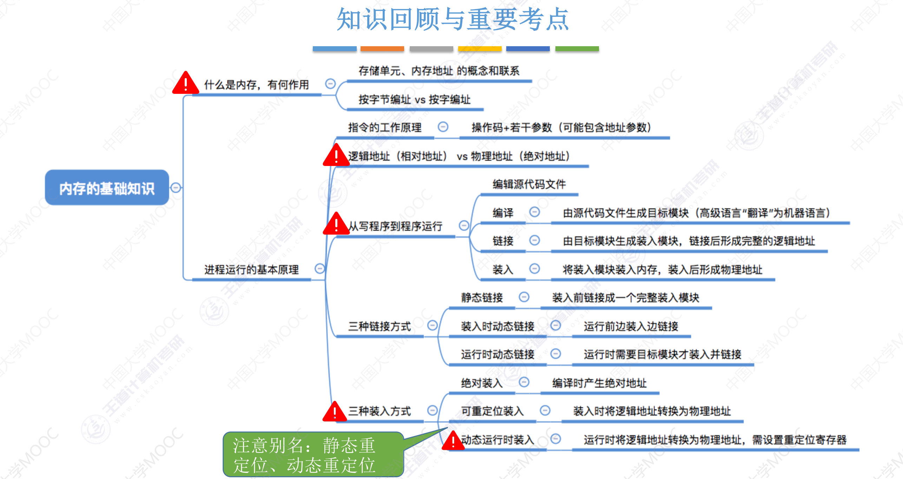

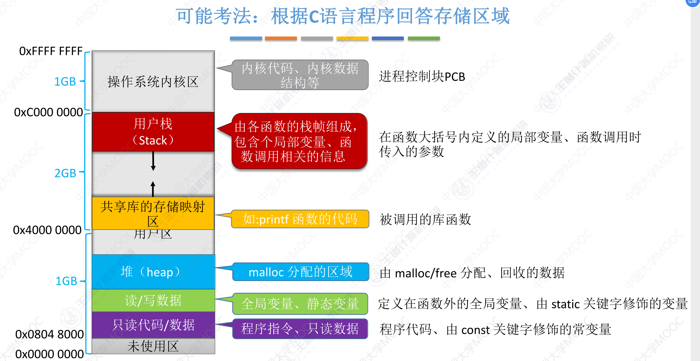

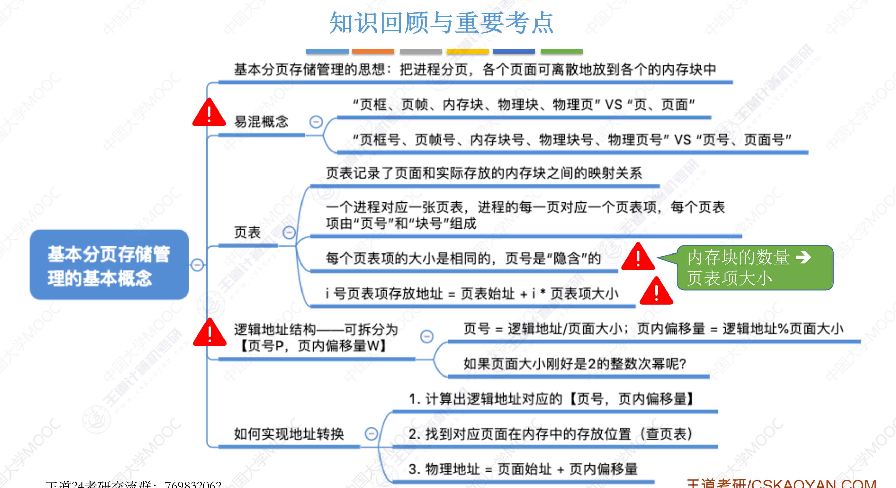

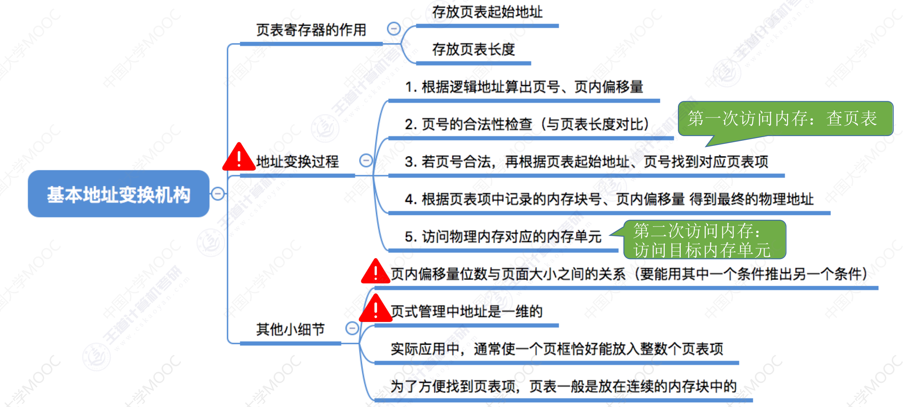

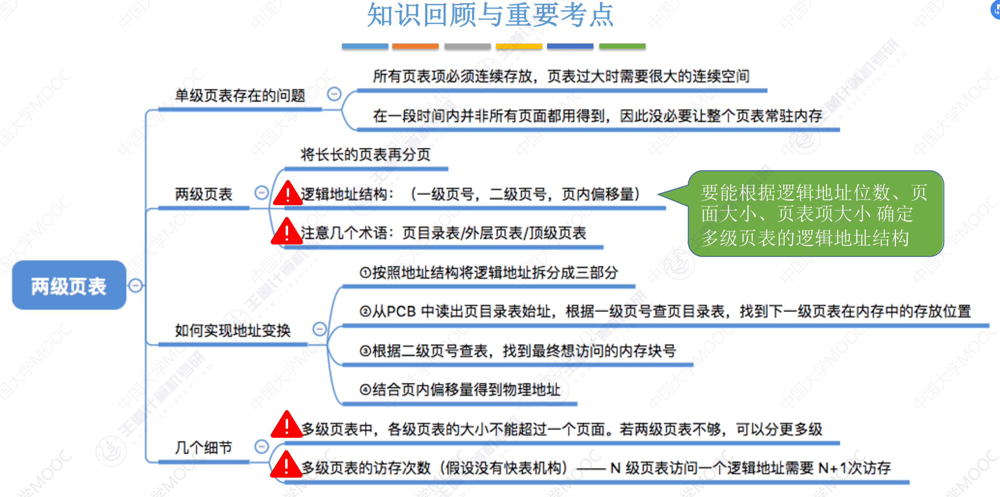

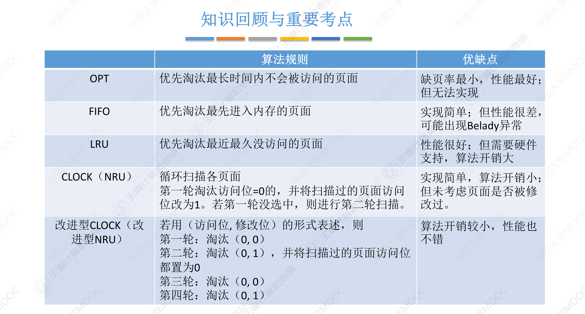

## 知识滚雪球：指令的工作原理

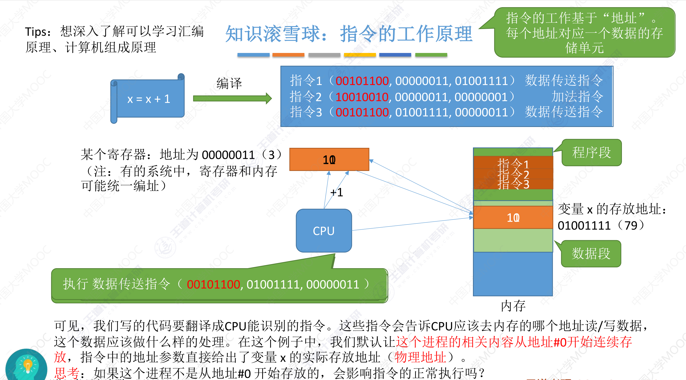

- 一个高级程序语言要先经过编译器的编译，变成一个个CPU能看懂的二进制指令
- 这些指令会告诉 CPU 应该去内存的哪个地址读/写数据，这个数据应该做什么样的处理（移动到其他寄存器、加减乘除...）
- 在上述例子中
  - 默认让这个进程的相关内容从地址#0 开始连续存放，指令中的地址参数直接给出了变量 x 的实际存放地址（物理地址）
  - 思考
    - 如果这个进程不是从地址#0 开始存放的，会影响指令的正常执行吗？

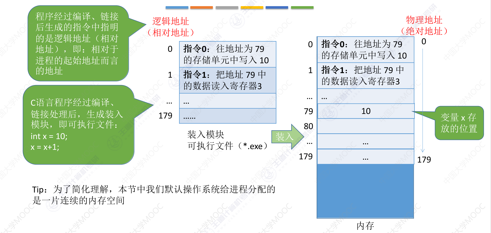
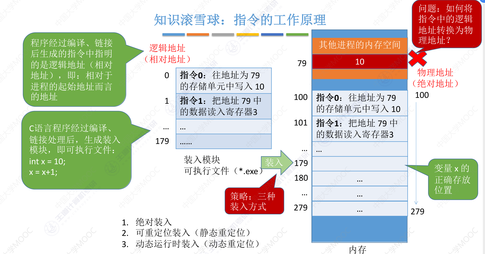

- 使用逻辑地址
  - 默认操作系统给进程分配的是一片连续的内存空间
  - C 语言程序经过编译、链接处理后，生成装入模块，即可执行文件
    - int x = 10;
    - x = x+ 1;
  - 程序经过编译、链接后生成的指令中指明的是逻辑地址（相对地址）
    - 即相对于进程的初始地址而言的地址
    
  - 如果在逻辑地址中指明要对内存地址为 79 的存储单元进行操作，而该程序在物理地址中第一句指令的存放位置不是 0，79 的空间可能早就被其他程序占用了，那么就会发生可能占用其他进程的内存空间的问题
    
    - 如何将指令中的逻辑地址转换为物理地址？——三种装入方式
      - 绝对装入
      - 可重定位装入（静态重定位）
      - 动态运行时装入（动态重定位）

### 装入的三种方式

#### 绝对装入

- 绝对装入
  - 在编译时，如果知道程序将放到内存中的哪个位置，编译程序将产生绝对地址的目标代码
  - 装入程序按照装入模块中的地址，将程序 和数据装入内存
    - 如果知道装入模块要从地址为 100 的地方开始存放
      - 编译、链接后得到的装入模块的指令直接就使用了绝对地址
      - 将相对地址直接修改为正确地址
  - 绝对装入**只适用于单道程序环境**
    - 程序中使用的绝对地址，可在编译或汇编时给出，也可由程序员直接赋予
    - 通常情况下都是编译或汇编时再转换为绝对地址
  - 灵活性很差

#### 静态重定位

- 静态重定位
  - 又称可重定位装入
  - 编译、链接后的装入模块地址都是从 0 开始的，指令中使用的地址、数据存放的地址都是相对于起始地址而言的逻辑地址
  - **可根据内存的当前情况，将装入模块装入到内存的适当位置**
  - 装入时对地址进行“重定位”，将逻辑地址变换为物理地址（**地址变换是在装入时一次完成的**）
- 程序装入时根据装入的起始物理地址，将所有地址相关的参数进行相加
- 特点
  - 一个作业装入内存时，**必须分配其要求的全部内存空间**
  - 如果没有足够的内存，就不能装入该作业
  - 作业一旦进入内存后，**在运行期间就不能再移动**

#### 动态重定位

- 动态重定位
  - 又称动态运行时装入
  - 编译、链接后的装入模块的地址都是从 0 开始的
  - 装入程序把装入模块装入内存后，并不会立即把逻辑地址转化为物理地址，而是**把地址转换推迟到程序真正要执行时才运行**
  - 因此**装入内存后所有的地址依然是逻辑地址**
  - 这种方式需要一个重定位寄存器的支持
    - 重定位寄存器：**存放装入模块存放的起始位置**
- 实际物理地址 = 重定位寄存器 + 逻辑地址
  - 采用动态重定位时**允许程序在内存中发生移动**
  - 并且可将程序分配到不连续的存储区中
    - 在程序运行前只需装入它的部分代码即可投入运行
    - 然后在程序运行期间，根据需要动态申请分配内存

- 便于程序段的共享，可以向用户提供一个比存储空间大得多的地址空间

### 从写程序到程序运行

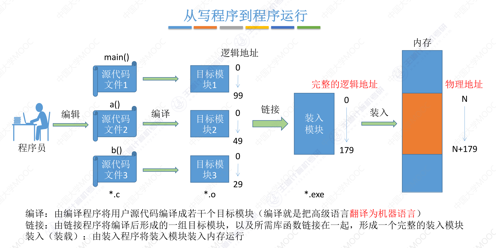

- 编译：
  - 由编译程序将用户源代码编译成若干个目标模块
  - 将高级语言翻译成机器语言
  
- 链接
  - 由链接程序将编译后形成的一组目标模块，以及所需库函数链接在一起，形成一个完整的装入模块（可执行文件）
- 装入（装载）
  - 由装入程序将装入模块装入内存运行

#### 链接的三种方式

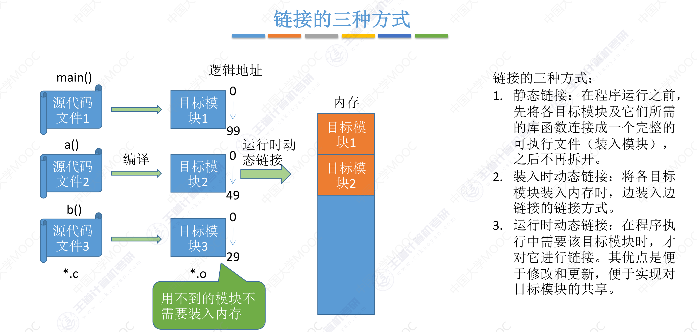

- 链接的三种方式
  - 静态链接（一次合成，终身受益）
    - 在程序运行之前，先将各目标模块及它们所需的库函数连接成一个完整的可执行文件（装入模块），之后便不再拆开
  - 装入时动态链接（硬盘中不一定连续，内存中连续）
    - 将各目标模块装入内存时，边装入边链接
  - 运行时链接（用的时候再链接）
    - 在程序执行中需要该目标模块时，才对它进行链接
    - 用不到的模块不需要装入内存
    - 优点：便于修改和更新，便于实现对目标模块的共享

## 内存管理概念

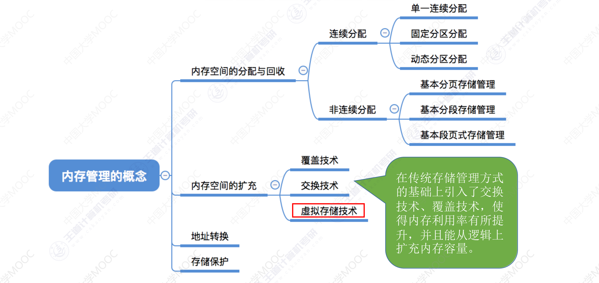

### 内存的基础知识

#### 什么是内存，有什么作用？

- 内存可存放数据
  - 程序执行前需要先放到内存中才能被 CPU 处理——缓和 CPU 与硬盘之间的速度矛盾
- 思考
  - 在多道程序环境下，系统中会有多个程序并发执行，也就是说会有多个程序的数据需要同时放到内存中。
  - 那么如何区分各个程序的数据时放在什么地方的呢？
    - 方案：给内存的存储单元编地址
      - 内存中一个一个的小房间就是**存储单元**
      - 内存地址从 0 开始，**每个地址对应一个存储单元**
      - 如果计算机“按字节编址”，则每个存储单元大小为 1 字节，即 1B，即 8 个二进制位
      - 如果字长为 16 位的计算机“按字编址”

### 内存空间的分配与回收

- 操作系统作为系统资源的管理者，要对内存进行管理
  - **负责内存空间的分配与回收**
  - **提供某种技术从逻辑上对内存空间进行扩充**
  - **提供地址转换功能，负责程序的逻辑地址与物理地址的转换**
  - **提供内存保护功能，保证各进程在各自存储空间内运行，互不干扰**
- 问题
  - 操作系统要怎么记录哪些内存区域已经被分配出去了？哪些又还空闲？
  - 当进程运行结束之后，如果将进程占用的内存空间回收？
  - 内存很多位置都可以放，那应该放在哪里？

#### 连续分配管理方式

- 连续分配：为用户进程分配的必须是一个**连续的内存空间**

##### 单一连续分配

- 单一连续分配方式
  - 内存被分为**系统区和用户区**
    - 系统区
      - 通常位于内存的低地址部分，用于存放操作系统相关数据
    - 用户区
      - 用于存放用户进程相关数据
  - 内存中**只能有一道用户程序**，用户程序独占整个用户区空间。
    - 有很大一部分用户区空闲，内存利用率低
- 优点
  - 实现简单
  - 无外部碎片
  - 可以采用覆盖技术拓展内存
  - 不一定需要采取内存保护
- 缺点
  - 只能用于单用户、单任务的操作系统
  - 有内部碎片
    - **分配给某进程的内存区域中，如果有些部分没有用上，就是“内部碎片”**
  - 存储器利用率极低

##### 固定分区分配

- 固定分区分配
  - 目的
    - 多道程序系统为了能在内存中装入多道程序，且这些程序之间又不会相互干扰
  - 解决方案
    - 将整个用户空间划分为若干个固定大小的 分区
    - **在每个分区中只装入一道作业**
    - 这样就形成了最早的、最简单的一种可运行多道程序的内存管理方式
  - 两种方案
    - 分区大小相等
      - 缺乏灵活性
      - **适合用于一台计算机控制多个相同对象的场合**
        - 比如：钢铁厂有 n 个相同的炼钢炉，就可以把内存分为 n 个大小相等的区域存放 n 个炼钢炉控制程序
    - 分区大小不等
      - 增加了灵活性
      - 可以满足不同大小的进程需求
      - 根据常在系统中运行的作业大小情况进行划分
        - 比如：划分多个小分区、适量中等分区、少量大分区

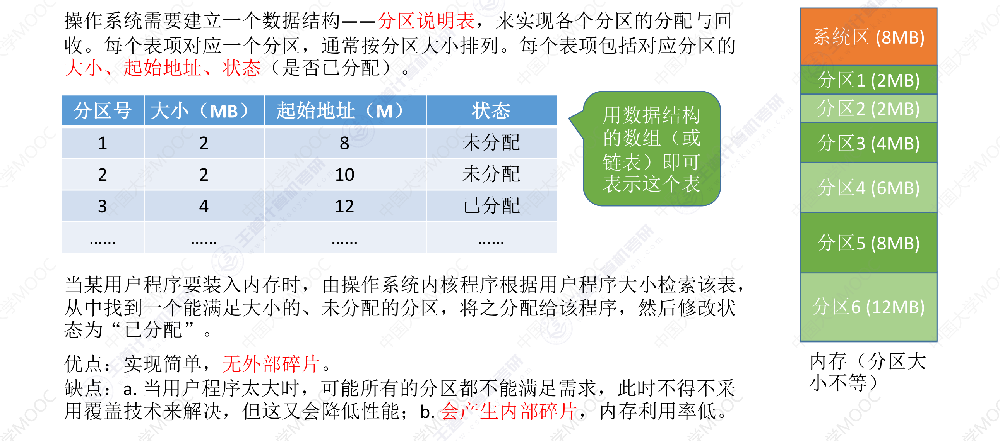

- 如何实现
  - 操作系统需要建立一个数据结构——**分区说明表**，来实现各个分区的分配与回收
    - 用数据结构的数组（或链表）即可表示这个表
  - 每个表项对应一个分区，通常按分区大小排列
  - 每个表项包括对应分区的**大小、起始地址、状态**（是否已分配）
- 实现过程
  - 当某用户程序要装入内存时，由操作系统内核程序根据用户程序大小检索该表，从中找到一个能满足大小的、未分配的分区，将之分配给该程序，然后修改状态为“已分配”
  - 优点
    - 实现简单，无外部碎片

  - 缺点
    - 当用户程序太大时，可能所有的分区都不能满足需求，此时不得不采用覆盖技术来解决，但这又会降低性能
    - **会产生内部碎片**，内存利用率低

##### 动态分区分配

- 动态分区分配

  - 又称**可变分区分配**
  - **不会预先划分内存分区**，而是在进程装入内存时，**根据进程的大小动态的建立分区**，并使分区的大小正好适合进程的需要
  - 因此系统分区的大小和数目是可变的

- 问题

  - 假设某计算机内存大小为 64MB，系统区 8MB，用户区共 56MB

    - 系统要用什么样的数据结构记录内存的使用情况？

    - 当很多个空闲分区都能满足需求时，应该选择哪个分区进行分配？
    - 如何进行分区的分配与回收操作？

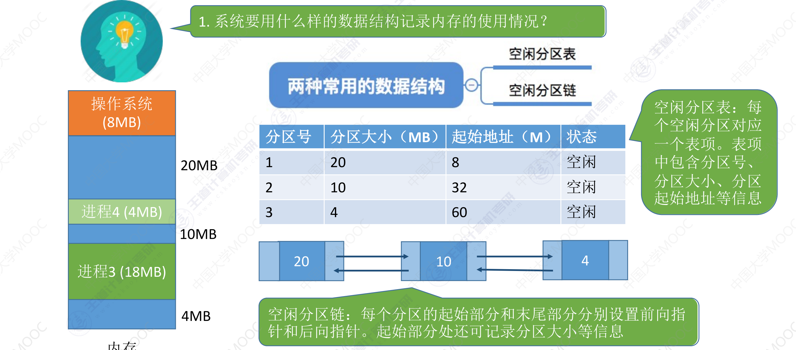

- 系统要用什么样的数据结构记录内存的使用情况？
  - 空闲分区表
    - 每个空闲分区对应一个表项
    - 表项中包含分区号、分区大小、分区起始地址等信息
  - 空闲分区链
    - 每个分区的起始部分和末尾部分分别设置前向指针和后向指针
    - 起始部分处还可记录分区大小等信息

- 当很多个空闲分区都能满足需求时，应该选择哪个分区进行分配？
  - 应该用最大的分区进行分配？还是用最小的分区进行分配？又或是用地址最低的部分进行分配？
  - 把一个新作业装入内存时，需按照一定的动态分区分配算法，从空闲分区表（或空闲分区链）中选出一个分区分配给该作业
  - 分配算法对系统性能有很大影响

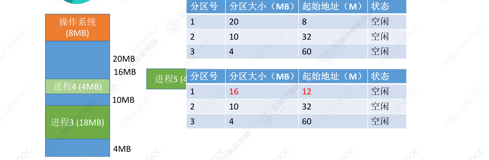

- 空闲分区表
  - 如果分区大小>进程大小，直接修改分区大小和起始地址
  - 如果分区大小=进程大小，直接删去分区
- 空闲分区链
  - 如果分区大小>进程大小，直接修改分区大小
  - 如果分区大小=进程大小，直接删去分区节点

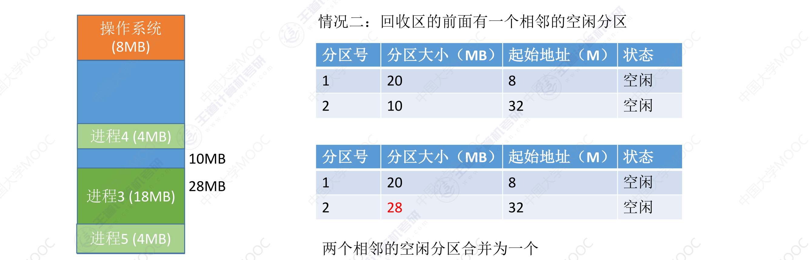

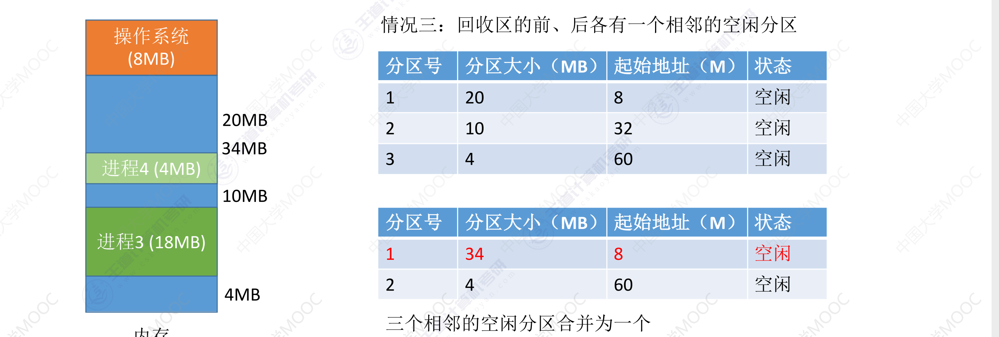

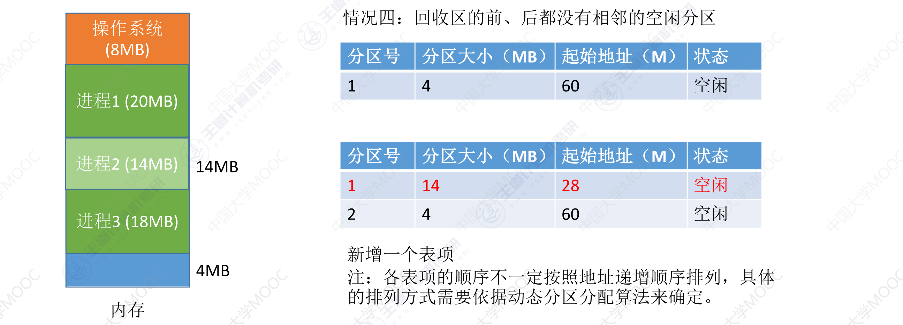

- 空闲分区表

  - 回收区的后面有一个相邻的空闲分区
    - 两个相邻的空闲分区合并为一个
  - 回收区的前面有一个相邻的空闲分区
    - 两个相邻的空闲分区合并为一个
  - 回收区的前、后各有一个相邻的空闲分区
    - 三个相邻的空闲分区合并为一个
  - 回收区的前、后都没有相邻的空闲分区
    - 新增一个表项

- 各表项的顺序不一定按照地址递增顺序排列，具体的排列方式需要依据动态分区分配算法来确定

- 动态分区分配**没有内部碎片，但是有外部碎片**
  - 内部碎片
    - **分配给某进程的内存区域，如果有些部分没有用上**
  - 外部碎片
    - **内存中的某些空闲分区由于太小而难以利用**
- 如果内存中空闲时间的总和本来可以满足某进程的要求，但由于进程需要的是一整块连续的内存空间，因此这些“碎片”不能满足进程的需求
  - 可以通过紧凑（拼凑，Compaction）技术来解决外部碎片
    - 把各个进程挪位，拼凑在一起，得到一片连续的内存空间
- 回忆交换技术
  - 什么是换入换出？
  - 什么是中级调度（内存调度）？
- 思考动态分区分配应使用哪种装入方式？紧凑之后需要做什么处理？

##### 动态分区分配算法

###### 首次适应算法（First Fit）（最好）

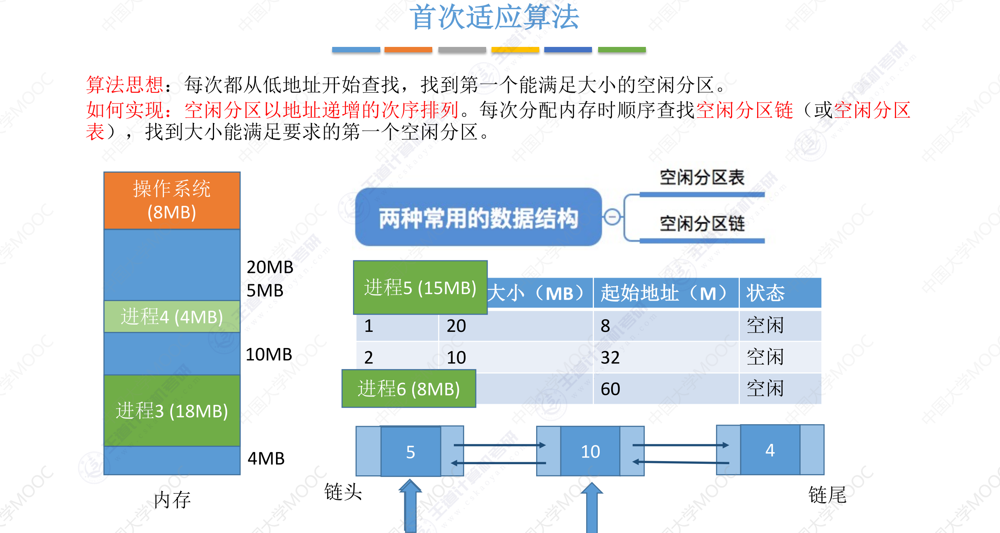

- 算法思想
  - 每次都从低地址开始查找，找到第一个能满足大小的空闲分区
- 如何实现
  - **空闲分区以地址递增的次序排列**
  - 每次分配内存时，顺序查找空闲分区链（空闲分区表），找到**大小能满足要求的第一个空闲分区**

###### 最佳适应算法（Best Fit）

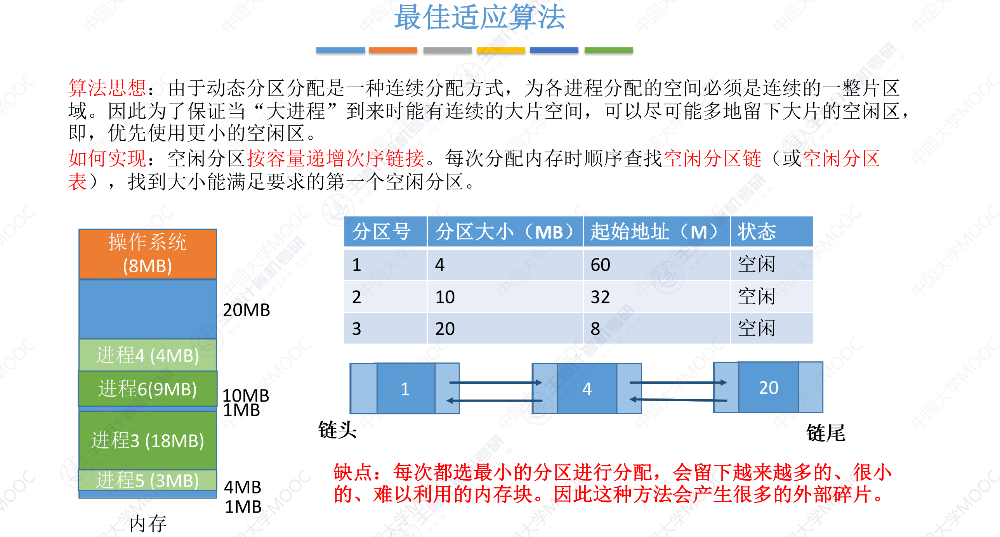

- 算法思想
  - 由于动态分区分配时一种连续分配方式，为各进程分配的空间必须是连续的一整片区域
  - 为了保证当大进程到来时能有连续的大片空间，可以尽可能多的留下大片的空闲区
- 如何实现
  - **空闲分区按容量递增次序连接**
  - 每次分配内存时顺序查找空闲分区链/空闲分区表，找到大小能满足要求的第一个空闲分区
- 缺点
  - 每次都选最小的分区进行分配，会留下越来越多的、很小的、难以利用的内存块
  - 会产生很多的外部碎片

###### 最坏适应算法（Worst Fit）

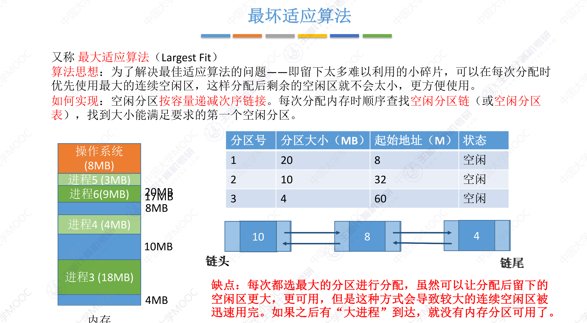

- 又称最大适应算法（Largest Fit）
- 算法思想
  - 为了解决最佳适应算法的问题——即留下太多难以利用的小碎片
  - 可以在每次分配时优先使用最大的连续空闲区，这样分配后剩余的空闲区就不会太小，更方便使用
- 如何实现
  - **空闲分区按容量递减次序连接**
  - 每次分配内存时顺序查找空闲分区链/空闲分区表，找到大小能满足要求的第一个内存分区
- 缺点
  - 每次都选最大的分区进行分配，虽然可以让分配后留下的空闲区更大，更可用，但是这种方式会导致较大的连续空闲区被迅速用完
  - 如果之后有“大进程”到达，就没有内存分区可用了

###### 临近适应算法（Next Fit）

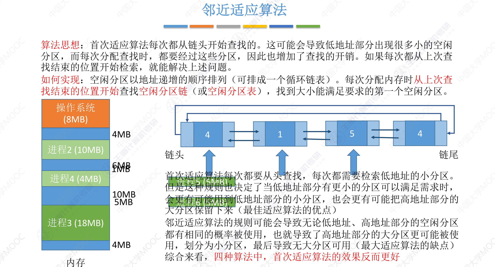

- 算法思想
  - 首次适应算法每次都从链头开始查找，这可能会导致低地址部分出现很多小的空闲分区
  - 而每次分配查找时，就要经过这些分区，因此也增加了查找的开销
  - 如果**每次都从上次查找结束的位置开始检索**，就能解决上述问题
- 如何实现
  - **空闲分区以地址递增的顺序排列**（可排成一个循环链表）
  - 每次分配内存时从上次查找结束的位置开始查找空闲分区链/空闲分区表，找到大小能满足要求的第一个空闲分区
- 对比
  - 首次适应算法每次都要从头查找，每次都需要检索低地址的小分区
  - 这样的规则也决定了当低地址部分有更小的分区可以满足需求时，会更有可能用到低地址部分得小分区，也会更有可能把高地址部分的大分区保留下来（最佳适应算法的优点）
  - 临近适应算法的规则可能会导致无论低地址、高地址部分的空闲分区都有相同的概率被使用，也就导致了高地址部分的大分区更有可能被使用，划分为小分区，最后导致无大分区可用（最大适应算法的缺点）
  - 总和来看，**首次适应算法的效果最好**

#### 非连续分配的管理方式

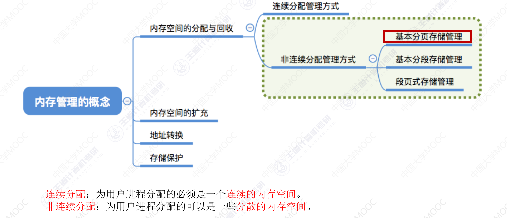

- 连续分配：为用户进程分配的必须是一个连续的内存空间
- 非连续分配：为用户进程分配的可以是一些分散的内存空间

##### 基本分页存储管理

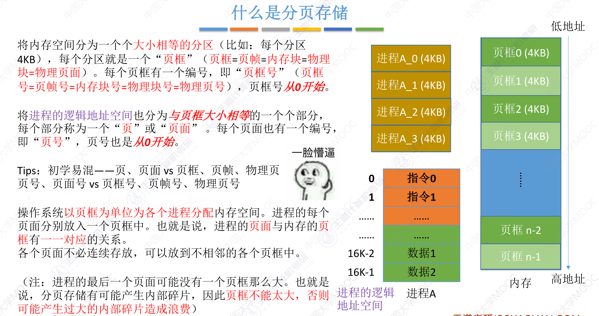

- 分页存储
  - **将内存空间空间分为一个个大小相等的分区**
    - 比如：每个分区 4KB
    - 每个分区就是一个“**页框**”
      - 页框 = 页帧 = 内存块 = 物理块 = 物理页面
    - 每个页框有一个编号，即**页框号**，页框号从 0 开始
      - 页框号 = 页帧号 = 内存块号 = 物理块号 = 物理页号
  - 将进程的**逻辑地址空间也分为与页框大小相等**的一个个部分
    - 每个部分称为一个**页或页面**
    - 每个页面也有一个编号，即**页号**，页号也是从 0 开始
  - 页号、页面号 VS 页框号、页帧号、物理块号
    - **操作系统以页框为单位为各个进程分配内存空间**
    - **进程的每个页面分别放入一个页框中**
      - 进程的页面与内存的页框一一对应
    - 各个页面不必连续存放，可以放到不想理你的各个页框中
- 进程的最后一个页面可能没有一个页框那么大
  - 分页存储可能会产生内部碎片
  - **页框不能太大，否则可能产生过大的内部碎片造成浪费**
- 自己理解
  - 类似于分区相等的固定分区分配
  - 把内存分为不大的一个个小段，然后把进程也分为同样大小的小段，一个小段对应一个小段
  - 跟内存有关的叫页框、页帧、物理啥、内存块（比较拗口）；跟进程有关的叫页/页面（比较简单）

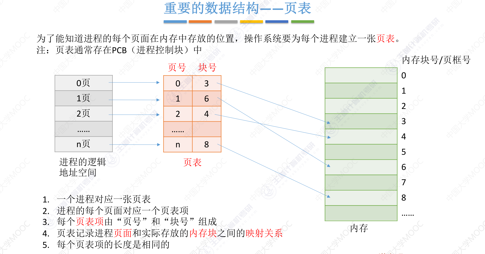

- 页表
  - 为了能知道进程的每个页面在内存中存放的位置，操作系统要为每个进程建立一张页表
    - 页表通常存在 PCB（进程控制块）中
  - 一个进程对应一张页表
  - 进程的每个页面对应一个页表项
  - 每个**页表项**由“页号”和“块号”组成
  - **页表记录进程页面和实际存放的内存块之间的映射关系**
  - 每个页表项的长度是相同的
- 问题
  - 每个页表项多大？占几个字节？
  - 如何通过页表实现逻辑地址到物理地址的转换？

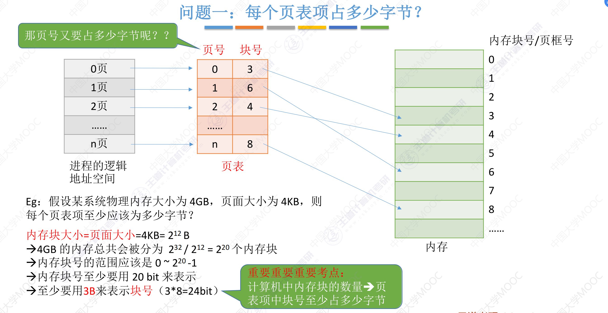

- 每个页表项栈多少字节？

  - Eg：假设某系统物理内存大小为4GB，页面大小为 4KB，则每个页表项至少应该为多少字节？
    - 内存块大小 = 页面大小 = 4KB = 2^12B
    - 4GB的内存总共会被分为 2^32/2^12=2^20 个内存块
    - 内存块号的范围应该是 0~2^20-1
    - 内存块号至少要用 20bit 表示
    - 至少要用 3B 来表示块号（3*8=24bit）
      - 计算机中内存块的数量 —> 页表项中块号至少占多少字节
  - 注意：页表记录的只是内存块号，而不是内存块的起始地址！
    - **J 号内存块的起始地址 = J * 内存块大小**

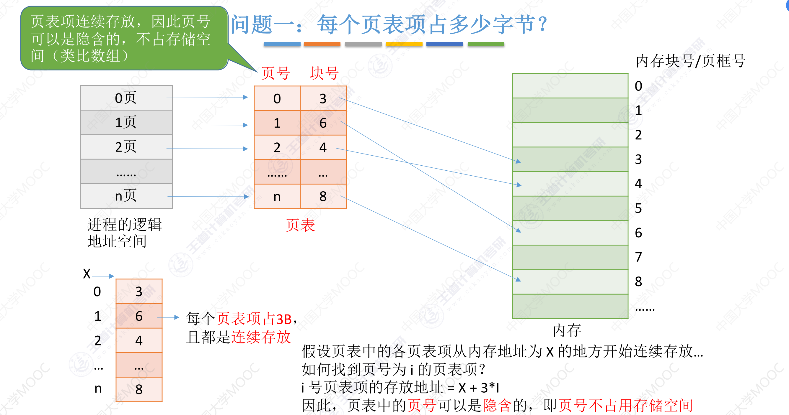

- 页号又要占多少字节呢？
  - 页表项连续存放，因此页表可以是隐含的，不占存储空间（类比数组）
    - 每个页表项占 3B 并且都是连续存放
      - 假设页表中的各页表项从内存地址为 x 的地方开始连续存放
      - 如何找到页号为 i 的页表项？
      - **i 号页表项的存放地址 = x + 3*i**

- 如何实现地址的转换？
  - 进程在内存中连续存放时，操作系统是如何实现逻辑地址到物理地址的转换的？
    - 重定位寄存器：指明了进程在内存中的起始位置
    - 目标逻辑地址：相对于其实位置的偏移量

- 将进程地址空间分页之后，操作系统该如何实现逻辑地址到物理地址的转换？
  - 特点
    - 虽然进程的各个页面是离散存在的，但是页面内部是连续存放的
  - 如果想要访问逻辑地址 A，则
    - 确定逻辑地址 A 对应的**“页号”P**
    - 找到 P 号页面在内存中的起始地址（需要查页表）
    - 确定逻辑地址 A 的**页内偏移量 W**
  - 逻辑地址 A 对应的物理地址 = P 号页面在内存中的起始地址 + 页内偏移量 W

- 如何确定一个逻辑地址对应的页号、页内偏移量
  - 在某个计算机系统中，页面大小是 50B。某进程逻辑地址空间大小为 200B，则逻辑地址 110 对应的页号、页内偏移量是多少？
    - 页号 = 逻辑地址/页面长度（取除法的整数部分）
      - 页号 = 110/50 = 2
    - 页内偏移量 = 逻辑地址 % 页面长度（取触发的余数部分）
      - 页内偏移量 = 110 % 50 = 10
    - **逻辑地址可以拆分为（页号，页内偏移量）**
    - 通过页号查询页表，可以知道页面在内存中的起始地址
    - 页面在内存中的起始地址 + 页内偏移量 = 实际的物理地址

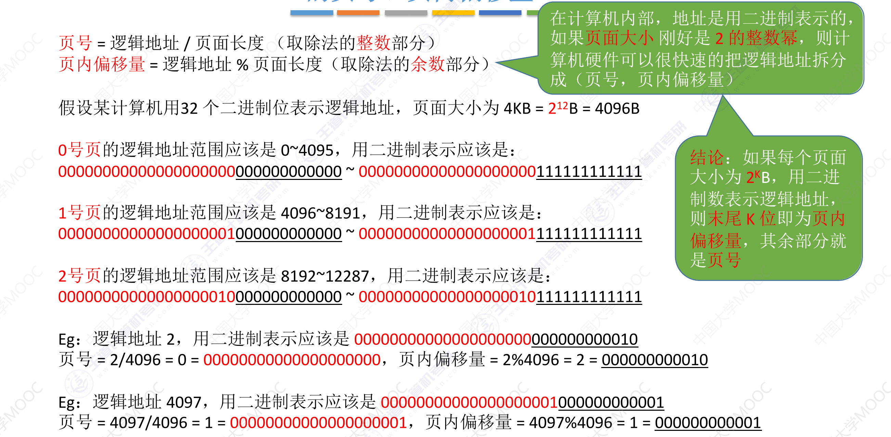

- 如果每个页面大小为 2^kB，用二进制数表示逻辑地址，则末尾 k 位即为页偏移量，其余部分就是页号

- 如果页面大小刚好是 2 的整数幂，则只需把页表中记录的物理块号拼接上页内偏移量就能得到对应的物理地址

- 总结
  - 页面大小刚好是 2 的整数次幂有什么好处？
    - 逻辑地址的拆分更加迅速
      - 如果每个页面大小为 2^kB，用二进制数表示逻辑地址，则末尾 k 位即为页内偏移量，其余部分就是页号
      - 如果让每个页面的大小为 2 的整数幂，计算机硬件就可以很方便地得出一个逻辑地址对应的页号和页内偏移量，而无需进行除法运算，从而提升了运行速度
    - 物理地址的计算更加迅速
      - 根据逻辑地址得到页号，根据页号查询页表从而找到页面存放的内存块号，将二进制表示的内存块号和页内偏移量拼接起来，就可以得到最终的物理地址

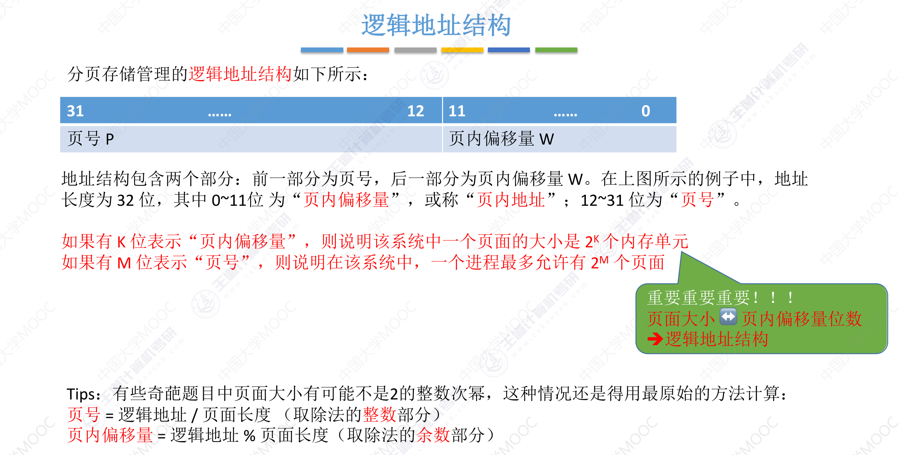

- 逻辑地址结构
  - 地址结构包含两个部分
    - 前一部分是页号P
    - 后一部分是页内偏移量 W
  - 地址长度为 32 位，其中 0~11 是页内偏移量/页内地址，12~31 位为页号
- **如果有 k 位表示页内偏移量，则说明该系统中一个页面的大小是 2^k个内存单元**
  - 页面大小 = 业内偏移量 = 逻辑地址结构
- **如果有 M 为表示页号，则说明在该系统中，一个进程最多允许有 2^M个页面**

- 有些奇葩题目中页面大小有可能不是2的整数次幂，这种情况还是得用最原始的方法计算：

​		**页号 = 逻辑地址 / 页面长度 （取除法的整数部分）**

​		**页内偏移量 = 逻辑地址 % 页面长度（取除法的余数部分）**

###### 基本地址变换机构

- 基本地址变换机构可以借助进程的页表将逻辑地址转换为物理地址
- 通常会在系统中设置一个页表寄存器（PTR）
  - 存放**页表在内存中的起始地址 F 和页表长度M**
  - 页表寄存器的作用类似于一个快速访问的缓存，它存储了最近使用的页表的物理地址，以减少地址转换的开销。这有助于提高程序的执行效率，特别是在涉及频繁的内存访问操作时。
    - 这个是 **CPU 从内存中取数据时**使用的，记录当前访问到的页表的地址，就可以很方便的继续向下读取未执行的页表项
- 进程未执行时，**页表的始址和页表长度放在进程控制块 PCB 中**
- 当进程被调度时，操作系统内核会把它们放到页表寄存器中

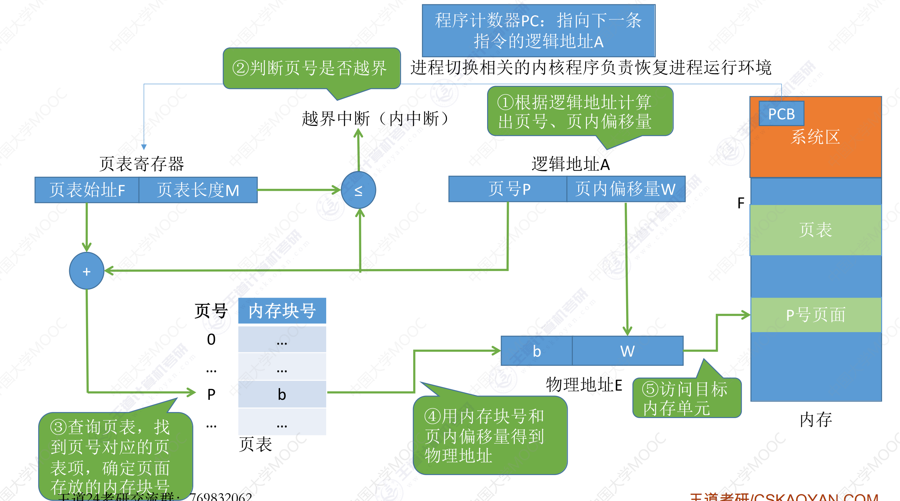

- 过程
  - 根据逻辑地址计算出页号、页内偏移量
  - 判断页号是否越界
  - 查询页表，找到页号对应的页表项，确定页面存放的内存块号
  - 用内存块号和页内偏移量得到物理地址
  - 访问目标内存单元

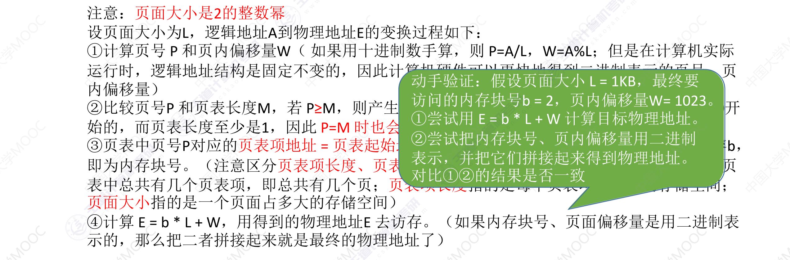

- 文字描述
  - 设页面大小为 L，逻辑地址 A 到物理地址 E 的变换过程如下
    - 计算页号 P 和页内偏移量 W
      - 如果用十进制手算，则 P=A/L, W=A%L
      - 在计算机实际运行时，逻辑地址结构是固定不变的，因此计算机硬件可以更快地得到二进制表示的页号、页内偏移量
    - 比较页号 P 和页表长度M，**若 P>= M，则产生越界中断**，否则继续执行
      - **页号是从 0 开始的，而页表长度至少是 1，因此 P=M 时也会越界**
    - 页表中   **页号 P 对应的页表项地址 = 页表起始地址 F + 页表 P * 页表项长度**
      - 取出该页表项内容 b，即为内存块号
        - 注意区分页表项长度、页表长度、页面大小的区别
        - 页表项长度：这个页表中总共有几个页表项，即总共有几个页
        - 页表长度：每个页表项占多大的存储空间
        - 页表大小：一个页面占多大的存储空间
    - 计算 E=b*L + W，用得到的物理地址 E 去方寸
      - 如果内存块号、页内偏移量是用二进制表示的，那么把两者拼接起来就是最终的物理地址了

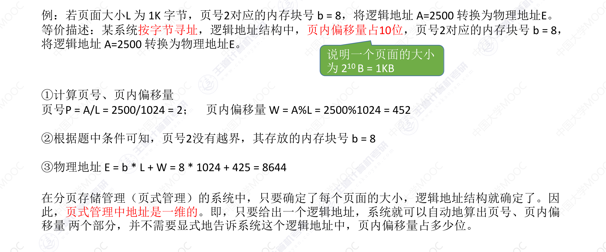

- 在分页存储管理（页式管理）的系统中，只要确定了每个页面的大小，逻辑地址结构就确定了
  - **页式管理中地址是一维的**
  - 只要给出一个逻辑地址，系统就可以自动地算出页号、页内偏移量两个部分，并不需要显示的告诉系统这个逻辑地址中，页内偏移量占多少位

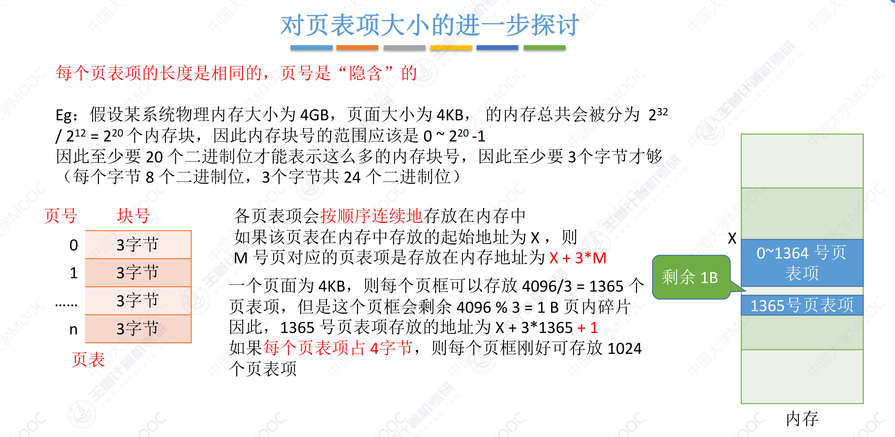

- 对页表项大小的进一步探讨

  - 如果每个页表项占 4 个字节
    - 1024 号页表项虽然是存放在下一个页框中的，但是它的地址依然可以用 X+4*1024 得出
  - 结论
    - 页表项长度为 3B 即可表示内存块号的范围
    - 但是为了方便页表的查询，常常会让一个页表项占更多的字节，使得**每个页面恰好可以装得下整数个页表项**

  - 进程页表通常是装在连续的内存块中的

###### 具有快表的地址变换机构

- 什么是快表(TLB)

- 快表（高速缓存，不是内存）
  - 又称联想寄存器（TLB，translation lookaside buffer）
  - 是一种**访问速度比内存快很多的高速缓存**，用来**存放最近访问的页表项的副本**，可以加速地址变换的速度
    - TLB 不是内存
    - TLB 和 普通 Cache 的区别——TLB 中只有页表项的副本，而普通 Cache 中可能会有其他各种数据的副本
  - **内存中的页表常称为慢表**

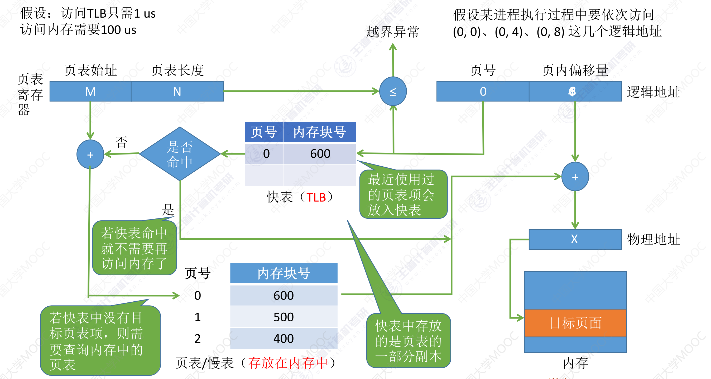

- 使用过程
  - CPU 每次访问内存中的逻辑地址，会先查找高速缓存中的快表，快表中没有想要的页表项才回去内存中访问页表/慢表
    - **最近使用过的页表项会放入快表，快表存放的是页表的一部分副本**
    - 若快表命中就不需要再访问内存了
    - 若快表中没有目标页表项，则需要查询内存中的页表
  - 先检查是否越界
    - 页号>=页表长度
  - 再看快表是否命中
    - 命中直接访问内存中的物理地址
    - 未命中就要去内存中访问页表，然后再去内存中访问目标页面

- 局部性原理
  - 时间局部性
    - 如果执行了程序中的某条指令，那么不久后这条指令很有可能再次执行
    - 如果某个数据被访问过，不久之后该数据很可能再次被访问
    - 原因：程序中存在大量的循环
  - 空间局部性
    - 一旦程序访问了某个存储单元，在不就之后，其附近的存储单元也很有可能被访问
    - 原因：很多数据在内存中都是连续存放的
- 基本地址变换机构中，每次要访问一个逻辑地址，都需要查询内存中的页表
  - 由于局部性原理，可能连续很多次查到的都是同一个页表项

- 引入快表后，地址的变换过程
  - CPU 给出逻辑地址，由某个硬件算的页号、页内偏移量，将页号与快表中的所有页号进行比较
  - 如果找到匹配的页号，说明要访问的页表项在快表中有副本
    - 直接从中取出该页对应的内存块号
    - 再将内存块号与页内偏移量拼接形成物理地址
    - 最后，访问该物理地址对应的内存单元
  - 如果没有找到匹配的页号
    - 需要访问内存中的页表，找到对应页表项，得到页面存放的内存块号
    - 再将内存块号与页内偏移量拼接形成物理地址
    - 最后访问该物理地址对应的内存单元
      - 因此若快表未命中，则访问某个逻辑地址需要两次访存
      - 在找到页表项后，应同时将其存入快表，以便后面可能的再次访问
      - 但若快表已满，则必须按照一定的算法对就得页表项进行替换
- 查询快表的速度比查询页表的速度快很多
  - 只要快表命中就可以节省很多时间
  - 因为局部性原理，一般来说，快表的命中率可以达到 90%以上
- 三种查询方式
  - 先查快表，快表查不到再去查慢表
  - 快表慢表一起查
  - 未采用快表机制

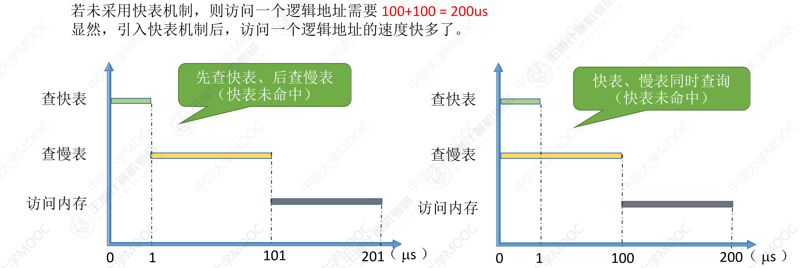

###### 两级页表

- 单级页表存在什么问题？如何解决？

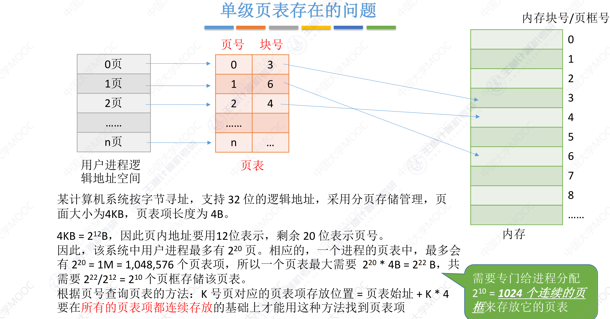

- 某计算机系统按字节寻址，支持 32 位的逻辑地址，采用分页存储管理，页面大小为 4KB，页表项长度为 4B
  - 页面大小就是一个页框的大小，4KB=2^12B，因此页内地址要用 12 位表示，剩余 20 位表示页号
  - 因此该系统中用户进程最多有 2^20页
  - 一个进程的页表中，最多会有 2^20=1M=1048576个页表项
  - 一个页表最大需要2^20 * 4B(页表项长度) = 2^22B，共需要 2^22/2^12 = 2^10个页框存储该页表
    - 需要专门给进程分配 2^10=1024个连续的页框来存放它的页表
  - 根据页号查询页表的方法
    - k 号页对应的页表项存放位置 = 页表始址+K*4
  - 要在**所有的页表项都连续存放**的基础上才能用这种方法找到页表项

- 根据局部性原理可知，很多时候，进程在一段时间内只需要访问某几个页面就可以正常运行了，
  - 没有必要让整个页表都常驻内存

- 问题
  - 页表必须连续存放，因此当页表很大时，需要占用很多个连续的页框
  - 没有必要将整个页表常驻内存，因为进程在一段时间内可能只需要访问某几个特定的页面
- 解决方法
  - 把页表再分页并离散存储，然后再建立一张页表记录页表各个部分的存放位置，称为页目录表，或称外层页表，或称顶层页表

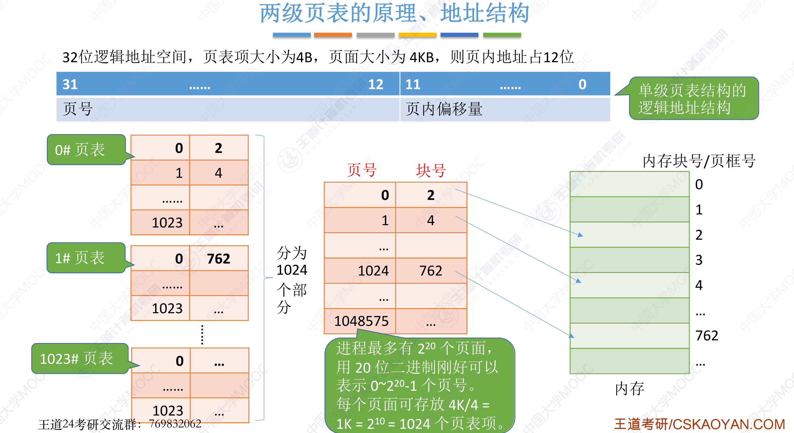

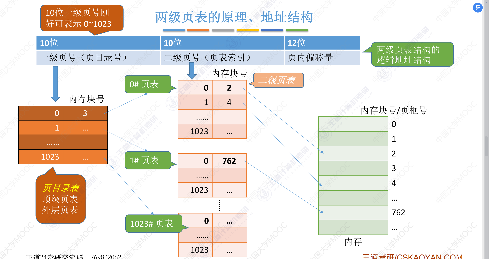

- 32 位逻辑地址空间，页表项为 4B，页面大小为 4KB，则页内地址占 12 位
  - 0#页表：第一位是 0
  - 1#页表：第一位是原来的 1024
  - ……
- 进程最多有 2^20 个页面，用 20 位二进制刚好可以表示 0~2^20-1个页号
  - 每个页面可以存放 4K/4 = 1K = 2^10=1024 个页表项
  - 10 位一级页号刚好可以表示 0~1023

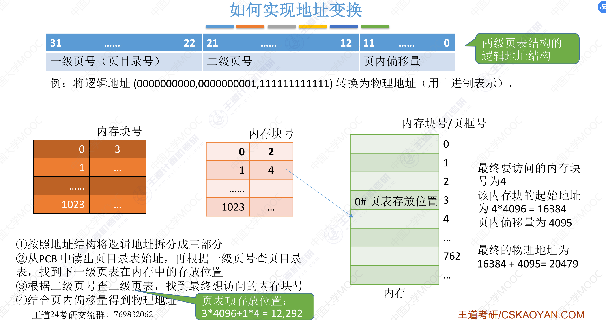

- 如何实现地址变换
  - 按照地址结构将逻辑地址拆分成三部分
  - 从 PCB 中读出页目录表始址，再根据一级页号查页目标表，找到下一级页表在内存中的存放位置
  - 根据二级页号查二级页表，找到最终想访问的内存块号
  - 结合页内偏移量得到物理内存
- 逻辑地址
  - 一级页号（页目录号）
  - 二级页号
  - 页内偏移量

- 解决方法
  - 可以在需要访问页面时才把页面调入内存（虚拟存储技术）
  - 可以在页表项中增加一个标志位，用于表示该页面是否已经调入内存了
- 若想访问的页面不在内存中，则产生缺页中断（内中断/异常），然后将目标页面从外存调入内存

- 题目
  - 先计算页内偏移量 4KB = 2^12B，按字节编址，因此页内偏移量是 12 位
  - 页号 = 40 - 12 = 28
  - 页面大小 = 2^12B，页表项 = 4B，则每个页面可存放 2^12/4 = 2^10个页表项
  - 各级页表最多包含 2^10个页表项，需要 10 位二进制位才能映射到 2^10个页表项，因此每一级的页表对应页号应为 10 位
  - 总共 28 位的页号至少要分为三级
- 两级页表的访存次数分析（假设没有快表机构）
  - 第一次访存
    - 访问内存中的页目录表
  - 第二次访存
    - 访问内存中的二级页表
  - 第三次访存
    - 访问目标内存单元

##### 基本分段存储管理

- 与分页最大的区别就是——离散分配时所分配地址空间的基本单位不同

###### 什么是分段

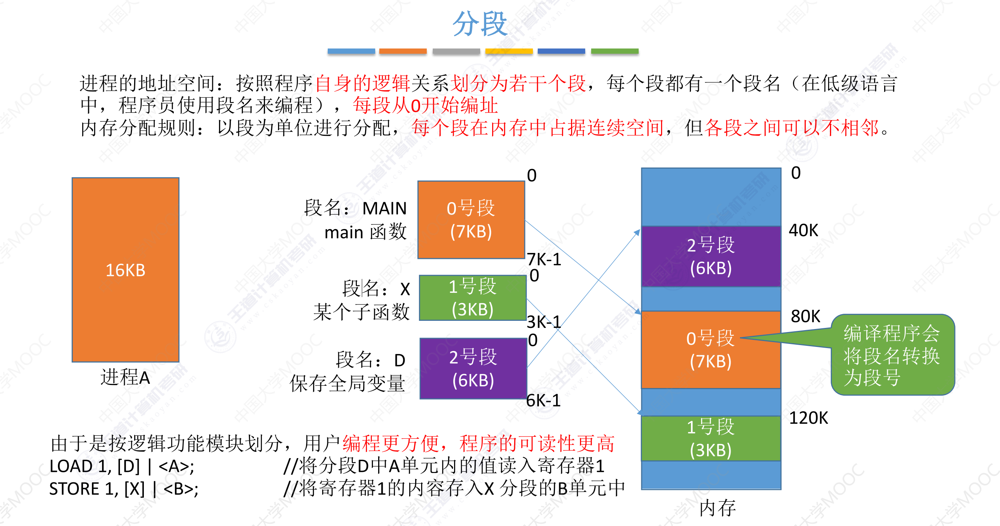

- 进程的地址空间
  - 会按照程序自身的逻辑关系划分为若干个段，每个段都有一个段名
  - 在在低级语言中，程序员使用段名来编程，每段从 0 开始编址
- 内存分配规则
  - 以段为单位进行分配
  - 每个段在内存中占据连续空间，但各段之间可以不相邻
- 按逻辑功能模块划分
  - 用户编程更方便，程序可读性更高
    - STORE 1, [X] | \<B\>; 		//将寄存器1的内容存入X 分段的B单元中
    - LOAD 1, [D] | \<A\>;          //将分段D中A单元内的值读入寄存器1

###### 什么是段表

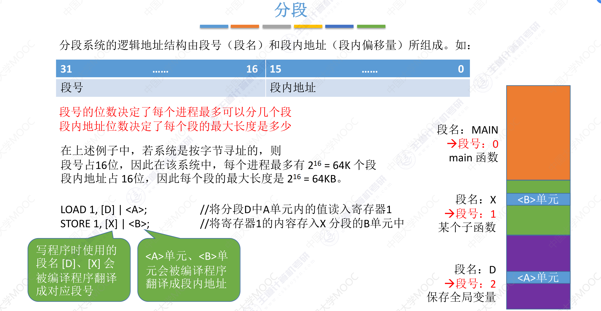

- 分段系统的逻辑地址结构由段号（段名）和段内地址（段内偏移量）所组成

  - 段号的位数决定了每个进程最多可以分为几个段

  - 段内地址位数决定了每个段的最大长度是多少

- 若系统是按字节寻址的

  - 段号占 16 位，因此在该系统中，每个进程最多有 2^16 = 64K个段
  - 段内地址占16位，因此每个段的最大长度是 2^16=64KB

- STORE 1, [X] | \<B\>; 		//将寄存器1的内容存入X 分段的B单元中

- LOAD 1, [D] | \<A\>;          //将分段D中A单元内的值读入寄存器1

  - 写程序时使用的段名 D、X 会被编译程序翻译成对应段号
  - A 单元、B 单元会被编译程序翻译成段内地址

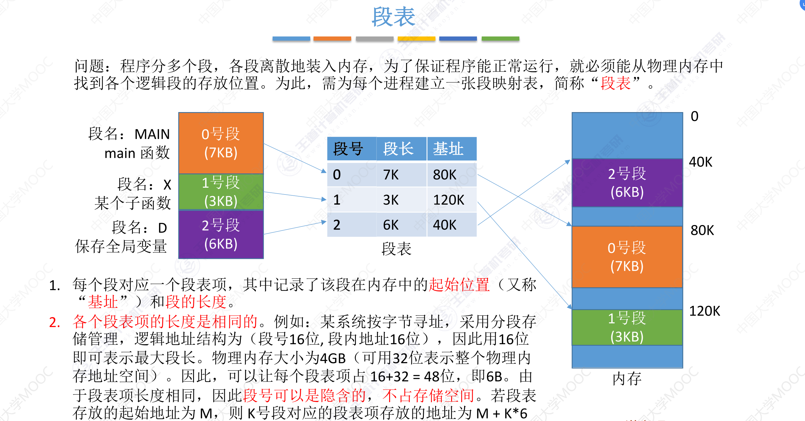

- 段表
  - 程序分多个段，各段离散地装入内存，为了保证程序能正常运行，就必须能从物理内存中找到各个逻辑段的存放位置
  - 需要为每个进程建立一张段映射表，简称段表
    - 建立了逻辑段到物理内存的映射关系
- 每个段对应一个段表项，其中记录了该段在内存中的起始位置（基址）和段的长度（每一段长度不一定相同）
- 各个段表项的长度是相同的
  - 某系统按字节寻址，采用分段存储管理，逻辑地址结构为（段号 16 位，段内地址 16 位）
    - 因此用 16 位即可表示最大段长
  - 物理内存大小为 4GB（
    - 可用 32 位表示整个物理内存地址空间
  - 因此可以让每个段表项占 16+32=48 位，即 6B
- 由于段表项长度相同，因此段号可以是隐含的不占内存空间
  - 若段表存放的起始地址为 M，则 k 号段对应的段表项存放的地址为 M+K*6

###### 如何实现地址转换

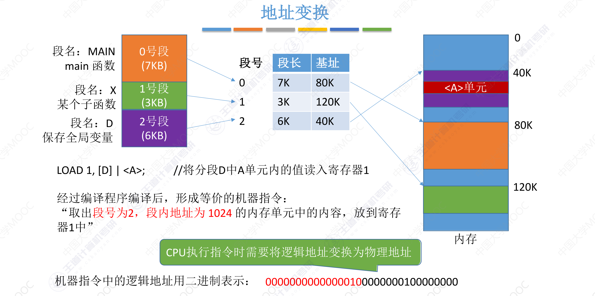

- LOAD 1, [D] | \<A\>;          //将分段D中A单元内的值读入寄存器1
  - 经过编译程序编译后，形成等价的机器指令
    - 取出段号为 2，段内地址为 1024 的内存单元中的内容，放到寄存器 1 中
    - 机器指令中的逻辑地址用二进制表示：00000000000000010 0000000100000000

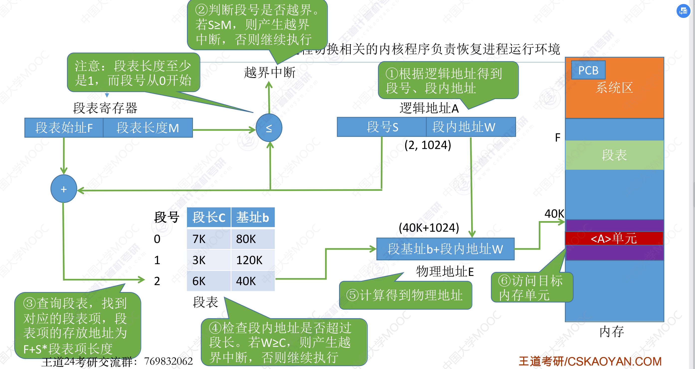

- 实现过程
  - 进程切换相关的内核程序负责恢复进程运行环境
    - 其中最重要的就是段表寄存器
  - 当进程开始执行，进入内存时，首先就会访问段表寄存器
  - 根据逻辑地址找到段号、段内地址
  - 判断段号是否越界
    - 若 S>=M，则产生越界中断
      - 段表的长度至少是 1，而段号从 0开始
    - 若 S<M，则继续执行查找
  - 查询段表，找到对应的段表项，段表项的存放地址为 F+S*段表项长度
  - 检查段内地址是否超过段长
    - 若 W>=C，则产生越界中断
    - 若 W<C，继续执行
  - 计算得到物理地址
  - 访问目标内存单元

###### 分段、分页管理的对比

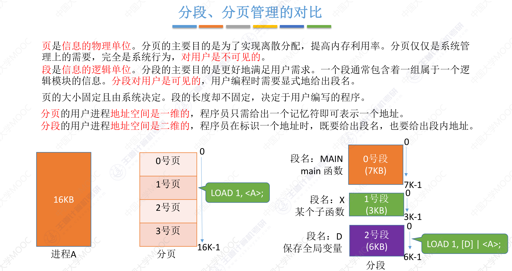

- 页
  - 页是信息的物理单位
    - 分页的主要目的是为了**实现离散分配**，提高内存利用率
    - **分页仅仅是系统管理上的需要**，完全是系统行为，对用户是不可见的
  - 页的大小固定且由系统决定
  - 分页的用户进程**地址空间是一维的**，程序员只需给出一个记忆符即可表示一个地址
    - 用户进程看起来好像在使用一个连续的地址空间，而不需要担心物理内存中的实际分布。程序员只需要提供一个虚拟地址即可，操作系统会将这个虚拟地址映射到正确的物理地址。
- 段
  - 段是信息的逻辑单位
    - **分段的主要目的是更好的满足用户需求**
    - 一个段通常包含着一组属于一个逻辑模块的信息
    - 分段**对用户是可见的**，用户编程时需要显式的给出段名
  - 段的长度不固定，决定于用户编写的程序
  - 分段的用户进程**地址空间是二维的**，程序员在标识一个地址时，既要给出段名，也要给出段内地址
    - 用户进程的虚拟地址空间被划分为不同大小的段，每个段有一个名字。不同的段可以表示不同类型的数据或代码。因此，程序员需要提供两个信息：段名和段内地址，才能准确地标识一个地址。
- 一维 VS 二维
  - 分页的话不用考虑分配问题，在用户进程看来它是连续存储的；而分段要考虑分配，所以既要提供段名又要提供段内地址
  

- 访问一个逻辑地址需要几次访存
  - 分页（单级页表）
    - 第一次访存——查内存中的页表
    - 第二次访存——访问目标内存单元
    - 总共两次访存

  - 分段
    - 第一次访存——查内存中的段表
    - 第二次访存——访问目标内存单元
    - 总共两次访存
    - 与分页系统类似，分段存储也可用引入快表机构，将近期访问过的段表项放到快表中，这样可以少一次访存，加快地址变换速度

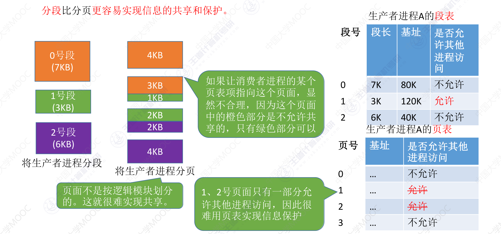

- 分段比分页更容易实现信息的共享和保护
  - 不能被修改的代码（比如变量可被修改就不属于此类代码）称为纯代码或可重入代码（不属于临界资源），可以共享
  - 可修改的代码是不能够共享的
    - 比如有一个代码段中有很多变量，各进程并发地同时访问可能造成数据不一致
    - 有点类似于并行里面的变量
- 实现代码段共享只需要让各进程的段表项指向同一个段
- 而页面不是按逻辑模块划分的，可能只有一部分允许其他进程访问，一部分不允许

##### 段页式存储管理

###### 分页、分段的优缺点分析

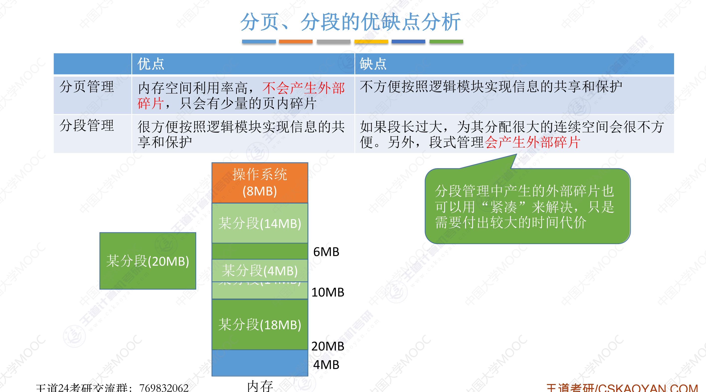

- 分页管理
  - 优点
    - 内存空间利用率高
    - 不会产生外部碎片，只会有少量的页内碎片
  - 缺点
    - 不方便按照逻辑模块实现信息的共享和保护
- 分段管理
  - 优点
    - 很方便按照逻辑模块实现信息的共享和保护
  - 缺点
    - 如果段长过大，为其分配很大的连续空间会很不方便
    - 段式管理会产生外部碎片
      - 分段管理中产生的外部碎片也可以用紧凑来解决，只是需要付出较大的事件代价

###### 分段+分页=段页式管理

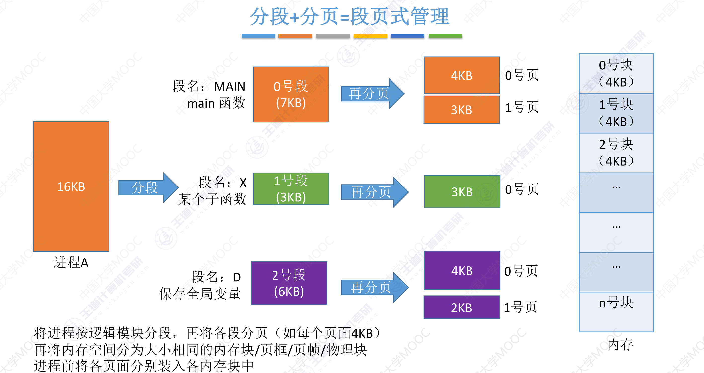

- 如何实现段页式管理？（先分段再分页）
  - 将进程按逻辑模块分段，再将各段分页（如每个页面 4KB）
  - 再将内存空间分为大小相同的内存块/页框/页帧/物理块
  - 进程执行前将各页面分别装入各内存块

###### 逻辑地址结构

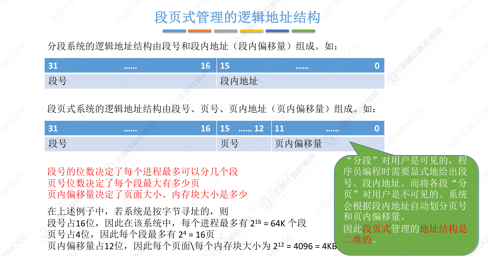

- 分段系统：段号+段内地址
- 分页系统：页号+页内偏移量
- 段页式系统：段号+页号+页内偏移量
  - 段号的位数决定了每个进程最多可以分几个段
  - 页号位数决定了每个段最大有多少页
  - 页内偏移量决定了页面大小、内存块大小是多少
- 若系统是按字节寻址的，段号 16~31，页号 12~15，页内偏移量0~11
  - 段号占 16 位，因此在该系统中，每个进程最多有 2^16=64K 个段
  - 页号占 4 位，因此每个段最多有 2^4=16 页
  - 页内偏移量占 12 位，因此每个页面/每个内存块大小为2^12=4096=4KB
- 分段对用户是可见的
  - 程序员编程时需要显式的给出段号、段内地址
  - 而将各段分页对用户是不可见的
  - 系统会根据段内地址自动划分页号和页内偏移量
- 因此段页式管理的地址是二维的

###### 段表、页表

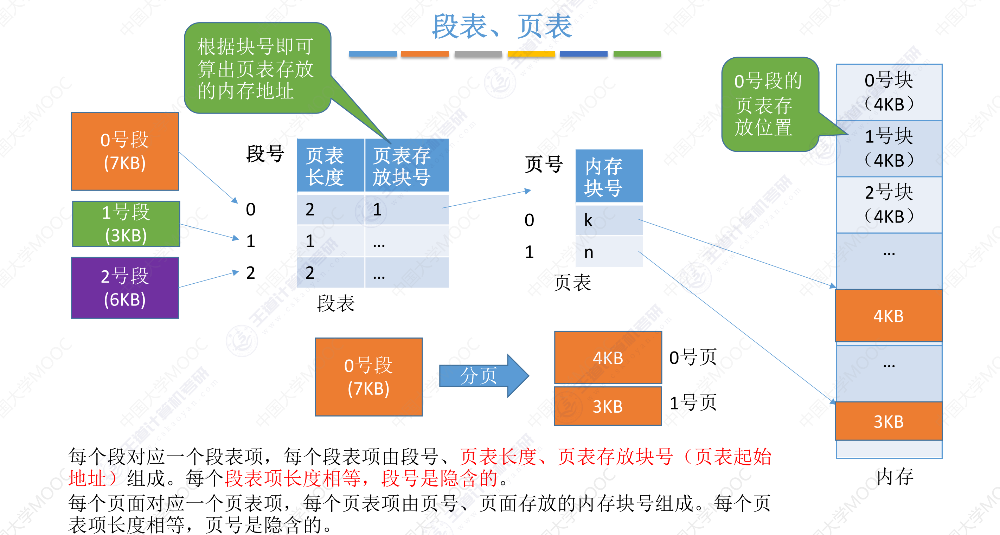

- 每个段对应一个段表项
  - **每个段表项由段号、页表长度、页表存放块号（页表起始地址）组成**
    - **与分段存储管理不同：段表项由段号、段的长度、起始存放地址**
  - 每个段表项长度相等，段号是隐含的
- 每个页面对应一个页表项
  - 每个页表项由页号、页面存放的内存块号组成
  - 每个页表项长度相等，页号是隐含的
- 一个进程对应一个段表，但是可能对应多个页表

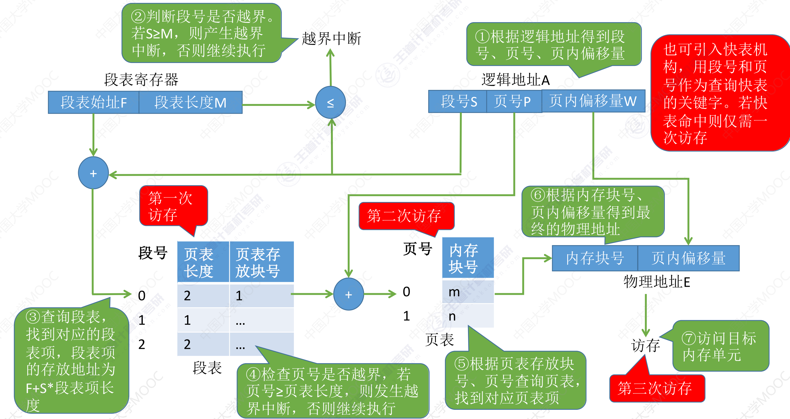

- 用逻辑地址查找物理地址的过程
  - 根据逻辑地址得到段号、页号、页内偏移量
  - 判断段号是否越界
    - 若S>=M，则产生越界中断
    - 若 S<M，则继续执行
  - 查询段表，找到对应的段表项，段表项的存放地址为 F+S*段表项长度
    - 第一次访存
  - 检查页号是否越界
    - 页号<页表长度，继续执行
    - 页号>=页表长度，则发生越界中断
  - 根据页表存放块号、页号查询页表，找到对应页表项
    - 第二次访存
  - 根据内存块号、页内偏移量得到最终的物理地址访问目标内存单元
    - 第三次访存

- 可以引用快表机构
  - 用段号和页号座位查询快表的关键字
  - 若快表命中则仅需一次访存

### 内存空间的扩充

- 虚拟技术（操作系统的虚拟性）

#### 覆盖技术

- 情况
  - 计算机内存小，内存大小不够用
- 目的

  - 为了**解决“程序大小超过物理内存总和”的问题**
- 思想

  - **将程序分为多个段**（多个模块）
  - 常用的段常驻内存，不常用的段在需要时调入内存

    - 内存中分为**一个固定区**和**若干个覆盖区**
  
      - 需要常驻内存的段放在固定区中，**调入后就不再调出（除非运行结束）**
      - 不常用的段放在覆盖区，**需要用到时调入内存，用不到时调出内存**
  

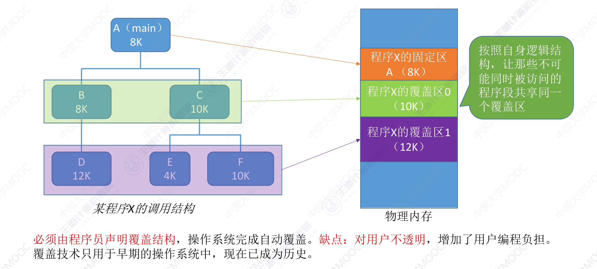

- 问题描述
  - 只有直接相连的上级模块才能调用下级模块
  - 同一等级的模块不可能被同时调用
- 解决方法
  - 按照自身逻辑结构，让哪些不能同时被访问的程序段共享同一个覆盖区
- 缺点
  - **必须由程序员声明覆盖结构**，操作系统完成自动覆盖
  - **对用户不透明**，增加了用户编程负担
- 只用于早期的操作系统，现在已成为历史

#### 交换技术

- 交换（对换）技术
  - 设计思想
    - 内存空间紧张时，系统**将内存中某些进程暂时换出外存**
    - 把外存中某些已具备运行条件的进程**换入内存**
      - 进程在内存与磁盘间动态调度
  - 中级调度（内存调度）
    - 决定将哪些处于挂起状态的进程重新调入内存

- 暂时换出外存等待的进程状态为挂起状态（挂起态，suspend）
  - 就绪挂起、阻塞挂起

- 问题
  - 应该在外存（磁盘）的什么位置保存被换出的进程？
    - 具有对换功能的操作系统中，通常把磁盘空间分为文件区和对换区两部分
      - 文件区
        - 主要存放文件
        - **主要追求存储空间的利用率**
        - 对文件区空间的管理采用**离散分配**方式
      - 对换区
        - 主要存放被换出的进程数据，只占磁盘空间的小部分，
        - **主要追求换入换出速度**
        - 采用**连续分配**方式
      - 对换区的 I/O速度比文件区的更快
  - 什么时候应该交换？
    - 通常在很多进程运行且内存吃紧时运行，而系统负荷降低就暂停
      - 例如
        - 发现很多进程运行时经常发生缺页，说明内存紧张，此时可以换出一些进程
        - 如果缺页率明显下降，就可以暂停换出
  - 应该换出哪些进程？
    - 可优先换出阻塞进程
    - 可换出优先级低的进程
      - 为了防止优先级低的进程再被调入内存后很快又被换出，有些系统还会考虑进程在内存的驻留时间
    - **注意：PCB 会常驻内存**，不会被换出外存

#### 覆盖技术和交换技术的区别

- 覆盖是在**同一个程序或进程**中进行的
- 交换技术是在******不同进程（或作业）**之间
  - 需要的进程调入内存
  - 不紧急/不需要的进程调出内存

#### 虚拟存储技术

- 使用下面一大节的内容具体介绍虚拟存储技术

### 地址转换

- 为了使编程更方便，程序员写程序时应该只需要关注指令、数据的逻辑地址
- 而**逻辑地址到物理地址的转换（这个过程称为地址重定位）**，应该由操作系统负责
- 这样就保证了程序员写程序时不需要关注物理内存的实际情况

### 存储保护

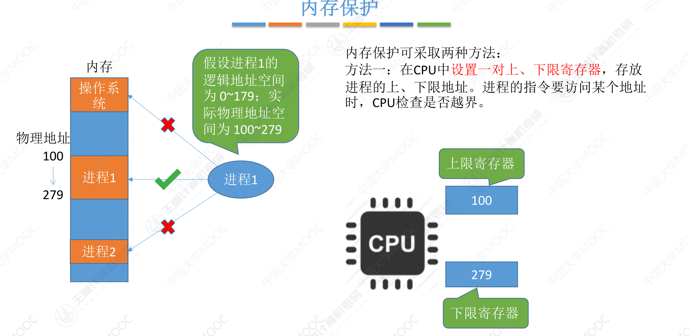
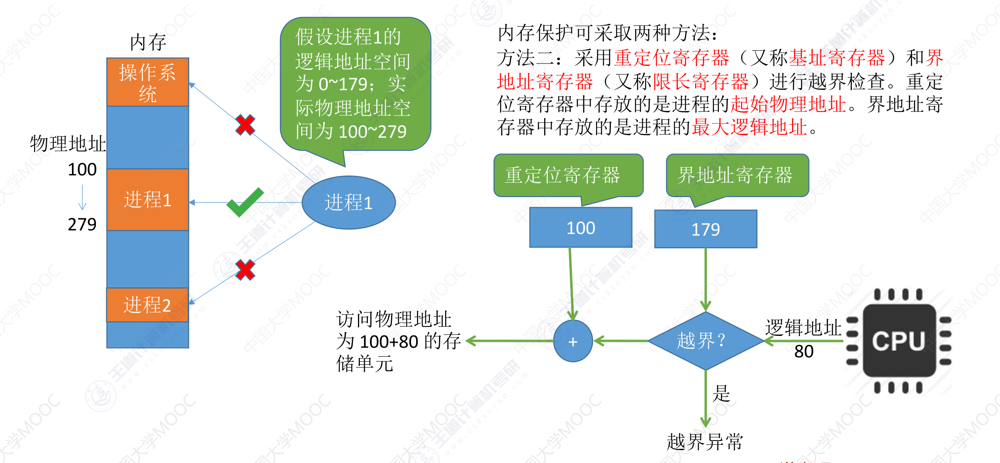

- 让一个进程只能访问系统分配的它所在的内存空间，而不能访问内存中其他程序或者操作系统所在的内存空间，防止恶意篡改
  - 假设进程 1 的逻辑地址空间为 0~179；实际物理地址空间为 100~279
    - 两种方法进行内存保护
      - 方法一：在 CPU 中设置一对**上下限寄存器**，存放进程的上、下限地址。进程指令要访问某个地址时，CPU 检查是否越界
        - 上限寄存器：100
        - 下限寄存器：279
      - 方法二：采用**重定位寄存器（基址寄存器）和界地址寄存器（限长寄存器）进行越界检查。**重定位寄存器中存放的是进程的**起始物理地址**。界地址寄存器中存放的是进程的**最大逻辑地址**
        - 重定位寄存器：100
        - 界地址寄存器：179

### 进程的内存映像

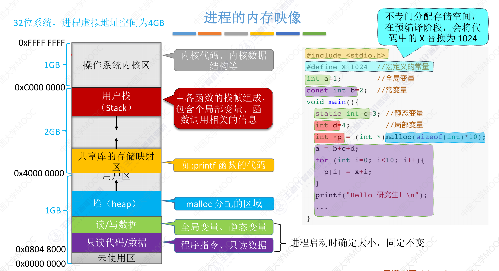

- **操作系统内核区**
- 占用 1GB，从内存的最高位地址开始
  - 存放内核代码、内核数据结构等
    - 进程调度就是内核代码中的一段代码
    - 进程控制块 PCB

- 普通程序员写的程序只能访问用户区的数据，不能访问操作系统内核区的数据

- 用户区

  - 低位1GB区域，0x00000000 到 0x40000000
    - **未使用区**
    - **只读代码/数据**
      - 存放在用户区最低地址上
      - 存放程序指令、只读数据（在程序运行过程中只能读，不能写）
        - 由 const 关键字修饰的常变量
        - 程序代码
    - **读/写数据**
      - 存放在第二低的地址上
        - 存放定义在函数外的全局变量
        - 由 static 关键字修饰的静态变量
    - 以上两种数据，在进程启动时确定大小，固定不变
    - **堆（heap）**
      - 存放在第三低的地址上
        - malloc/free 分配、回收的数据
    
  - 中间 2GB 区域
    - **共享库的存储映射区**
      - 存放在中间区域的低位
        - 存放被调用的库函数代码，如：<stdio.h>中的print函数的代码
    - **用户栈(Stack)**
      - 存放在中间区域的高位
      - 由各函数的栈帧组成，包含局部变量、函数调用相关的信息
        - 递归中函数调用就是存放在这里
        - 在函数大括号内定义的局部变量
        - 函数调用时传入的参数

- 宏定义的常量不会在内存中分配存储空间，在预编译阶段，会直接将代码中的 X 替换为 1024，然后隐含到程序指令中（立即数）

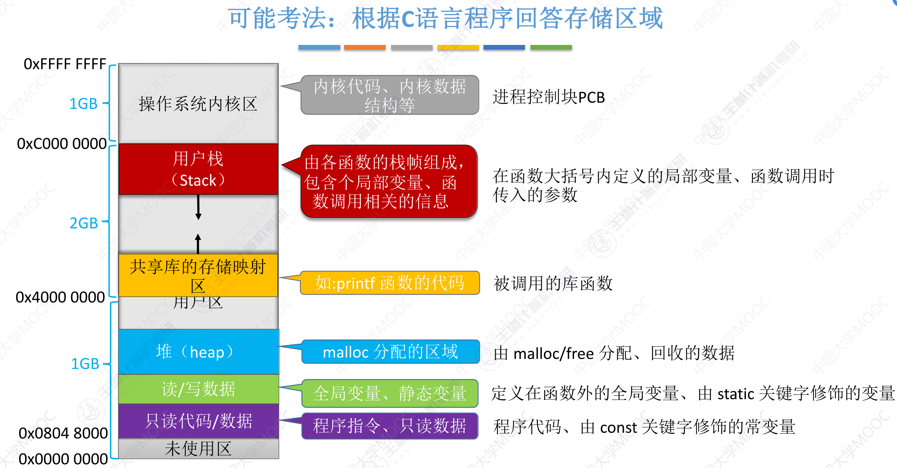

- 根据 C 语言程序回答存储区域

  - 操作系统内核区

    - 进程控制块 PCB

  - 用户栈

    - 在函数大括号内定义的局部变量、函数调用时传入的参数

  - 共享库的存储映射区

    - 被调用的库函数

  - 堆

    - 由 mallo/free分配、回收的数据
  - 读写数据

    - 定义在函数外的全局变量，由 static 关键字修饰的变量
  - 只读代码/数据
  - 程序代码、由 const 关键字修饰的常变量

## 虚拟内存管理

### 虚拟内存的基本概念

#### 传统存储管理方式的特征、缺点

- 一次性
  - **作业必须一次性全部装入内存后才能开始运行**
    - 作业很大时，不能全部装入内存，导致**大作业无法运行**
    - 当大量作业要求运行时，由于内存无法容纳所有作业，因此只有少量作业能运行，导致**多道程序并发度下降**
- 驻留性
  - 一旦作业被装入内存，就会**一直驻留在内存**中，直到作业运行结束
  - 在一个时间段内，只需要访问作业的一小部分数据即可正常运行，这就导致了内存中会驻留大量的、暂时用不到的数据，浪费了宝贵的内存资源
- 自己理解
  - 大程序装不进来
  - 程序多了后面的进不来了
  - 用不到的程序也走不了

#### 局部性原理

##### 时间局部性

- 如果执行了程序中的某条指令，那么不久后这条指令很有可能再次执行
- 如果某个数据被访问过，不久之后该数据很可能再次被访问
  - 因为程序中存在大量的循环

##### 空间局部性

- 一旦程序访问了某个存储单元，在不久之后，其附近的存储单元也很有可能被访问
  - 因为很多数据在内存中都是连续存放的，并且程序的指令也是顺序的在内存中存放

##### 高速缓存技术

- 思想
  - 将近期会频繁访问到的数据放到更高速的存储器中，暂时用不到的数据放在更低速存储器中

#### 虚拟内存的定义和特征

- 基于局部性原理
  - 在程序装入时，可以将程序中很快会用到的部分装入内存，暂时用不到的部分留在外存，就可以让程序开始执行
  - 程序执行时，当所访问的信息不在内存中，由操作系统负责将所需信息从外存调入内存，然后继续执行程序
  - 若内存空间不够，由操作系统负责将内存中暂时用不到的信息换出到外存
  - 在操作系统的管理下，用户看来似乎有一个比实际内存大的多的内存，虚拟内存
    - 操作系统虚拟性的一个体现，实际的物理内存大小没有变，只是在逻辑上进行了扩充
- 主要特征
  - 多次性（少量多次）
    - 无需再作业运行时一次性全部装入内存，而是允许被分成多次调入内存
  - 对换性（交换技术）
    - 在作业运行时无需一直常驻内存，而是允许在作业运行过程中，将作业换入、换出
  - 虚拟性（虚拟变大了）
    - 从逻辑上扩充了内存的容量，使用户看到的内存容量，远大于实际的容量

- 虚拟内存的最大容量是由计算机的地址结构（CPU 寻址范围）确定的
- 虚拟内存的实际容量 = min（内存和外存容量之和，CPU 寻址范围）
  - 如：某计算机地址结构为 32 位，按地址编址，内存大小为 512MB，外存大小为 2GB
    - 虚拟内存的最大容量为2^32B = 4GB
    - 虚拟内存的实际容量 = min(2^32B, 512MB+2GB) = 2GB + 512MB

#### 如何实现虚拟内存技术

- 虚拟内存技术

  - 允许一个作业分多次调入内存
  - 如果采用连续分配方式，会不方便实现
  - **虚拟内存的实现需要建立在离散分配的内存管理方式基础上**

- 虚拟内存实现  VS  传统的非连续分配存储管理

  - 在程序执行过程中，**当所访问的信息不在内存时，由操作系统负责将所需信息从外存调入内存，然后继续执行程序**
    - 操作系统要提供请求调页（或请求调段）功能

  - 若内存空间不够，由操作系统负责将**内存中暂时用不到的信息换出到外存**
    - 操作系统要提供页面置换（或段置换）的功能

### 请求分页管理方式

- 请求分页存储管理与基本分页存储管理的主要区别
  - 在程序执行过程中，当所访问的信息不在内存时，由操作系统负责将所需信息从外存调入内存，然后继续执行程序
  - 操作系统要提供请求调页功能，将缺失页面从外存调入内存
- 若内存空间不够，由操作系统负责将内存中暂时用不到的信息换出到外存
  - 操作系统要提供页面置换功能，将暂时用不到的页面换出外存

#### 页表机制

- 与基本分页管理相比
  - 请求分页管理中，为了实现“请求调页”，操作系统需要知道每个页面是否已经调入内存
  - 如果还没调入，那么也需要知道该页面在外存中存放的位置
- 当内存空间不够时，要实现“页面置换”
  - 操作系统需要通过某些指标来决定到底换出哪些页面
  - 有的页面没有被修改过，就不用再浪费时间写回外存
  - 有的页面修改过，就需要将外存中的旧数据覆盖
  - 因此操作系统也需要记录各个页面是否被修改的信息
- 基本分页存储管理的页表
  - 页号
  - 内存块号
- 请求分页存储管理的页表
  - 页号
  - 内存块号
  - 状态位：是否已调入内存
  - 访问字段：可记录最近被访问过几次，或记录上次访问的事件，供置换算法选择换出页面时参考
  - 修改位：页面调入内存后是否被修改过
  - 外存地址：页面在外存中的存放位置

#### 缺页中断机构

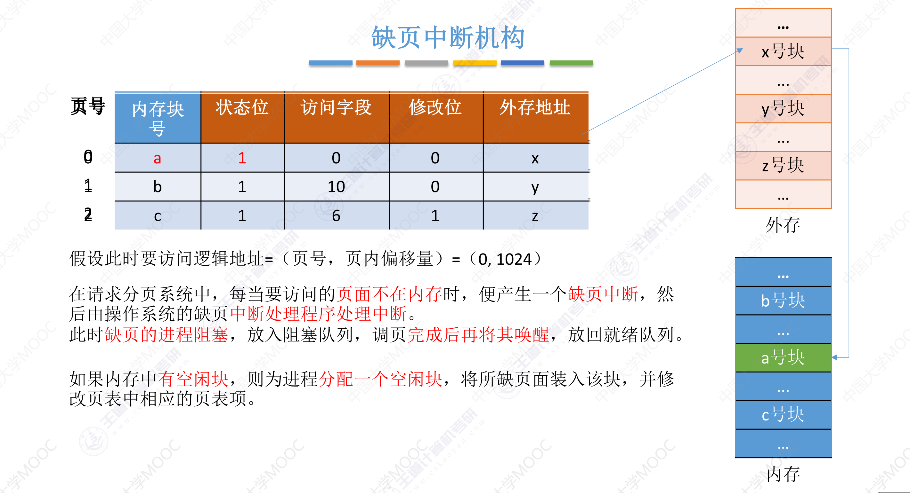
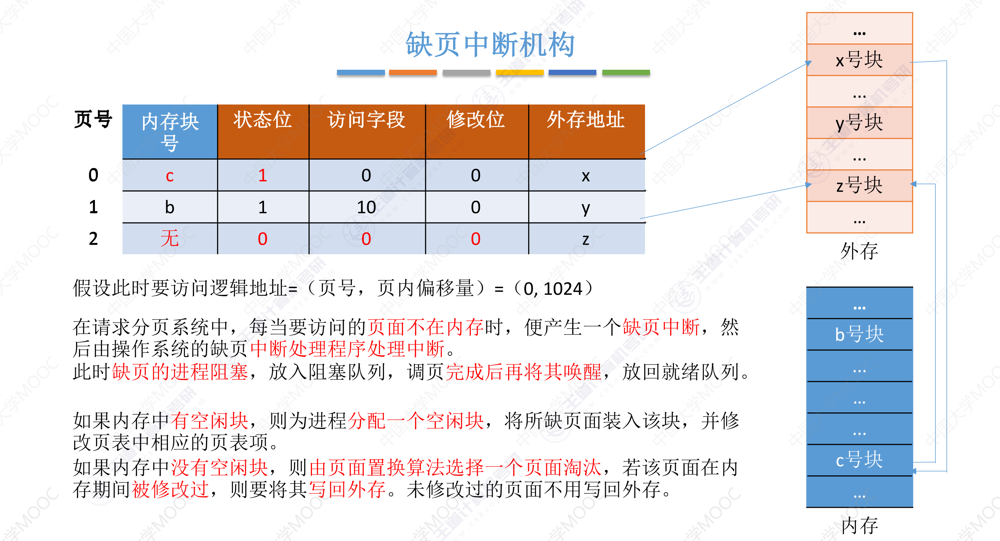

- 假设此时要访问逻辑地址 = （页号，页内偏移量）=（0,1024）
- 在请求分页系统中，每当**要访问的页面不在内存**时，便会**产生一个缺页中断**，然后由操作系统的缺页**中断处理程序处理中断**
  - 此时**缺页的进程阻塞**，放入阻塞队列，调页**完成后再将其唤醒**，放回就绪队列
- 如果内存中有**空闲块**，则为进程**分配一个空闲块**，将所缺页面装入该块，并修改页表中相应的页表项

- **如果内存中没有空闲块，则由页面置换算法选择一个页面淘汰**
  - 若该页面在内存期间被修改过，则要将其写回外存
  - 未修改过的页面不用写回外存

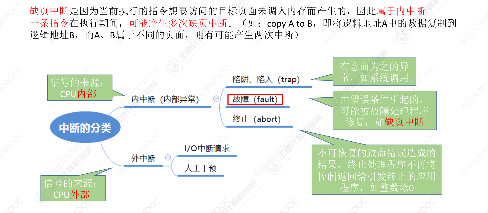

- 缺页中断
  - 使因为当前执行的指令想要访问的目标页面未调入内存而产生的，因此属于内中断
- 一条指令在执行期间，可能产生多次缺页中断
  - copy A to B
  - 即将逻辑地址 A 中的数据复制到逻辑地址 B，而 A、B 属于不同的页面，则可能产生两次中断

#### 地址变换机构

- 新增步骤
  - 请求调页（查到页表项时进行判断）
  - 页面置换（需要调入页面，但没有空闲内存块时进行）
  - 需要修改请求页表中新增的表项

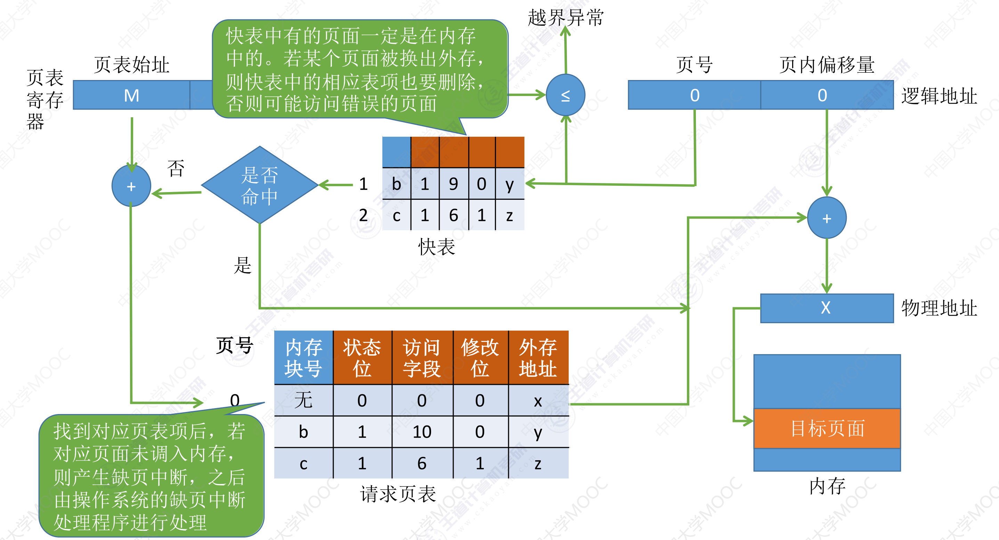

- 快表中有的页面一定是在内存中的
  - 若某个页面被换出外存，则快表中的相应表项也要删除，否则可能访问错误的页面
  - 如果在快表中查询到页表项，就不用去页表中查找了，可以直接访问目标页面的物理地址
- 找到对应页表项后，若对应页面未调入内存，则会产生缺页中断
  - 之后由操作系统的缺页中断处理程序进行处理

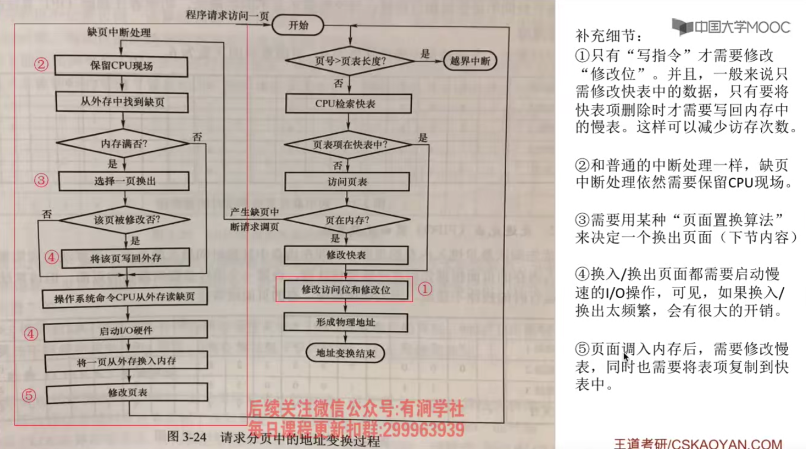

- 只有“写指令”才需要修改“修改位”
  - 一般来说只需修改快表中的数据，只有要将快表项删除时才需要写回内存中的慢表
  - 这可以减少访存次数
- 和普通的中断处理一样，缺页中断处理依然需要保留 CPU 现场
- 需要用某种“页面置换算法”来决定一个换出页面
- 换入/换出页面都需要启动慢速的 I/O操作
  - 如果需要换入/换出太频繁，会有很大的开销
- 页面调入内存中，需要修改慢表，同时也需要将表项复制到快表中

- 在具有快表机构的请求分页系统中，访问一个逻辑地址时，若发生缺页，则地址变换步骤是
  - 差快表（未命中）
  - 查慢表（发现未调入内存）
  - 调页（调入的页面对应的表项会直接加入快表）
  - 查快表（命中）
  - 访问目标内存单元

### 页面置换算法

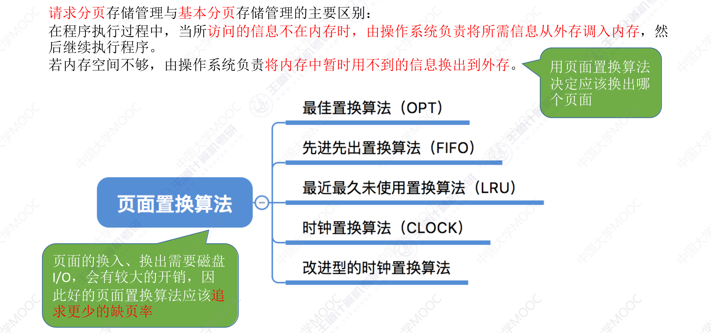

- 请求分页存储管理与基本分页存储管理的主要区别
  - 在程序执行过程中，当所访问的信息不在内存时，由操作系统负责将所需信息从外存调入内存，然后继续执行程序
  - 若内存空间不够，由操作系统负责将内存中暂时用不到的信息换出到外存
    - 用页面置换算法决定应该换出哪个页面
- 页面的换入、换出都需要磁盘I/O，会有较大的开销
  - 因此**好的页面置换算法应该追求更少的缺页率**

#### 最佳置换算法（OPT）

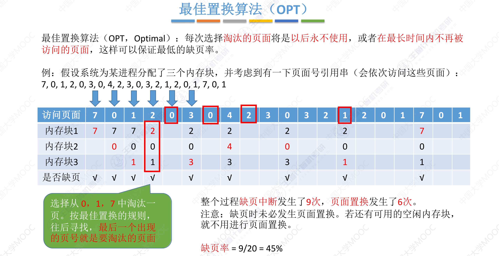

- 每次选择淘汰的页面将是以后永不使用，或者最长时间内不再被访问的页面，这样可以保证最低的缺页率

- 选择从当前内存块中淘汰一页

  - 按最佳置换的规则，往后寻找
  - **最后一个出现的页号就是要淘汰的页面**

- 整个过程缺页中断发生了 9 次，页面置换发生了 6 次

  - 缺页时未必发生页面置换，若还有可用的空闲内存块，就不用进行页面置换

  - 缺页率 = 9/20 = 45%
- 最佳置换算法是无法实现的
- 只有在进程执行的过程中才能知道接下来会访问到的是哪个页面
  - 操作系统无法提前预判页面访问序列

#### 先进先出置换算法（FIFO）

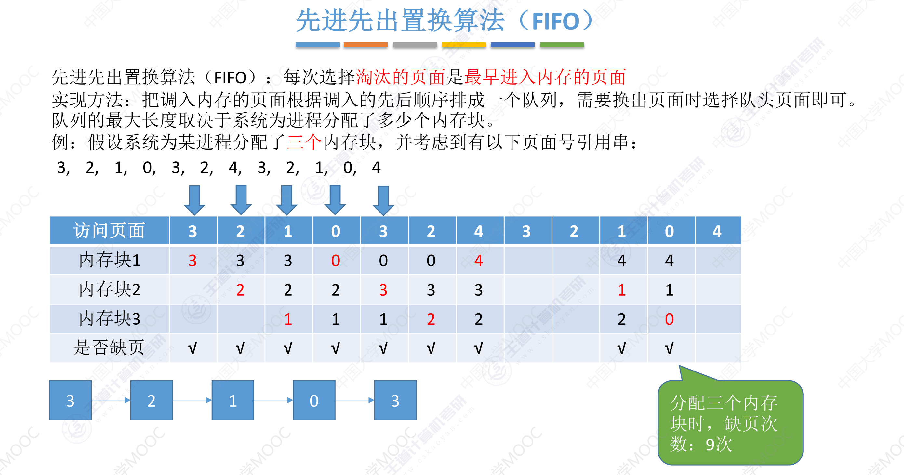

- 先进先出置换算法
  - **每次选择淘汰的页面是最早进入内存的页面**
- 实现方法
  - 把调入内存的页面根据调入的先后顺序排成一个队列
  - 需要换出页面时，选择队头页面即可
  - 队列的最大长度取决于系统为进程分配了多少个内存块

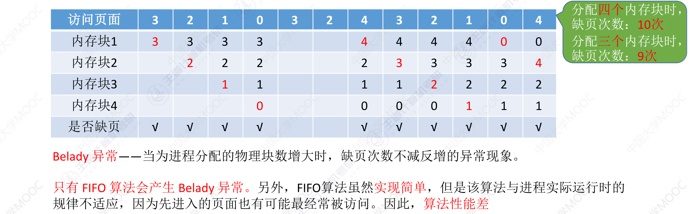

- Belady 异常
  - 当为进程分配的物理块数增大时，缺页次数不减反增的异常现象
- 只有 FIFO 算法会产生 Belady 异常
- FIFO 虽然实现简单，但是该算法与进程实际运行时的规律不适应，因为先进入的页面也有可能最经常被访问
  - 因此，算法性能差

#### 最近最久未使用置换算法（LRU）

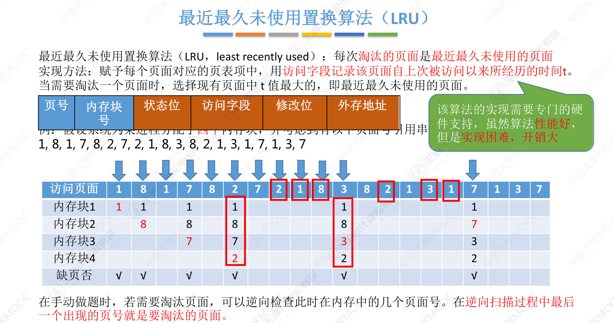

- 最近最久未使用置换算法
  - 每次淘汰的页面是最近最久未使用的页面
- 实现方法
  - 赋予每个页面对应的页表项，**用访问字段记录该页面自上次被访问以来所经历的事件 t**，当需要淘汰一个页面时，选择现有页面中 t 最大的，即最近最久未使用的页面
- 该算法的实现需要专门的硬件支持，虽然算法性能好，但是实现困难，开销大
- 做题过程中
  - 若需要淘汰页面，可以你想检查此时在内存中的几个页面号
  - 在逆向扫描过程中最后一个出现的页号就是要淘汰的页面

#### 时钟置换算法（CLOCK，NRU）

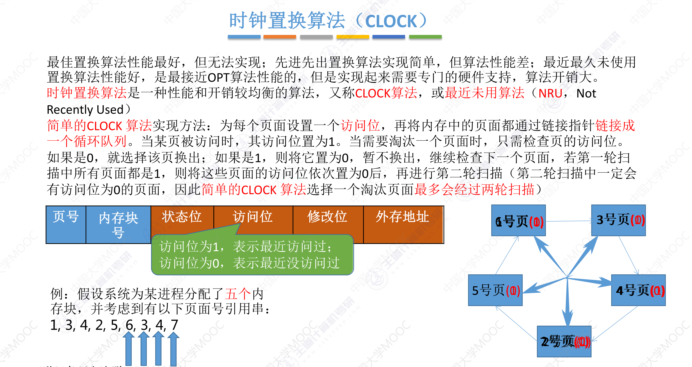

- 时钟置换算法
  - 最佳置换算法性能最好，但无法实现
  - 先进先出置换算法实现简单，但算法性能差
  - 最近最久未使用置换算法性能好，使最接近 OPT 算法性能的，但是实现起来需要专门的硬件支持，算法开销 da
  - 时钟置换算法是一种性能和开销较均衡的算法，又称 CLOCK 算法，或最近未用算法
- 实现方法
  - 为每个页面设置一个访问位
  - 再将内存中的页面都通过链接指针链接成一个循环队列
  - 当某页被访问时，其访问位置为 1
  - 当需要淘汰一个页面时，只需检查页的访问位
    - 如果是 0，就选择该页换出
    - 如果是 1，就将它置为 0，暂不换出，继续检查下一个页面
  - 若第一轮扫描中所有页面都是 1，则将这些页面的访问位依次置为 0 后，再进行第二轮扫描
    - 第二轮扫描中一定会有访问位为 0 的页面
    - 因此简单的 CLOCK 算法选择一个淘汰页面最多会经过两轮扫描
- 访问位
  - 为 1，说明最近访问过
  - 为 0，说明最近没有访问过

#### 改进型的时钟置换算法

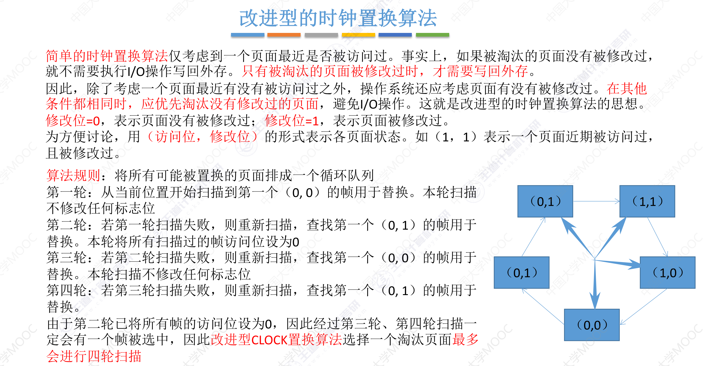

- 简单的时钟置换算法
  - 仅考虑到一个页面最近是否被访问过
  - 事实上，如果被淘汰的页面，没有被修改过，就不需要执行 I/O操作写回外存
  - 只有被淘汰的页面被修改过，才需要写回外存
- 改进型的时钟置换算法
  - 除了考虑一个页面最近又没有被修改过之外，操作系统还应考虑页面又没有被修改过
  - 在其他条件都相同时，应优先淘汰没有被修改过的页面，避免 I/O操作
- 修改位
  - 为 0，说明页面没有被修改过
  - 为 1，说明页面被修改过
- （访问位，修改位）= （1,1）说明一个页面最近被访问过并且被修改过
- 算法规则
  - 将所有可能被置换的页面排成一个循环队列
  - 第一轮：没访问且没修改（0,0）
    - 从当前位置开始扫描到第一个（0,0）的帧用于替换。
    - 本轮扫描不修改任何标志位
  - 第二轮：没访问但修改过
    - 若第一轮扫描失败，则重新扫描，查找第一个（0,1）的帧用于替换。本轮将所有扫描过的帧访问位设为 0
  - 第三轮：访问过但没修改（1,0）—> (0,0)
    - 若第二轮扫描失败，则重新扫描，查找第一个（0,0）的帧用于替换。本轮不修改任何标志位
  - 第四轮：访问过且修改过（1,1）—> (0,1)
    - 若第三轮扫描失败，则重新扫描，查找第一个（0,1）的帧用于替换。
  - 由于第二轮已将所有帧的访问位置为 0，因此经过第三轮、第四轮扫描一定会有一个帧被选中
    - 因此改进型 CLOCK置换算法选择一个淘汰页面最多会进行四轮扫描

- 自己理解
  - 为啥只修改访问位不修改 修改位？
    - 因为修改位代表着这个帧是否被修改过，如果被修改了CPU 就不知道要不要写回外存了，所以这个位的数据不能动

### 页面分配策略

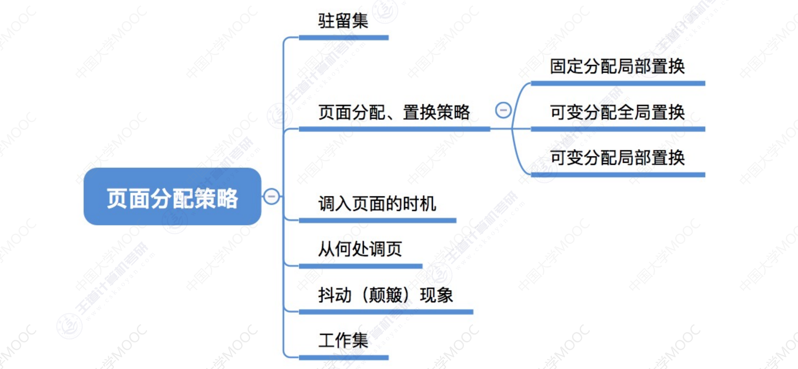

#### 驻留集

- 驻留集

  - 请求分页存储管理中给进程分配的物理块的集合

  - 在采用了虚拟存储技术的系统中，驻留集大小一般小于进程的总大小
  - 若驻留集太小
    - 会导致缺页频繁，系统要花大量的事件来处理缺页，实际用于进程推进的时间很少
  - 若驻留集太大
    - 导致多道程序并发度下降，资源利用率降低

#### 页面分配、置换策略（选择）

- 固定分配
  - 操作系统为每个进程分配一组固定数目的物理块，在程序运行期间不再改变
  - 即驻留集大小不变
- 可变分配
  - 先为每个进程分配一定数目的物理块。在进程运行期间，可根据情况做适当的增加或减少
  - 即驻留集可变
- 局部置换
  - 发生缺页时，只能选进程自己的物理块进行置换
    - 可能是固定分配，也可能是可变分配
- 全局置换
  - 可以将操作系统保留的空闲物理块分配给缺页进程
  - 也可以将别的进程持有的物理块置换到外存，再分配给缺页进程
    - 全局置换意味着一个进程拥有的物理块数量必然会改变，因此不可能是固定分配

##### 固定分配局部替换

- 系统为每个进程分配一定数量的物理块，在整个运行期间都不改变
  - 若进程在运行中发生缺页，则只能从该进程的内存中的页面中选出一页换出，然后再调入需要的页面
  - 缺点
    - 很难再刚开始就确定应为每个进程分配多少个物理块才算合理
  - 采用这种策略的系统可以根据进程大小、优先级、或是根据程序员给出的参数来确定为一个进程分配的内存块数

##### 可变分配全局替换

- 刚开始会为每个进程分配一定数量的物理块
  - 操作系统会保持一个空闲物理块队列
  - **当某进程发生缺页时**，从空闲物理块中取出一块分配给该进程
  - **若已经没有空闲物理块**，则选择一个**未锁定**的页面换出外存，在将该物理块分配给缺页的进程
    - 采用这种策略时，只要某进程发生缺页，都将获得新的物理块，仅当空闲物理块用完时，系统才选择一个未锁定的页面调出
    - 被选择调出的页可能是系统中任何一个进程中的页
      - 系统会锁定一些页面，这些页面中的内容不能置换出外存（如重要的内核数据）
  - 因此这个被选中的进程拥有的物理块会减少，缺页率会增加

##### 可变分配局部替换

- 刚开始会为每个进程分配一定数量的物理块
  - **当某进程发生缺页时，只允许从该进程自己的物理块中选出一个进行换出外存**
  - 如果进程在运行中**频繁缺页**，系统会为该进程多分配几个物理块，直至该进程缺页率趋势适当
  - 如果进程在运行中缺页率特别低，可适当减少分配给该进程的物理块

##### 区别

- 可变分配全局置换：只要缺页就给分配新物理块
- 可变分配局部置换：要根据发生缺页的频率来动态的增加或减少进程的物理块

#### 何时调入页面

##### 预调页策略

- 预调页策略（运行前调入）
  - 根据局部性原理
    - 空间局部性，如果当前访问了某个内存单元，在之后很有可能会接着访问与其相邻的那些内存单元
  - 一次调入若干个相邻的页面可能比一次调入一个页面更高效
    - 但如果提前调入的页面中大多数都没被访问过，又很低效
    - 可以预测不久之后可能访问到的页面，将它们预先调入内存
    - 但目前预测成功率只有 50 左右
  - 主要用于进程的首次调入，由程序员指出应该调入哪些部分

##### 请求调页策略

- 请求调页策略（运行后调入）
  - 进程在运行期间发现缺页时才将所缺页面调入内存
  - 由这种策略调入的页面一定会被访问到，但由于每次只能调入一页，而每次调页都要磁盘I/O操作，因此 I/O开销较大

#### 从何处调页

- 系统拥有足够的对换区空间

  - 原因

    - 对换区：读写速度更快，采用连续分配方式
    - 文件区：读写速度更慢，采用离散分配方式

  - 过程

    - 页面的调入、调出都是在**内存与对换区**中间进行的

    - 可以保证页面的调入、调出速度更快

    - **在进程运行前，需将进程相关的数据从文件区复制到对换区**

- 系统缺少足够的对换区空间
  - 凡是不会被修改的数据都直接从文件区调入
    - 这些页面会不被修改，换出时不必写回磁盘，下次需要时再从文件区调入即可
  - 可能被修改的部分，换出时需写回磁盘对换区，下次需要时再从对换区调入

- Unix 方式
  - 运行之前进程有关的数据全部放在文件区
    - 未使用过的页面，都要从文件区调入
  - 被使用过的页面需要换出，则写回对换区，下次有需要时从对换区调入

#### 抖动（颠簸）现象

- 抖动（颠簸）
  - 刚刚换出的页面马上又要换入内存，刚刚换入的页面马上又要换出外存，这种频繁的页面调度行为称为抖动
  - 主要原因
    - 进程频繁访问的页面数目高于可用的物理块数（分配给进程的物理块不够）

#### 工作集（了解）

- 驻留集
  - 请求分页存储管理中给进程分配的内存块的集合
- 工作集
  - 在某段时间间隔里，进程实际访问页面的集合
- 操作系统会根据“窗口尺寸”来算出工作集
  - 工作集大小可能小于窗口尺寸
    - 实际应用中，操作系统可以统计进程的工作集大小，根据工作集大小给进程分配若干内存块
  - **驻留集大小不能小于工作集大小，否则进程运行过程中将频繁缺页**
- 拓展
  - 基于局部性原理可知，进程在一段时间内访问的页面与不久之后会访问的页面是有相关性的
  - 可以根据进程近期访问的页面集合（工作集）来设计一种页面置换算法
    - 选择一个不在工作集中的页面进行淘汰

### 内存映射文件

#### 定义和作用

- 内存映射文件
  - 操作系统向上层程序员提供的功能——系统调用
    - 方便程序员访问文件数据
    - 方便多个进程共享同一个文件

#### 传统的文件访问方式

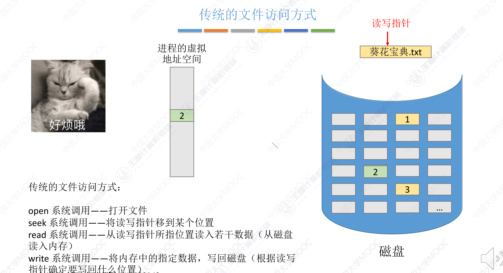

- 传统文件的访问方式
  - open 系统调用——打开文件
  - seek 系统调用——将读写指针移到某个位置
  - read 系统调用——从读写指针所指位置读入若干数据（从磁盘读入内存）
  - write 系统调用——将内存中的指定数据，写回磁盘（根据写指针确定要写回什么位置）

#### 内存映射文件的原理和作用

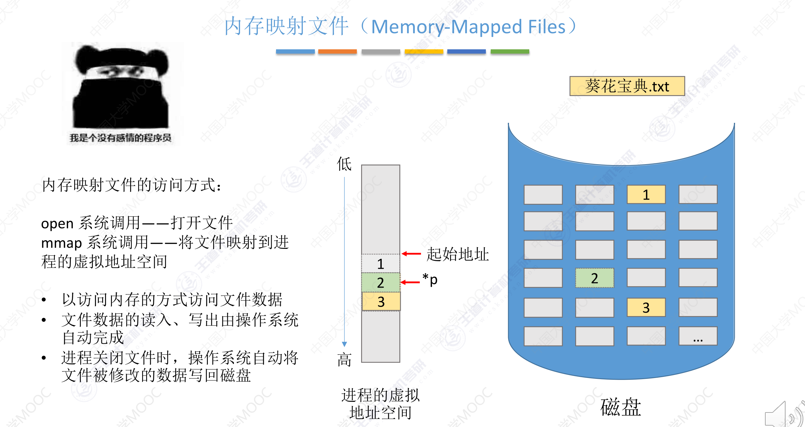

- 内存映射文件的访问方式
  - open 系统调用——打开文件
  - mmap 系统调用——将文件映射到进程的虚拟地址空间
- 以访问内存的方式访问文件数据
- 文件数据的读入、写出由操作系统自动完成
- 进程关闭文件时，操作系统自动将文件被修改的数据写回磁盘

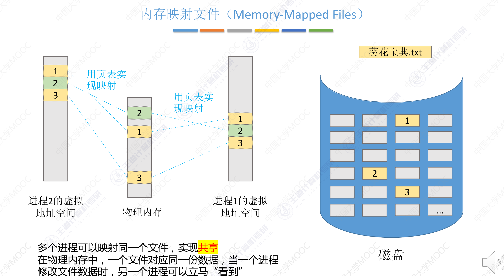

- 多个进程可以映射同一个文件，实现共享
- 在物理内存中，一个文件对应同一份数据，当一个进程修改文件数据时，另一个文件可以立马看到

