# 文件管理

## 考点总结

- 考试中遇到未指明隐式链接/显式链接的链接分配，默认是指隐式链接的链接分配

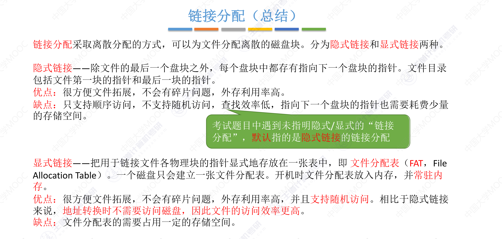


- 超级超级超级超级重要的考点
  - 要会根据多层索引、混合索引的结构计算出文件的最大长度
    - 各级索引表最大不能超过一个块
  - 要能自己分析访问某个数据块所需要的读磁盘次数
    - FCB 中会存有指向顶级索引块的指针，因此可以根据 FCB 读入顶级索引块
    - 每次读入下一级的索引块都需要一次读磁盘奥做
    - 注意题目条件——顶级索引块是否已经调入内存

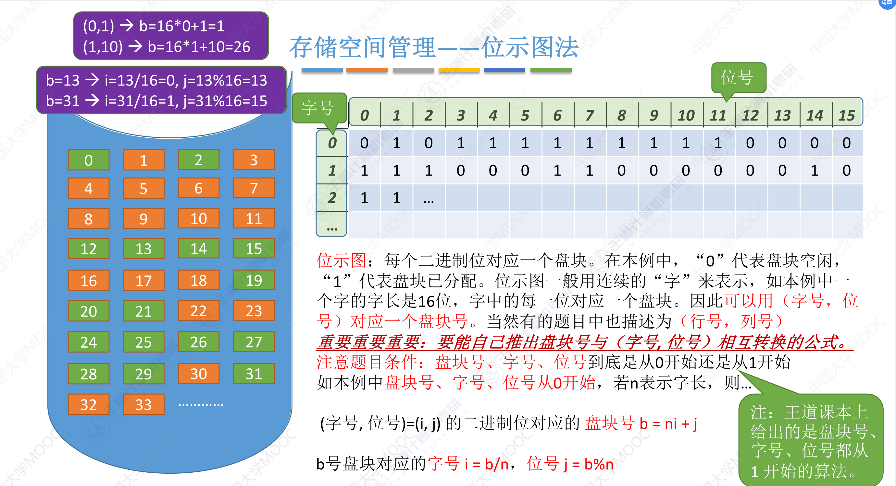

## 知识总结

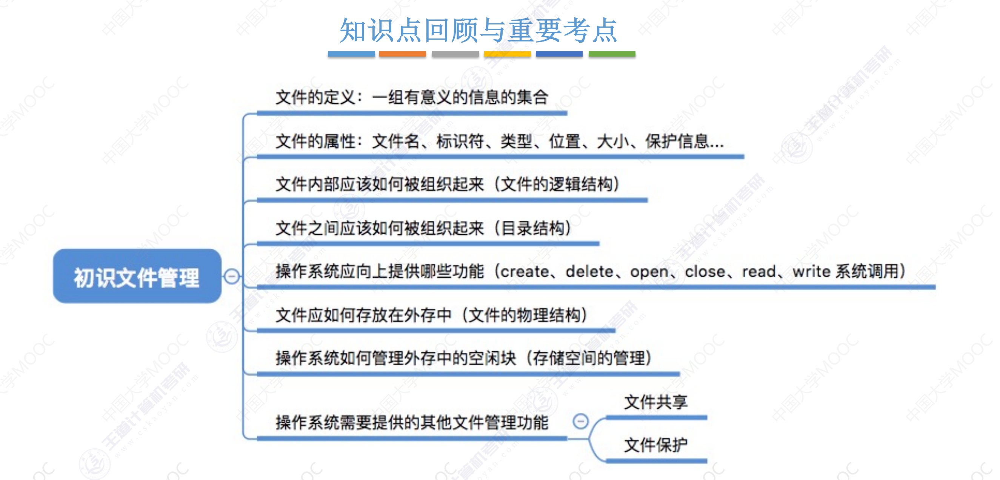


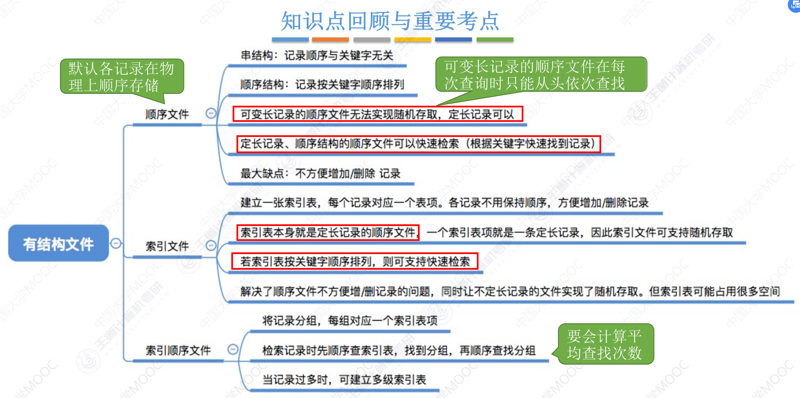

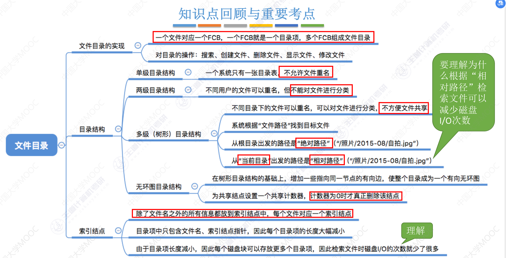

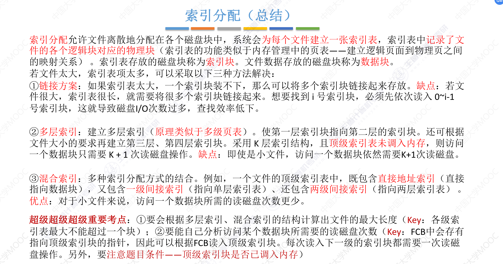

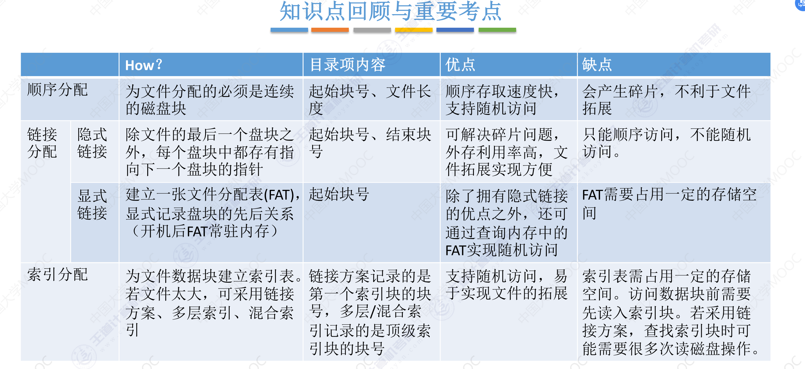

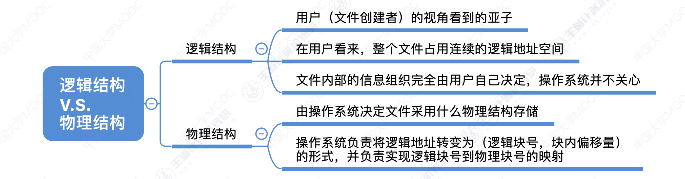

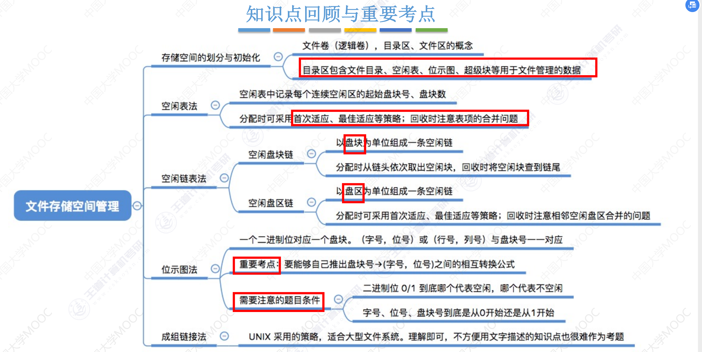


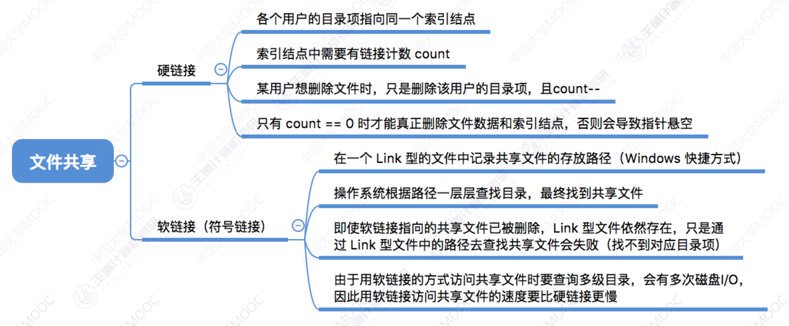

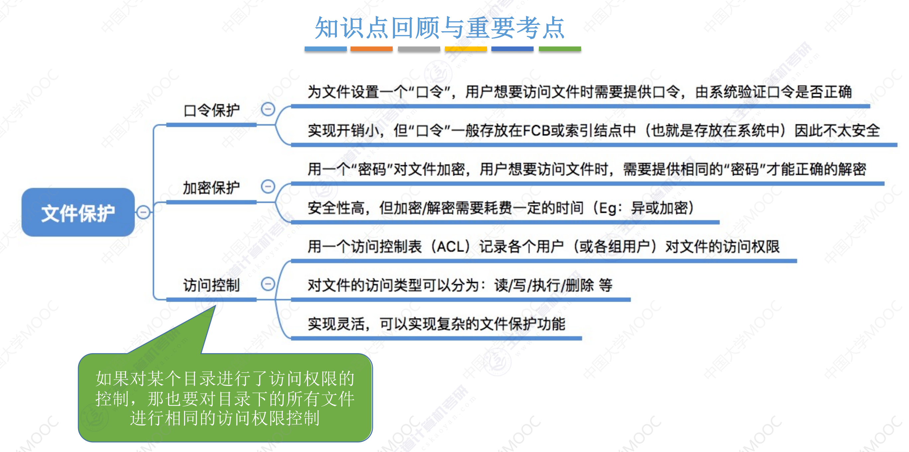


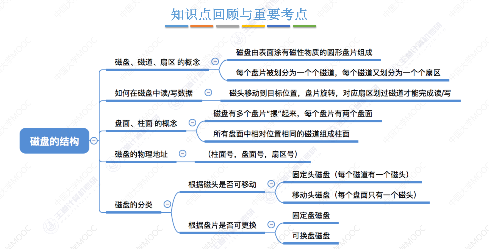

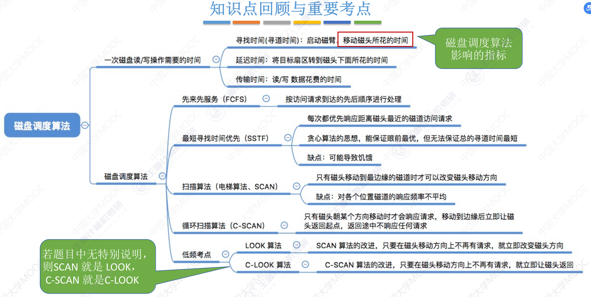

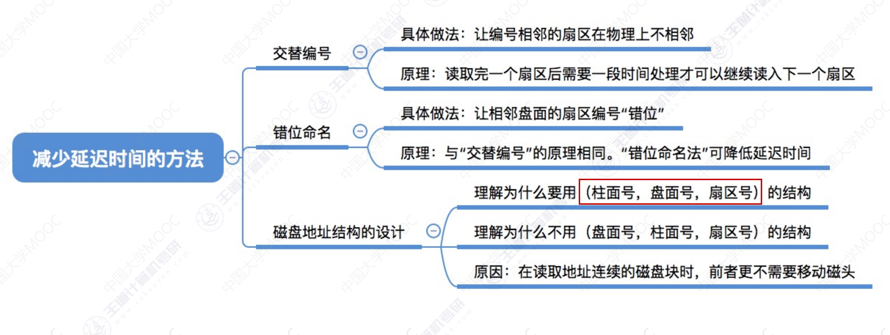

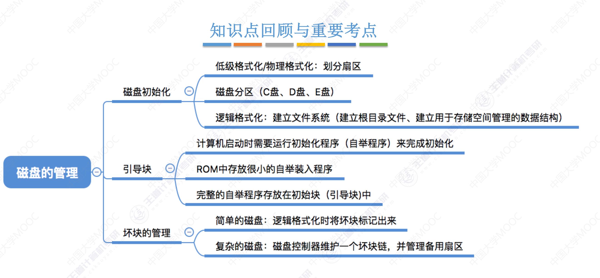


## 文件管理概论

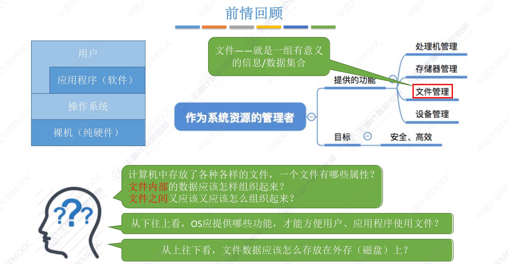

- 文件
  - 一组有意义的信息/数据集合
- 问题
  - 计算机中存放了各种各样的文件，一个文件有哪些属性？
  - 文件内部的数据应该怎样组织起来？
  - 文件之间又应该怎么组织起来？
  - 从下往上看。OS 应提供哪些功能才能方便用户、应用程序使用文件？
  - 从上向下看，文件数据应该怎么存放在外存（磁盘）上？

### 文件属性

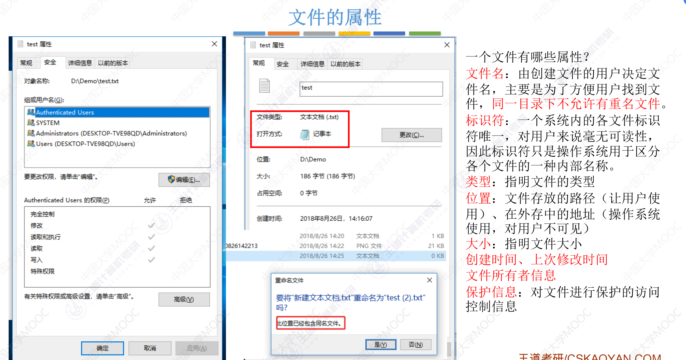

- 一个文件有哪些属性？
  - 文件名
    - 由创建文件的用户决定文件名，主要是为了方便用户找到文件
    - 同一目录下不允许有重名文件
  - 标识符
    - 一个系统内的各文件标识符唯一，对用户毫无可读性
    - 只是操作系统用于区分各个文件的一种内部名称
  - 类型
    - 指明文件的类型
  - 位置
      - 文件存放的路径
        - 让用户使用
    - 在外存中的地址
      - 操作系统使用，对用户不可见
  - 大小
      - 指明文件大小
  - 创建时间、上次修改时间
  - 文件所有者信息
  - 保护信息
      - 对文件进行保护的访问控制信息

### 组织内部数据

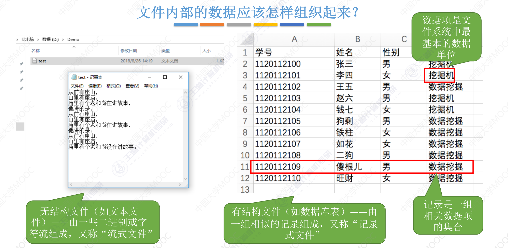

- 无结构文件
  - 又称流式文件，如文本文件txt
  - 由一些二进制或字符流组成
  - 没有明显的结构特性
- 有结构文件
  - 又称“记录式文件”
  - 由一组**相似的记录**组成
  - 数据项是文件系统中最基本的数据单位
  - 记录是一组相关数据项的集合

### 如何组织文件的内部数据

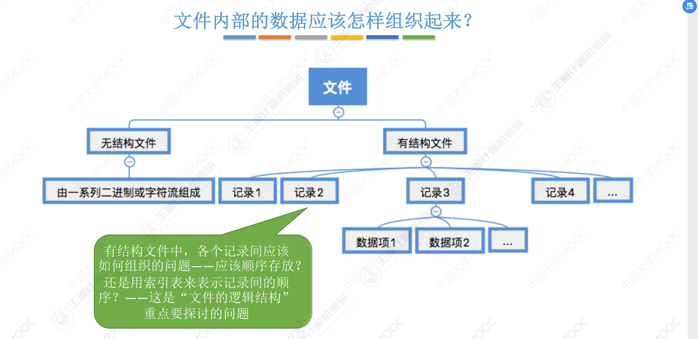

- 有结构文件中，各个记录间应该如何组织的问题
  - 应该顺序存放？
  - 用索引表表示记录间的顺序？
    - 这是文件的逻辑结构重点讨论的问题

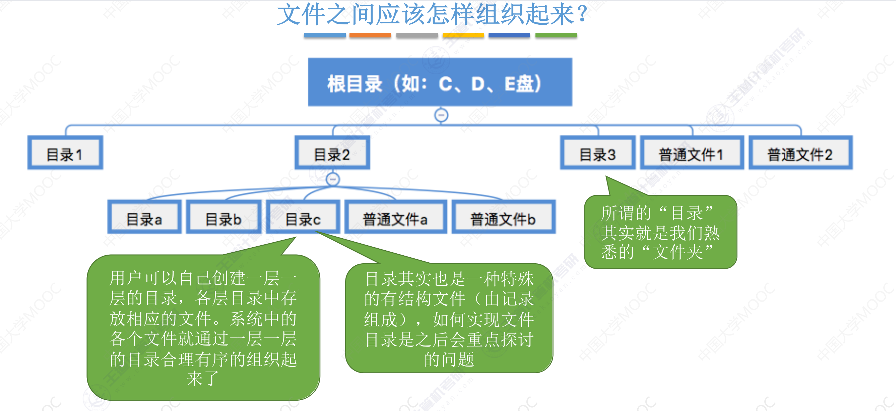

- 目录就是文件夹
- 用户可以自己创建一层一层的目录，各层目录中存放相应的文件
  - 系统中的各个文件就通过一层一层的目录合理有序的组织起来
- 目录其实也是一种特殊的有结构文件
  - 由记录组成
  - 重点：如何实现目录

### 操作系统向上提供的功能


- 创建文件
  - 点击新建后，图形化交互进程在背后调用了 create 系统调用
- 读文件
  - 将文件数据读入内存，才能让 CPU 处理
  - 双击之后，记事本应用程序通过操作系统提供的读文件功能，即 read 系统调用，将文件数据从外存读入内存，并显示在屏幕上
- 写文件
  - 将更改过的文件数据写回外存
  - 在记事本应用程序中编辑文件内容，点击保存后，记事本应用程序通过操作系统提供的写文件功能，即 write 系统调用，将文件数据从内存写回外存
- 删除文件
  - 点击删除之后，图形化交互进程通过操作系统提供的删除文件功能，即 delete 系统调用，将文件数据从外存中删除
- 打开文件
  - open 系统调用
  - 读写文件之前，需要打开文件
- 关闭文件
  - close 系统调用
  - 读写文件结束之后，需要关闭文件

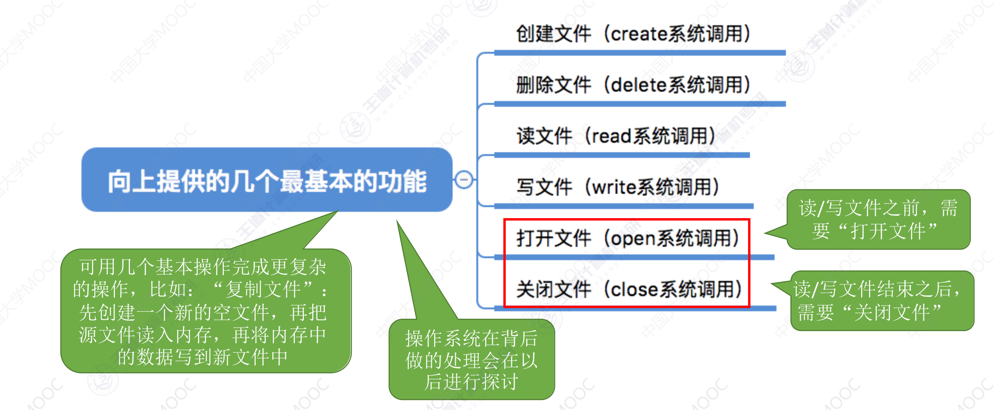

- 可以用几个基本操作完成更复杂的操作
  - 复制文件
    - 先创建一个新的空文件，再把源文件读入内存，再将内存中的数据写到新文件中

### 文件如何放到外存


- 与内存一样，外存也是由一个个存储单元组成的
  - 每个存储单元可以存储一定量的数据（如 1B）
  - 每个存储单元对应一个物理地址
- 类似于内存分为一个个内存块，外存也会分为一个个“块/磁盘块/物理块”
  - 每个磁盘块的大小是相等的，每块一般包含 2 的整数幂个地址
    - 本例中，一块包含 2^10个地址，即 1KB
  - 文件的逻辑地址也可以分为（逻辑块号，块内地址）
  - 操作系统同样需要将逻辑地址转换为外存的物理地址（物理块号，块内地址）的形式
  - 块内地址的位数取决于磁盘块的大小
- 操作系统以块为单位为文件分配存储空间。
  - 即使一个文件大小只有 10B，但依然需要占用 1KB 的磁盘块。
  - 外存中的数据读入内存时同样以块为单位

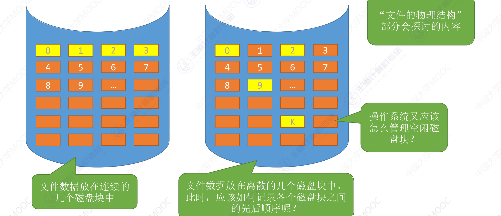

- 连续存放
  - 文件数据放在连续的几个磁盘块中
- 离散存放
  - 文件数据放在离散的几个磁盘块中
    - 如何记录各个磁盘块之间的先后顺序？
    - 操作系统又应该怎么管理空闲磁盘块？

### 文件共享和文件保护

- 文件共享：使多个用户可以共享使用一个文件
- 文件保护：如何保证不同的用户对文件有不同的操作权限


## 文件的逻辑结构

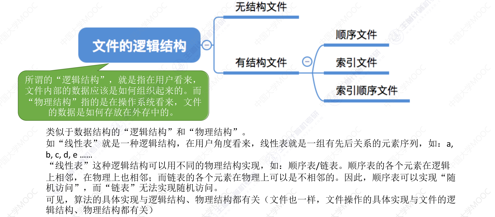

- 逻辑结构
  - 在用户看来，文件内部的数据应该是如何组织起来的
- 物理结构
  - 在操作系统看来，文件的数据时如何存放在外存中的
- 类似于数据结构的逻辑结构和物理结构
  - 线性表就是一种逻辑结构
  - 在用户角度
    - 线性表就是一组有先后关系的元素序列，如 a,b,c,d,e.....
  - 线性表可以用不同的物理结构实现
    - 顺序表和链表
    - 顺序表的各个元素在逻辑上相邻，在物理上也相邻
    - 链表的各个元素在物理上可以是不相邻的
      - 顺序表可以实现随机访问，链表无法实现随机访问
  - 算法的实现与逻辑结构、物理结构都有关
  - 文件也一样，文件操作的具体实现与文件的逻辑结构、物理结构都有关

### 无结构文件


- 无结构文件
  - 文件内部的数据就是一系列二进制流或字符流组成，没有明显的 结构特性
  - 又称流式文件，如 txt 文件

### 有结构文件

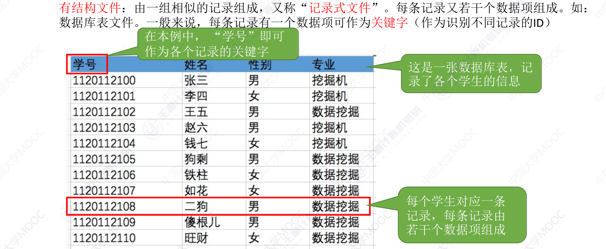


- 有结构文件
  - 又称记录式文件
  - 由一组相似的记录组成，每个记录由若干个数据项组成
  - 如数据库表文件
  - 每条记录都有一个数据项可以作为**关键字**。
  - 根据各条记录的长度（占用存储空间）是否相等，分为定长记录和可变长记录

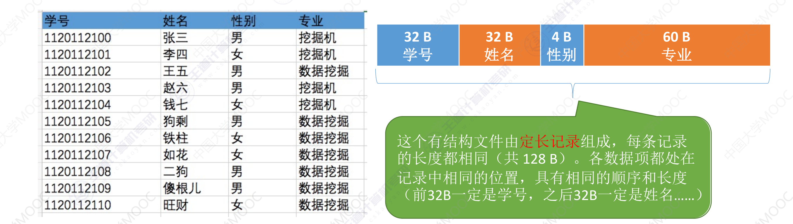

- 定长记录
  - 每条记录的长度都相同（供 128B）
  - 各个数据项都处在记录中相同的位置，具有相同的顺序和长度
    - 前 32B 一定是学号，之后 32B 一定是姓名

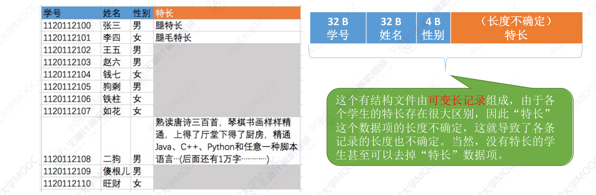

- 可变长记录
  - 数据项的长度不确定，记录各条记录的长度也不确定


- 根据有结构文件中的各条记录在逻辑上如何组织，可分为三类

#### 顺序文件


- 顺序存储
  - 逻辑上相邻的记录物理上也相邻
  - 类似于顺序表

- 链式存储

  - 逻辑上相邻的记录物理上不一定相邻
  - 类似于链表

- 顺序文件

    - 串结构
      - 记录之间的顺序与关键字无关


  - 顺序结构

    - 记录之间的顺序按关键字顺序排列


  - 通常按照记录存入的事件决定记录的顺序

- 问题

  - 假设已经知道了文件的起始地址（第一个记录存放的位置）
  - 能否快速找到第 i 个记录对应的地址？
    - 能否实现随机存取？
  - 能否快速找到某个关键字对应的记录存放的位置？

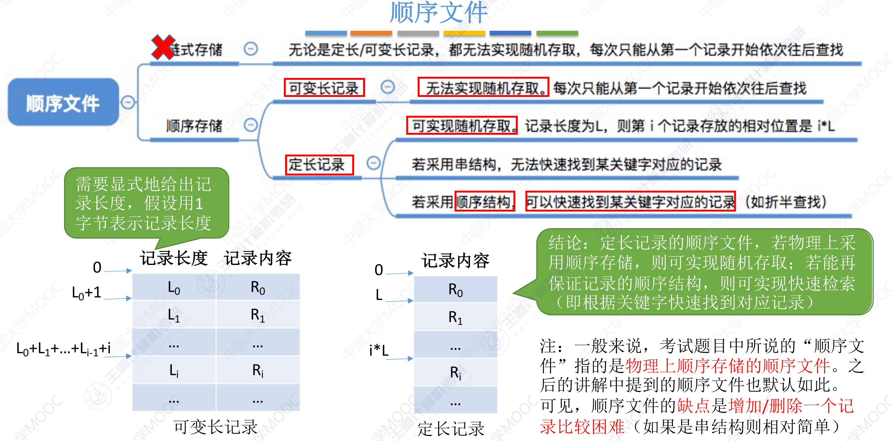

- 定长记录的顺序文件
  - 若物理上采用顺序存储，则可实现随机存取
  - 若能再保证记录的顺序结构，则可实现快速检索
    - 根据关键字快速找到对应记录
- 顺序文件
  - 一般指的是物理上顺序存储的顺序文件
- 缺点
  - 增加、删除一个记录比较困难（如果是串结构则相对简单）

#### 索引文件

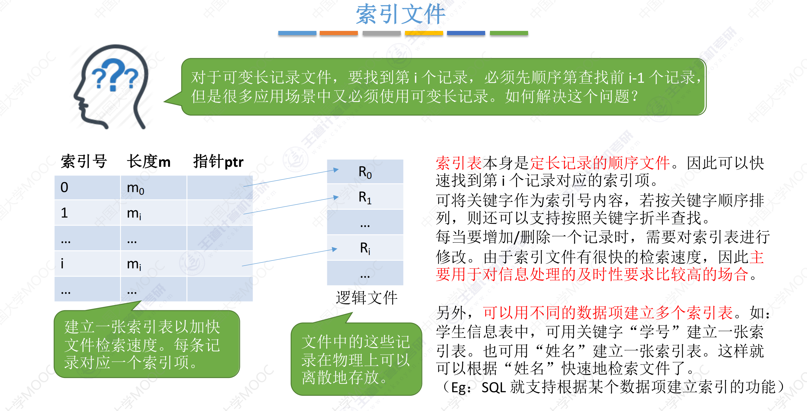

- 对于可变长记录文件，要找到第 i 个记录，就必须先顺序查找前 i-1 个记录
  - 但是很多应用场景中，又必须使用可变长记录
- 如何解决？
  - 建立一张索引表来加快文件检索速度
    - 每条记录对应一个索引项
    - 索引表对应的逻辑文件中的记录在物理上可以离散的存放
  - 索引表
    - 定长记录的顺序文件
    - 可以快速找到第 i 个记录对应的索引表
    - 可将关键字作为索引号内容，若按关键字顺序排列，还可以支持按照关键字折半查找
    - 索引文件具有较快的检索速度，**主要用于对信息处理的及时性要求比较高的场合**
  - 每当要增加/删除一个记录
    - 需要对索引表进行修改
  - 可以用不同的数据项建立多个索引表
    - 学生信息表中
      - 可以用“学号”建立一张索引表
      - 也可用用“姓名”建立一张索引表
    - SQL 就支持根据某个数据项建立索引的功能

#### 索引顺序文件


- 索引文件
  - 缺点
    - 每个记录对应一个索引表项，因此索引表可能会很大
      - 假设文件的每个记录平均只占 8B，而每个索引表项占 32 个字节
      - 索引表本身都要比文件内容大 4 倍，对存储空间的利用率太低
- 索引顺序文件
  - 索引文件额顺序文件思想的结合
    - 索引顺序文件中，同样会为文件建立一张索引表
    - 但并不是每个记录对应一个索引表项，而是一组记录对应一个索引表项
  - **索引顺序文件的索引项也不需要按关键字顺序排列，这样可以极大地方便新表项的插入**
- 在例子中
  - 学生记录按照学生姓名的开头字母进行分组
  - 每个分组就是一个顺序文件
  - 分组内的记录不需要按关键字排序


- 若一个顺序文件有10000个记录，则根据关键字检索文件，只能从头开始顺序查找（这里指的并不是定长记录、顺序结构 的顺序文件），平均须查找 5000 个记录。

- 若采用索引顺序文件结构，可把 10000 个记录分为 √10000 = 100 组，每组 100 个记录。则需要先顺序查找 索引表找到分组（共100个分组，因此索引表长度为 100，平均需要查 50 次），找到分组后，再在分组中顺序查找记录（每个分组100 个记录，因此平均需要查 50 次）。可见，采用索引顺序文件结构后，平均查找次数减少为 50+50 = 100 次。

- 同理，若文件共有 106个记录，则可分为 1000 个分组，每个分组 1000 个记录。根据关键字检索一个记录平均需要查找 500+500 = 1000 次。这个查找次数依然很多，如何解决呢？

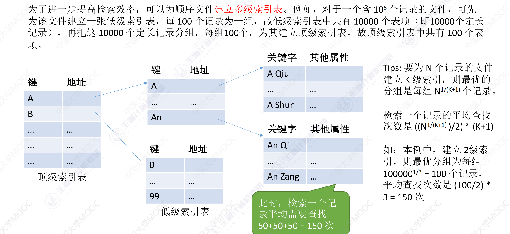

- 多级索引顺序文件

  - Tips: 要为 N 个记录的文件建立 K 级索引，则最优的分组是每组 N1/(K+1)个记录。
  - 检索一个记录的平均查找 次数是 ((N1/(K+1) )/2) * (K+1)
  - 如：本例中，建立 2级索 引，则最优分组为每组100000^1/3 = 100 个记录，平均查找次数是 (100/2) * 3 = 150 次

## 文件目录

- 文件控制块和目录都是操作系统内核空间中用于管理文件和文件系统的重要数据结构。
  - **它们加载到内存，便一直存放在操作系统内核空间里面的**
- 内存中并不总是包含所有的目录项，尤其是当目录项的数量非常多时，无法一次性全部加载到内存中。在某些情况下，操作系统需要从磁盘中读取目录项到内存中，以便进行文件的查找、打开、读写等操作。这个过程涉及到磁盘 I/O 操作，也就是从磁盘读取数据到内存的操作，以满足程序或用户的需求。

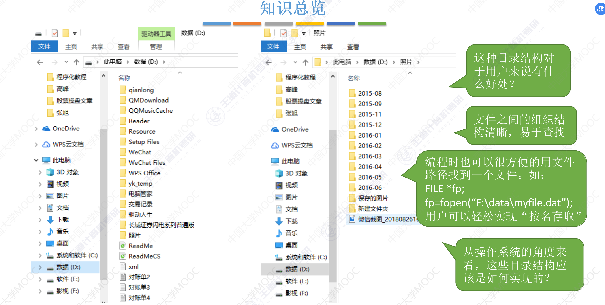

- 这种目录结构对于用户来说有什么好处？
  - 文件之间的组织结构清晰，易于查找

- 编程时也可以很方便的使用文件路径找到一个文件
  - FILE *fp; fp = fopen("F:\data\myfile.dat")
  - 用户可以轻松实现按名存取
- 从操作系统的角度来看，这些目录结构应该是如何实现的？

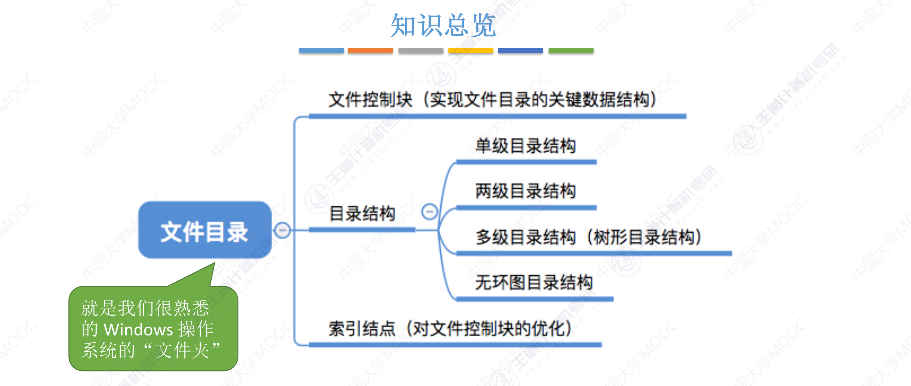

### 文件控制块（实现文件目录的关键数据结构）

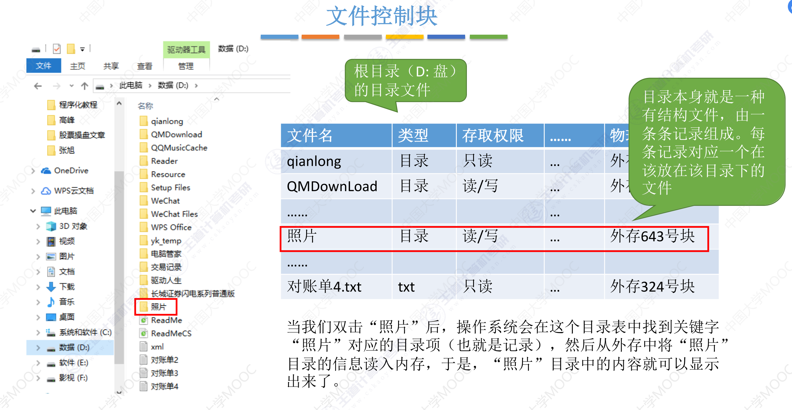

- 目录本身就是一种有结构文件，由一条条记录组成
- 每条记录对应一个在该目录下的文件
- 当我们双击“照片”后
  - 操作系统会在这个目录表中找到关键字“照片”对应的目录项（也就是记录）
  - 然后从外存中将“照片”目录的信息读入内存
  - 于是，照片目录中的内容就可以显示出来了

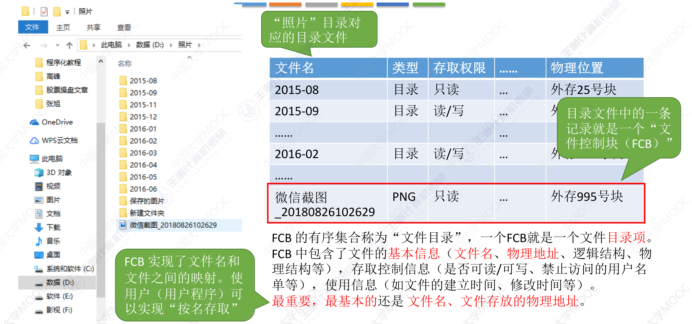

- 照片目录对应的目录文件

  - 目录文件中的一条记录就是一个文件控制块（FCB）

- FCB 的有序集合称为文件目录
  - 一个 FCB 就是一个文件目录项
  - FCB 中包含了
    - 文件的基本信息（文件名、物理地址、逻辑地址、物理结构等）
    - 存取控制信息（是否可读/可写，禁止访问的用户名单等）
    - 使用信息（文件创建时间、修改时间）
  - **最重要、最基本的是文件名、文件存放的物理地址**
      - FCB 实现了文件名与文件之间的映射。使用户（用户程序）可以实现“按名存取”


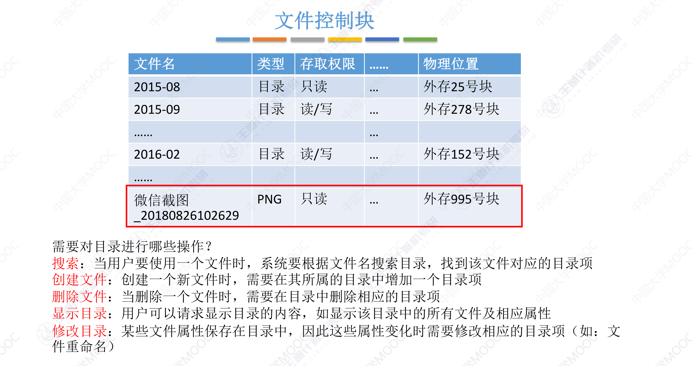

- 对目录进行的操作
  - 搜索
    - 当用户要使用一个文件时，系统要根据文件名搜索目录，找到该文件对应的目录项
  - 创建文件
    - 创建一个新文件时，需要在其所属的目录中增加一个目录项
  - 删除文件
    - 当删除一个文件时，需要在目录中删除对应的目录项
  - 显示目录
    - 用户可以请求显示目录的内容，如显示该目录中的所有文件及相应属性
  - 修改目录
    - 某些文件属性保存在目录中，因此这些属性变化时需要修改相应的目录项
    - 如文件重命名

### 目录结构

#### 单级目录结构

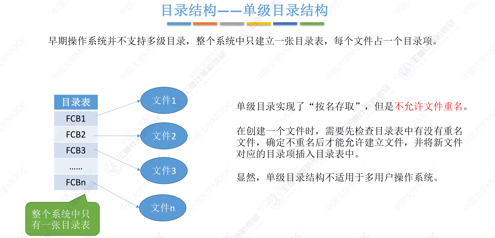

- 单级目录结构
  - 早期操作系统并不支持多级目录，**整个系统只建立一张目录表**，每个文件占一个目录表
  - 单级目录实现了“按名存取”，但是**不允许文件重名**
  - 在创建一个文件时，需要先检查目录表中有没有重名文件，确定不重名后才能允许建立文件，并将新文件对应的目录项插入目录表中
  - 显然，单级目录结构不适用于多用户操作系统

#### 两级目录结构

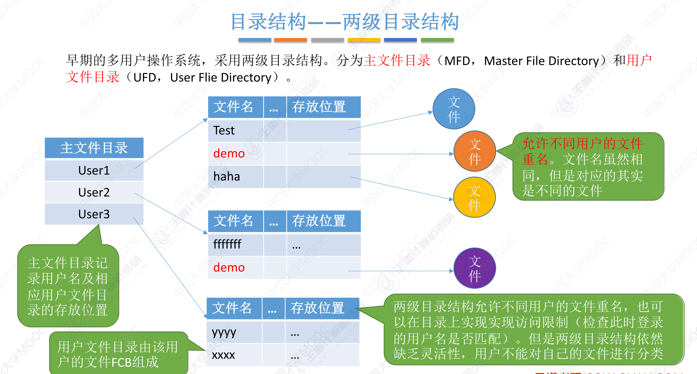

- 两级目录结构
  - 早期的多用户操作系统，采用两级目录结构
    - 主文件目录
      - 记录用户名及相应用户文件目录的存放位置
    - 用户文件目录
      - 由该用户的文件的 FCB 组成
  - 两级目录结构允许不同用户的文件重名，也可以在目录上实现访问限制（检查此时登录的用户名是否匹配）
  - 缺点
    - 缺乏灵活性
    - 用户不能对自己的文件进行分类

#### 多级目录结构（树形目录结构）

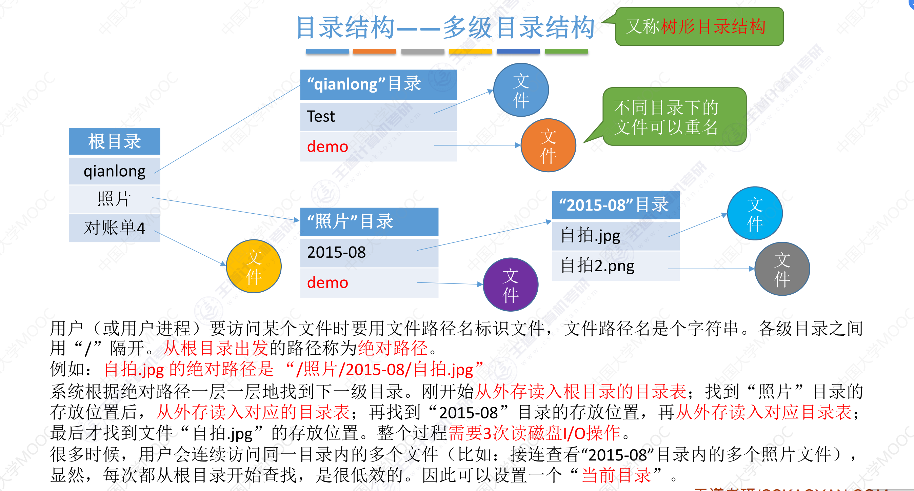


- 绝对路径

  - 用户（或用户进程）想要访问某个文件时要用文件路径名标识文件
  - 文件路径名是个字符串，**各级目录之间用“/”隔开，从根目录出发的路径称为绝对路径**
    - 如：自拍.jpg的绝对路径是“/照片/2015-08/自拍.jpg”
  - 查找过程
    - 系统根据绝对路径一层一层的找到下一级目录
    - 刚开始从外存读入根目录的目录表；找到照片目录的存放位置后，从外存读入对应的目录表；再找到“2015-08”目录的存放位置，再从外存读入对应的目录表；最后才找到文件“自拍.jpg”的存放位置
    - 整个过程需要 3 次读磁盘 I/O操作

- 相对位置

  - 很多时候用户会连续访问同一目录内的多个文件（比如：接连查看“2015-08”目录内的多个照片文件）

    - 每次都从根目录开始查找，是很低效的。因此可以设置一个“当前目录”
    - 例如，此时已经打开了“照片”的目录文件，也就是说，这张目录表已经调入内存，那么可以把它设置为“当前目录”。

    - 当用户想要访问某个文件时，可以**使用从当前目录出发的相对路径**
    - 在 Linux 中，“.”表示当前目录，因此如果“照片”是当前目录，则“自拍.jpg”的相对路径是“./2015-08/自拍.jpg”
    - 从当前路径出发，只需要查询内存中的“照片”目录表，即可知道“2015-08”目录表的存放位置，从外存调入该目录，即可知道"自拍.jpg"存放的位置

  - 引入**“当前目录”和“相对路径”**后，磁盘 I/O的次数减少了，这就提升了访问文件的效率

- 优点

  - 树形目录结构可以很方便的对文件进行分类，层次结构清晰，也能够更有效的进行文件的管理和保护

- 缺点

  - **树形结构不便于实现文件共享，为此提出了无换图目录结构**

#### 无环图目录结构

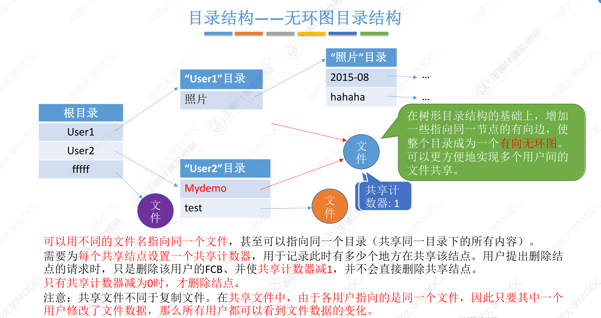

- 无环图目录结构
  - 实现方式
    - 可以用不同的文件名指向同一个文件，甚至可以指向同一个目录（共享同一目录下的所有内容）
  - 删除操作
    - 需要为每个共享节点设置一个共享计数器，用于记录此时有多少个地方在共享该节点
    - 用户提出删除节点的请求时，只是删除该用户的FCB，并使共享计数器减 1，并不会直接删除共享节点
    - 只有共享计数器减为 0 时，才删除节点
  - 注意
    - 共享文件不同于复制文件
    - 在共享文件中，由于各用户指向的是同一个文件，因此只要其中一个用户修改了文件数据，那么所有用户都可以看到文件数据的变化

### 索引节点（对文件控制块的优化）

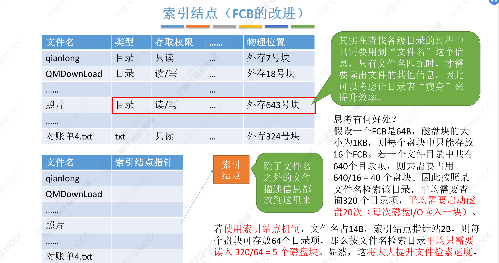


- 索引节点

  - **在查找各级目录的过程中只需要用到“文件名”这个信息**
  - 只有文件名匹配时，才需要读出文件的其他信息
  - 因此可以考虑让目录表“瘦身”来提升效率

- 思考

  - 假设一个FCB是64B，磁盘块的大 小为1KB，则每个盘块中只能存放16个FCB。

    - 若一个文件目录中共有640个目录项，则共需要占用640/16 = 40 个盘块。因此按照某文件名检索该目录，平均需要查询320 个目录项，平均需要启动磁盘20次（每次磁盘I/O读入一块）

      - 内存中并不总是包含所有的目录项，尤其是当目录项的数量非常多时，无法一次性全部加载到内存中。在某些情况下，操作系统需要从磁盘中读取目录项到内存中，以便进行文件的查找、打开、读写等操作。这个过程涉及到磁盘 I/O 操作，也就是从磁盘读取数据到内存的操作，以满足程序或用户的需求。

        在你的理解中，当操作系统需要查找某个文件时，它首先会查看内存中的目录结构。如果所需的目录项已经在内存中，那么就可以直接在内存中找到文件信息。但如果目录项不在内存中，操作系统就需要通过磁盘 I/O 操作，从磁盘中读取相应的目录块（包含目录项）到内存中，然后再在内存中进行查找，最终找到所需的文件信息。

        总之，内存中的目录结构可以看作是一个缓存，用于加速文件的查找和访问。但由于内存有限，无法容纳所有的目录项，因此有时候仍然需要从磁盘中读取数据到内存，以满足操作系统和应用程序的需要。

    - 若使用索引结点机制，文件名占14B，索引结点指针站2B，则每个盘块可存放64个目录项，那么按文件名检索目录平均只需要读入 320/64 = 5 个磁盘块。显然，这将大大提升文件检索速度。

      - 当找到文件名对应的目录项的时候，才需要将索引节点调入内存，索引节点中记录了文件的各种信息，包括文件在外存中的存放位置，根据“存放位置”即可找到文件
      - **存放在外存中的索引节点称为“磁盘索引节点”，当索引节点放入内存后称为“内存索引节点”**
      - 相比之下内存索引节点中需要增加一些信息
        - 文件是否被修改、此时有几个进程正在访问该文件

## 文件的物理结构（文件分配方式）


- 对非空闲磁盘块的管理（存放量文件数据的磁盘块）
  - 文件的物理结构/文件分配方式要探讨的问题
  - 文件数据应该怎样存放在外存中
- 对空闲磁盘块的管理
  - “文件存储空间管理”要探讨的内容


### 复习：文件块、磁盘块

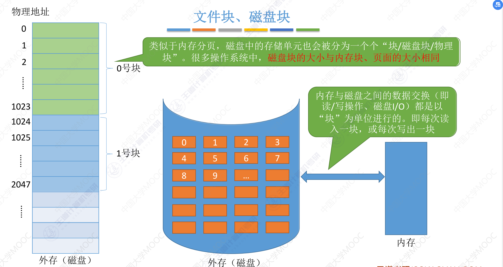

- 类似于内存分页，磁盘中的存储单元也会被分为一个个“块/磁盘块/物理块”
  - 很多操作系统中，**磁盘块的大小与内存块、页面的大小相同**
- 内存与磁盘之间的数据交换（读写操作、磁盘 I/O）
  - 读写操作、磁盘 I/O都是以块为单位进行的
  - 每次读入一块，或者写出一块

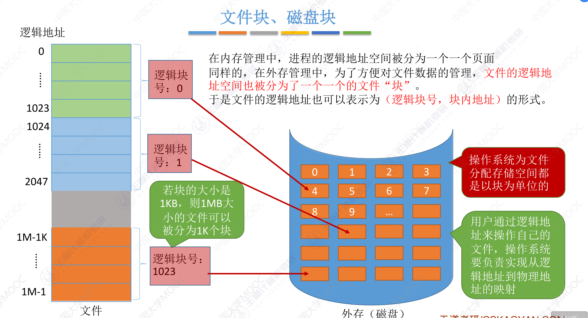

- 在内存管理中，进程的逻辑地址空间被分为一个一个页面
  - 若块的大小是 1KB，则 1MB 大小的文件可以分为 1K 个块
- 在外存管理中，为了方便对文件数据的管理，**文件的逻辑地址空间也被分为了一个一个的文件块**
  - 文件的逻辑地址也可以表示位（逻辑块号，块内地址）的形式
- 操作系统为文件分配存储空间都是以块为单位
  - 用户通过逻辑地址来操作自己的文件，操作系统要负责实现从逻辑地址到物理地址的映射

### 连续分配

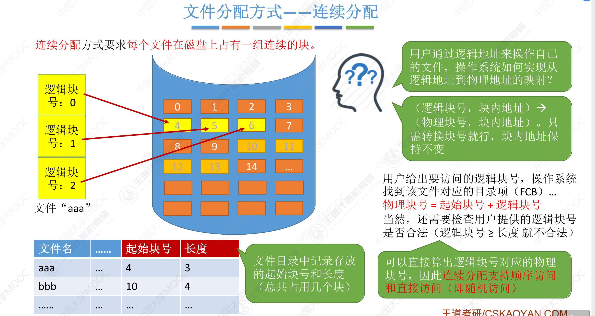

- **连续分配方式要求每个文件在磁盘上占有一组连续的块**
  - 用户通过逻辑地址来操作自己的文件，操作系统如何实现从偶记地址到物理地址的映射？
    - （逻辑块号，块内地址）—> （物理块号，块内地址）
    - 只需要转换块号就可以，块内地址保持不变
  - 用户给出要访问的逻辑块号，操作系统找到该文件对应的目录项（FCB）
    - 物理块号 = 起始块号 + 逻辑块号
  - 需要检查用户提供的逻辑块号是否合法
    - 逻辑块号 >= 长度就不合法
  - 可以直接算出逻辑块号对应的物理块号，因此**连续分配支持顺序访问和直接访问（即随机访问）**
    - 顺序访问：访问 2 要先访问 0 和 1
    - 直接访问：可以直接访问 2
- **文件目录中记录存放的起始块号和长度（总共占用几个块）**


- 读取某个磁盘块时，需要移动磁头
  - 访问的两个磁盘块相隔越远，移动磁头所需时间就越长
  - 结论
    - **连续分配的文件在顺序读/写时速度最快**

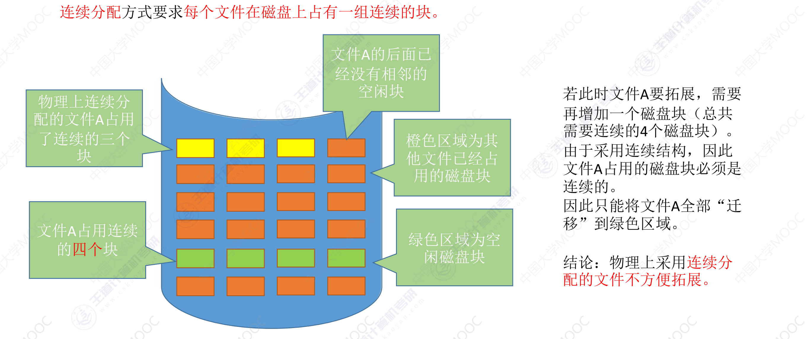

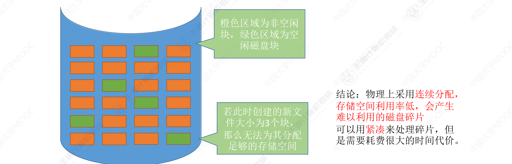


- 缺点
  - 不方便拓展
  - 存储空间利用率低，会产生难以利用的磁盘碎片
    - 可以用紧凑来处理碎片，但是需要耗费很大的事件代价
- 优点
  - 支持顺序访问和随机访问
  - 连续分配的文件在顺序访问时速度最快

### 链接分配


- 采取离散分配的方式，可以为文件分配离散的磁盘块

#### 隐式链接


- 隐式链接
  - 目录
    - 记录了文件存放的**起始块号和结束块号**
    - 可以增加一个字段来表示文件的**长度**
    - 除了文件的最后一个磁盘块之外，每个磁盘块中都会保存指向下一个盘块的指针，这些指针对用户是透明的
  - 如何实现文件的逻辑块号到物理块号的转换？
    - 用户给出要访问的逻辑块号 i，操作系统找到该文件对应的目录项（FCB）
    - 从目录项中找到起始块号（即 0 号块），将 0 号逻辑块读入内存，由此知道 1 号逻辑块存放的物理块号，于是读入 1 号逻辑块，再找到 2 号逻辑块的存放位置.....以此类推
    - 读入 i 号逻辑块，总共需要 i+1 次磁盘 I/O
  - 采用链式分配（隐式链接）方式的文件
    - 优点
      - 很方便文件拓展，不会有碎片问题，外存利用率高
    - 缺点
      - 只支持顺序访问，不支持随机访问
      - 查找效率低
      - 指向下一个盘块的指针也需要耗费少量的存储空间

#### 显式链接

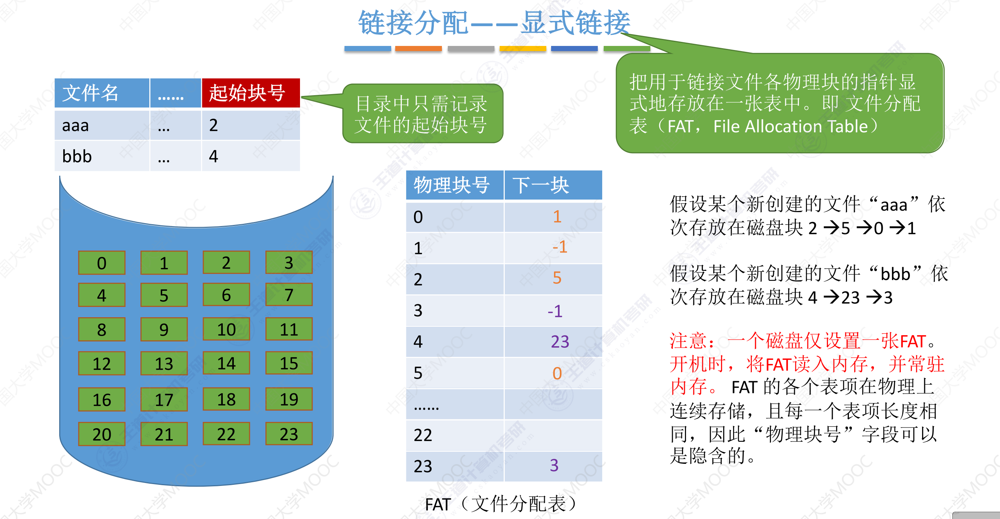


- 考试中遇到未指明隐式链接/显式链接的链接分配，默认是指隐式链接的链接分配
  
- 显式链接
  
  - 目录
    - 只需记录文件的起始块号
  - 文件分配表
    - 把用于链接文件各物理块的指针显式的存放在一张表中
    - **一个磁盘仅设置一张 FAT。开机时，将 FAT 读入内存，并常驻内存**
    - FAT 的各个表项在物理上连续存储，且每一个表项长度相同，因此“物理块号”字段可以是隐含的
  
  - 如何实现文件的逻辑块号到物理块号的转变？
    - 用户给出要访问的逻辑块号 i，操作系统找到该文件对应的目录项（FCB）
    - 从目录项中找到起始块号，若 i>0，则查询内存中的文件分配表 FAT，往后找到 i 号逻辑块对应的物理块号
      - 逻辑块号转换成物理块号的过程不需要读磁盘操作
  - 优点
    - 很方便文件拓展，不会有碎片问题，外存利用率高
    - 支持顺序访问，也支持随机访问
      - 想访问 i 号逻辑块时，不需要一次访问之前的 0~i-1号逻辑块
    - 相比于隐式链接来说，地址转换时不需要访问磁盘，因此文件的访问效率更高
  
  - 缺点
    - 文件分配表需要占用一定的存储空间

### 索引分配

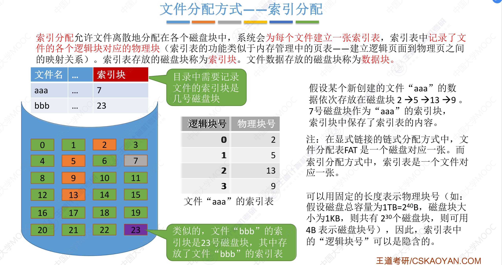


- 索引分配
  - 目录
    - 需要记录文件的索引块是几号磁盘块
  - 实现
    - 允许文件离散地分配在各个磁盘块中
    - 系统会为每个文件建立一张索引表，索引表中记录了文件的各个逻辑块对应的物理块
      - 索引表的功能类似于内存管理中的页表——建立逻辑页面到物理页之间的映射关系
    - 索引表存放的磁盘块称为索引块
    - 文件数据存放的磁盘块称为数据块
  - 过程
    - 假设某个新创建的文件“aaa”的数据以此存放在磁盘块 2—>5—>13—>9
    - 7 号磁盘块作为“aaa”的索引块，索引块中保存了索引表的内容
  - 区别
    - 在显式链接的链式分配方式中，文件分配表 FAT 是一个磁盘对应一张
    - 而**索引分配方式中，索引表是一个文件对应一张**
  - 可以用固定的长度表示物理块号
    - 假设磁盘总容量是 1TB=2^40B，磁盘块大小为 1KB，则总共有 2^30个磁盘块，则可用 4B 表示磁盘块号
      - 因此，索引表中的“逻辑块号”可以是隐含的
  - 如何实现文件的逻辑块号到物理块号的转换？
    - 用户给出要访问的逻辑块号 i，操作系统找到该文件对应的目录项（FCB）
    - 从目录项中可知索引表存放位置，将索引表从外存读入内存，并查找索引表即可知道 i 号逻辑块在外存中的存放位置
  - 优点
    - 可以支持随机访问
    - 文件拓展也很容易实现
      - 只需要给文件分配一个空闲块，并且增加一个索引表项就可以
  - 缺点
    - 索引表需要占用一定的存储空间


- 若每个磁盘块 1KB，一个索引表项 4B，则一个磁盘块只能存放 256 个索引项
  - 如果一个文件的大小超过了 256 块，那么一个磁盘块是装不下文件的整张索引表的，如何解决这个问题？
    - 链接方案
    - 多层索引
    - 混合索引

#### 链接方案

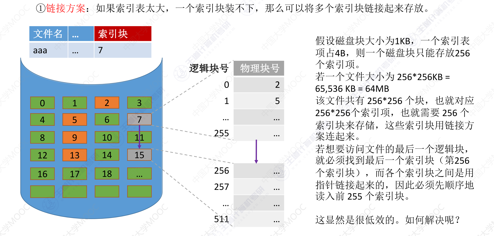

- 链接方案
  - 如果索引表太大，一个索引表放不下，那么可以**将多个索引表链接起来存放**
    - 假设磁盘块大小为1KB，一个索引表项占4B，则一个磁盘块只能存放256个索引项。
    - 若一个文件大小为 256\*256KB =65,536 KB = 64MB该文件共有 256\*256 个块，也就对应256\*256个索引项，也就需要 256 个索引块来存储，这些索引块用链接方案连起来。
    - 若想要访问文件的最后一个逻辑块，就必须找到最后一个索引块（第256个索引块），而各个索引块之间是用指针链接起来的，因此必须先顺序地读入前 255 个索引块。
  - 缺点
    - 若文件很大，索引表很长，就需要将很多个索引块链接起来。
    - 想要找到第 i 号索引块，就必须先依次读入 0~i-1 号索引块，这就导致磁盘 I/O次数过多，查找效率低下

#### 多层索引

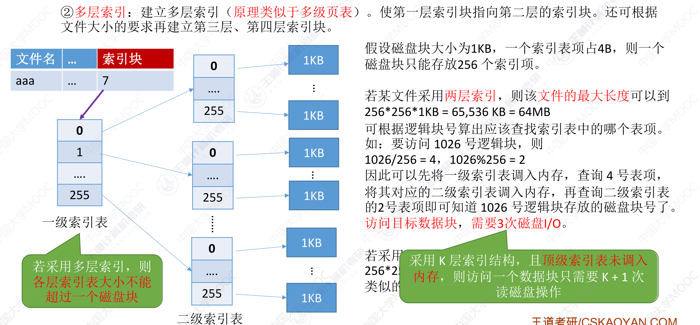

- 多层索引

  - 建立多层索引（类似于多级页表）

  - 使第一层索引块指向第二层索引块，还可以根据文件大小的要求再建立第三层、第四层索引块

  - 若采用多级索引，则各层索引表大小不能超过一个磁盘块

  - 采用二层索引，文件的最大长度 256\*256\*1KB = 64MB

  - 采用三层索引，文件的 最大长度 256\*256\*256*1KB = 16GB

  - 采用 K 层索引结构，且顶级索引表未调入内存，则访问一个数据块只需要 K + 1 次读磁盘操作
    - 可根据逻辑块号算出应该查找索引表中的哪个表项。
    - 如：要访问 1026 号逻辑块，则1026/256 = 4，1026%256 = 2
    - 因此可以先将**一级索引表**调入内存，查询 4 号表项，将其对应的**二级索引表**调入内存，再查询二级索引表 的2号表项即可知道 **1026 号逻辑块存放的磁盘块号**了。
    - **访问目标数据块，需要3次磁盘I/O**

- 缺点

  - 即使是小文件，访问一个数据块依然需要 K+1 次读磁盘

#### 混合索引

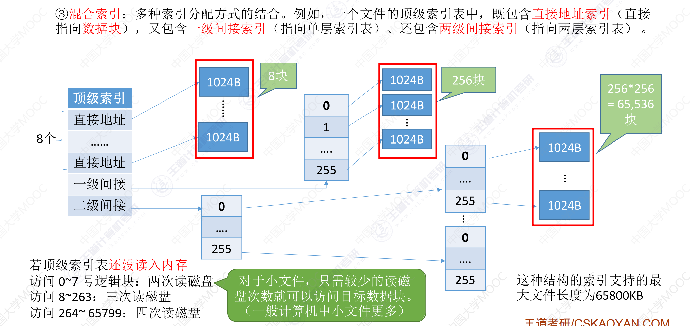

- 混合索引
  - **多种索引分配方式的结合**，上图结构的索引支持最大文件长度为 65800KB
  - 例如：一个文件的顶级索引表包含
    - 直接地址索引（直接指向数据块）：8 个
    - 一级间接索引（指向单层索引表）：1 个
    - 两级间接索引（指向两层索引表）：1 个
  - 若顶级索引表还没有读入内存
    - 访问 0~7号逻辑块：两次读磁盘
    - 访问 8~263 号逻辑块：三次读磁盘
    - 访问 264~65799 号逻辑块：四次读磁盘
  - 对于小文件只需较少的读磁盘次数就可以访问目标数据块（一般来说计算机中小文件更多）

- 优点
  - 对于小文件来说，访问一个数据块所需的读磁盘次数更少

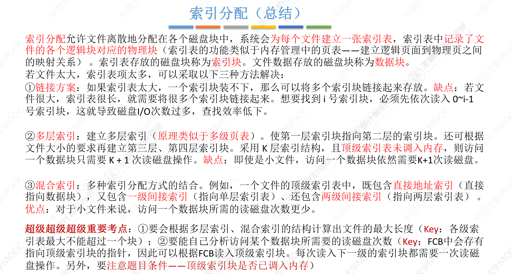

- 超级超级超级超级重要的考点
  - 要会根据多层索引、混合索引的结构计算出文件的最大长度
    - 各级索引表最大不能超过一个块
  - 要能自己分析访问某个数据块所需要的读磁盘次数
    - FCB 中会存有指向顶级索引块的指针，因此可以根据 FCB 读入顶级索引块
    - 每次读入下一级的索引块都需要一次读磁盘奥做
    - 注意题目条件——顶级索引块是否已经调入内存


## 逻辑结构 VS 物理结构

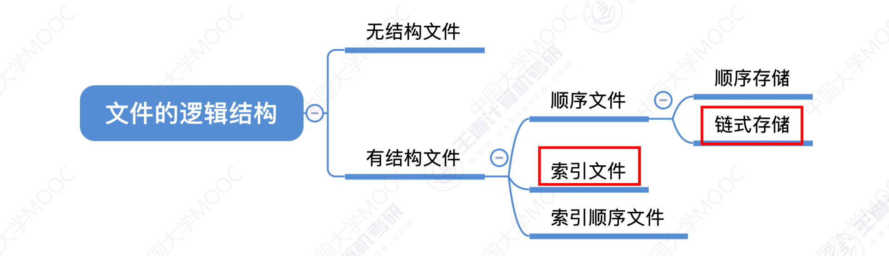


### 逻辑结构（从用户视角看）

#### 无结构文件

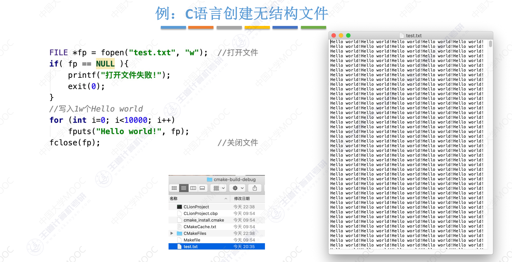

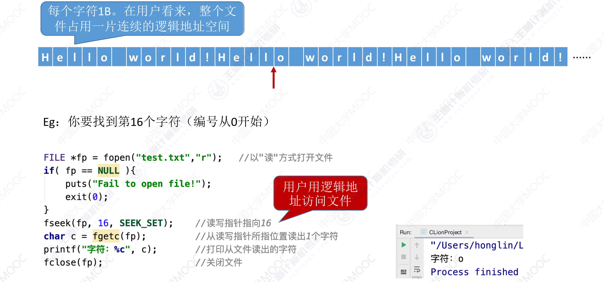

```C++
//写操作
    FILE *fp = fopen("test.txt", "w");
    if(fp == NULL){
        printf("打开文件失败");
        exit(0);
    }

    for(int i=0; i <100; i++)
        fputs("cylhbb!!", fp);
    fclose(fp);
    
    //读操作
    FILE *fp2 = fopen("test.txt","r");
    if(fp2 == NULL){
        puts("Fail to open file!");
        exit(0);
    }
    fseek(fp2,16,SEEK_SET);             //读写指针指向 16
    char c = fgetc(fp2);                //从读写指针所指位置读出一个字符
    printf("字符：%c", c);              //打印从文件读出的字符
    fclose(fp2);
```

#### 有结构文件

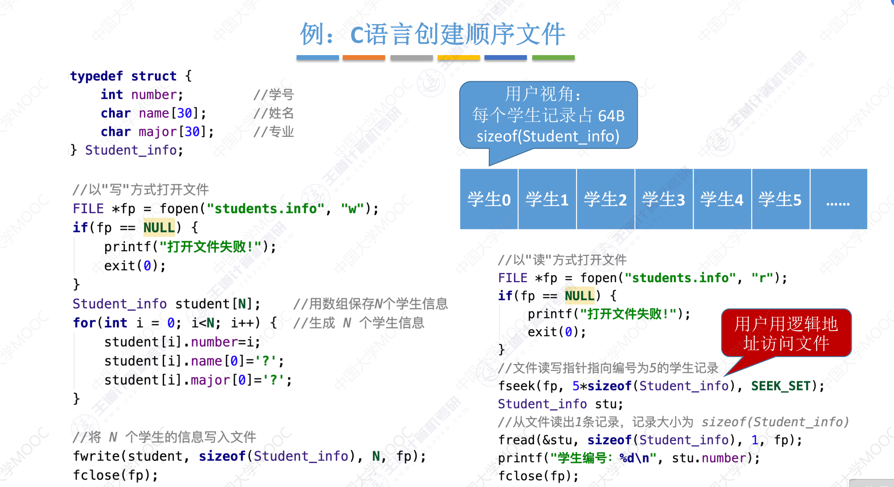

- 用户角度
  - 每个学生记录占 64B   sizeof(Student_info)
  - 用逻辑地址访问文件

```C++
#include <iostream>
using namespace std;
const int N = 100;

typedef struct{
    int number;
    char name[30];
    char major[30];
} Student_info;

int main(){
    //以写的方式打开文件
    FILE *fp = fopen("Student_info", "w");
    if(fp == NULL){
        printf("打开文件失败！");
        exit(0);
    }
    Student_info student[N];
    for(int i = 0; i<N; i++){
        student[i].number = i;
        student[i].name[0] = 'a';
        student[i].major[0]='b';
    }

    fwrite(student,sizeof(Student_info), N, fp);
    fclose(fp);

    //以读的方式打开文件
    FILE *fp2 = fopen("Student_info", "r");
    if(fp2 == NULL){
        printf("打开文件失败！");
        exit(0);
    }
    //文件读写指针指向编号为 5 的学生记录
    Student_info stu;
    fseek(fp2, 10*sizeof(Student_info), SEEK_SET);

    //从文件读出 1 条记录，记录大小为 sizeof(Student_info)
    fread(&stu, sizeof(Student_info), 1, fp2);
    printf("学生编号：%d", stu.number);
    fclose(fp2);
}
```


### 物理结构（从操作系统视角看）

#### 无结构文件

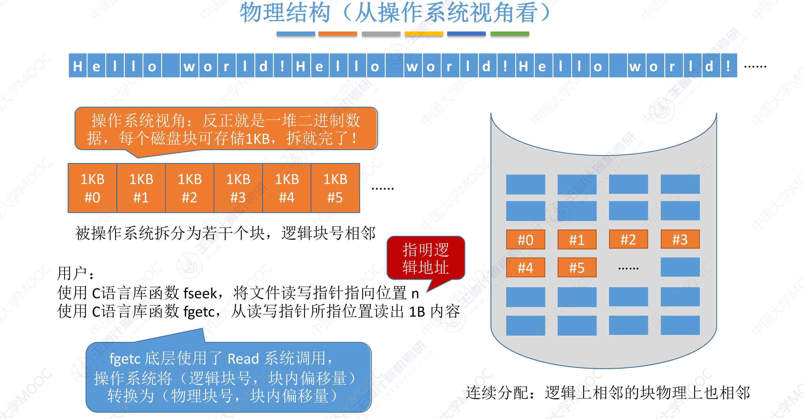

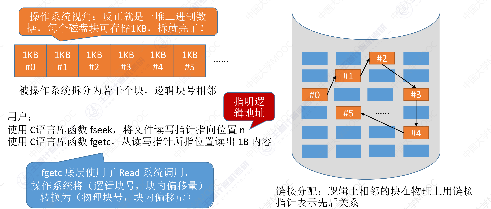

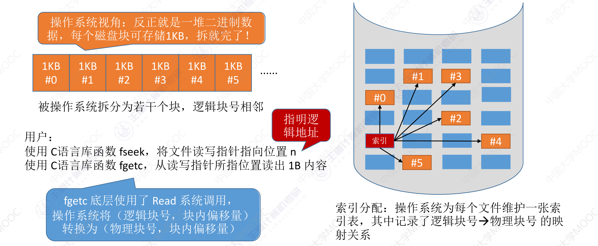

- 操作系统视角
  - 一堆二进制数据
  - 每个磁盘块可以存储 1KB，拆开存储
  - 文件数据被操作系统拆分成若干个块，逻辑块号相邻
- 用户
  - 使用 C 语言库函数 fseek，将文件读写指针指向位置 n（指明逻辑地址）
  - 使用 C语言库函数 fgetc，从读写指针所指位置读出 1B 内容
    - fgetc 底层使用了Read 系统调用，操作系统将（逻辑块号，块内偏移量）转换为（物理块号，块内偏移量）
- 连续分配：逻辑上相邻的块物理上也相邻
- 链接分配：逻辑上相邻的块在物理上用链接指针表示先后顺序
- 索引分配：操作系统为每个文件维护一张索引表，其中记录了逻辑块号—>物理块号的映射关系

#### 有结构文件

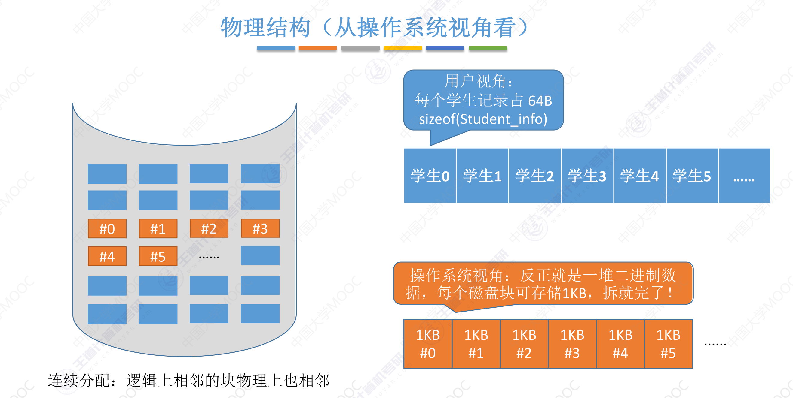

- 操作系统
  - 反正就是一堆二进制数据，每个磁盘块可以存储 1KB，拆开存储就完事了

### 存储  VS  分配

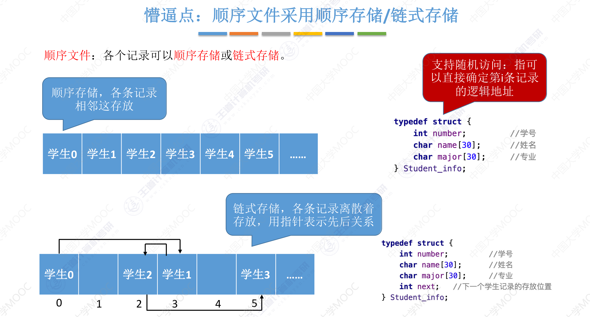

- 顺序文件采用顺序存储/链式存储（用户自己规定的）

  - 顺序存储

    - 每条记录相邻着存放

    - 支持随机访问：可以直接确定第 i 条记录的逻辑地址

    - ```C++
      typedef struct{
          int number;
          char name[30];
          char major[30];
      } Student_info;
      ```

  - 链式存储

    - 各条记录离散着存放，用指针表示先后顺序

    - ```C++
      typedef struct{
          int number;
          char name[30];
          char major[30];
        	int next; //下一个学生记录的存放位置
      } Student_info;
      ```

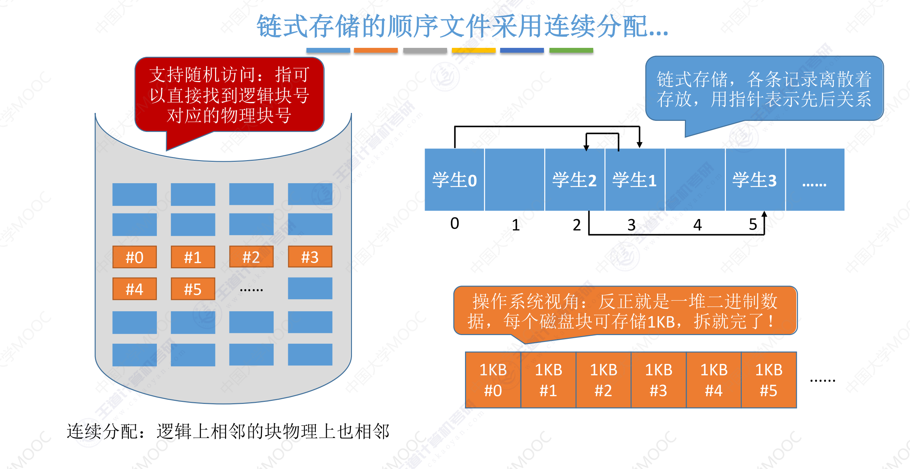

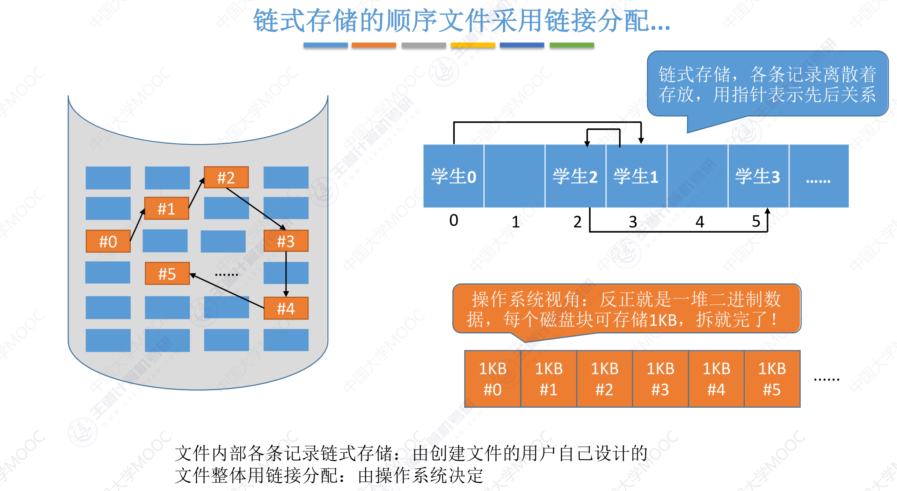

- 文件内部各条记录如何存储由创建文件的用户自己设计
  - 顺序文件存储
    - 顺序存储：数组
    - 链式存储：链表
- 文件整体存储用什么分配由操作系统决定
  - 顺序文件存储分配
    - 连续分配：逻辑上相邻的块物理上也相邻
  - 顺序文件链接分配
    - 链接分配：各条记录离散存放，指针表示先后关系

### 逻辑结构：索引文件

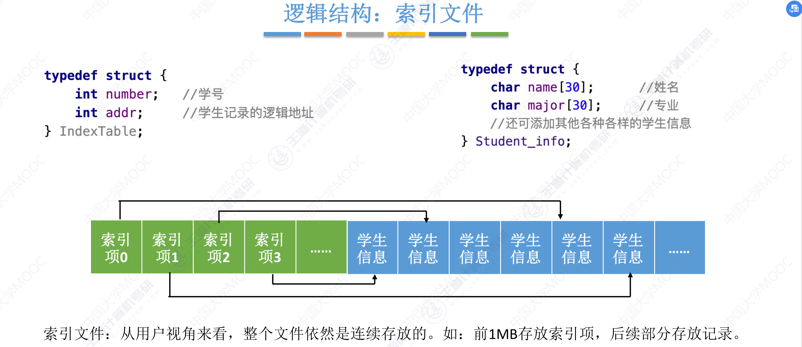

- 索引文件
  - 从用户视角来看，整个文件依然是连续存放的
  - 如：前 1MB 存放索引项，后续部分存放记录

```C++
typedef struct{
  int number;		//学号
  int addr;			//学生记录的逻辑地址
} IndexTable;

typedef struct{
  char name[30];	//姓名
  char major[30];	//专业
} Student_info;
```

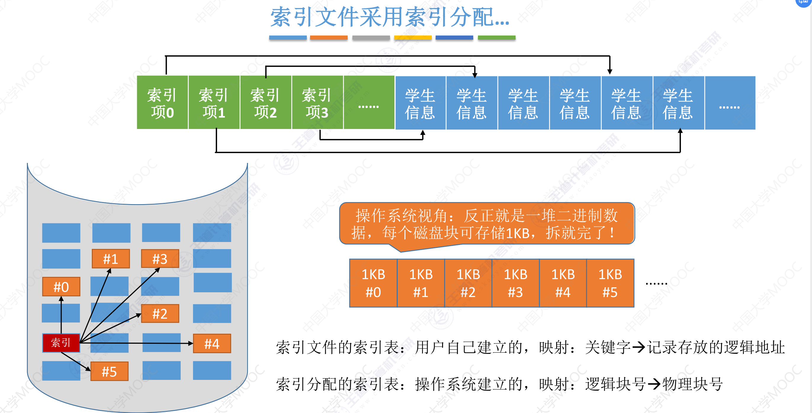

- 索引文件的索引表
  - 用户自己建立的
  - 映射
    - 关键字—>记录存放的逻辑地址
- 索引分配的索引表
  - 操作系统建立的
  - 映射
    - 逻辑块号—>物理块号

## 文件存储空间管理

### 存储空间的划分与初始化

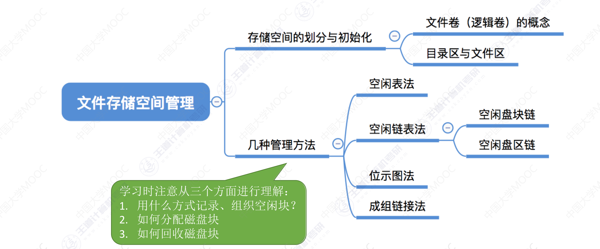

- 从三个方面理解
  - 用什么方式记录、组织空闲块
  - 如何分配磁盘块
  - 如何回收磁盘块

#### 文件卷（逻辑卷）的概念

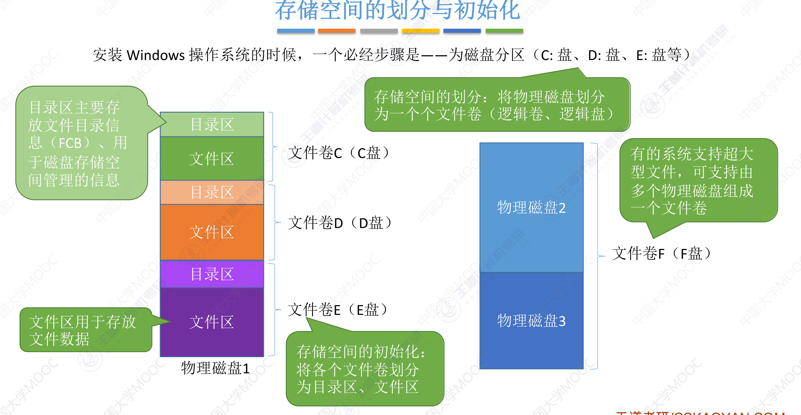

- 安装 Windows 操作系统的时候，一个必经的步骤就是——为磁盘分区（C、D、E 盘等）
  - 存储空间的划分——将物理磁盘划分为一个个文件卷（逻辑卷、逻辑盘）
  - 有的系统支持超大型文件，可支持由多个物理磁盘组成一个文件卷

#### 目录区与文件区

- 目录区
  - 主要存放文件目录信息 FCB
  - 用于磁盘存储空间管理的信息
- 文件区
  - 用于存放文件数据
- 存储空间的初始化
  - 将各个文件卷划分为目录区、文件区

### 管理方法

#### 空闲表法

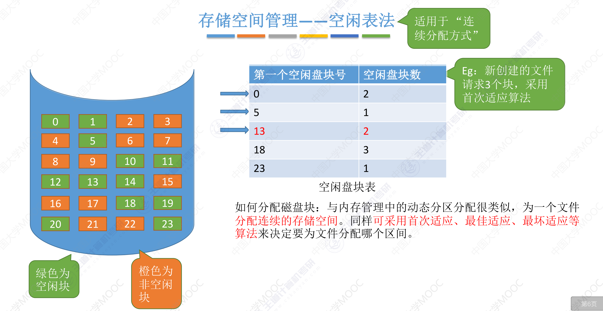

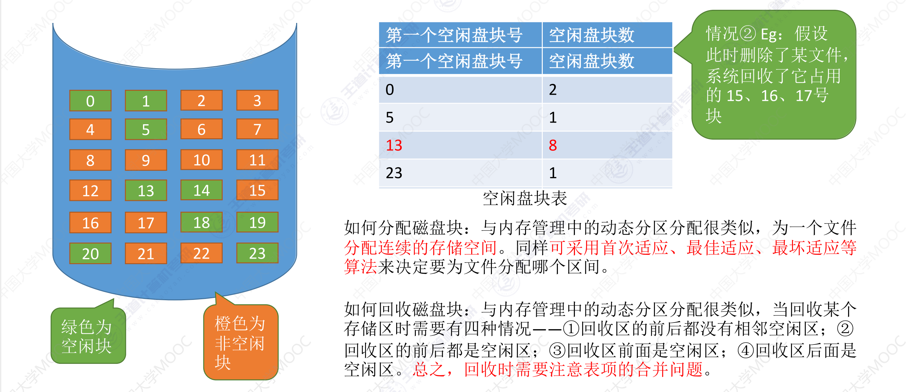

- 空闲表法
  - 适用于连续分配方法
  - 组成
    - 第一个空闲盘块号
    - 空闲盘块数
  - 如何分配磁盘块
    - 与内存管理中的动态分区分配很类似，为一个文件分配连续的存储空间
    - 可以采用**首次适应、最佳适应、最坏适应**算法来决定要为文件分配哪个区间
    - 例子：新创建的文件请求 3 个块，采用最佳适应算法
  - 如何回收磁盘块
    - 与内存管理中的动态分区分配很类似，当回收某个存储区时有四种情况
      - 回收区前后都没有相邻空闲区
      - 回收区前后都是空闲区
      - 回收区前面是空闲区
      - 回收区后面是空闲区
    - 回收时需要注意表项的合并问题

#### 空闲链表法

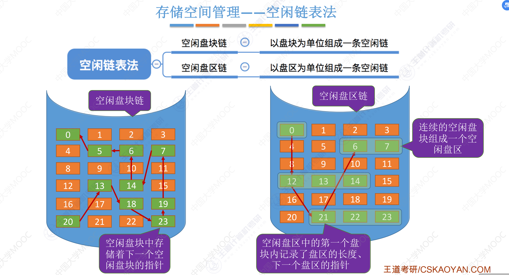

##### 空闲盘块链

- 空闲盘块链
  - **以空闲的块为单位**
  - 空闲盘块中存储着下一个空闲盘块的指针


##### 空闲盘区链

- 空闲盘区链
  - **以连续的空闲盘块组成的空闲盘区为单位**
  - 空闲盘区中的第一个盘块内记录了**盘区的长度**、**下一个盘区的指针**


- 结构
  - **操作系统保存着链头、链尾指针**
- 如何分配
  - 若某文件申请 k 个盘块，则从链头开始依次摘下 k 个盘块分配，并修改空闲链的链头指针
- 如何回收
  - 回收的盘块依次挂到链尾，并修改空闲链的链尾指针
    - 适用于离散分配的物理结构
    - 为文件分配多个盘块时可能要重复多次操作


- 结构
  - 操作系统保存着链头、链尾指针
  - 空闲盘区中的第一个盘块内记录了盘区的长度、下一个盘区的指针
  - 连续的空闲盘块组成一个空闲盘区
- 如何分配
  - 若某文件申请 k 个盘块，则可以采用首次使用、最佳使用等算法，从链头开始检索
  - 按照算法规则找到一个大小符合要求的空闲盘区，分配给文件
  - 若没有合适的连续空闲块，也可以将不同盘区的盘块同时分配给一个文件
  - 注意分配后可能要修改相应的链指针、盘区大小等数据
- 如何回收
  - 若回收区和某个空闲盘区相邻，则需要将回收区合并到空闲盘区中
  - 若回收区没有和任何空闲区相邻，将回收区作为单独的一个空闲盘区挂到链尾
- 离散分配、连续分配都适用
- 为一个文件分配多个盘块时效率更高

#### 位示图法


- 位示图
  - 每个二进制位对应一个盘块
  - 0 代表盘块空闲；1 代表盘块已分配
  - 位示图一般用**连续的字**来表示
    - 如本例中一个字的字长是 16 位，字中的每一位对应一个盘块
    - 因此可以用（字号，位号）对应一个盘块号。或者是（行号，列号）
  - 最最最最重要
    - **能自己推出盘块号与（字号，位号）相互转换的公式**
    - 注意题目条件
      - **盘块号、字号、位号到底是从 0 开始还是从 1 开始**
      - 如本例中盘块号、字号、位号从 0 开始
      - 若 n 表示字长，则
      - （字号，位号）=（i,j）的二进制位对应的盘块号 b=ni+j
      - **b号盘块对应的字号 i=b/n，位号j=b%n**

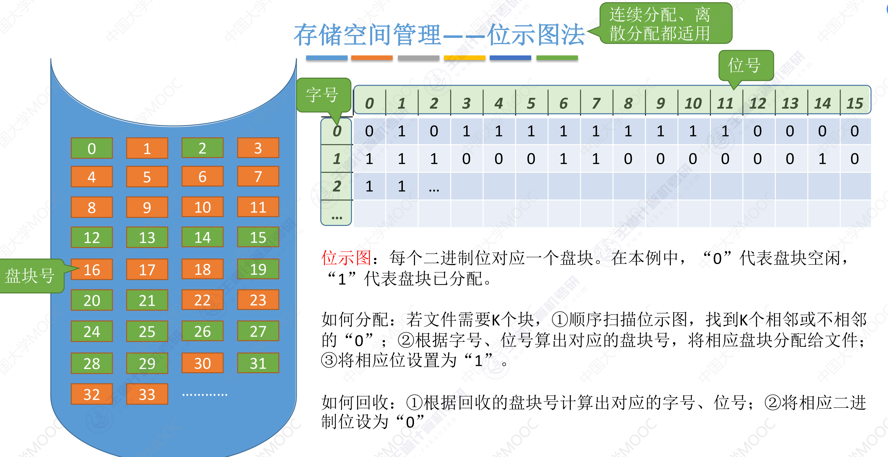

- 位示图法

  - 连续分配、离散分配都适用
  - 如何分配
    - 若文件需要 k 个块
      - 顺序扫描位示图，找到 k 个相邻或不相邻的“0”
      - 根据字号、位号算出对应的盘块号，将对应盘块分配给文件
      - 将对应位设置为 1
  - 如何回收
    - 根据回收的盘块号计算出对应的字号、位号
    - 将相应二进制位设为“0”

#### 成组链接法（理解）

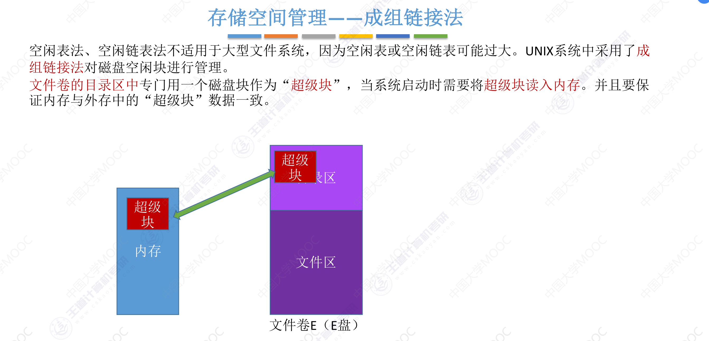

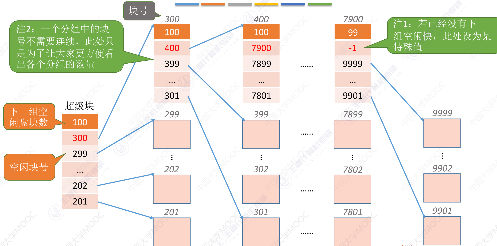

- 成组链接法
  - 空闲表法、空闲链表法不适用于大型文件系统，因为空闲表或空闲链表可能过大
  - UNIX 系统中采用了成组链接法对磁盘空闲块进行管理
  - 文件卷的目录区中专门用一个磁盘块作为超级块，当系统启动时需要将超级块读入内存，并且要保证内存与外存中的超级块数据一致
- 组成
  - 第一个数据：下一组空闲盘块的数量
  - 第二个数据：空闲块号
- 注意
  - 若**已经没有下一组空闲块（此时为倒数第二个盘块）**，此时该将块数设为特殊值，如-1
  - 一个分组中的块号不需要连续

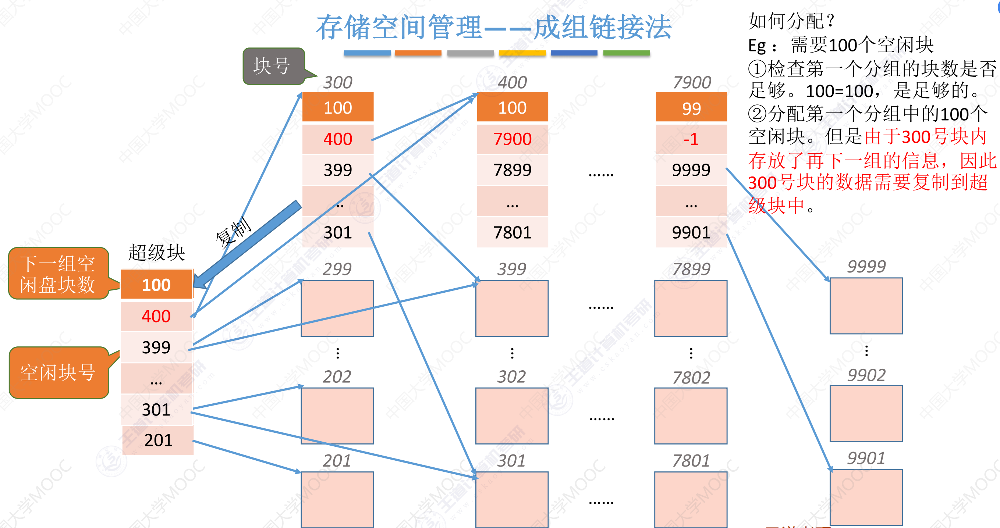

- 如何分配
  - 例如需要 100 个空闲块
    - 检查第一个分组的块数是否足够 100=100 是足够的
    - 分配第一个分组中的 100 个空闲块
      - 由于 300 号块内存放了再下一组的信息，因此 300 号块的数据需要复制到超级块中

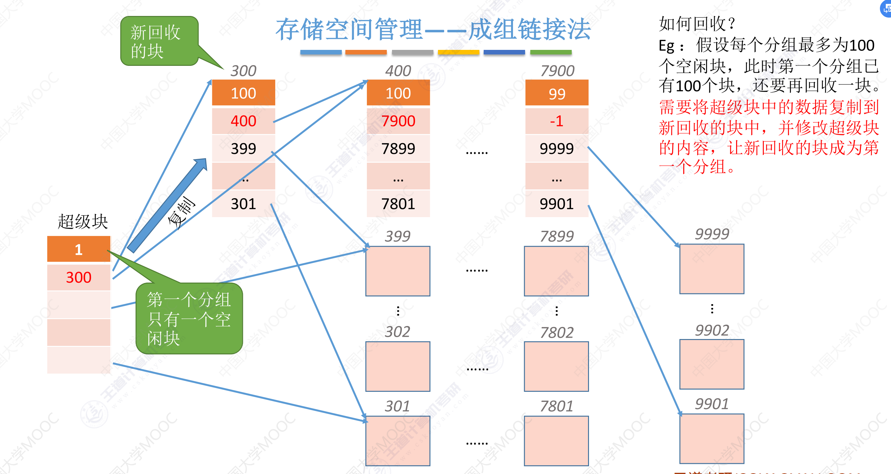

- 如何回收
  - 假设每个分组最多为100个空闲块，此时第一个分组已有99个块，还要再回收一块
    - 直接将新回收的块插入到第一个分组的最后的位置
  - 假设每个分组最多为 100 个空闲块，此时第一个分组已经有 100 个块，还要再回收一块
    - 需要将超级块中的数据复制到新回收的块中，并修改超级块的内容，让新回收的块成为第一个分组
      - 懂了，因为新回收的块都是空的，所以可以把原来的内容都复制到这个块里面，让这个满的块称为超级块的第一个分组


## 文件的基本操作


- 向上提供的几个最基本功能
  - 创建文件
    - create 系统调用
  - 删除文件
    - delete 系统调用
  - 读文件
    - read 系统调用
  - 写文件
    - write 系统调用
  - 打开文件
    - open 系统调用
  - 关闭文件
    - close 系统调用

### 创建文件（create）

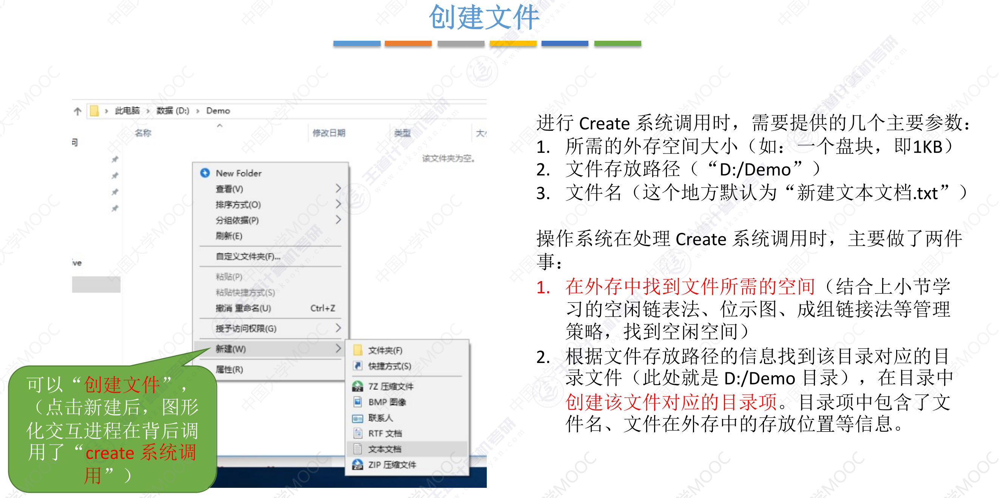


- 进行Create 系统调用时，需要提供几个主要参数
  - 所需的外存空间大小（如：一个盘块，即 1KB）
  - 文件存放路径（“D:/Demo”）
  - 文件名（默认为“新建文本文件.txt”）
- 操作系统在处理 Create 系统调用时，主要做了两件事
  - **在外存中找到文件所需的空间**
    - 可以使用空闲链表法、位示图、成组链接法等管理策略，找到空闲空间
  - 根据文件存放路径的信息找到该目录对应的目录文件（“D:/Demo目录”），**在目录中创建该文件对应的目录项**
    - 目录项中包含了文件名、文件在外存中存放位置等信息

### 删除文件

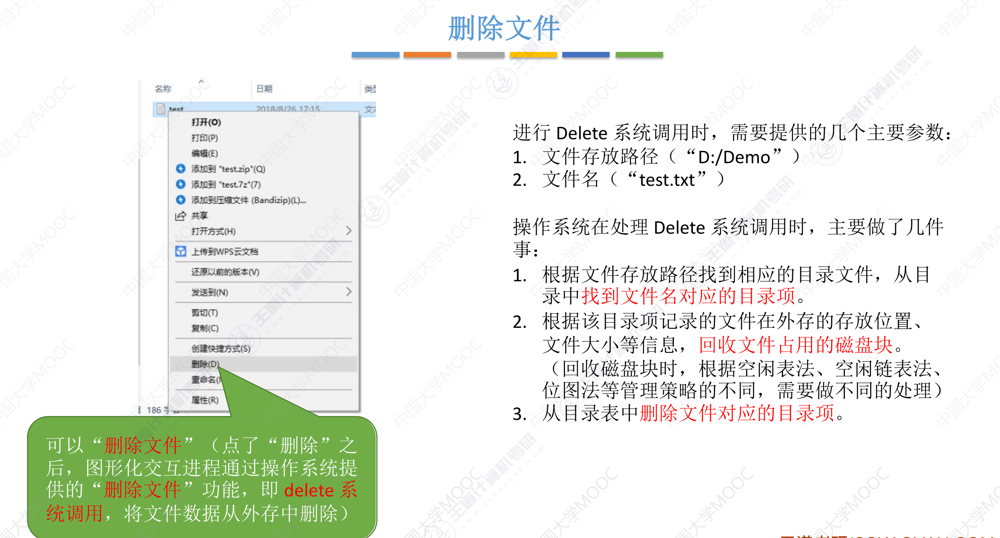

- 删除文件
  - 进行 Delete 系统调用时，需要提供几个主要参数
    - 文件存放路径（“D:/Demo”）
    - 文件名（“test.txt”）
  - 操作系统在处理 Delete 系统调用时，主要做了几件事
    - 根据文件存放路径找到相应的目录文件，从目录中**找到文件名对应的目录项**
    - 根据该目录项的文件在外存的存放位置、文件大小等信息，**回收文件占用的磁盘块**
      - 回收磁盘块时，根据空闲表法、空闲链表法、位示图等管理策略的不同，需要做不同的处理
    - 从目录表中**删除文件对应的目录项**

### 读文件

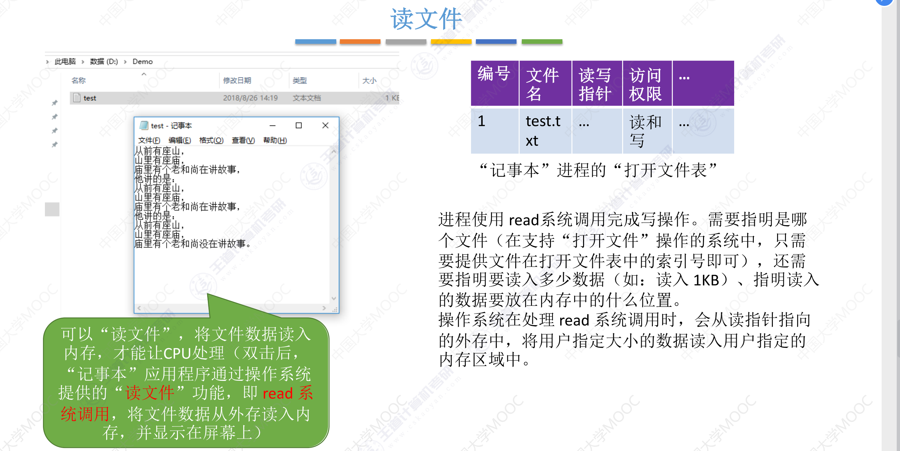

- 读文件
  - 将文件数据读入内存，才能让 CPU 处理（双击后，“记事本”应用程序通过操作系统提供的“读文件”功能，即 read 系统调用，将文件数据从外存读入内存，并显示在屏幕上）
  - 读操作
    - 需要指明时哪个文件（在支持“打开文件”操作的系统中，只需要提供文件在打开文件表中的索引号即可）
    - 要读入多少数据（如读入 1KB）
    - 读入的数据要放在内存中的什么位置
  - 操作系统在处理 read 系统调用时，会从读指针指向的外存中，将用户指定大小的数据读入用户指定的内存区域

### 写文件

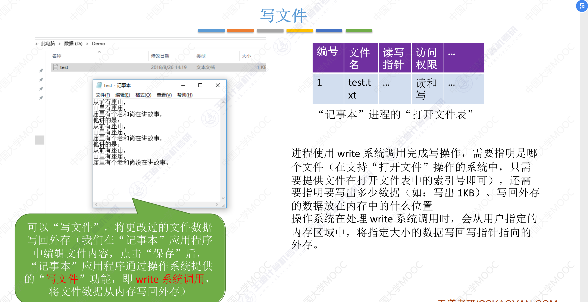

- 写文件

  - 将更改过的文件数据写回外存

    - 在“记事本”应用程序中编辑文件内容，点击“保存”后，“记事本”应用程序通过操作系统提供的“写文件”功能，即 write 系统调用将文件数据从内存写回外存

  - 写操作

    - 需要指明是哪个文件

      - 在支持打开文件操作的系统中，只需要提供文件在打开文件表中的索引号即可

    - 写出多少数据（如写出 1KB）
    
    - 写回外存的数据放在内存中的什么位置
  - 在处理 write 系统调用时，会从用户指定的内存区域中，将指定大小的数据写回写指针指向的外存

### 打开文件

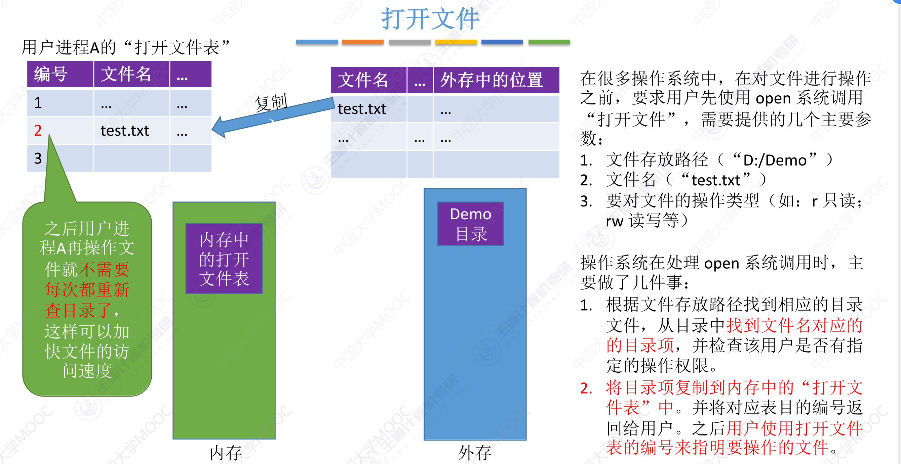

- 打开文件
  - 用户进程 A 的打开文件表
    - 之后用户进程 A 再操作文件就不需要每次都重新查目录了，这样可以加快文件的访问速度
  - 在很多操作系统中，在对文件进行操作之前，要求用户提供的几个主要参数，才能使用 open 系统调用“打开文件”
    - 文件存放路径（“D:/Demo”）
    - 文件名（“test.txt”）
    - 要对文件的操作类型（r 只读；rw 读写）
  - 操作系统在处理 open 系统调用时，主要做了几件事
    - **根据文件存放路径找到相应的目录文件**，从目录中**找到文件名对应的目录项**，并检查该用户是否有指定的操作权限
    - **将目录项复制到内存中的“打开文件表”中，之后用户使用打开文件表的编号来指明要操作的文件**

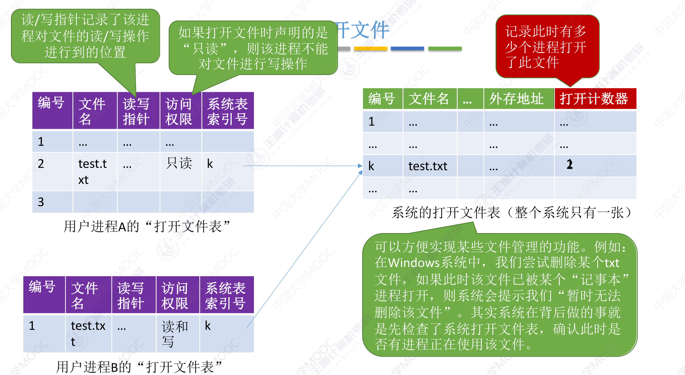

- 用户进程的打开文件表
  - 编号
  - 文件名
  - 读/写指针
    - 记录了该进程对文件的读/写操作进行到的位置
  - 访问权限
    - 如果打开文件时声明的是只读，则该进程不能对文件进行写操作
  - 系统表索引号
- 系统的打开文件表（整个系统只有一张）：会记录所有进程打开的文件
  - 编号
  - 文件名
  - 外存地址
  - **打开计数器**
    - 记录此时有多少个进程打开了此文件
  - 此表的作用
    - 可以方便实现某些文件管理的功能
      - 例如：在 windows 系统中，我们尝试删除某个 txt 文件，如果此时该文件已经被某个“记事本”进程打开，则系统会提示我们“暂时无法删除该文件”。其实系统在背后做的事情就是先检查了系统打开文件表，确认此时是否有进程正在使用该文件

### 关闭文件

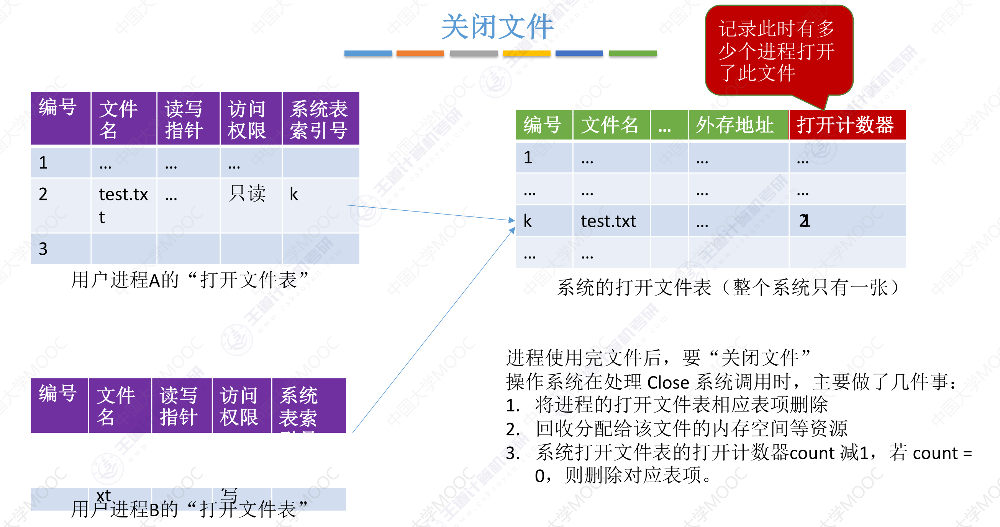

- 关闭文件
  - 进程使用完文件
  - 操作系统在处理 Close 系统调用时，主要做了几件事
    - 将**进程的打开文件表**相应表项删除
    - **回收分配给该文件的内存空间**等资源
    - 系统打开文件表的打开计数器 count--，若 count==0，则删除对应表项

## 文件共享

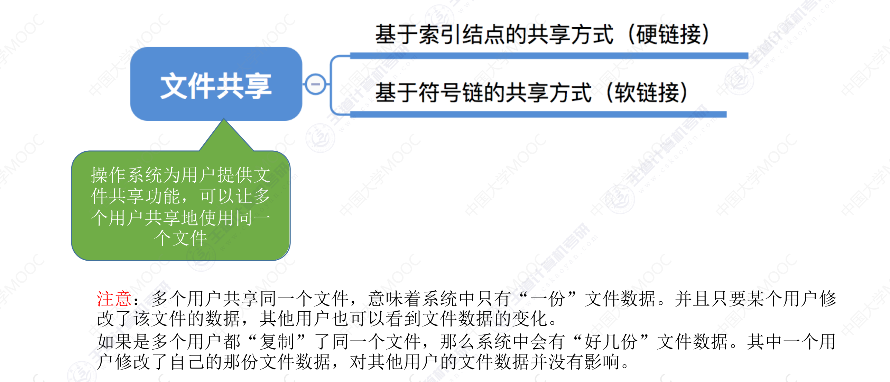

- 文件共享
  - 操作系统为用户提供文件共享功能，可以让多个用户共享地使用同一个文件
  - 共享
    - 多个用户共享同一个文件，意味着系统中只有“一份”文件数据
    - 并且只要某个用户修改了该文件的数据，其他用户也可以看到文件数据的变化
  - 复制
    - 多个用户都“复制”了同一个文件，那么系统中会有“好几份”文件数据
    - 其中一个用户修改了自己的那份文件数据，对其他用户的文件数据并没有影响

### 基于索引节点的共享方式（硬链接）

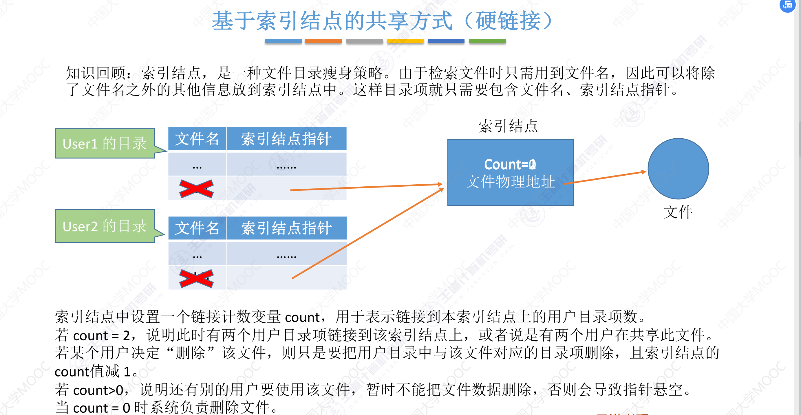

- 索引节点
  - 是一种文件目录瘦身策略
  - 检索文件时只需要用到文件名，因此可以将除了文件名之外的其他信息放到索引节点中。
  - 这样目录项就只需要包含文件名、索引节点指针
- 索引节点中设置一个链接计数变量 count，用于表示链接到本索引节点上的用户目录项数
  - 若 count=2，说明此时有两个用户目录项链接到该索引节点上，或者说有两个用户在共享此文件
  - 若某个用户决定删除该文件，则只需要把用户目录中与该文件对应的目录项删除，且索引节点的 count --
  - 若 count>0，说明还有别的用户要使用该文件，暂时不能把文件数据删除，否则会导致指针悬空
  - 当 count=0，系统负责删除文件

### 基于符号链的共享方式（软链接）

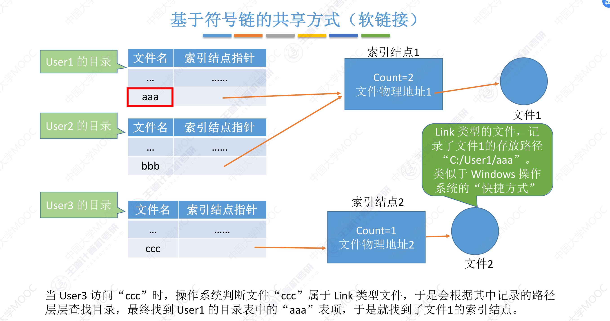

- 当 User3 访问“ccc”时，操作系统判断文件“ccc”属于 Link 类型文件，于是会根据其中记录的路径层层查找目录，最终找到 User1 的目录表中的“aaa”表项，于是就找到了文件 1 的索引节点
- Link 类型的文件，记录了文件 1 的存放路径“C://User1/aaa”
  - Link 类型的文件名可以不同
  - 类似于 Windows 操作系统的“快捷访问”
- 如果文件 1 已删除，但是文件 2 依然存在，只是通过“C:/User1/aaa”这个路径已经找不到文件 1 了
  - 此时软链接的“ccc”文件也就相应的失效了
- 双击打开的时候，操作系统会判断这个文件是 Link 类型的“快捷方式”文件，于是会根据其中记录的“路径信息”检索目录，最终找到

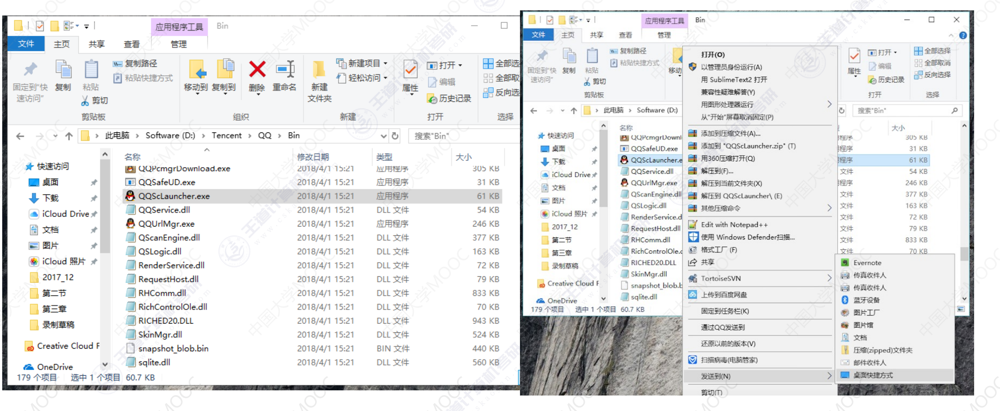

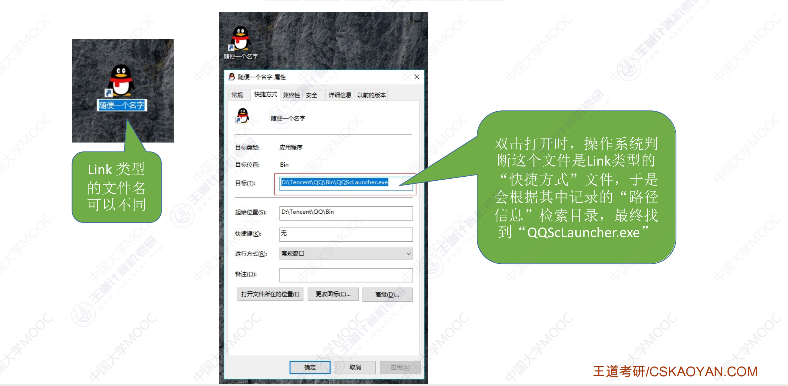

## 文件保护


- 保护文件数据的安全

### 口令保护

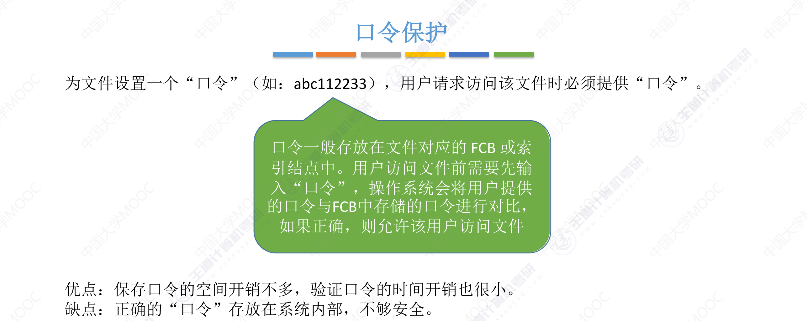

- 口令保护
  - 方式
    - 为文件设置一个“口令”（如：abc112233），用户请求访问该文件时必须提供“口令”
      - 口令一般存放在文件对应的 FCB 或索引节点中
      - 用户访问文件前需要先输入“口令”，操作系统会将用户提供的口令与 FCB 中存储的口令进行对比
      - 如果正确，则允许该用户访问文件
  - 优点
    - 保存口令的空间开销不多，验证口令的时间开销也很小
  - 缺点
    - 正确的“口令”存放在系统内部，不够安全

### 加密保护

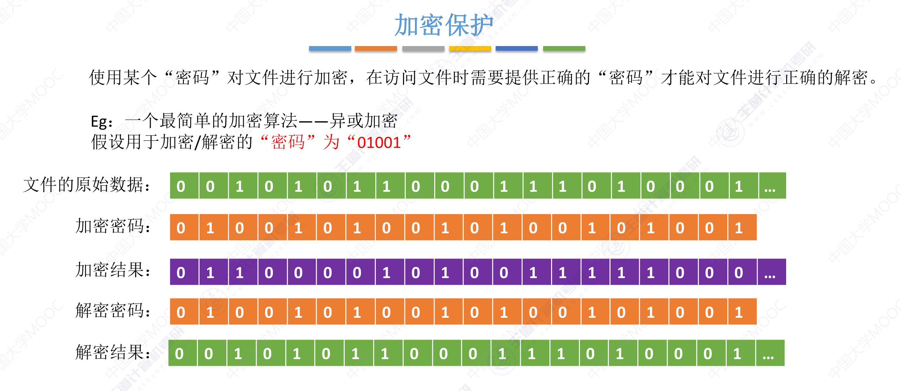

- 加密保护
  - 方式
    - 使用某个密码对文件进行加密，在访问文件时需要提供正确的“密码”才能对文件进行正确的解密
  - EG：一个最简单的加密算法——异或加密
    - 假设用于加密解密的密码为“01001”
    - 文件的原始数据
    - 加密密码
    - 加密结果
    - 解密密码
    - 解密结果
  - 加密和解密使用的密码相同，则最终得到的加密结果和解密结果相同
  - 优点
    - 保密性强，不需要系统中存储“密码”
  - 缺点
    - 编码译码，或者加密解密要花费一定时间

### 访问控制

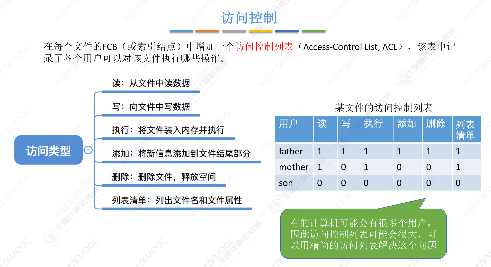

- 访问控制

  - 在每个文件的 FCB（或索引节点）中增加一个**访问控制列表**（ACL, Access-Control List），该表中记录了各个用户可以对该文件执行哪些操作
  - 如果对某个目录进行了访问权限的控制，那也要对目录下的所有文件进行相同的访问权限控制
  - 访问类型
    - 读：从文件中读数据
    - 写：向文件中写数据
    - 执行：将文件装入内存并执行
    - 添加：将新信息添加到文件结尾部分
    - 删除：删除文件，释放空间
    - 列表清单：列出文件名和文件属性

  - 有的计算机可能有很多个用户，因此访问控制列表可能会很大，可以用精简的访问列表解决这个问题

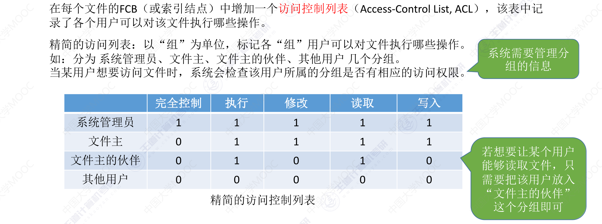

- 精简的访问列表
  - **以组为单位，标记各组用户可以对文件执行哪些操作**
    - 如分为 系统管理员、文件主、文件主的伙伴、其他用户 几个分组
  - 当某用户想要访问文件时，系统会检查该用户所属的分组是否有相应的访问权限
    - 系统需要管理分组的信息
    - 若想要让某个用户能够读取文件，只需要把该用户放入“文件主的伙伴”这个分组即可

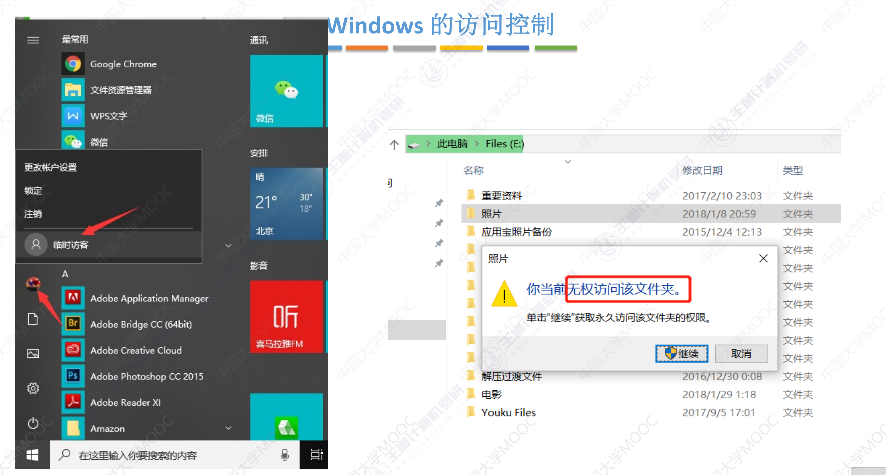

- Windows 的访问控制
  - 每当用户想要访问某个文件夹
  - 操作系统会先寻找这个文件夹的 FCB，然后根据 FCB 中记录的访问权限相关的记录信息来判断该用户是否有权限访问这个文件夹

## 文件系统的层次结构

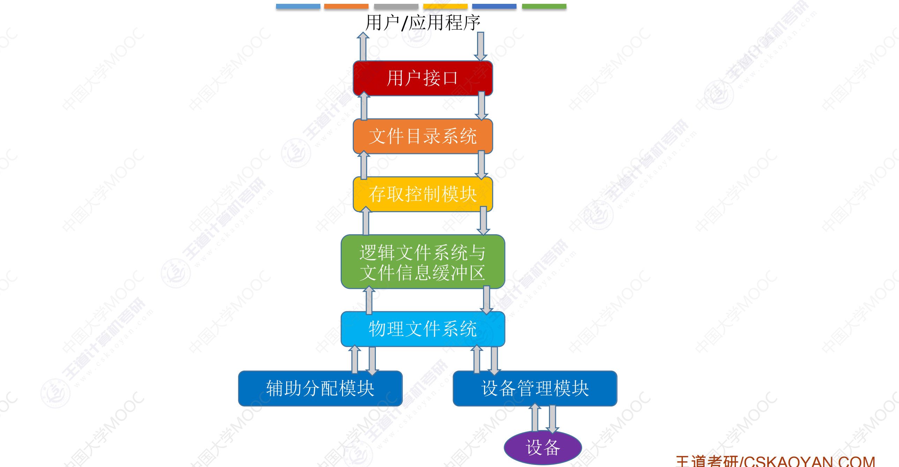

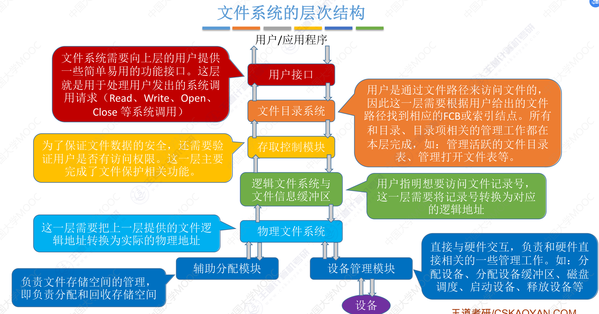

- 文件系统的层次结构
  - 用户/应用软件
  - 用户接口
    - 文件系统需要向上层的用户提供一些简单易用的功能接口
    - 这层就是用于处理用户发出的系统调用请求（Read、Write、Open、Close 系统调用）
  - 文件目录系统
    - 用户是通过文件路径来访问文件的
    - 这一层需要根据用户给出的文件路径找到对应的 FCB 或索引节点
    - 所有和目录、目录项相关的管理工作都在本层完成
    - 如：管理活跃的文件目录表、管理打开文件表等
  - 存取控制模块
    - 为了保证文件数据的安全，还需要验证用户是否有访问权限
    - 这一层主要完成了文件保护相关功能
  - 逻辑文件系统与文件信息缓冲区
    - 用户指明想要访问文件记录号，这一层需要将记录号转换为对应的逻辑地址
    - 对索引地址进行向下查询
  - 物理文件系统
    - 这一层需要把上一层提供的文件逻辑地址转换为实际的物理地址
  - 辅助分配模块
    - 负责文件存储空间的管理，即负责分配和回收存储空间
  - 设备管理模块
    - **直接与硬件交互，负责和硬件直接相关的一些管理工作，与硬件连接最紧密**
    - 如：分配设备、分配设备缓冲区、磁盘调度、启动设备、释放设备


- 用一个例子辅助记忆文件系统的层次结构
  - 假设某用户请求删除文件“D:/工作目录/学生信息.xlsx”的最后 100 条记录
    - 用户需要通过操作系统提供的接口发出上述请求——**用户接口**
    - 由于用户提供的是文件的存放路径，因此需要操作系统一层一层的查找目录，找到对应的目录项——**文件目录系统**
    - 不同的用户对文件有不同的操作权限，因此为了保证安全，需要检查用户是否有访问权限——存取控制模块（存取控制验证层）
    - 验证了用户的访问权限之后，需要把用户提供的“记录号”转变为对应的逻辑地址——逻辑文件系统与文件信息缓冲区
    - 知道了目标记录对应的逻辑地址后，还需要转换成实际的物理地址——物理文件系统
    - 要删除这条记录，必定要对磁盘设备发出请求——设备管理程序模块
    - 删除这些记录后，会有一些盘块空闲，因此要将这些空闲盘块回收——辅助分配模块

## 文件系统的全局结构（布局）

### 文件系统在外存中的结构

#### 原始磁盘

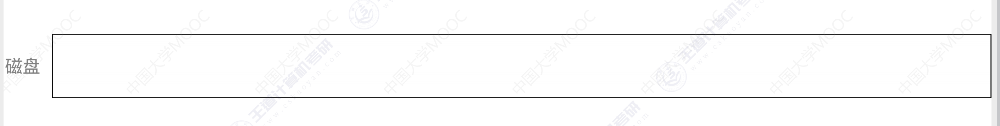

#### 物理格式化后（低级格式化）

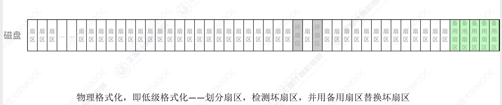

- 物理格式化
  - 划分扇区，检测坏扇区，并用备用扇区替换坏扇区

#### 磁盘分区后


#### 逻辑格式化后

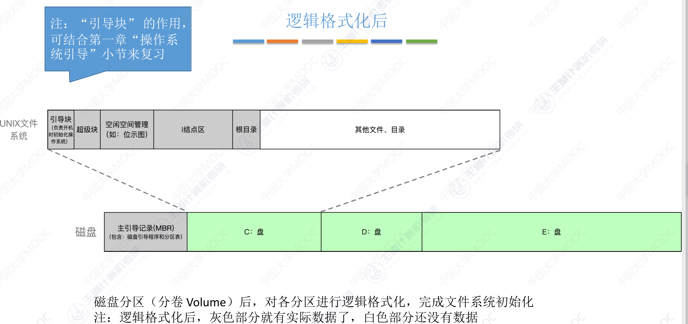


- 逻辑格式化
  - 磁盘分区（分卷 Volume）后，对各分区进行逻辑格式化，完成文件系统初始化
  - 逻辑格式化后，灰色部分就有实际数据了，白色部分还没有数据

- 结构

  - 磁盘

    - 主引导记录（MBR）

      - 磁盘引导程序和分区表

    - C盘

      - 引导块
        - 负责开机时初始化操作系统

      - 超级块
        - 找到很多空闲的磁盘块进行分配
      - 空闲空间管理
        - 位示图
      - i 节点区
        - 索引节点（超大数组，数组元素就是一个个索引节点）
      - 根目录
      - 其他文件、目录

    - D 盘

    - E 盘

### 文件系统在内存中的结构

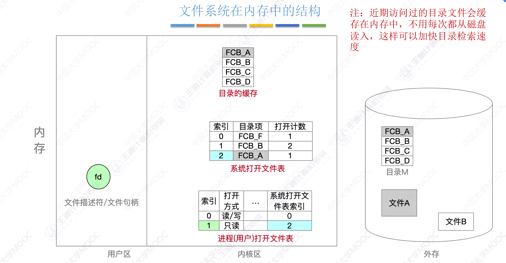

- 文件系统在内存中的结构
  - 目录的缓存
    - 近期访问过的目录文件会缓存在内存中，不用每次都从磁盘读入，这样可以加快目录检索速度
  - 系统打开文件表
    - 一个系统只有一张
  - 进程（用户）打开文件表
    - 每个进程都有一张
    - 包含在进程的 PCB 中

### open 系统调用打开文件的背后过程

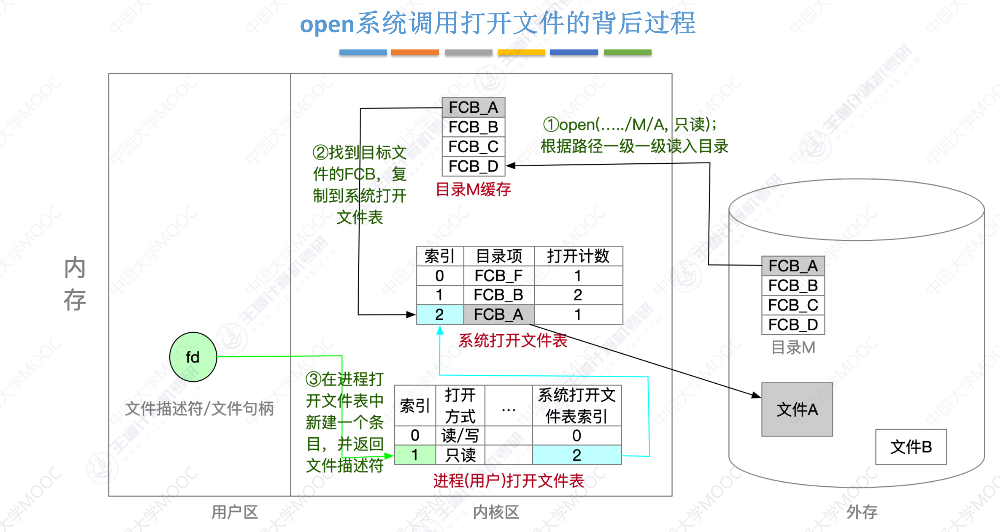

- open(....../M/A，只读)根据路径一级一级读入目录
  - 规定对文件的权限控制：只读
- 找到目标文件的 FCB，复制到系统打开文件表
  - 将 count 设置为 1
  - 目录项 FCB_A指向文件 A
- 在进程打开文件表中新建一个条目，并返回文件描述符（指向进程打开文件项）
  - 系统打开文件表索引：指向文件实际存放位置
  - 打开方式：只读（与上面保持一致）
- 给用户返回一个文件描述符/文件句柄 fd
  - 对打开的文件进行相应操作
    - read(fd, xxx, xxx)
    - 从文件描述符 fd 出发，先找到进程打开文件表的索引
    - 再找到系统打开文件表索引
    - 根据索引找到目录项 FCB_A，找到它存储的逻辑位置
    - 根据逻辑位置转化为物理位置，找到文件 A 并进行读取操作

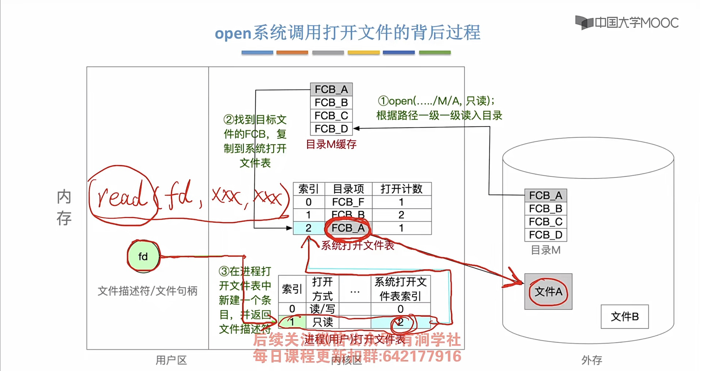

## 虚拟文件系统 & 文件系统挂载（安装）

### 普通文件系统

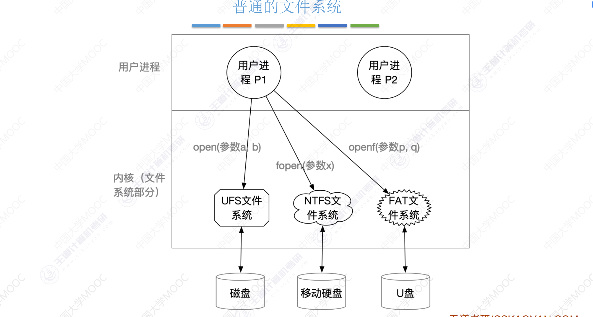

- 普通文件系统
  - 磁盘
    - UFS 文件系统：open(参数 a, b)
  - 移动硬盘
    - NTFS 文件系统：fopen(参数 x)
  - U盘
    - FAT 文件系统：openf(参数 p, q)
- 不同的硬件存储设备采用的文件系统不同，对应的函数方法不同

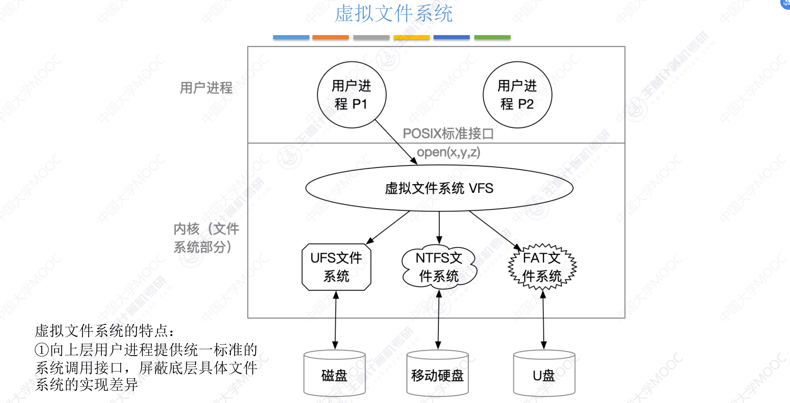

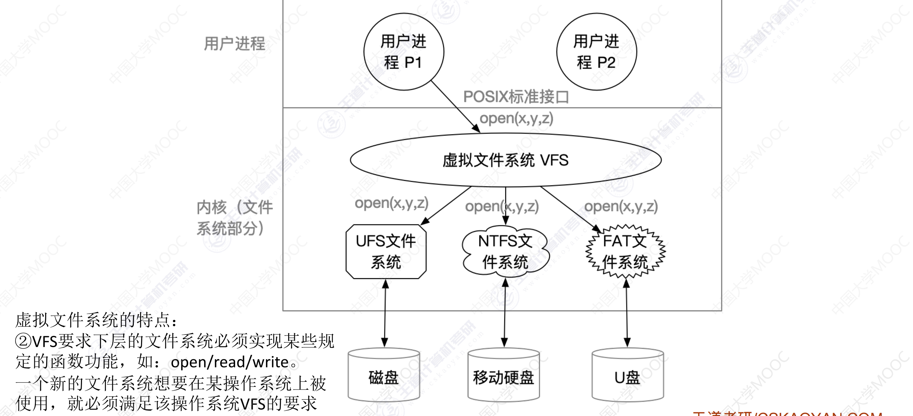

### 虚拟文件系统

- 虚拟文件系统（VFS）的特点
  - **向上层用户进程提供统一标准的系统调用接口，屏蔽底层具体文件系统的实现差异**
    - 不用去管下层具体的文件系统，只需要使用虚拟文件系统 VFS 提供的 POSIX 标准接口 open(x,y,z)就可以实现 open 方法
  - **VFS 要求下层的文件系统必须实现某些规定的函数功能**，如：opem/read/write
    - 一个新的文件系统想要在某操作系统上被使用，就必须满足该操作系统 VFS 的要求
  - **每打开一个文件，VFS 就在主存中新建一个 vnode，用统一的数据结构表示文件，无论该文件存储在哪个文件系统**

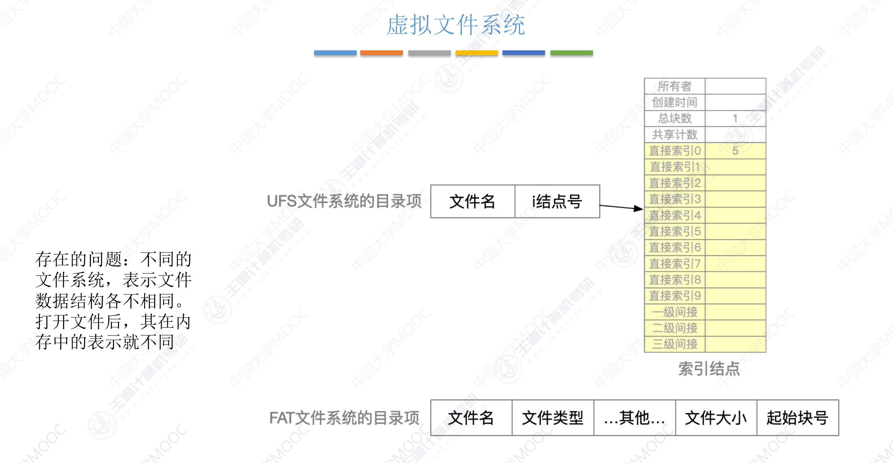

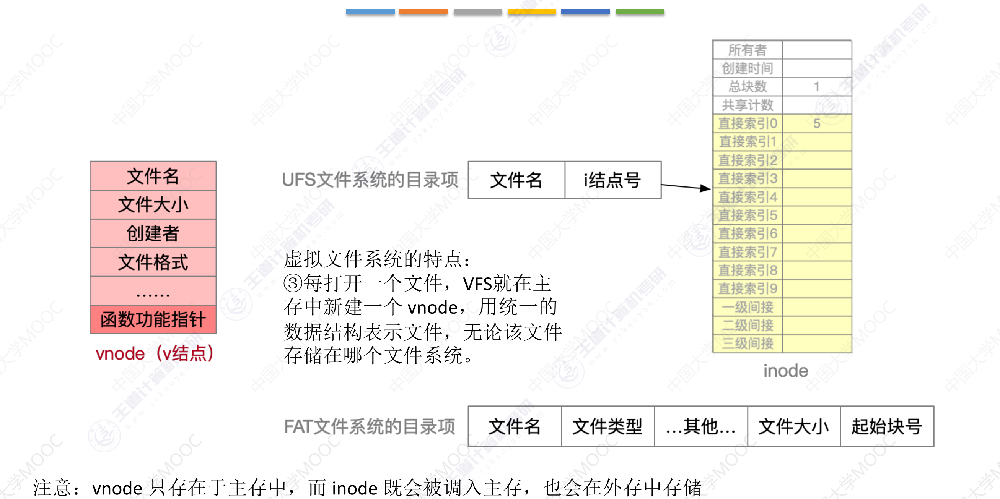

- 虚拟文件系统
  - 存在的问题
    - 不同的文件系统，表示文件数据结构各不相同，打开文件后其在内存中的表示就不同
  - 解决方法
    - 每打开一个文件，VFS 就在主存中新建一个 vnode，用统一的数据结构表示文件，无论该文件存储在哪个文件系统
  - vnode 指存在于主存中，而 inode 既会被调入主存，也会在外存中存储
    - vnode 其实就是在运行过程中声明的一种数据结构，不会提前储存
    - 当读取硬盘的时候，inode 的信息数据会复制到 vnode 中

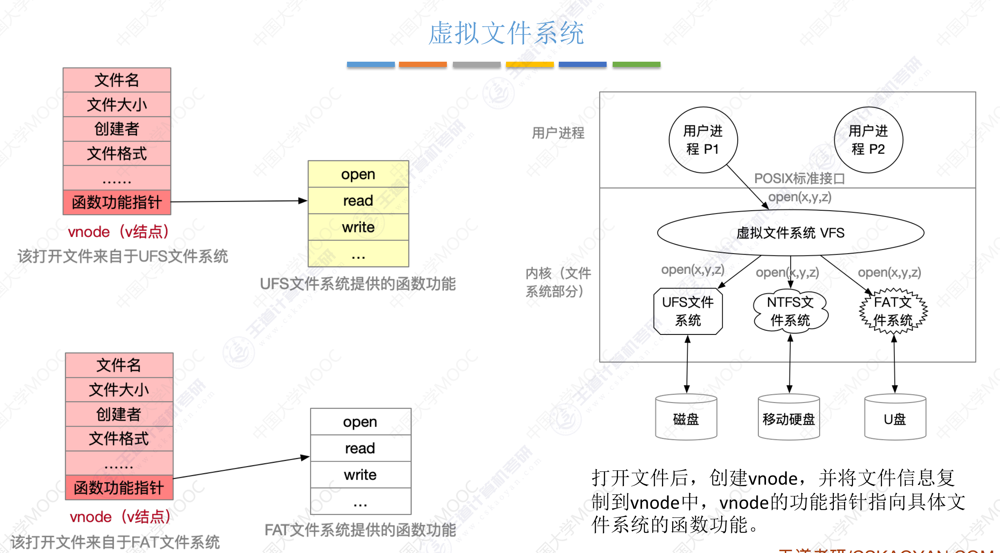

- 虚拟文件系统使用函数的方法
  - 打开文件后，创建 vnode，并将文件信息复制到 vnode 中
  - vnode 的功能指针指向具体文件系统的函数功能
    - 即虚拟文件系统会调用其下的 UFS、FAT 等不同文件系统自己的函数功能

### 文件系统挂载

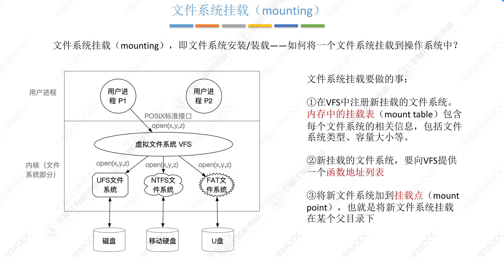

- 文件系统挂载（mounting）
  - 即文件系统安装/装载
  - 如何将一个文件系统挂载到操作系统中？
  - 文件系统挂载要做的事情？
    - 在 VFS 中注册新挂载的文件系统。
      - **内存中的挂载表**（mount table）包含每个文件系统的相关信息，包括文件系统类型、容量大小
    - 新挂载的文件系统，要向 VFS 提供一个函数地址列表
    - 将新文件系统加到挂载点（mount point）
      - 也就是将文件系统挂载在某个父目录下

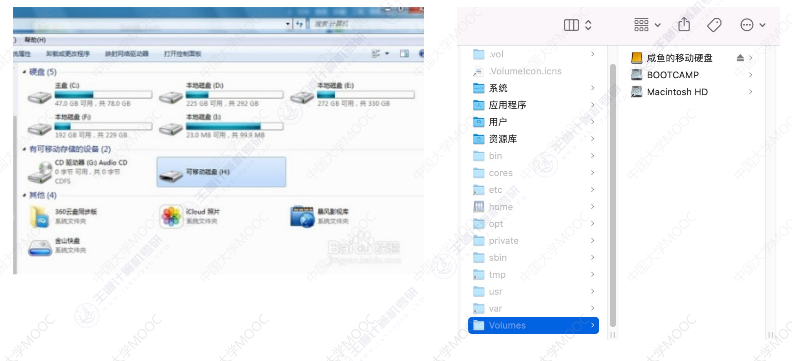

- Windows 挂载在与 C 盘、D 盘、E盘同级的目录下
- MacOS 挂在到 Volumes 文件夹下

## 磁盘

### 磁盘的结构


#### 磁盘、磁道、扇区的概念

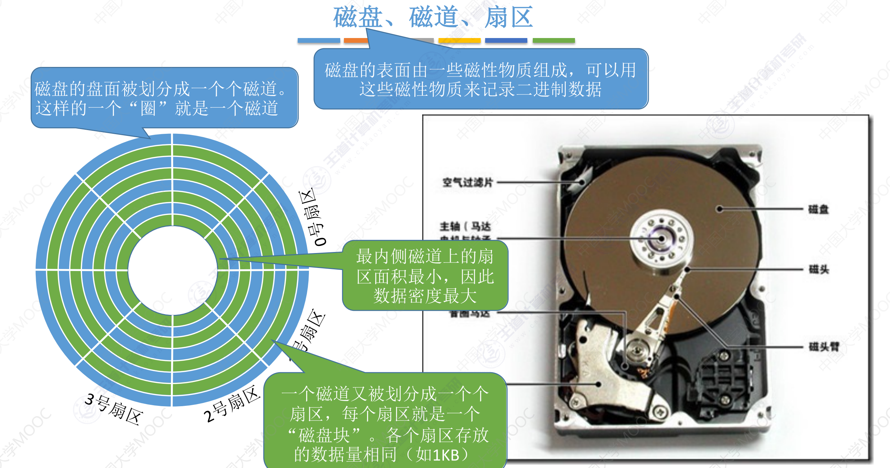

- 磁盘
  - 构成
    - 磁盘的表面由一些磁性物质组成，可以用这些磁性物质来记录二进制数据
  - 磁道
    - 磁盘的盘面被划分成一个个磁道
    - 这样的一个圈就是一个磁道
  - 扇区
    - 一个磁道又被划分为一个个扇区，每个扇区就是一个磁盘块
    - 各个扇区存放的数据量相同（如 1KB）

#### 如何在磁盘中读/写数据

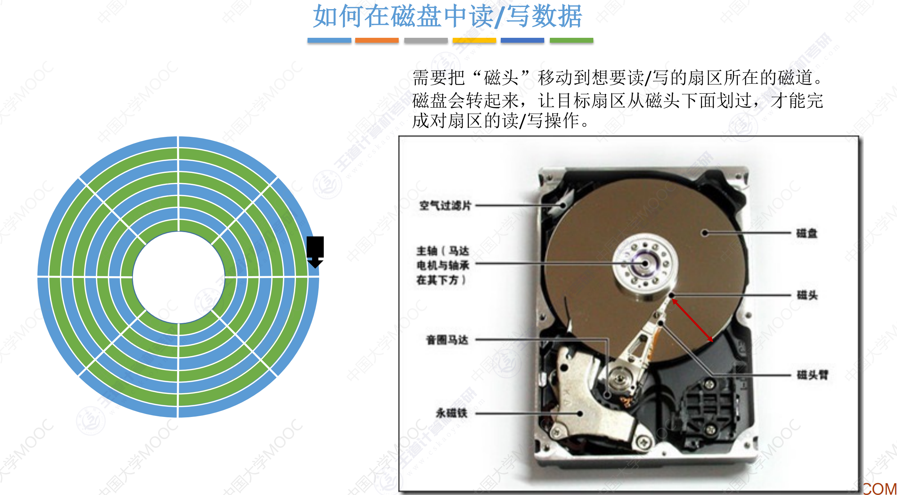

- 读写数据
  - 需要用磁头臂把“磁头”移动到想要读/写的扇区所在的磁道
  - 磁盘会转起来，让目标扇区从磁头下面划过，才能完成对扇区的读/写操作

#### 盘面、柱面的概念

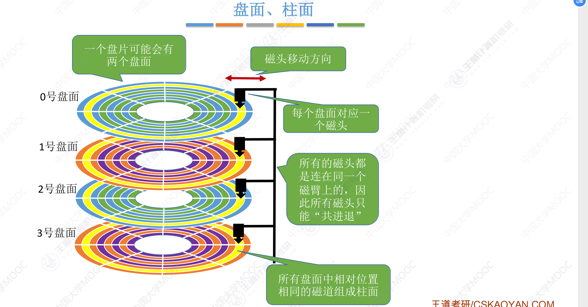

- 磁盘
  - 盘片
    - 就是上图中的一个环形
  - 盘面
    - 盘片的一个面
    - 一个盘片可能会有两个盘面
  - 磁头
    - 每个盘面对应一个磁头，可以用磁头在盘面上读取数据
  - 磁臂
    - 所有的磁头都是连在同一个磁臂上的，因此所有磁头只能共进退
    - 磁臂带动着所有磁头在不同磁道上移动、切换
  - 柱面
    - 所有盘面中相对位置相同的磁道组成柱面（黄色的是一个柱面）

#### 磁盘的物理地址

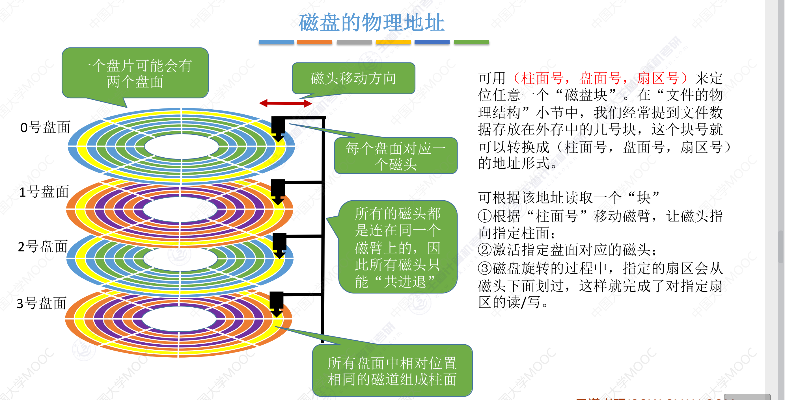

- 如何确定位置
  - 可用（柱面号，盘面号，扇区号）来定位任意一个“磁盘块”
  - 我们经常提到的文件数据存放在外存中的几号块，这个块号就可以转换为（柱面号，盘面号，扇区号）的地址形式
- 可根据该地址读取一个“块”
  - 根据“柱面号”移动磁臂，让磁头指向指定柱面
  - 激活指定盘对应的磁头
  - 磁盘旋转的过程中，指定的扇区会从磁头下面划过，这样就完成了对指定扇区的读/写

#### 磁盘的分类

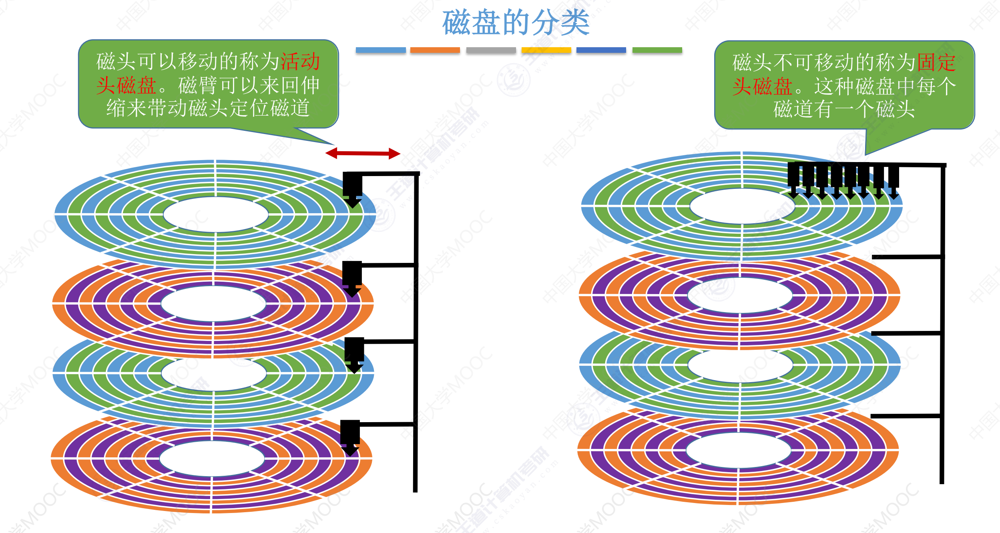

- 活动头磁盘
  - 磁头可以移动的称为活动头磁盘
  - 磁臂可以来回伸缩来带动磁头定位磁道
- 固定头磁盘
  - 磁头不可以移动
  - 每个磁道都有一个磁头

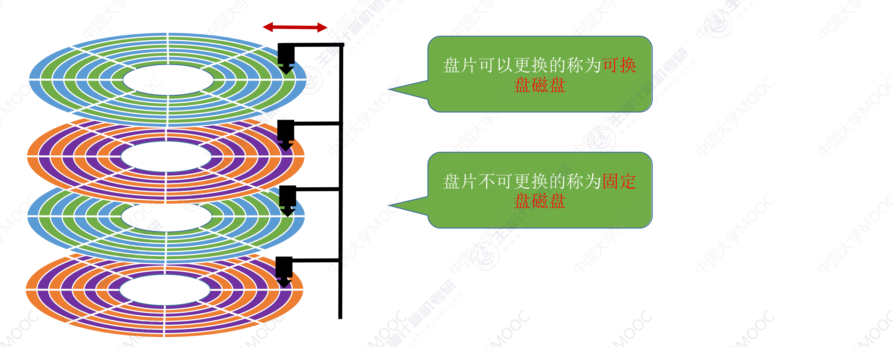

- 可换盘磁盘
  - 盘片可以更换
- 固定盘磁盘
  - 盘片不可更换

## 磁盘调度算法

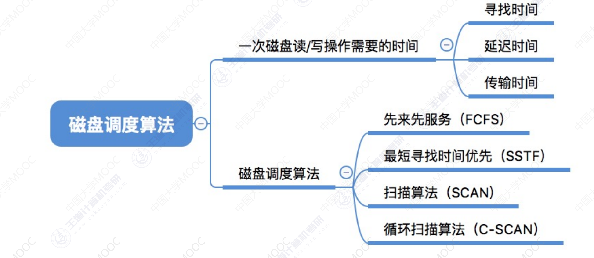

### 一次磁盘读/写需要的时间

#### 寻找时间

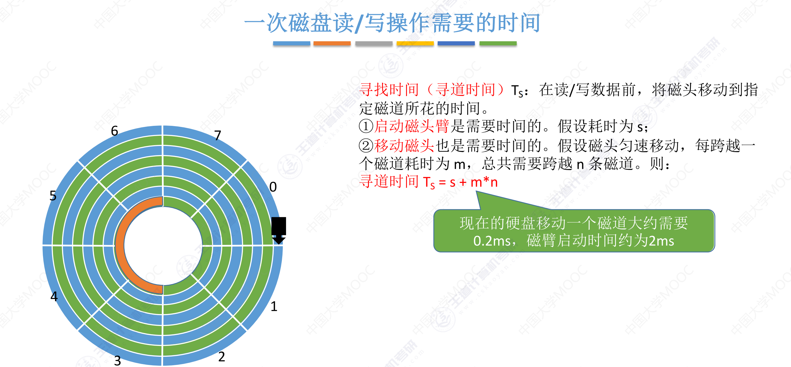

- 寻找时间
  - 寻道时间，Ts：在读/写数据之前，将磁头移动到指定磁道所花的事件
    - 启动磁头臂是需要时间的，假设耗时为 s
    - 移动磁头也是需要时间的，假设磁头均匀移动，每跨越一个磁道耗时为 m，总共需要跨越 n 条磁道
  - 寻道时间 Ts = s+m*n
  - 现在的硬盘移动一个磁道大约需要 0.2ms，磁臂启动时间约为 2ms

#### 延迟时间

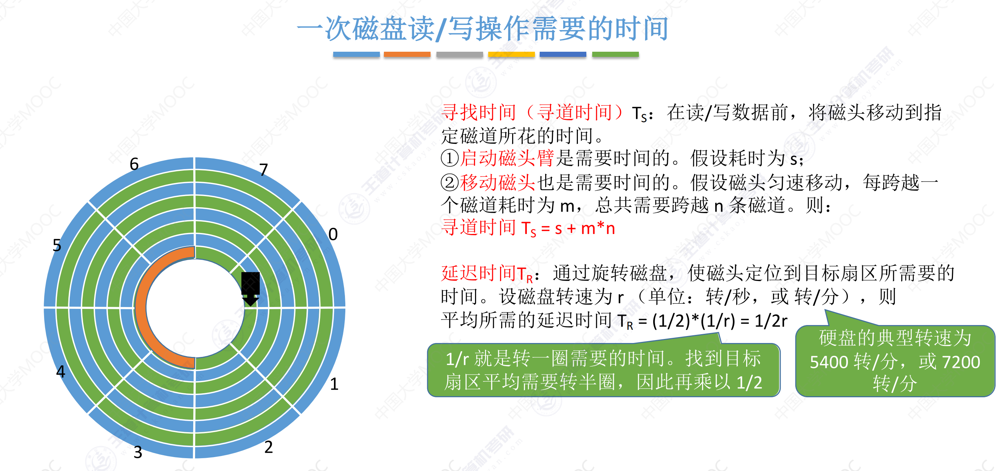

- 延迟事件
  - 通过旋转磁盘，使磁头定位到目标扇区所需要的时间
  - 设磁盘转速为 r（单位：转/秒，或转/分）
  - 则平均所需的延迟时间 Tr=(1/2)*(1/r)=1/2r
    - 1/r就是转一圈需要的事件
    - 找到目标扇区平均需要转半圈，因此再乘 1/2

#### 传输时间

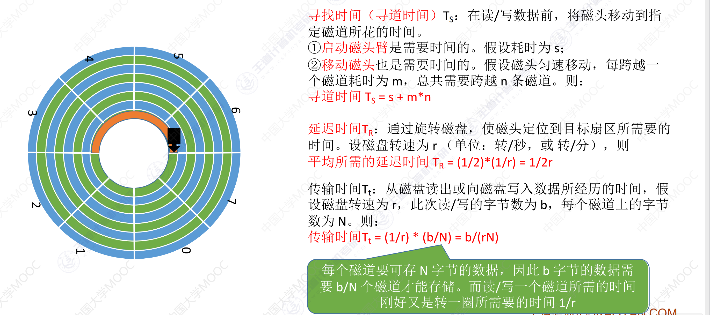

- 传输时间
  - Tt，从磁盘读出或向磁盘写入数据所经历的时间
  - 假设磁盘转速为 r，此次读/写的字节数为 b，每个磁道上的字节数为 N
  - 则：传输时间 Tt = (1/r)*(b/N) = b/(rN)
    - 每个磁道可存 N 字节的数据，因此 b 字节的数据需要b/N个磁道才能存储
    - 读写一个磁道所需的事件刚好又是转一圈所需要的时间1/r

#### 总时间

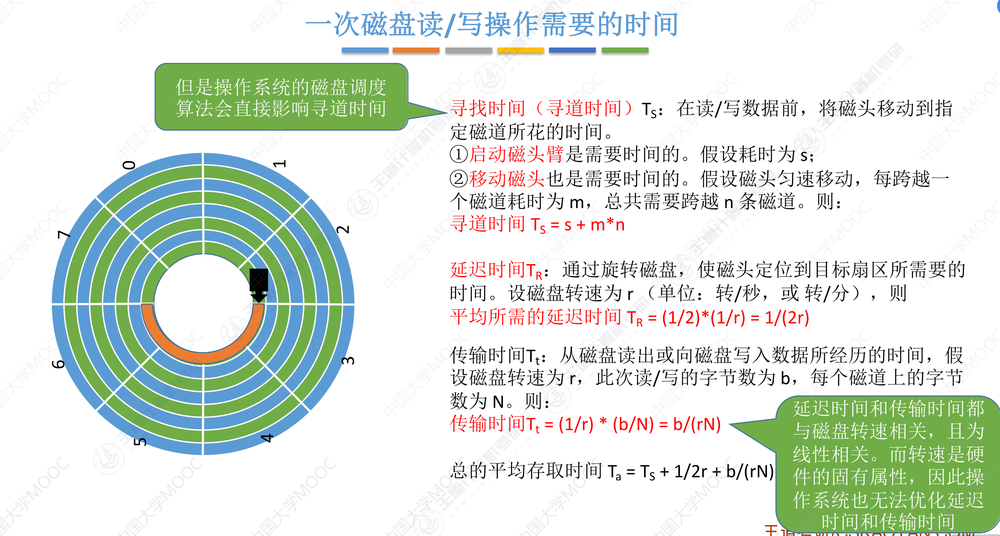

- 总的平均存取时间
  - Ta = Ts +1/2r + b/(rN)
  - 延迟时间和传输时间都与磁盘转速相关，且为线性相关
  - 转速是硬件的固有属性，因此操作系统也无法优化延迟时间和传输时间
  - 但是操作系统的磁盘调度算法会直接影响寻道时间

### 磁盘调度算法

#### 先来先服务（FCFS）

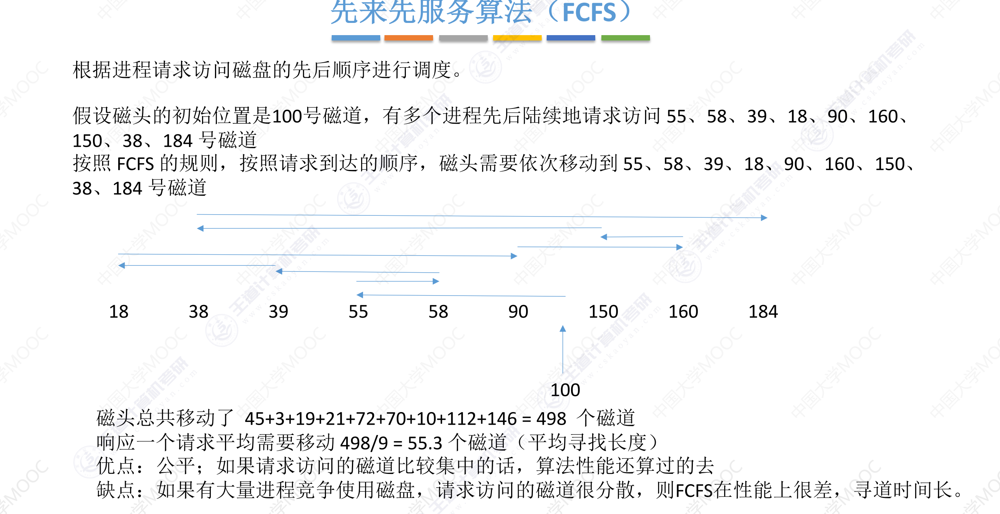

- 先来先服务
  - 算法思想
    - 根据进程请求访问磁盘的先后顺序进行调度
  - 优点
    - 公平
    - 如果请求访问的磁道比较集中的话，算法性能还算过得去
  - 缺点
    - 如果有大量进程竞争使用磁盘，请求访问的磁道很分散，则 FCFS 在性能上很差，寻道时间长
  - 例子
    - 假设磁头的初始位置是100号磁道，有多个进程先后陆续地请求访问 55、58、39、18、90、160、150、38、184 号磁道
    - 按照 FCFS 的规则，按照请求到达的顺序，磁头需要依次移动到 55、58、39、18、90、160、150、38、184 号磁道
    - 磁头总共移动了 45+3+19+21+72+70+10+112+146 = 498 个磁道
    - 响应一个请求平均需要移动 498/9 = 55.3 个磁道（平均寻找长度）

#### 最短寻找时间优先（SSTF）

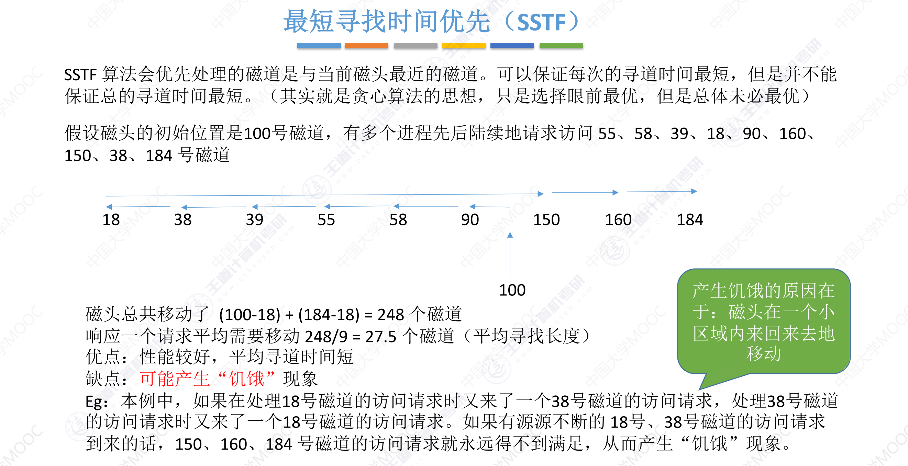

- 最短寻找事件优先（SSTF）
  - 算法思想
    - SSTF 算法会优先处理的磁道是与当前磁头最近的磁道
    - 可以保证每次的寻道时间最短，但是不能保证总的寻道时间最短
    - 贪心思想，只选择眼前最优，整体未必最优
  - 优点
    - 性能较好，平均寻道时间最短
  - 缺点
    - 可能产生“饥饿现象”
  - 例子
    - 假设磁头的初始位置是100号磁道，有多个进程先后陆续地请求访问 55、58、39、18、90、160、150、38、184 号磁道
    - 磁头总共移动了 (100-18) + (184-18) = 248 个磁道
    - 响应一个请求平均需要移动 248/9 = 27.5 个磁道（平均寻找长度）
    - 本例中，如果在处理18号磁道的访问请求时又来了一个38号磁道的访问请求，处理38号磁道的访问请求时又来了一个18号磁道的访问请求。如果有源源不断的 18号、38号磁道的访问请求到来的话，150、160、184 号磁道的访问请求就永远得不到满足，从而产生“饥饿”现象。
      - 产生饥饿的原因在于：磁头在一个小 区域内来回来去地移动

#### 扫描算法（SCAN）

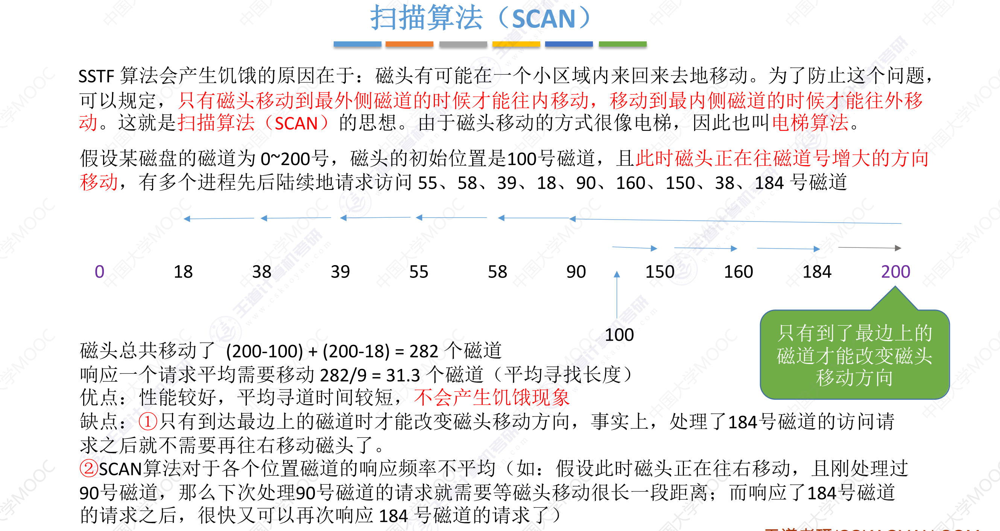

- 扫描算法（电梯算法）
  - 算法思想
    - 为了解决 SSTF 算法有可能在一个小区域内来回来去地移动，产生饥饿的缺点
    - 只有磁头移动到最外侧磁道的时候才能往内移动，移动到最内侧磁道的时候才能往外移动
    - 只有到了最边上的磁道才能改变磁头移动方向
  - 优点
    - 性能较好，平均寻道时间较短，不会产生饥饿现象
  - 缺点
    - **只有到达最边上的磁道时才能改变磁头移动方向**，事实上，处理了 184 号（最高）磁道的访问请求之后就不需要再往右移动磁头了
    - **SCAN 算法对于各个位置的响应频率不均匀**
      - 假设此时磁头正往右移动，且刚处理过 90 号磁道，那么下次处理 90 号磁道的请求就需要等磁头移动很长一段距离
      - 但是响应了 184 号磁道的请求之后，很快又可以再次相应 184 号磁道的请求了
  - 例子
    - 假设某磁盘的磁道为 0~200号，磁头的初始位置是100号磁道，且此时磁头正在往磁道号增大的方向移动，有多个进程先后陆续地请求访问 55、58、39、18、90、160、150、38、184 号磁道
    - 磁头总共移动了 (200-100) + (200-18) = 282 个磁道
    - 响应一个请求平均需要移动 282/9 = 31.3 个磁道（平均寻找长度）

#### LOOK 调度算法

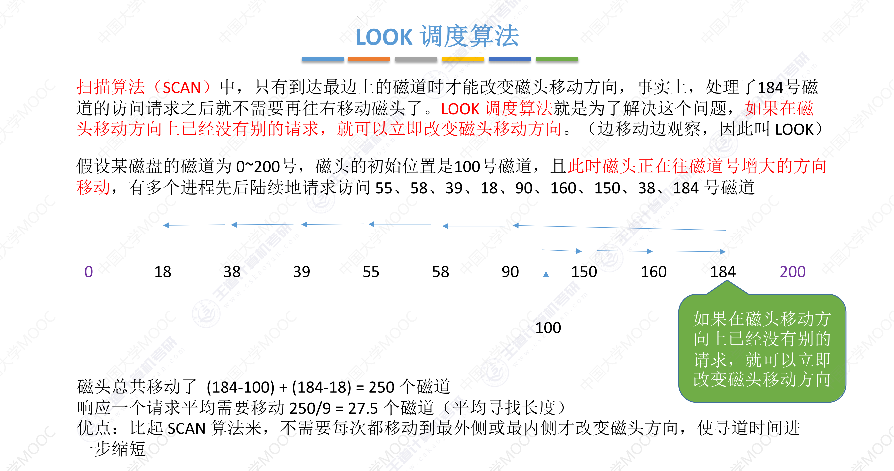

- LOOk 调度算法
  - 算法思想
    - 解决了扫描算法中只有到达最边上的磁道时才能改变磁头移动方向的问题
    - 如果在磁头移动方向上已经没有别的请求了，就可以立即改变磁头移动方向
    - 边移动便观察，因此叫 LOOK
    - **只有到了最边上的磁道才能改变磁头移动方向**
  - 优点
    - 比起 SCAN 算法，不需要每次都移动到最外侧或最内侧才改变磁头方向，使寻道时间进一步缩短
  - 例子
    - 假设某磁盘的磁道为 0~200号，磁头的初始位置是100号磁道，且此时磁头正在往磁道号增大的方向移动，有多个进程先后陆续地请求访问 55、58、39、18、90、160、150、38、184 号磁道
    - 磁头总共移动了 (184-100) + (184-18) = 250 个磁道
    - 响应一个请求平均需要移动 250/9 = 27.5 个磁道（平均寻找长度）

#### 循环扫描算法（C-SCAN）

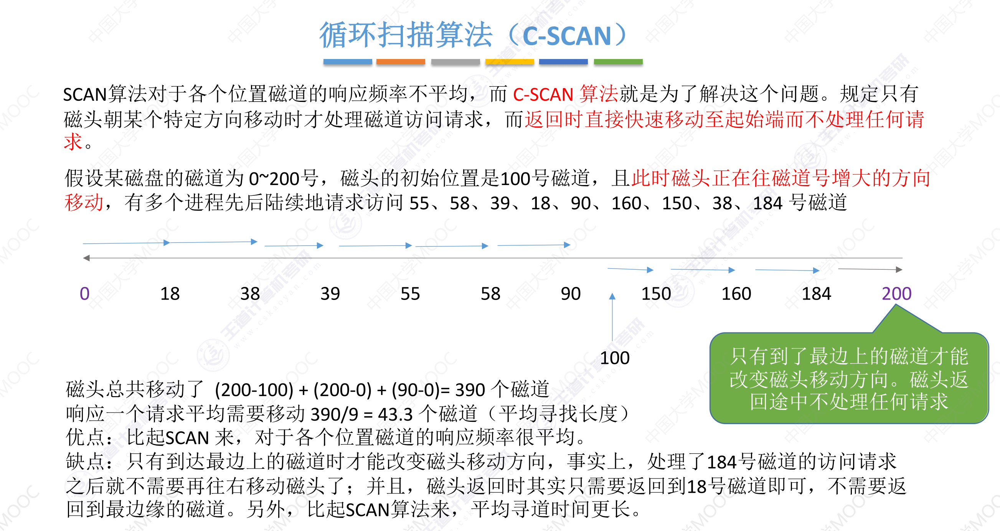

- C-SCAN算法
  - 算法思想
    - 解决各个位置磁道的响应频率不平均的问题
    - 规定只有磁头朝某个特定方向移动时才处理磁道访问请求，而返回时直接快速移动至起始端而不处理任何请求
    - 只有到了最边上的磁道才能改变磁头移动方向。磁头返回途中不处理任何请求
  - 优点
    - 比起 SCAN，对于各个位置磁道的响应频率很平均
  - 缺点
    - **只有到达最边上的磁道时才能改变磁头移动方向**
    - 比起 SCAN 算法，**平均寻道时间更长**
  - 例子
    - 假设某磁盘的磁道为 0~200号，磁头的初始位置是100号磁道，且此时磁头正在往磁道号增大的方向移动，有多个进程先后陆续地请求访问 55、58、39、18、90、160、150、38、184 号磁道
    - 磁头总共移动了 (200-100) + (200-0) + (90-0)= 390 个磁道
    - 响应一个请求平均需要移动 390/9 = 43.3 个磁道（平均寻找长度）

#### C-LOOK调度算法

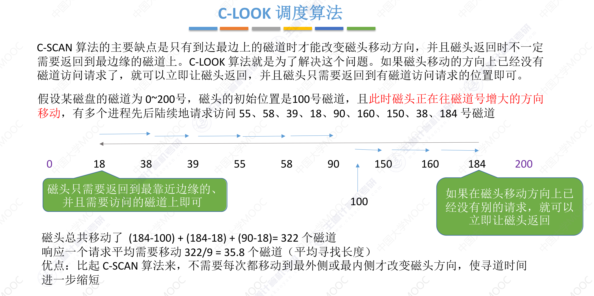

- C-LOOK
  - 算法思想
    - 解决 C-SCAN 算法只有达到最边上的磁道时才能改变磁头移动方向，并且磁头返回时不一定需要返回到最边缘的磁道上的缺点
    - 如果磁头移动方向上已经没有磁道访问请求了，就可以立即让磁头返回，并且磁头只需要返回到有磁道访问请求的位置即可
    - 磁头只需要返回到最靠近边缘的、并且需要访问的磁道上即可
    - 如果在磁头移动方向上已 经没有别的请求，就可以立即让磁头返回
  - 优点
    - 比起 C-SCAN 算法，不需要每次都移动到最外侧或者最内侧才改变磁头方向，使寻道时间进一步缩短
  - 例子
    - 假设某磁盘的磁道为 0~200号，磁头的初始位置是100号磁道，且此时磁头正在往磁道号增大的方向移动，有多个进程先后陆续地请求访问 55、58、39、18、90、160、150、38、184 号磁道
    - 磁头总共移动了 (184-100) + (184-18) + (90-18)= 322 个磁道
    - 响应一个请求平均需要移动 322/9 = 35.8 个磁道（平均寻找长度）

## 减少磁盘延迟事件的方法

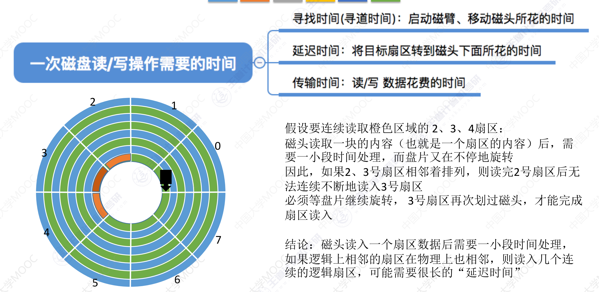

- 假设要连续读取橙色区域的 2、3、4 扇区
  - 磁头读取一路爱的内容（一个扇区的内容）后，需要一小段时间处理，而扇片又在不停地旋转
  - 如果 2、3 号扇区相邻着排列，则读完 2 号扇区后无法连续读入 3 号扇区
  - 必须等扇片继续旋转，3 号扇区再次划过磁头，才能完成扇区读入
- 结论
  - 磁头读入一个扇区数据后需要一小段时间处理，如果逻辑上相邻的扇区在物理上也相邻，则读入几个连续的逻辑扇区，可能需要很长的“延迟时间”

### 交替编号：减少延迟时间

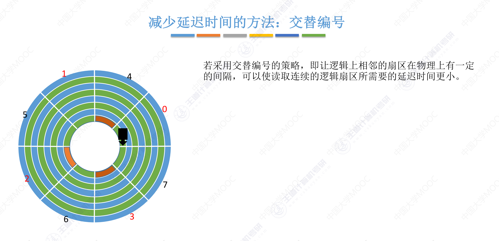

- 交替编号
  - 让逻辑上相邻的扇区在物理上有一定的间隔，可以使读取连续的逻辑扇区所需要的延迟时间更小

### 磁盘地址结构的设计


- 思考
  - 为什么磁盘的物理地址是（柱面号，盘面号，扇区号）而不是（盘面号，柱面号，扇区号）
    - 若物理地址结构是（盘面号，柱面号，扇区号）且需要连续读取物理地址 （00, 000, 000）~（00, 001, 111）的扇区
      - （00, 000, 000） ~（ 00, 000, 111 ） 转两圈可读完之后再读取物理地址相邻的区域
      - 即（00, 001, 000） ~（ 00, 001, 111 ），需要启动磁头臂，将磁头移动到下一个磁道
    - 若物理地址结构是（柱面号，盘面号，扇区号），且需要连续读取物理地址 （000, 00, 000）~（000, 01, 111）的扇区
      - （000, 00, 000） ~（ 000, 00, 111 ） 由盘面0的磁头读入数据之后再读取物理地址相邻的区域
      - （000, 01, 000） ~（ 000, 01, 111 ），由于柱面号/磁道号相同，只是盘面号不同，因此不需要移动磁头臂。只需要激活相邻盘面的磁头即可
  - 读取地址连续的磁盘块时，采用（柱面号，盘面号，扇区号）的地址结构可以减少磁头移动消耗的时间

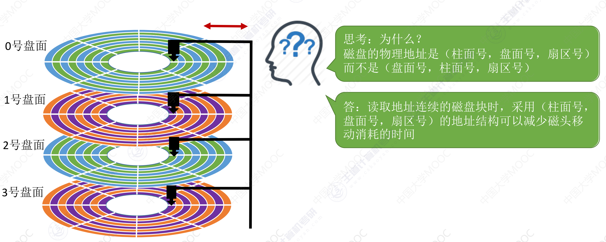

### 错位命名：减少延迟事件

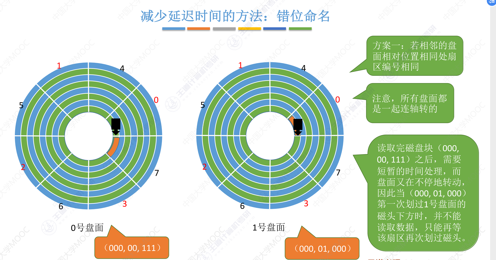

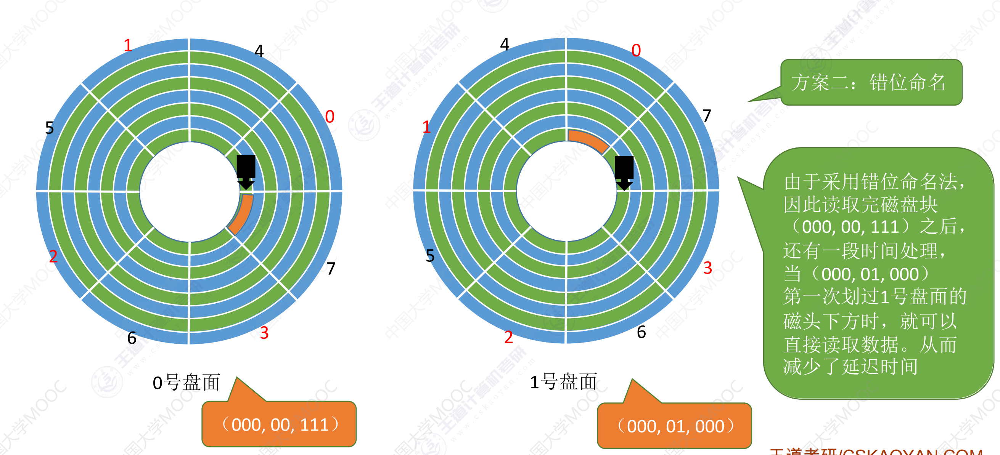

- 不同盘面命名
  - 方案一：若相邻的盘面相对位置相同处扇区编号相同
    - 所有盘面都是一起连轴转的
    - 读取完磁盘块（000,00, 111）之后，需要短暂的时间处理，而盘面又在不停地转动，因此当（000, 01, 000）**第一次划过1号盘面的磁头下方时，并不能读取数据，只能再等该扇区再次划过磁头**
  - 方案二：错位命名
    - 由于采用错位命名法，因此读取完磁盘块（000, 00, 111）之后，还有一段时间处理，当（000, 01, 000）第一次划过1号盘面的磁头下方时，就可以直接读取数据。从而减少了延迟时间

## 磁盘的管理


### 磁盘的初始化

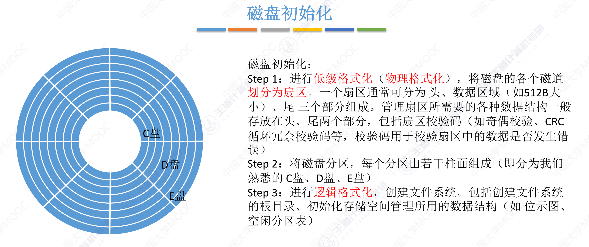

- 磁盘的初始化
  - **进行低级格式化（物理格式化），将磁盘的各个磁道划分为扇区**
    - 一个扇区通常可分为头、数据区域（扇区的内存大小，如 512B 大小）、尾（指向下一个扇区的指针）三个部分组成
    - 管理扇区所需要的各种数据结构一般存放在头、尾两个部分，包括扇区校验码（如奇偶校验、CRC 循环冗余检验码等，检验码用于校验扇区中的数据是否发生错误）
  - **将磁盘分区，每个分区由若干柱面组成**（即分为 C、D、E 盘）
  - **进行逻辑格式化，创建文件系统**
    - 包括创建文件系统的根目录、初始化存储空间管理所用的数据结构
    - 如位示图、空闲分区表

### 引导块


- 引导块

  - 计算机开机时需要进行一系列初始化的工作，这些初始化工作是通过执行**初始化程序（自举程序）**完成的

  - 初始化程序可以放在 ROM（只读存储器）中**，ROM 中的数据在出厂时就写入了，并且以后不能够再修改**

    - ROM 一般是出厂时就集成在主板上的

  - 初始化程序（自举程序）放在 ROM 中存在什么问题？

    - 万一需要更新自举程序，将会很不方便，因为 ROM 中的数据无法更改。如何解决？

      - **ROM 中只存放很小的“自举装入程序”**
      - **完整的自举程序放在磁盘的启动块（即引导块/启动分区）上，启动块位于磁盘的固定位置**
      - 开机时计算机先运行“自举装入程序”，通过执行该程序就可以找到引导块，并将完整的“自举程序”读入内存，完成初始化
      - 拥有启动分区的磁盘称为启动磁盘或系统磁盘（C 盘）

      


### 坏块的管理

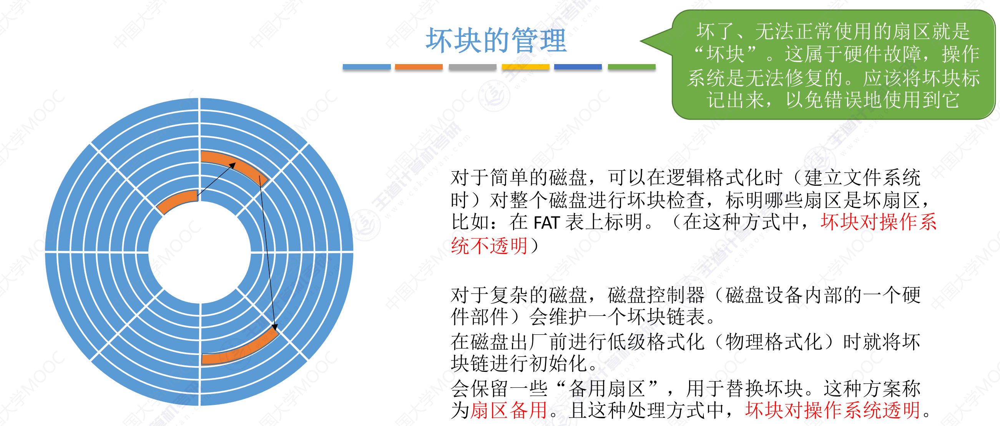

- 坏块的管理
  - 坏块
    - 坏了无法正常使用的扇区
    - 属于硬件故障，操作系统是无法修复的
    - 应该将坏块标记出来，以免错误的使用到它
  - 对于简单的磁盘
    - **可以在逻辑格式化时（建立文件系统时）对整个磁盘进行坏块检查，标明哪些扇区是坏扇区**
      - 比如：在 FAT 表上标明
      - 这种方式，坏块对操作系统不透明
  - 对于复杂的磁盘
    - 磁盘控制器（磁盘设备内部的一个硬件部件）会维护一个坏块链表
    - **在磁盘出厂前进行低级格式化（物理格式化时）就将坏块链进行初始化**
    - 会保留一些“备用扇区”，用于替换坏块
      - 这种方法被称为扇区备用
      - 这种方式，坏块对操作系统透明

## 固态硬盘 SSD


### 总结

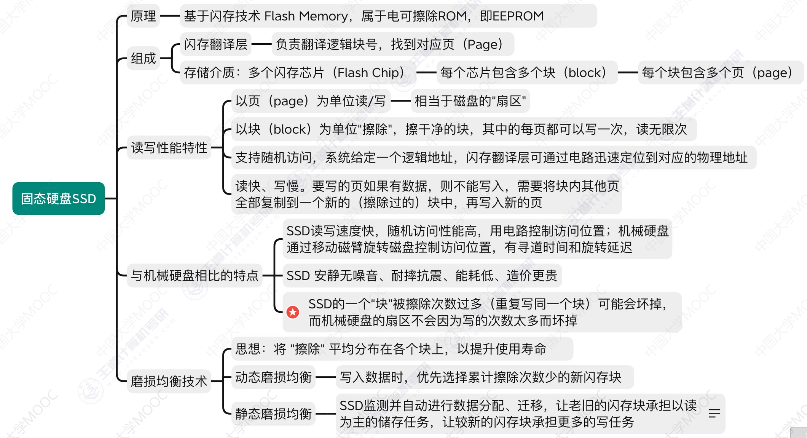

- 固态硬盘
  - 原理
    - 基于闪存技术 Flash Memory，属于电可擦除 ROM，EEPROM
  - 组成
    - 闪存翻译层
      - 负责翻译逻辑块号，找到对应页（Page）
    - 存储介质
      - 多个闪存芯片（Flash Chip）
      - 每个芯片包含多个块（block）
      - 每个块包含多个页（page）
  - 读写性能特性
    - 以页（page）为单位读/写——相对于磁盘的“扇区”
    - **以块（block）为单位“擦除”，擦干净的块，其中的每页都可以写一次，读无数次**
    - 支持随机访问，系统给定一个逻辑地址，闪存翻译层可以通过电路迅速定位到对应的物理地址
    - 读快、写慢
      - **要写的页如果有数据，则不能直接写入，需要将块内其他页全部复制到一个新的（擦除过的）块中，再写入新的页**
  - 与机械硬盘相比的特点
    - 读写速度
      - SSD 读写速度快，随机访问性能高，用电路控制访问位置
      - 机械硬盘通过移动磁臂旋转磁盘控制访问位置，有寻道时间和旋转延迟
    - SSD 安静无噪音、耐摔抗震、能耗低、造价更贵
    - **SSD 的一个块被擦除次数过多（重复写同一个块）可能会坏掉，而机械硬盘的扇区不会因为写的次数太多而坏掉**
  - 磨损均衡技术
    - 思想
      - **将擦除平均分布到各个块上，以提升使用寿命**
    - 动态磨损均衡
      - 写入数据时，优先选择累计擦除次数少的新闪存块
    - 静态磨损均衡
      - SSD 监测并自动进行数据分配、迁移，让老旧的闪存块承担以读为主的储存任务，让较新的闪存块承担更多的写任务

### 固态硬盘的结构

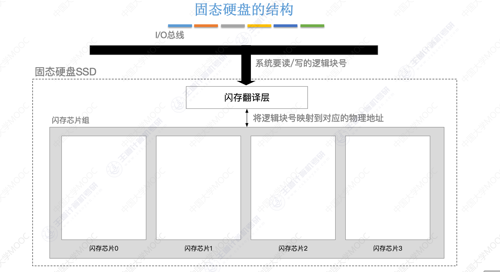

- 闪存翻译层
  - 地址变换
  - 将系统要读/写的逻辑块号翻译成对应的物理地址

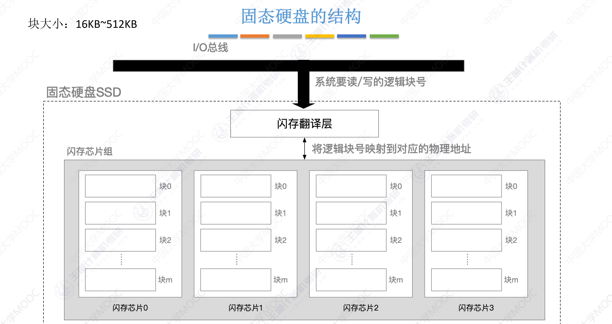

- 块
  - 大小：16KB~512KB
  - 磁道

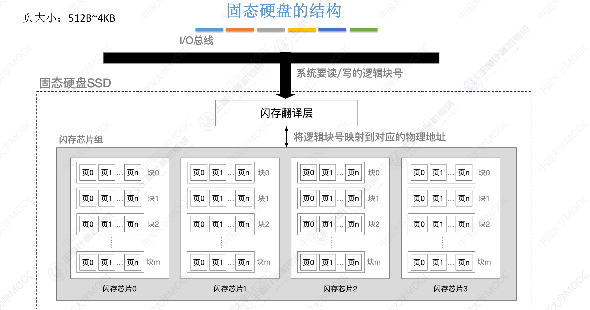

- 页
  - 大小：512B~4KB
  - 扇区

### 例题

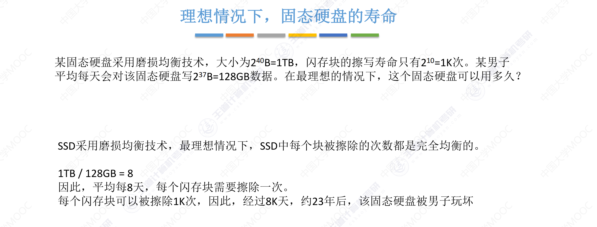

- 理想情况下，固态硬盘的寿命

  - 某固态硬盘采用磨损均衡技术，大小为240B=1TB，闪存块的擦写寿命只有2^10=1K次。某男子平均每天会对该固态硬盘写237B=128GB数据。在最理想的情况下，这个固态硬盘可以用多久？

    - SSD采用磨损均衡技术，最理想情况下，SSD中每个块被擦除的次数都是完全均衡的。
    - 1TB / 128GB = 8
    - 因此，平均每8天，每个闪存块需要擦除一次。
    - 每个闪存块可以被擦除1K次，因此，经过8K天，约23年后，该固态硬盘被男子玩坏

    

    


