# 计算机系统概述

## 考点总结

### 题型

- 操作系统体系结构
  - 分层结构、模块化、外核
    - 考简单地选择题，了解各种体系结构的特性，了解各自的优缺点

### 常考内容

- 允许多个用户以交互的方式使用计算机的操作系统：分时操作系统
- 允许多个用户将若干作业提交给计算机系统集中处理：批处理系统
- 计算机系统能及时处理由过程控制反馈的数据，并及时作出相应：实时操作系统
- 在 IBM-PC 中，操作系统称为：微型计算机操作系统

- 操作系统发展历程中的各个阶段，优点缺点，解决技术方案

  - 手工操作阶段

    - 缺点
      - **不脱机，无操作系统**
      - **单用户独占全机**，不会出现因资源被其他用户用户占用而等待的现象，但资源利用率低
      - CPU 等待手工操作，CPU 的利用不充分
    - 解决方法
      - 用高速的机器代替相对较慢的手工操作来对作业进行控制

  - 批处理阶段

    - 解决问题
      - **多用户**
  
      - 人机矛盾
  
      - CPU 及 I/O 设备之间不匹配的矛盾

      - **实现作业自动控制而无需人工干预**

  
    - 单道批处理系统
      - 解决方案
  
        - **操作系统开始出现**
        - 引入脱机输入输出技术，并由监督程序负责控制作业的输入输出
  
      - 特点
  
        - 缓解了一定程度的人机速度矛盾，资源利用率有所提升
        - **自动性**：在顺利的情况下，磁带上一批作业能自动地逐个运行，而**无需人工干涉**
        - **顺序性**：磁带上的各道作业顺利地进入内存，各道作业的完成顺序与它们进入内存的顺序在正常情况下应完全相同，即**先调入内存的作业先完成**
      - 缺点
        - 每次主机内存中仅能存放一道作业，每当它在运行期间（而不是完成后）发出输入输出请求后，高速的 CPU 便处于等待低速 I/O 完成的状态
        - **单道性**：内存中仅有一道程序运行，即监督程序每次从磁带上只调入一道程序进入内存运行。当该程序完成或发生异常情况时，才换入其后继程序进入内存运行
        - CPU 有大量的时间是在空闲等待 I/O 完成。资源利用率很低
    - 多道批处理系统
      - 目标
        - 为了进一步提高资源利用率和系统的吞吐量
      - 技术
        - **多道程序设计技术**
          - 允许**多个程序**同时进入内存并允许他们在 CPU 中交替地运行，这些程序共享系统中的各种软/硬件资源
  
        - 把用户提交的作业成批的送入计算机内存，然后由作业调度程序自动地选择作业运行
  
        - 可以实现系统各部件之间的**并行工作**，使其整体在单位时间内的效率翻倍
      - 特点
        - **多道**：
          - 计算机内存中同时存放多道相互独立的程序
  
        - **宏观上并行**：
          - 同时进入系统的多道程序都处于运行过程中，即它们先后开始各自的运行但都未运行完成
  
        - **微观上串行**：
          - 内存中的多道程序轮流占有 CPU，交替执行
      - 需要解决的问题
        - 如何分配处理器
  
        - 多道程序的内存分配问题
  
        - I/O 设备如何**分配**
  
        - 如何组织和存放大量的程序和数据，以方便用户使用并保证其**安全性和一致性**
      - 优点
        - 资源利用率高，多道程序共享计算机资源，从而使各种资源得到充分利用
  
        - 系统吞吐量大、CPU 和其他资源保持“忙碌”状态
  
        - **多道程序并发执行**
      - 缺点
        - 用户响应时间长
        - **不提供人机交互**（用户提交自己的作业之后就只能等待计算机处理完成，中间不能控制自己的作业执行）
  
  - 分时操作系统
  
    - 目标
  
      - 人机交互
  
    - 技术
  
      - 分时技术
        - 把处理器的运行时间分成很短的时间片，按时间片轮流把处理器分配给各联机作业使用
        - 若作业在分配给它的时间片内不能完成计算，则该作业暂时停止运行，把处理器让给其他作业使用，等待下一轮再继续执行
        - 每个用户都感觉自己独占一台计算机：计算机速度很快，作业运行轮转的很快
  
    - 需要解决的问题
  
      - 如何使用户能与自己的作业进行交互，即当用户在自己的终端上键入命令时，系统应能及时接收并及时处理该命令
      - **实现人机交互**
  
    - 特点
  
      - 多个用户通过终端同时共享一台主机，这些终端连接在主机上，用户可以同时与主机进行交互操作而互不干扰
  
      - 计算机以**时间片**为单位轮流给各个用户/作业服务，各个用户可通过终端与计算机交互
      - 同时性：多路性，允许多个终端用户同时使用一台计算机，即一台计算机与若干台终端相连接，终端上这些用户可以同时或基本同时使用计算机
      - 交互性：用户能够方便的与系统进行人机对话，即用户通过终端采用人机对话的方式直接控制程序运行，与同程序进行交互
      - 独立性：系统中多个用户可以彼此独立的进行操作，互不干扰，单个用户感受不到别人也在用这台计算机，好像只有自己单独使用这台计算机一样
      - 及时性：用户请求能在短时间内获得响应，分时系统采用时间片轮转方式使一台计算机同时为多个终端服务，使用户能够对系统的及时响应感到满意
  
    - 优点
  
      - 用户请求可以被及时响应，解决了**人机交互**问题
      - **允许多个用户同时使用一台计算机**，并且用户对计算机的操作相互独立，感受不到别人的存在
  
    - 缺点
      - **不能优先处理一些紧急的任务**
      - 操作系统对各个用户/作业都是完全公平的，循环地为每个用户/作业服务一个时间片，不区分任务紧急性
  
  - 实时操作系统
  
    - 目标
      - 为了能在某个时间限制内完成某些紧急任务而不需要时间片排队
    - 分类
      - 硬实时系统
        - 某个动作必须在规定的时刻（或规定的时间范围内）发生
        - 飞行器的飞行自动控制系统
      - 软实时系统
        - 能够接受偶尔违反时间规定且不会引起任何永久性的损害
        - 飞机订票系统、银行管理系统
    - 特点
      - 及时性
      - 可靠性
      - 计算机系统接收到外部信号后及时进行处理，并在严格的时限内处理完接收的事件
    - 优点
      - 能够优先处理响应一些紧急任务，某些紧急任务不需要时间片排队

## 知识总结

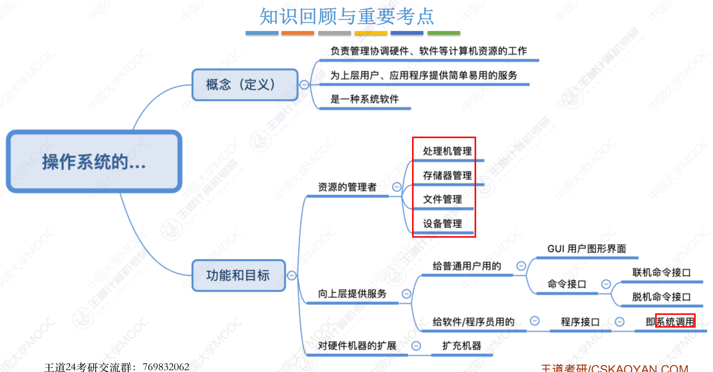

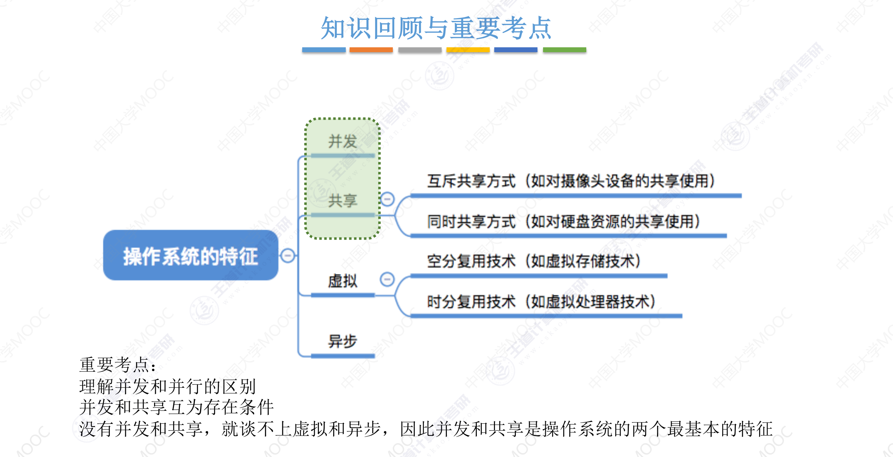

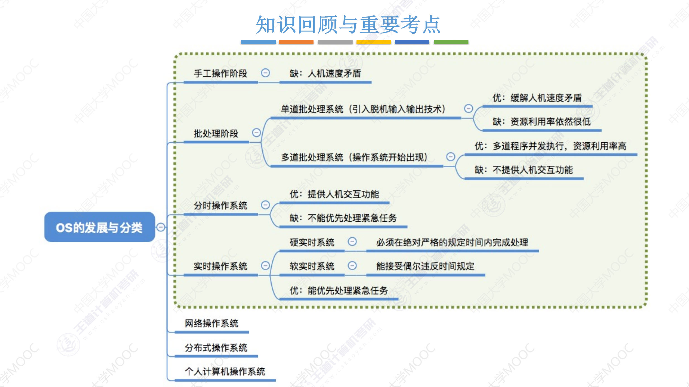

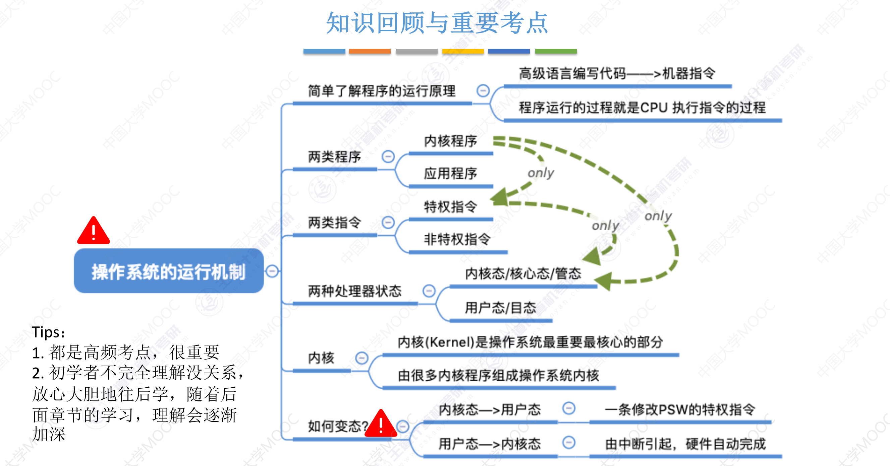

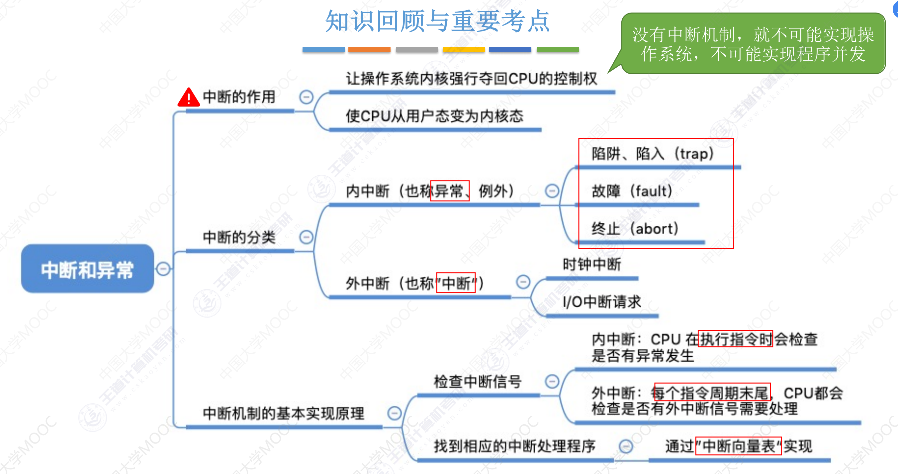

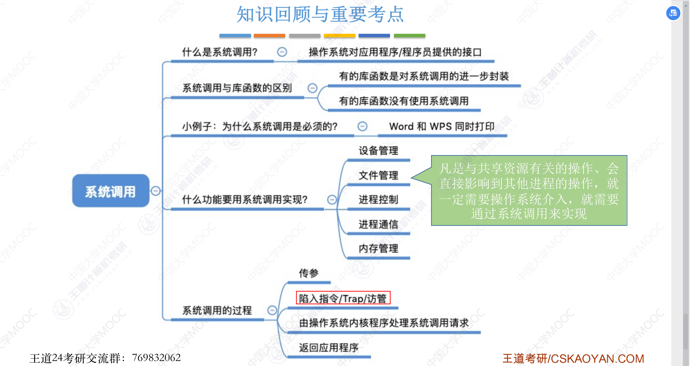

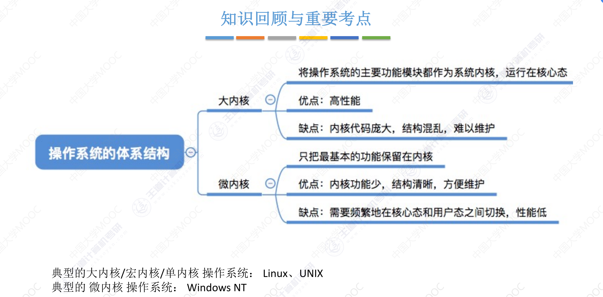

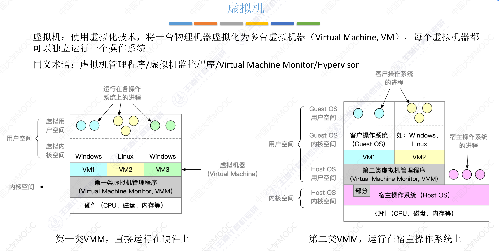

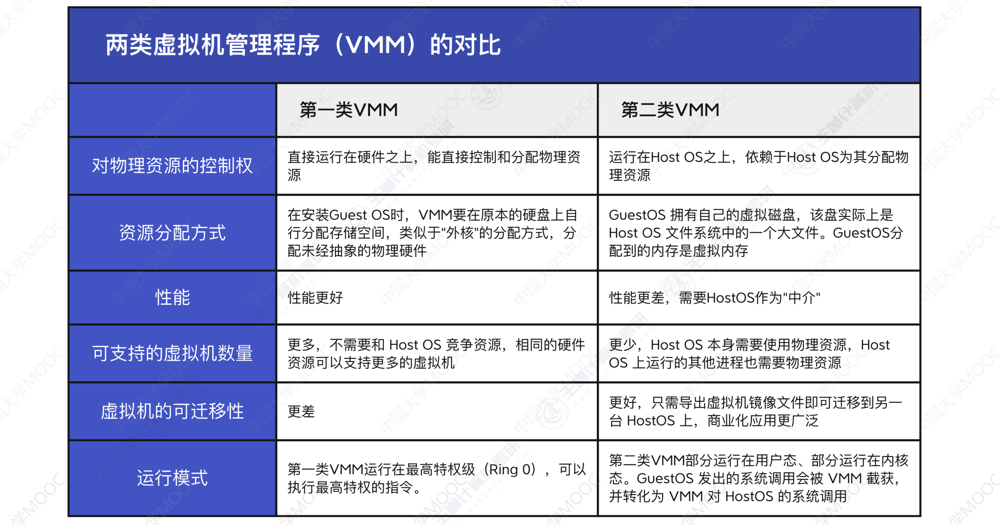

## 操作系统的基本概念

### 操作系统的概念（定义）

#### 什么是操作系统

- 操作系统
  - 控制和管理整个计算机系统的硬件和软件资源，并合理地组织调度计算机的工作和资源分配
  - 以提供给用户和其他软件方便的接口和环境
  - 它是计算机系统中最基本的系统软件
- 特征
  - 系统资源的管理者
  - 向上层提供方便易用的服务
  - 是最接近硬件的一层软件

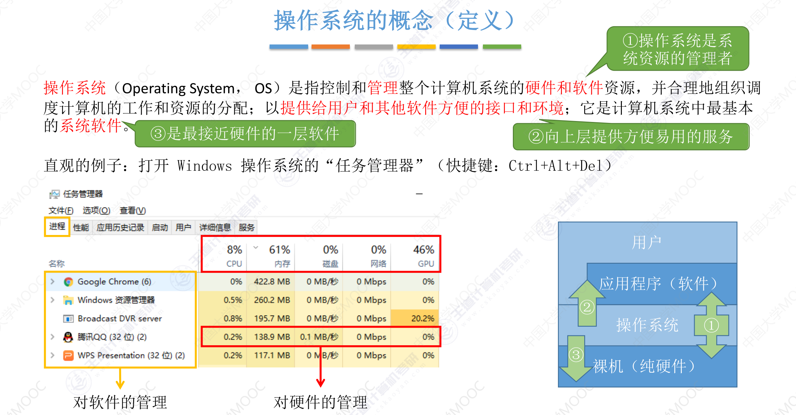

### 操作系统的功能和目标

- 作为系统资源的管理者

  - 提供的功能
    - 处理机管理
    - 存储器管理
    - 文件管理
    - 设备管理

  - 目标
    - 安全、高效

- 向上层提供方便易用的服务

  - 封装思想：操作系统把一些丑陋的硬件功能封装成简单易用的服务，使用户能更方便地使用计算机，用户无需关心底层硬件的原理，只需要对操作系统发出命令

  - GUI：图形化用户接口

  - 用户接口
    - 命令接口
      - 联机命令接口（交互式命令接口）
        - 用户说一句，系统跟着做一句
      - 脱机命令接口（批处理命令接口）
        - *.bat文件
    - 程序接口（广义命令）
      - 可以在程序中进行系统调用来使用程序接口。
      - 普通用户不能直接使用程序接口，只能通过程序代码间接使用
      - 类似于函数调用，是应用程序请求操作系统服务的唯一方式
      - 例如：printf函数
- 作为最接近硬件的层次
  - 需要**实现对硬件机器的拓展**
    - 将CPU、内存、磁盘、显示器、键盘等硬件合理地组织起来，让各种硬件能够相互协调配合，实现更多更复杂的功能

  - 没有任何软件支持的计算机称为裸机
    - 在裸机上安装的操作系统，可以提供资源管理功能和方便用户的服务功能，将裸机改造成功能更强、使用更方便的机器
  
  - 通常把覆盖了软件的机器称为**扩充机器**，又称之为**虚拟机**
  

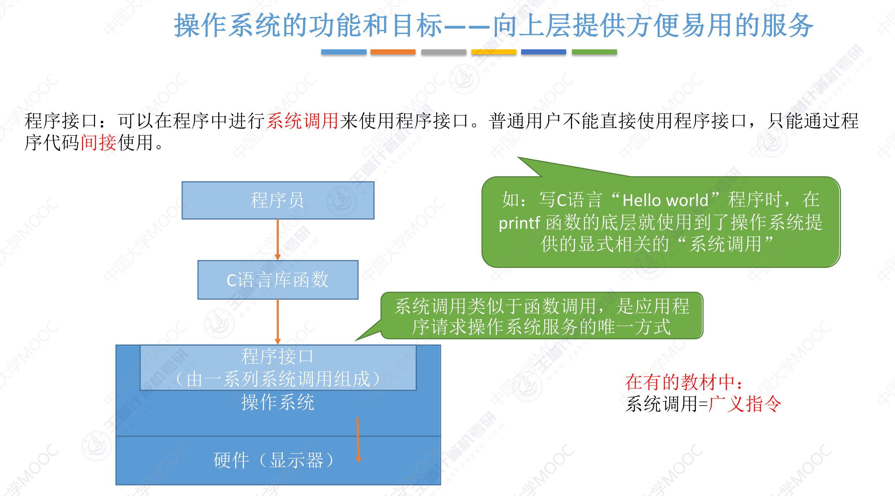

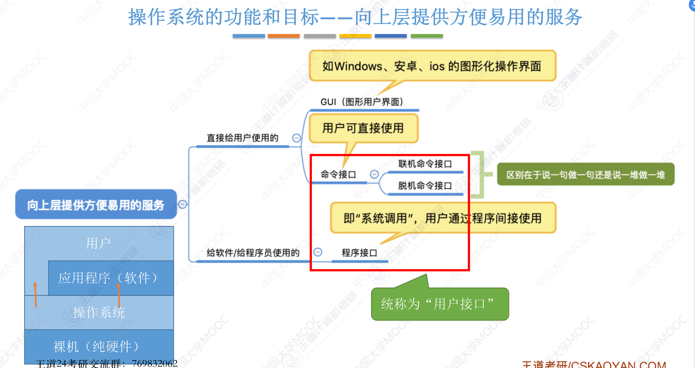

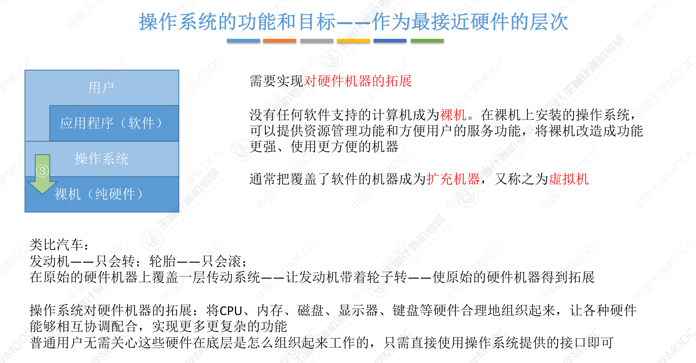

#### 操作系统要做什么

- 执行一个程序前，需要将该程序放到内存中
- 以QQ为例
  - 逐层打开文件夹，找到可执行文件的存放位置
  - 该程序相关数据放入内存
  - 对应的进程被处理机（CPU处理）
  - 将设备分配给进程

### 操作系统的特征

- 并发、共享（两个最基本的特征，二者互为存在条件）、虚拟、异步

#### 并发

- 并发
  - 两个或多个事件在同一时间间隔内发生
  - 这些事件**在宏观上是同时发生**的，但**微观上是交替发生**的
- 并行
  - 两个或多个事件在同一时刻同时发生

- 操作系统的并发性
  - 计算机系统中“同时”运行着多个程序，这些程序宏观上看是同时运行着的，而微观上看是交替运行的
- 操作系统就是伴随着“多道程序技术”而出现的。因此，**操作系统和程序并发是一起诞生的**

- 注意：
  - 单核CPU同一时刻只能执行**一个程序**，多个程序只能**并发**地执行
  - 多核CPU同一时刻可以同时执行**多个程序**，多个程序可以**并行**地执行
- **并发性是操作系统一个最基本的特征**

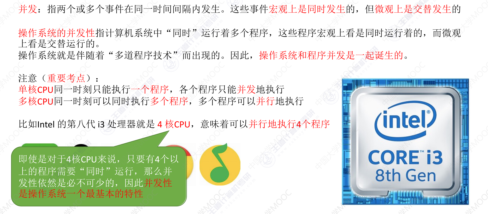

#### 共享

- **共享**即资源共享，是指系统中的资源可供内存中多个并发执行的进程共同使用
- 两种资源共享方式
  - 互斥共享方式
    - 系统中的某些资源，虽然可以提供给多个进程使用，但**一个时间段内只允许一个进程访问该资源**
    - 例如：使用QQ和微信视频。同一时间段内，摄像头只能分配给其中一个进程
  - 同时共享方式
    - 系统中的某些资源，**允许一个时间段内由多个进程“同时”对它们进行访问**
    - 所谓的“同时”往往是宏观上的，而在微观上，这些进程可能是交替地对该资源进行访问的（即分时共享）
    - 例如：使用QQ发送文件A，同时使用微信发送文件B。宏观上看，两边都在同时读取并发送文件，说明两个进程都在访问硬盘资源，从中读取数据。微观上看，两个进程是交替着访问硬盘的

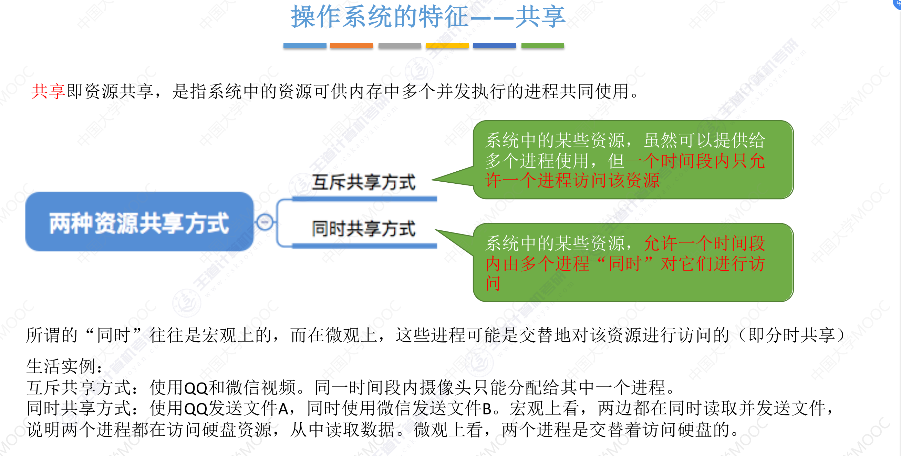

#### 并发和共享的关系

- **并发性**指计算机系统中同时存在着多个运行着的程序
- **共享性**是指系统中的资源可供内存中多个并发执行的进程共同使用

- 并发与共享的关系
  - 使用QQ发送文件A，同时使用微信发送文件B
    - 两个进程正在并发执行**（并发性）**
    - 需要共享地访问硬盘资源**（共享性）**
    - 如果失去并发性，则系统中只有一个程序正在运行，则共享性失去存在的意义
    - 如果失去共享性，则QQ和微信不能同时访问硬盘资源，就无法实现同时发送文件，也就无法并发

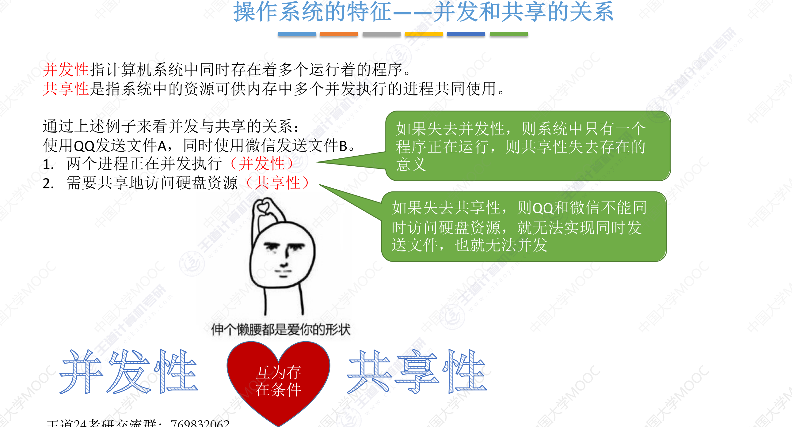

#### 虚拟

- 虚拟是指把一个物理上的实体变为若干个逻辑上的对应物
  - 物理实体（前者）是**实际存在**的
  - 逻辑上的对应物（后者）是**用户感受到**的
    - 例子：**空分复用技术**（虚拟存储器技术）、**时分复用技术**（微观上处理剂在各个微小的时间段内交替着为各个进程服务，**虚拟处理器技术**）
- 如果失去并发性，则一个时间段内系统中只能运行一道程序，那么就失去了实现虚拟性的意义
  - 没有并发性，就谈不上虚拟性

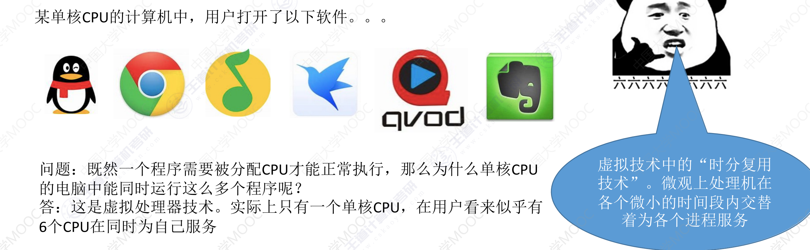
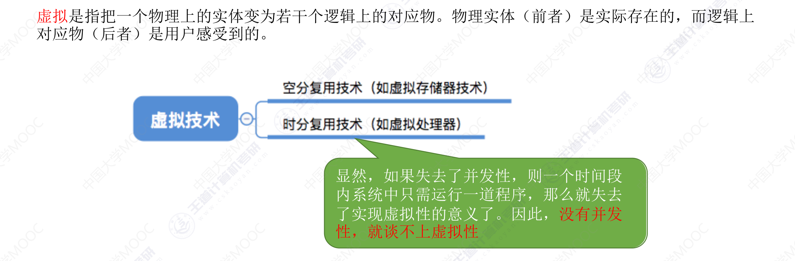

#### 异步

- 异步
  - 在多道程序环境下，允许多个程序并行执行
  - 但由于资源有限，进程的执行并不是一贯到底的，而是走走停停，以不可预知的速度向前推进
- 并发运行的程序会争抢着使用系统资源，而**系统中的资源有限**，因此进程的执行不是一贯到底的，有时候阻塞，有时候运行
- 如果失去并发性，系统只能串行地运行各个程序，那么所有程序的执行会一贯到底
- **只有系统拥有并发性，才有可能导致异步性**

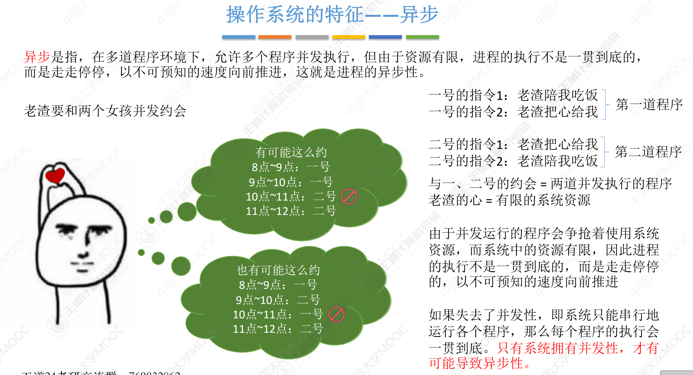

## 操作系统的发展历程

- 重点：各类操作系统主要想**解决的是什么问题**，各自的**优缺点**

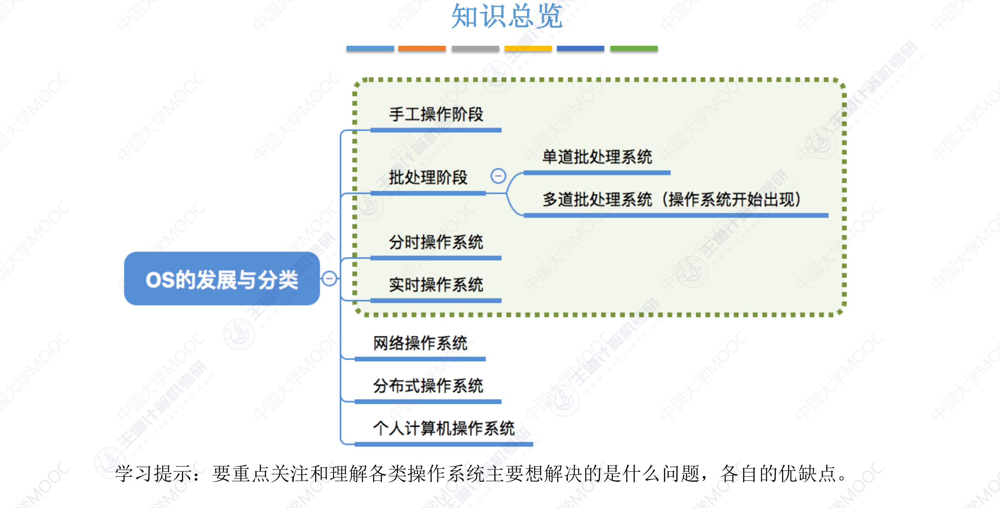

### 操作系统的发展和分类

#### 手工操作阶段

- 速度
  - 超慢
- 设备
  - 纸带机，输入输出速度慢
- 流程
  - 程序员将程序打在纸带机上，再将纸带机插入计算机运行计算
- 主要缺点
  - 用户独占全机
  - 人机速度矛盾导致资源利用率极低

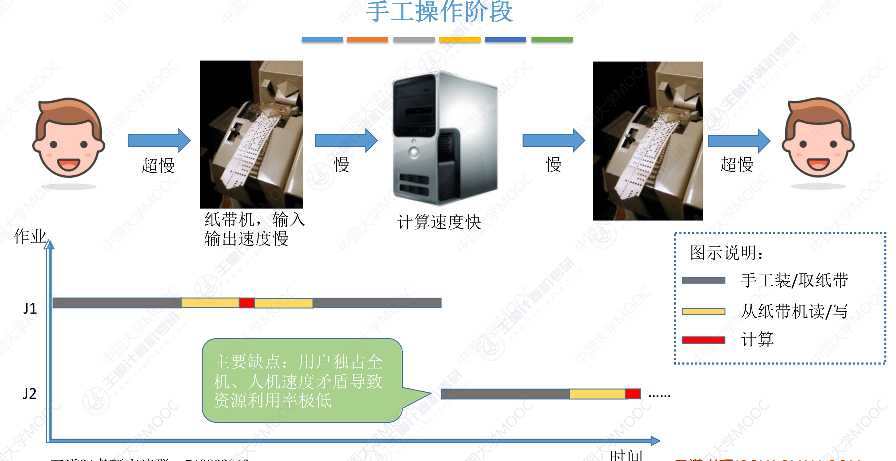

#### 批处理阶段

- 非剥夺调度方式
  - 只允许进程主动放弃处理机
  - 无法及时处理紧急任务
    - 如 FCFS 先来先服务、SJF 最短作业优先、HRRN 最高响应比优先算法

##### 单道批处理系统

- 速度

  - 磁带的读/写速度比纸带机快很多

- 设备

  - 磁带、外围机
  - 通过外围机把程序提前存到磁带里

- 流程

  - 引入**脱机输入/输出技术**（用外围机+磁带完成）

  - 由**监督程序**（操作系统的雏形）负责控制作业的输入、输出

- 主要缺点
  - **内存中仅能有一道程序运行**，只有该程序运行结束之后才能调入下一道程序
  - **CPU有大量的时间是在空闲，等待 I/O 完成**
  - 资源利用率依然很低

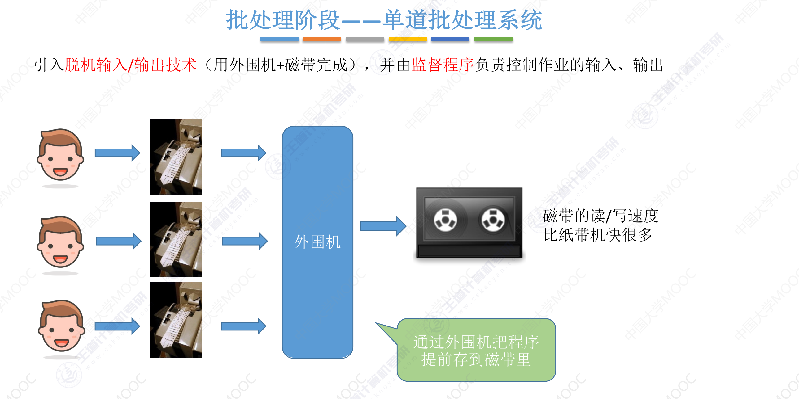

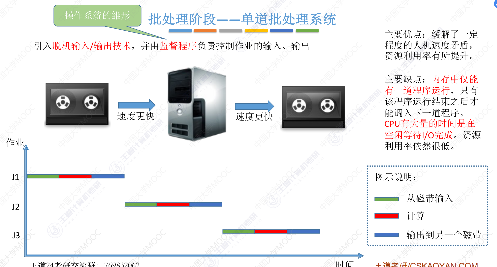

##### 多道批处理系统

- 特点
  - 多道程序设计技术
  - 每次往内存中读入多道程序，允许多个程序同时进入内存并允许它们在 CPU 中交替地运行，这些程序共享系统中的各种软/硬件资源
  - 操作系统正式诞生，用于支持多道程序并发运行

- 主要优点
  - 多道程序**并发执行**，**共享**计算机资源
  - **资源利用率大幅提升**，CPU和其他资源更能保持“忙碌”状态，系统吞吐量增大
- 主要缺点
  - 用户响应时间长
  - **没有人机交互功能**（用户提交自己的作业之后就只能等待计算机处理完成，中间不能控制自己的作业执行）
  - eg：无法调适程序/无法再程序运行过程中输入一些参数

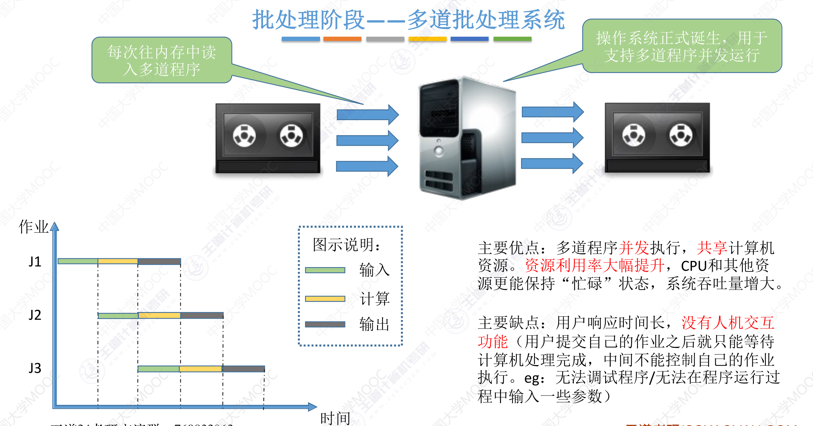

#### 分时操作系统

- 剥夺调度方式
  - 当一个进程正在处理机上执行时，如果有一个更重要或紧迫的进程需要使用处理机，则立即暂停正在执行的进程，将处理机分配给更重要紧迫的那个进程
  - 如时间片轮转算法（RR，Round-Robin）

- 计算机以**时间片**为单位**轮流为各个用户/作业服务**，各个用户可通过终端与计算机进行交互
- 主要优点
  - 用户请求可以被即时响应，**解决了人机交互问题**
  - 允许多个用户同时使用一台计算机
  - 用户对操作系统的操作相互独立，感受不到别人的存在
- 主要缺点
  - **不能优先处理一些紧急任务**
  - 操作系统对各个用户/作业都是完全公平的，循环地为每个用户/作业服务一个时间片，不区分任务的紧急性

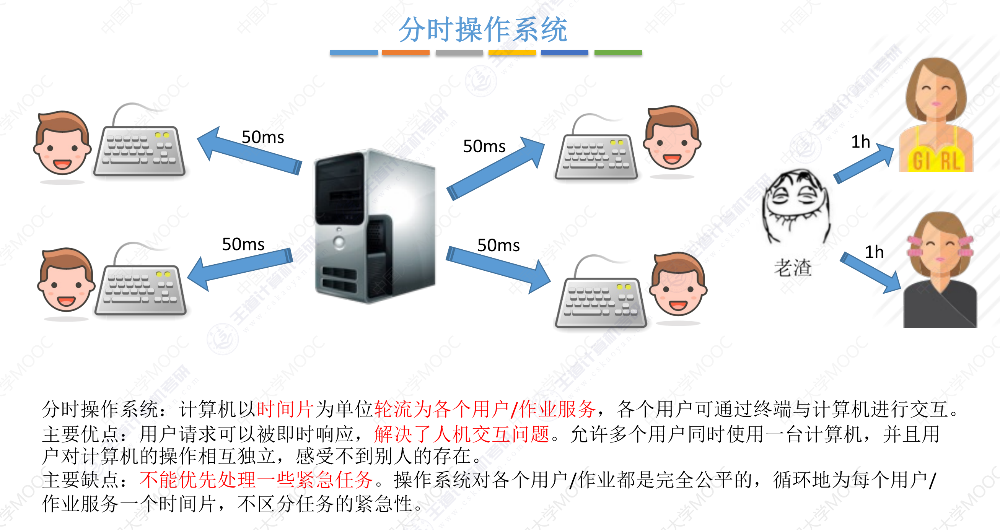

#### 实时操作系统

- 主要优点
  - 能够优先响应一些紧急任务，某些紧急任务不需时间片排队
- 在实时操作系统的控制下，计算机系统接收到外部信号后及时进行处理，并且**要在严格的时限内处理完事件**
- 主要特点
  - 及时性、可靠性

- 实时操作系统
  - 硬实时系统
    - 必须在绝对严格的规定时间内完成处理
    - eg：导弹控制系统，自动驾驶系统
  - 软实时系统
    - 能接受偶尔违反时间规定
    - eg：12306火车订票系统

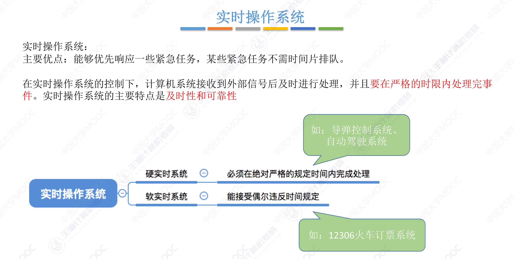

#### 网络操作系统和分布式操作系统

- 网络操作系统
  - 是伴随着计算机网络的发展而诞生的，能把网络中各个计算机有机地结合起来，实现数据传送等功能
  - **实现网络中各种资源等共享（如文件共享）和各台计算机之间的通信**
  - eg：Windows NT就是一种典型的网络操作系统，网站服务器就可以使用
- 分布式操作系统
  - 主要特点
    - **分布式和并行性**
  - 系统中的各台计算机地位相同，**任何工作都可以分布在这些计算机上，由它们并行、协同完成这个任务**

#### 个人计算机操作系统

- 个人计算机操作系统
  - Windows、MaxOS 方便个人使用

## 操作系统运行机制

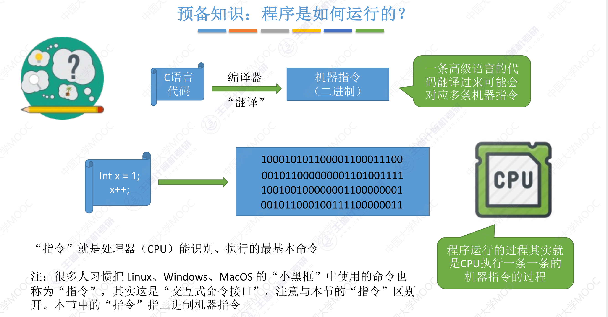

- 程序的运行机制
  - C语言代码  通过编译器的“翻译”  会变成计算机能看懂的二进制机器指令
    - 一条高级语言的代码翻译过来可能会对应多条机器指令
  - 程序执行的过程就是CPU执行一条一条的机器指令的过程
  - **在CPU设计和生产的时候就划分了特权指令和非特权指令**，因此CPU执行一条指令前就能判断出其类型
- “指令”是处理器CPU能识别、执行的最基本命令
- CPU能判断出指令类型，但它怎么区分此时正在运行的是内核程序 or 应用程序？
  - CPU有两种状态，**“内核态”和“用户态”**
  - 处于内核态时，说明此时**正在运行的是内核程序**，此时**可以执行特权指令**
  - 处于用户态时，说明此时**正在运行的是应用程序**，此时**只能执行非特权指令**
    - CPU中有一个寄存器叫 程序状态字寄存器（PSW），其中有个二进制位
    - 1 表示“内核态”
    - 0 表示”用户态“
- 切换状态
  - 刚开机时，CPU为“内核态”，操作系统先上CPU运行
  - 开机完成后，用户可以启动某个应用程序
  - 操作系统内核程序会在合适的时候主动让出CPU，让该应用程序上CPU运行
    - 操作系统内核在让出CPU之前，会**用一条特权指令把PSW的标志位设置为用户态**
  - 应用程序运行在用户态
  - 假如：此时一个黑客在应用程序中植入了一条特殊指令，企图破坏系统
  - CPU发现接下来要执行的这条指令时特权指令，但是自己又处于“用户态”
  - 这个非法事件会引发一个**中断信号**
    - **CPU监测到中断信号后**，会立即**变为“核心态”**，并停止运行当前的应用程序，转而运行处理终端信号的内核程序
  - “中断”使操作系统再次夺回CPU的控制权
  - 操作系统会对引发中断的事件进行处理，处理完了再把CPU使用权交给别的应用程序
- 如何切换
  - **内核态->用户态**
    - 执行一条**特权指令——修改PSW的标志位为“用户态”**，这个动作意味着操作系统将主动让出CPU使用权
  - **用户态->内核态**
    - 由**“中断”**引发，硬件**自动完成变态过程**，触发中断信号意味着操作系统将强行夺回CPU的使用权
      - 除了非法使用特权指令之外，还有很多事件会触发中断信号
      - 一个共性：**但凡需要操作系统介入的地方，都会触发中断信号**

### CPU 指令级别（后面的知识）

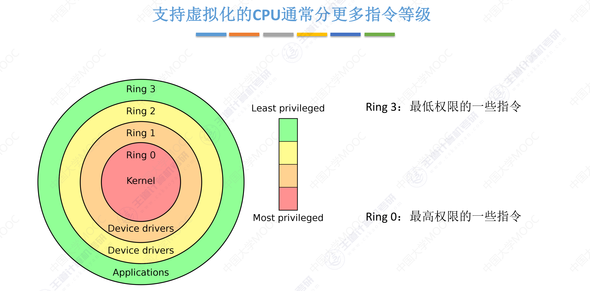

- 支持虚拟化的 CPU 通常分更多指令等级
  - Ring 0 ~ Ring 3，数字越大权限越低

### 两种程序

#### 内核程序

- 负责实现操作系统的“内核程序”
- 由很多内核程序组成了“**操作系统内核**”，或简称“内核（kernel）”
- 内核是操作系统最重要最核心的部分，也是**最接近硬件的部分**
  - 一个操作系统甚至只要有内核就够了
  - eg：Docker ->仅需Linux内核
- 操作系统的功能未必都在内核中，如图形化用户界面GUI
- 操作系统内核作为“管理者”，有时会让CPU执行一些“特权指令”
  - 如：内存清零指令
  - 这些指令影响重大，只允许“管理者”——即操作系统内核来使用

#### 应用程序

- 普通程序员写的程序

- 应用程序只能使用“非特权指令”
  - 如：加法指令、减法指令等

### 两种指令

- 程序执行的过程就是CPU执行一条一条的机器指令的过程

- **在CPU设计和生产的时候就划分了特权指令和非特权指令**，因此CPU执行一条指令前就能判断出其类型

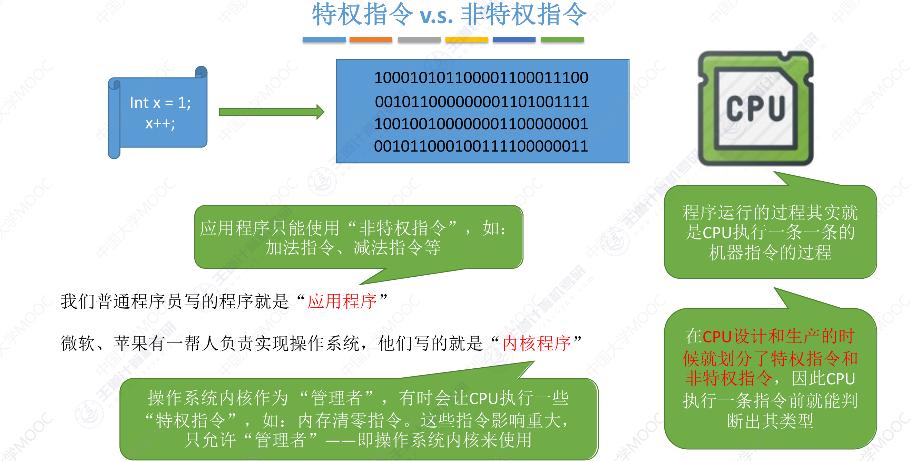

#### 特权指令

- 操作系统内核程序才能够发出特权指令
- 操作系统可以发出特权指令把PSW的标志位设置为用户态，让CPU处于“用户态”

#### 非特权指令

- 应用程序只能发出非特权指令
  - 加法指令、乘法指令等

### 两种处理器状态

CPU能判断出指令类型，但它怎么区分此时正在运行的是内核程序 or 应用程序？

- CPU有两种状态，**“内核态”和“用户态”**
- 处于内核态时，说明此时**正在运行的是内核程序**，此时**可以执行特权指令**
- 处于用户态时，说明此时**正在运行的是应用程序**，此时**只能执行非特权指令**
  - CPU中有一个寄存器叫 程序状态字寄存器（PSW），其中有个二进制位
  - 1 表示“内核态”
  - 0 表示”用户态“

- 切换状态
  - 刚开机时，CPU为“内核态”，操作系统先上CPU运行
  - 开机完成后，用户可以启动某个应用程序
  - 操作系统内核程序会在合适的时候主动让出CPU，让该应用程序上CPU运行
    - 操作系统内核在让出CPU之前，会**用一条特权指令把PSW的标志位设置为用户态**
  - 应用程序运行在用户态
  - 假如：此时一个黑客在应用程序中植入了一条特殊指令，企图破坏系统
  - CPU发现接下来要执行的这条指令时特权指令，但是自己又处于“用户态”
  - 这个非法事件会引发一个**中断信号**
    - **CPU监测到中断信号后**，会立即**变为“核心态”**，并停止运行当前的应用程序，转而运行处理终端信号的内核程序
  - “中断”使操作系统再次夺回CPU的控制权
  - 操作系统会对引发中断的事件进行处理，处理完了再把CPU使用权交给别的应用程序
- 如何切换
  - **内核态->用户态**
    - 执行一条**特权指令——修改PSW的标志位为“用户态”**，这个动作意味着操作系统将主动让出CPU使用权
  - **用户态->内核态**
    - 由**“中断”**引发，硬件**自动完成变态过程**，触发中断信号意味着操作系统将强行夺回CPU的使用权
      - 除了非法使用特权指令之外，还有很多事件会触发中断信号
      - 一个共性：**但凡需要操作系统介入的地方，都会触发中断信号**

#### 内核态（核心态、管态）

- 处于内核态时，说明此时**正在运行的是内核程序**，此时**可以执行特权指令**
- PSW = 1

#### 用户态（目态）

- 处于用户态时，说明此时**正在运行的是应用程序**，此时**只能执行非特权指令**
- PSW = 0

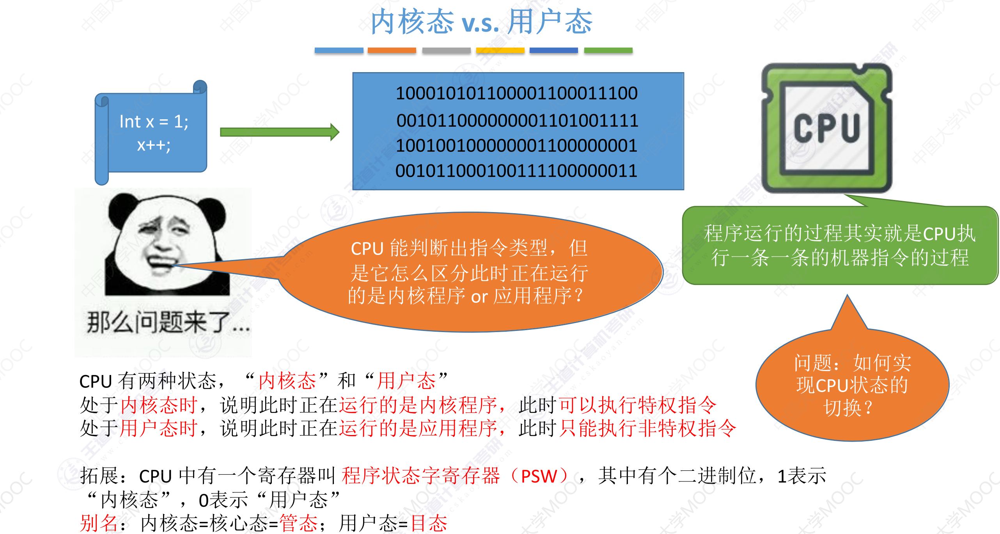

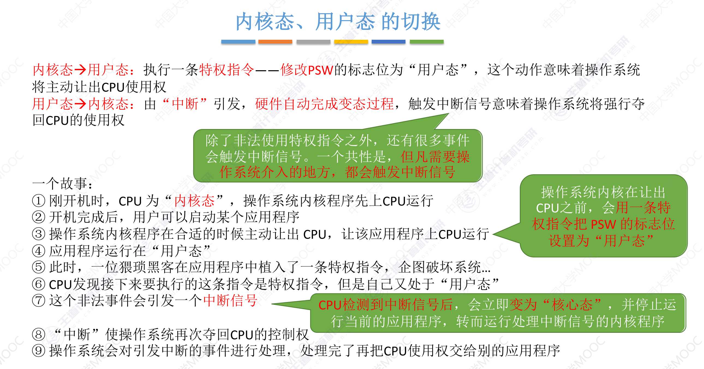

### 中断

#### 中断的作用

- 作用
  - 使CPU由用户态变为内核态，使操作系统重新夺回对CPU的控制权

- CPU上会运行两种程序
  - 操作系统内核程序——整个系统的管理者
  - 应用程序
- 在合适的情况下，操作系统内核会把CPU的使用权主动让给应用程序
- “中断”是**让操作系统内核夺回CPU使用权的唯一途径**
  - 如果没有“中断”机制，那么一旦应用程序上CPU运行，CPU就会一直运行这个应用程序
  - 没有中断，也就没有操作系统的并发，没有操作系统
- 状态转化
  - 内核态->用户态：执行一条**特权指令——修改PSW**的标志位为“用户态”，这个动作意味着操作系统将主动让出CPU使用权
  - 用户态->内核态：由**中断**引发，**硬件自动完成变态过程**，触发中断信号意味着操作系统将强行夺回 CPU 的使用权
    - 可以通过**陷入指令**引发内部中断信号

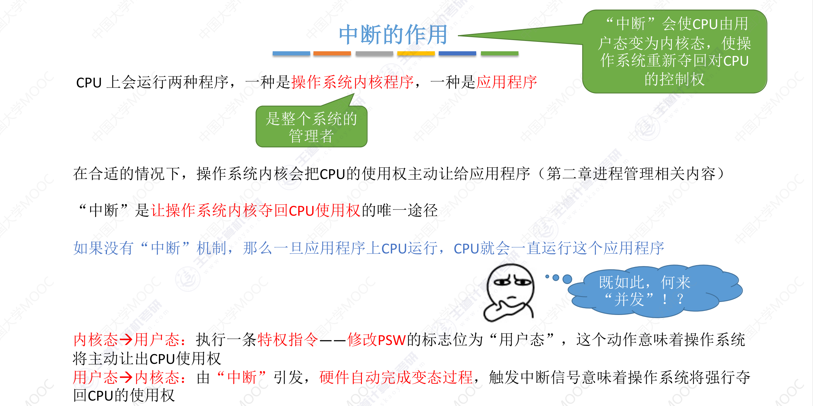

#### 中断的类型

- 异常
  - 内中断、例外
  - 分类
    - 陷阱、陷入
      - 由陷入指令引起，是应用程序故意引发的
    - 故障
      - 由错误条件引起，可能被内核程序修复
      - 内核程序修复故障后会把 CPU 使用权还给应用程序，让它继续执行下去
      - 如：缺页故障
    - 终止
      - 由致命错误引起，内核程序无法修复该错误
      - 因此一般不再将 CPU 使用权还给引发终止的应用程序，而是直接终止该应用程序
      - 如：整数除 0、非法使用特权指令

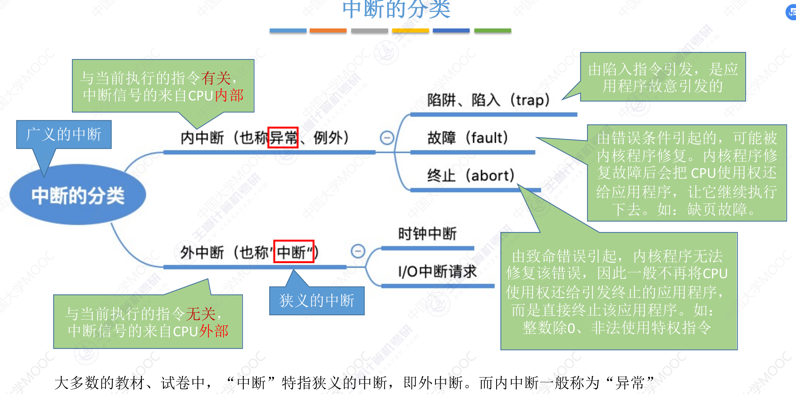

##### 内中断（异常）

- 与当前执行的指令有关
- 中断信号来源于 CPU 内部
- 触发事件
  - 当前执行的指令是非法的

- 例子
  - 试图在用户态下执行特权指令
  - 执行除法指令时发现除数为 0
  - 应用系统想请求操作系统内核的服务，此时会执行一条**特殊的指令——陷入指令**，该指令会引发一个内部中断信号
    - 执行陷入指令，意味着应用程序主动地将 CPU 控制权还给操作系统内核
    - 系统调用就是通过陷入指令完成的

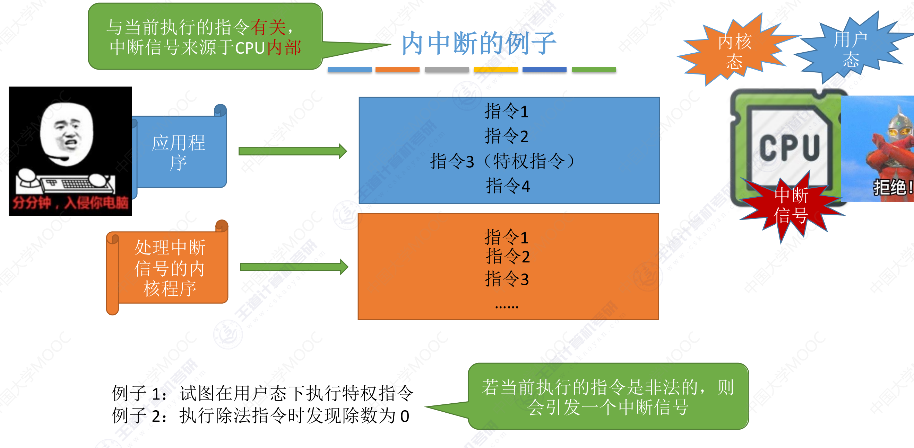
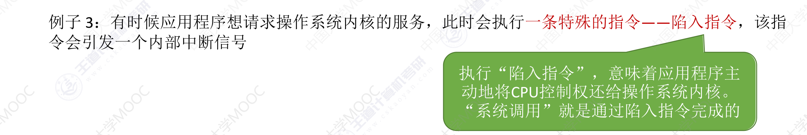

##### 外中断

- 与当前执行的指令无关

- 中断信号来源于 CPU 外部

- 例子

  - 时钟中断
    - 时钟部件每隔一个时间片（如 50ms）会给 CPU 发送一个时钟中断信号
    - CPU 从用户态切换回内核态，执行处理时钟中断的内核程序
    - 操作系统内核决定接下来让另一个应用程序上 CPU 运行

  - I/O 中断
    - 由输入/输出设备发来的中断信号
    - 当输入输出任务完成时，向 CPU 发送中断信号
    - CPU 从用户态切回内核态，执行处理 I/O中断的内核程序

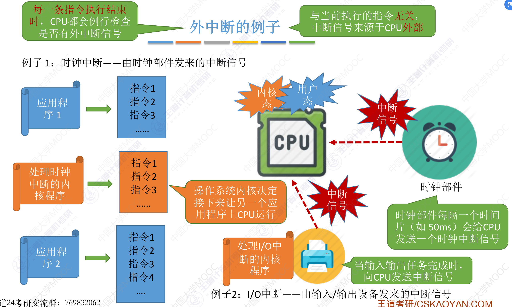

#### 中断机制的基本原理

- 检查中断信号

  - 内中断：**CPU 在执行指令时会检查是否有异常发生**
  - 外中断：**每个指令周期末尾，CPU 都会检查是否有外中断信号需要处理**

- 找到相应的中断处理程序

  - 不同的中断信号，需要不同的中断处理程序来处理

  - 当 CPU 检测到中断信号后，会根据中断信号的类型去查询“中断向量表”

  - 以此来找到相应的中断处理程序在内存中的存放位置

- 显然，中断处理程序一定是内核程序，需要运行在“内核态”

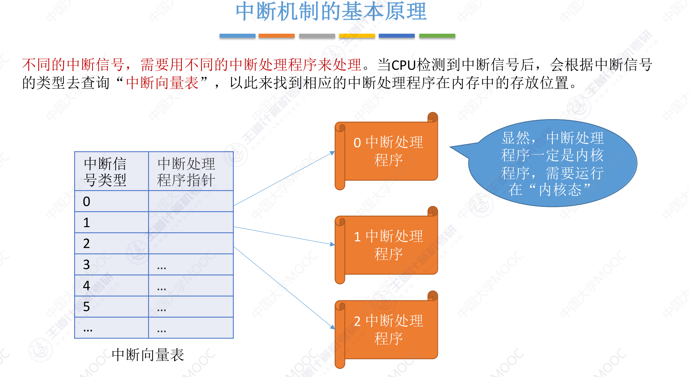

### 系统调用

#### 什么是系统调用

- 操作系统作为用户和计算机硬件之间的接口，需要向上提供一些简单易用的接口。
  - 命令接口：联机命令接口、脱机命令接口
  - 程序接口：一组**程序调用**组成

- 系统调用时操作系统提供给应用程序（程序员/编程人员）使用的接口
  - 一种可供应用程序调用的特殊函数
  - **应用程序可以通过系统调用来请求获得操作系统内核的服务**

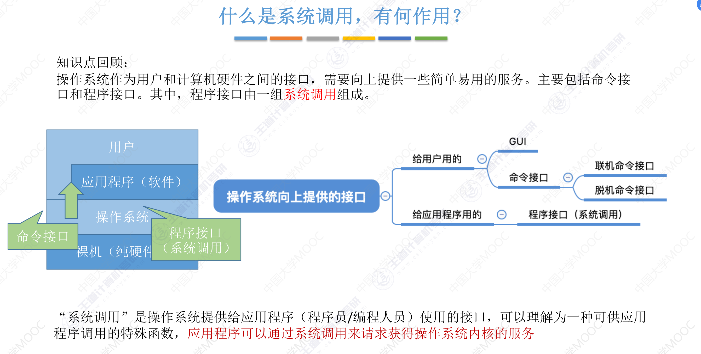

#### 系统调用与库函数的区别

- 裸机
- 操作系统：向上提供系统调用，使得上层程序能请求内核的服务
- 编程语言：向上提供库函数。有时会将系统调用封装成库函数，以隐藏系统调用的一些细节，使程序员编程更加方便
- 普通应用程序：可直接进行系统调用，也可以使用库函数
  - 有些库函数涉及系统调用，有些不涉及
    - 不涉及：取绝对值的函数
    - 涉及：创建文件的函数

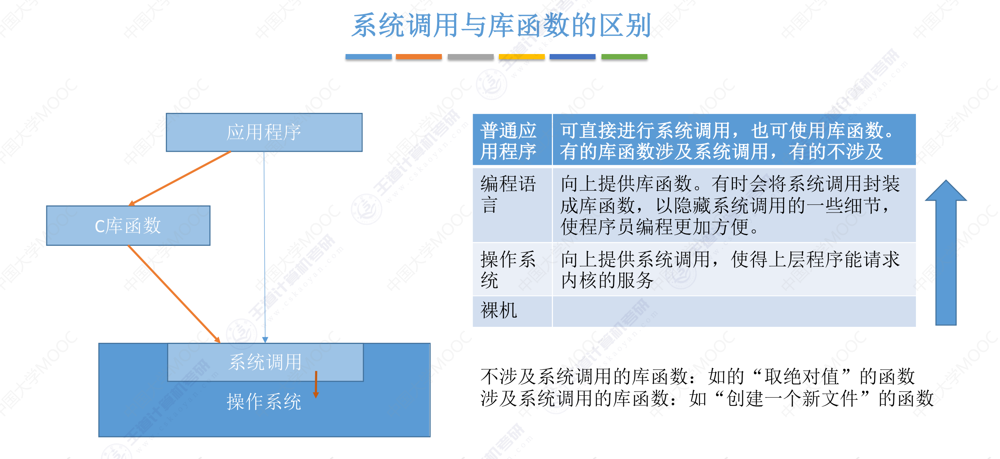

#### 系统调用的必要性

- 两个进程并发执行，如果都共用统一计算机资源，可能会导致错误
  - 解决方法
    - 由操作系统内核对共享资源进行统一的管理，并向上提供“系统调用”
    - 用户进程想要使用打印机这种共享资源，只能通过系统调用向操作系统内核发出请求
    - 内核会对各个请求进行协调处理

#### 什么功能需要系统调用实现

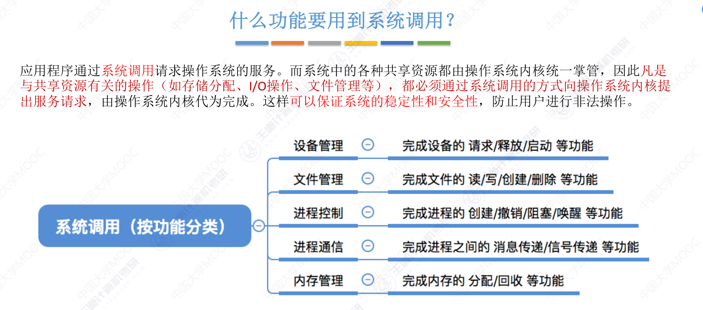

- 应用程序通过**系统调用**请求操作系统的服务
  - 系统中的各种共享资源都由操作系统内核统一掌控
  
  - **凡是与共享资源有关的操作——存储分配、I/O操作、文件管理，都必须通过系统调用的方式向操作系统内核提出服务请求**，由操作系统内核代为完成
  
  - 可以**保证系统的稳定性和安全性**，防止用户进行非法操作
  
- 系统调用（按功能分类）
  - 设备管理
    - 完成设备的 请求/释放/启动等功能
  
  - 文件管理
  
    - 完成文件的 读/写/创建/删除 等功能
  
  - 进程控制
    - 完成进程的 创建/销毁/阻塞/删除/唤醒 等功能
  - 进程通信
    - 完成进程之间的 消息传递/信号传递 等功能
  - 内存管理
    - 完成内存的 分配/回收 等功能
  

#### 系统调用过程

- **陷入指令**是在**用户态**执行的，执行陷入指令之后立即引发一个**内中断**，使 CPU **进入核心态**
- **发出系统调用请求是在用户态，对系统调用的相应处理是在核心态下进行**

- 应用程序调用
  - 应用程序需要请求系统调用的时候，会执行“陷入指令”制造中断
  - CPU收到 由陷入指令造成的中断信号 从用户态转到内核态，并且转入**相应的中断处理程序** ——系统调用的入口程序
  - 系统调用入口程序会根据寄存器中的参数判断用户需要哪种系统调用服务
  - 然后进行相应系统调用服务

- 高级语言代码调用
  - 代码中 调用库函数（该库函数内部封装了系统调用的复杂细节）
  - 编译成机器语言指令（运行在用户态）
    - 前期处理相关指令
    - 传参指令（将系统调用需要的参数放到某些通用寄存器中）
    - 陷入指令（trap 指令/访管指令）
      - 运行在核心态
      - 处理系统调用的内核程序

    - 后续处理相关指令

- 流程
  - 传递系统调用参数
  - 执行陷入指令（用户态）
  - 执行相应的内请求核程序处理系统调用（核心态）
  - 返回应用程序

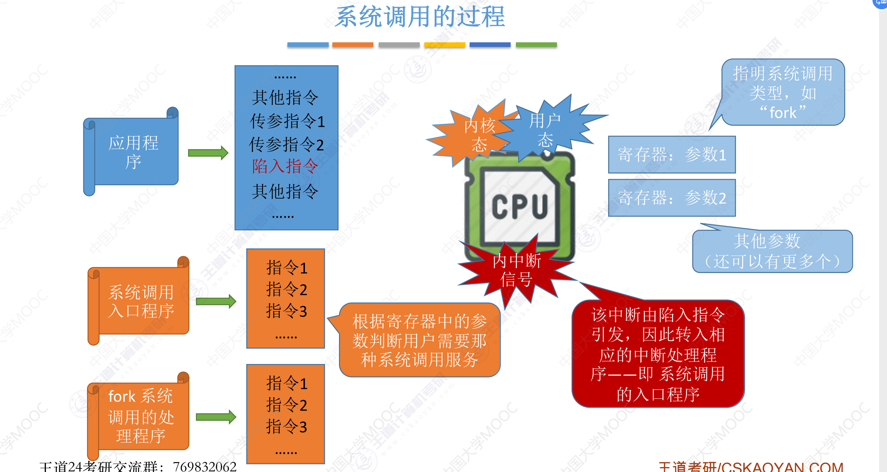

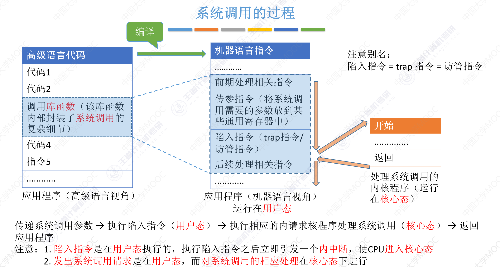

## 操作系统结构

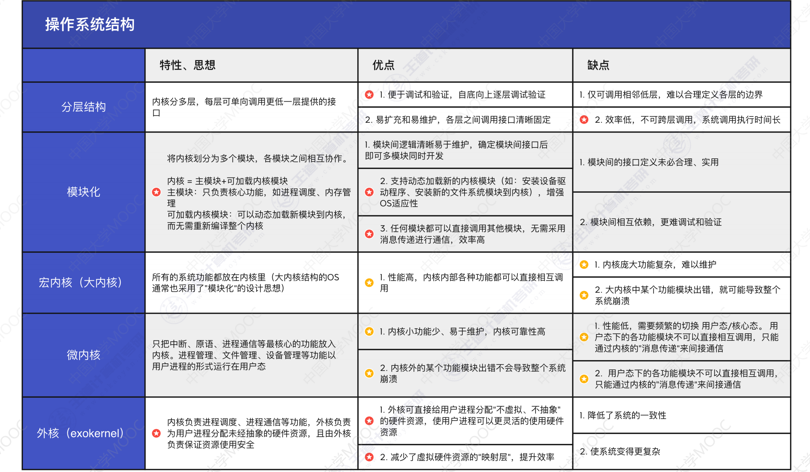

### 总结

- 宏内核
  - 特性、思想
    - 所有系统功能都放在内核里（大内核结构的 OS 通常也采用了模块化的设计思想）
  - 优点
    - 性能高，内核内部各种功能都可以直接相互调用
  - 缺点
    - 内核庞大功能复杂，难以维护
    - 大内核中某个功能模块出错，就可能导致整个系统大崩溃
- 微内核
  - 特性、思想
    - 只把中断、原语、进程通信等最核心的功能放入内核
    - 进程管理、文件管理、设备管理等功能以用户进程的形式运行在用户态
  - 优点
    - 内核小功能少，易于维护，内核可靠性高
    - 内核外的某个功能模块出错不会导致整个系统崩溃
- 分层结构
  - 特性、思想
    - 内核分多层，每一层可单向调用更低一层提供的接口
  - 优点
    - 便于调试和验证，自底向上逐层调试验证
    - 易扩充和易维护，各层之间调用接口清晰固定
  - 缺点
    - 仅可调用相邻低层，难以合理定义各层的便捷
    - 效率低，不可跨层调用，系统调用执行时间长
- 模块化
  - 特性、思想
    - 将内核划分为多个模块，各模块之间相互协作
    - 内核 = 主模块 + 可加载内核模块
    - 主模块：只负责核心功能，如进程调度、内存管理
    - 可加载内核模块：可以动态加载新模块到内核，而无需重新编译整个内核
  - 优点
    - 模块间逻辑清晰易于维护，确定模块间接口后即可多模块同时开发
    - 支持动态加载新的内存模块：如安装设备驱动程序、安装新的文件系统模块到内核，增强 OS 适应性
    - 任何模块都可以直接调用其他模块，无需采用消息传递进行通信，效率高
  - 缺点
    - 模块间的接口定义未必合理、实用
    - 模块间相互依赖，更难调试和验证
- 外核
  - 特性、思想
    - 内核负责进程调度、进程通信等功能
    - 外核负责为用户进程分配未经抽象的硬件资源，且由外核负责保证资源使用安全
  - 优点
    - 外核可直接给用户进程分配“不虚拟、不抽象”的硬件资源，使用户进程可以更灵活的使用硬件资源
    - 减少了虚拟硬件资源的“映射层”，提升效率
  - 缺点
    - 降低了系统的一致性
    - 使系统变得更复杂

### 内核

- **内核是操作系统最基本最核心的部分**
- 实现操作系统内核功能的那些程序就是内核程序

- 操作系统
  - 内核功能：
    - 进程管理、存储器管理、设备管理：**对系统资源进行管理的功能**
      - 更多的是对数据结构的操作，不会直接涉及到硬件
    - 时钟管理、中断处理、原语（设备驱动、CPU 切换）：**与硬件关联较为紧密的模块**
      - 时钟管理：利用时钟中断实现**计时功能**
      - 中断处理：负责实现中断机制
      - 原语
        - 是一种特殊的程序
        - 处于操作系统最底层，是最接近硬件的部分
        - 具有原子性——运行必须一气呵成，不可被“中断”
        - 运行时间较短、调用频繁
  - 非内核功能
    - GUI

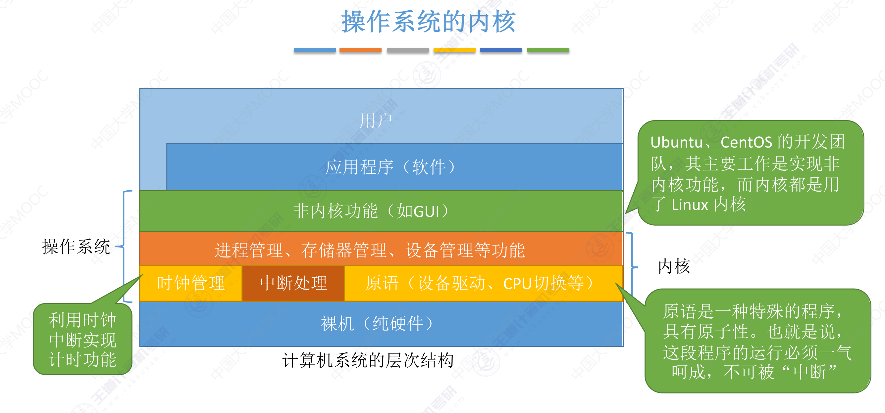

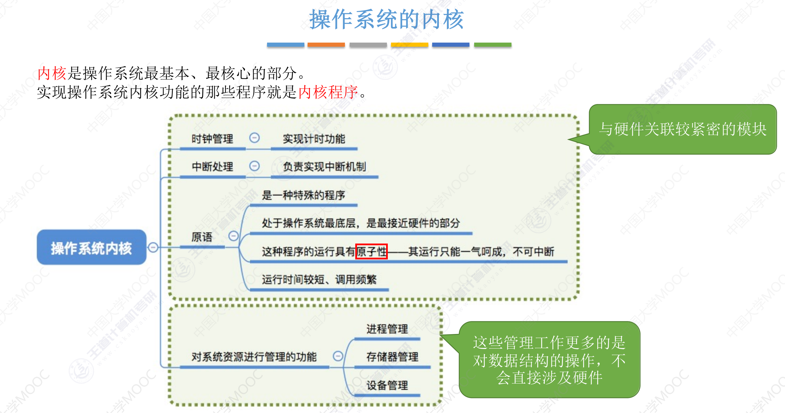

#### 大内核（宏内核/单内核）

- 大内核
  - 功能
    - 进程管理、存储器管理、设备管理等功能
    - 时钟处理、中断处理、原语等功能
  - 将操作系统的主要功能模块都作为系统内核，运行在核心态
  - 优点
    - 高性能，需要 CPU 状态转换的次数较少
  - 缺点
    - 内核代码庞大，结构混乱，难以维护
  - 典型的大内核操作系统：Linux、UNIX
- 微内核中
  - 只有 时钟处理、中断处理、原语等功能
  - 优点
    - 内核功能少，结构清晰，方便维护
  - 缺点
    - 需要频繁地在核心态和用户态之间切换，性能低
  - 典型的微内核操作系统：Windows NT
- 变态的过程是有成本的，要消耗不少时间，频繁的变态会降低系统性能

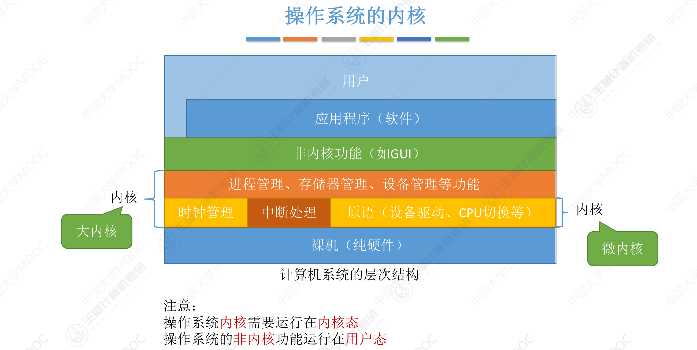

#### 微内核

- 宏内核
  - 特性、思想
    - 所有系统功能都放在内核里（大内核结构的 OS 通常也采用了模块化的设计思想）
  - 优点
    - 性能高，内核内部各种功能都可以直接相互调用
  - 缺点
    - 内核庞大功能复杂，难以维护
    - 大内核中某个功能模块出错，就可能导致整个系统大崩溃
- 微内核
  - 特性、思想
    - 只把中断、原语、进程通信等最核心的功能放入内核
    - 进程管理、文件管理、设备管理等功能以用户进程的形式运行在用户态
  - 优点
    - 内核小功能少，易于维护，内核可靠性高
    - 内核外的某个功能模块出错不会导致整个系统崩溃

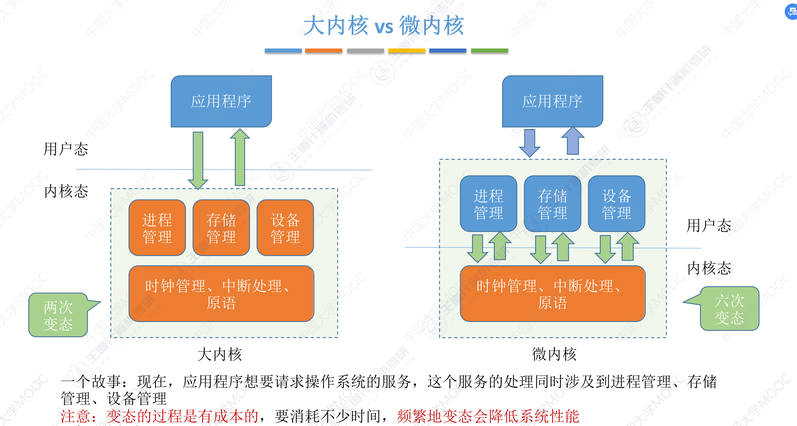

### 分层结构

- 考点：考察简单的选择题，了解各种体系结构的特性，了解各自的优缺点

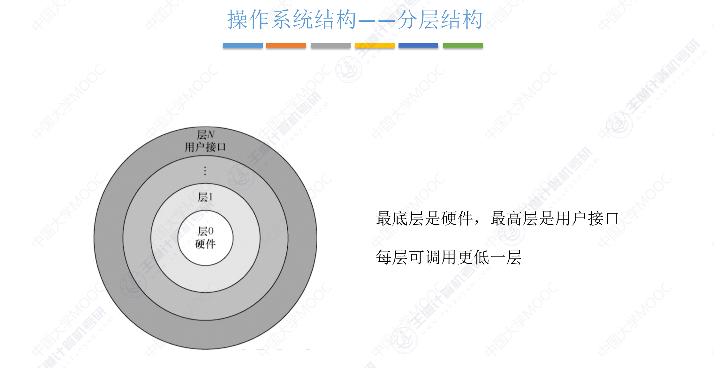

- 最底层是硬件，最高层是用户接口
- 每层可调用更低一层

- 特性、思想
  - 内核分多层，每一层可单向调用更低一层提供的接口
- 优点
  - 便于调试和验证，自底向上逐层调试验证
  - 易扩充和易维护，各层之间调用接口清晰固定
- 缺点
  - 仅可调用相邻低层，难以合理定义各层的便捷
    - 进程管理有时候会调用内存管理
    - 内存管理有时候也会调用 进程管理
  - 效率低，不可跨层调用，系统调用执行时间长
    - 最高层要想调用最底层，需要层层调用

### 模块化

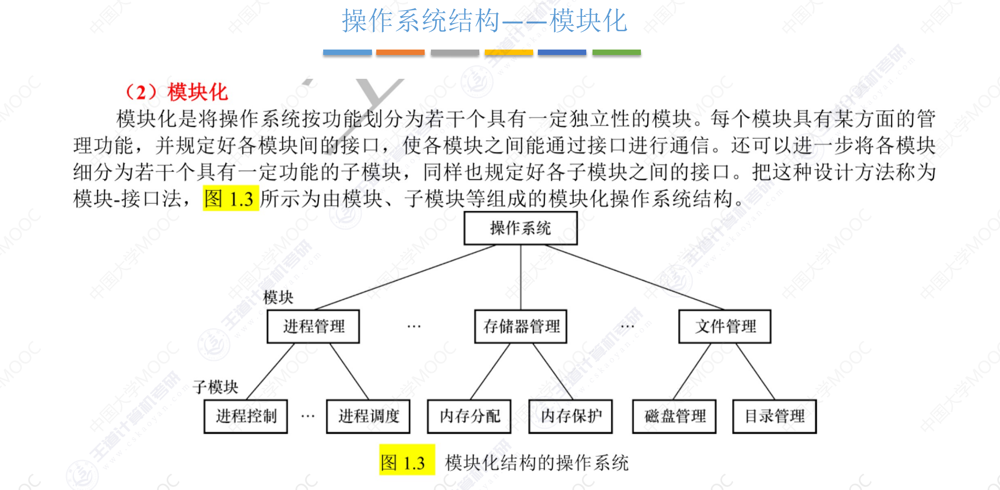

- 特性、思想
  - 将内核划分为多个模块，各模块之间相互协作
  - 内核 = 主模块 + 可加载内核模块
  - 主模块：只负责核心功能，如进程调度、内存管理
  - 可加载内核模块：可以动态加载新模块到内核，而无需重新编译整个内核
- 优点
  - 模块间逻辑清晰易于维护，确定模块间接口后即可多模块同时开发
  - 支持动态加载新的内存模块：如安装设备驱动程序、安装新的文件系统模块到内核，增强 OS 适应性
  - 任何模块都可以直接调用其他模块，无需采用消息传递进行通信，效率高
- 缺点
  - 模块间的接口定义未必合理、实用
  - 模块间相互依赖，更难调试和验证

### 外核

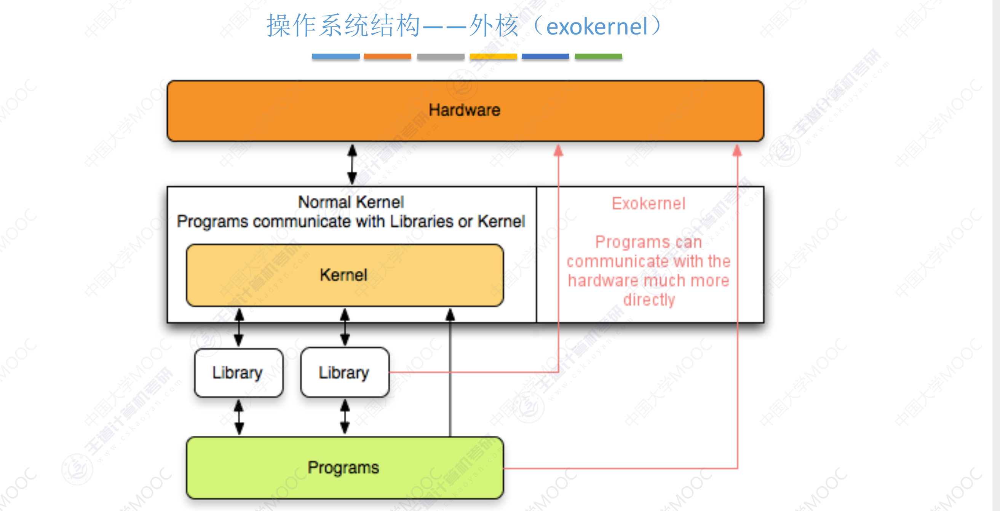

- 特性、思想
  - 内核负责进程调度、进程通信等功能
  - 外核负责为用户进程分配**未经抽象的硬件资源**（连续的内存和外存存储空间），且由外核负责保证资源使用安全
- 优点
  - 外核可直接给用户进程分配“不虚拟、不抽象”的硬件资源，使用户进程可以更灵活的使用硬件资源
  - 减少了虚拟硬件资源的“映射层”，提升效率
- 缺点
  - 降低了系统的一致性
    - 情况增加：有些连续、有些不连续
  - 使系统变得更复杂

## 操作系统引导

### 定义

- 操作系统引导
  - 开机的时候，怎么让操作系统运行起来

#### 外存

- 一个空磁盘

- 安装操作系统之后

- 磁盘
  - 主引导记录（MBR）
    - 包含 磁盘引导程序和分区表
  - C盘
    - 是这个磁盘的**活动分区**，安装了操作系统
  - D、E、F 盘

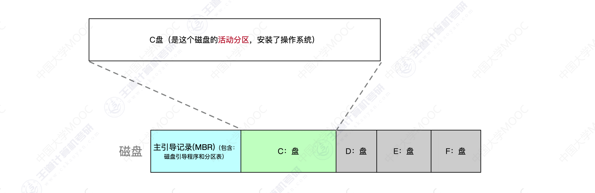

- C盘内容
  - 引导记录 PBR（负责找到“启动管理器”）
  - 根目录
  - 其他

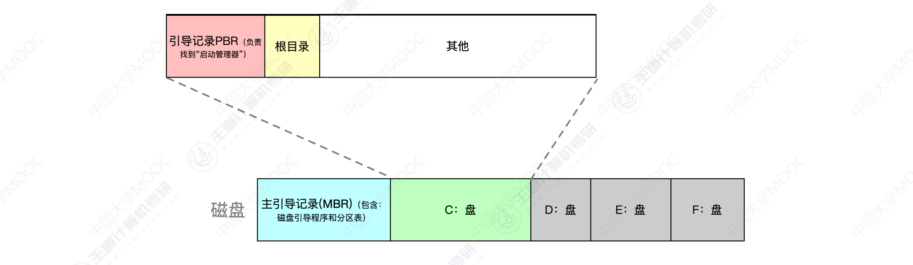

#### 内存

- 操作系统引导开机过程
- 内存
  - RAM：随机存取存储器（Random Access Memory），也叫主存，是与CPU直接交换数据的内部存储器。
    - RAM断电时将丢失其存储内容，故主要用于存储短时间使用的程序
  - ROM：只读内存(Read-Only Memory)，ROM所存数据，一般是装入整机前事先写好的，整机工作过程中**只能读出**，而不像RAM那样能快速地、方便地加以改写
    - 包含 BIOS，ROM 引导程序，即自荐程序
    - 即使计算机关闭，ROM也会保留其内容。ROM被称为非易失性

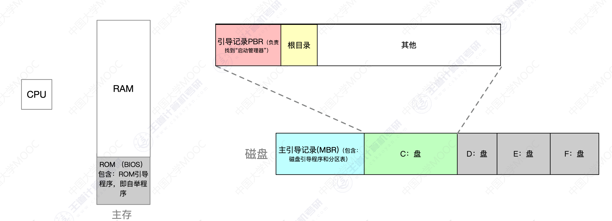

### 引导过程

- 操作系统引导
  - CPU 从一个特定主存地址开始，取指令，执行 ROM 中的引导程序（先进行**硬件自检**，在开机）
  - 将磁盘的第一块——主引导记录读入内存，执行磁盘引导程序，扫描分区块
  - 从活动分区（C 盘，又称主分区，即安装了操作系统的分区）读入分区引导记录，执行其中的程序
  - 从根目录下找到完整的操作系统初始化程序（即启动管理器）并执行，完成“开机”的一系列动作

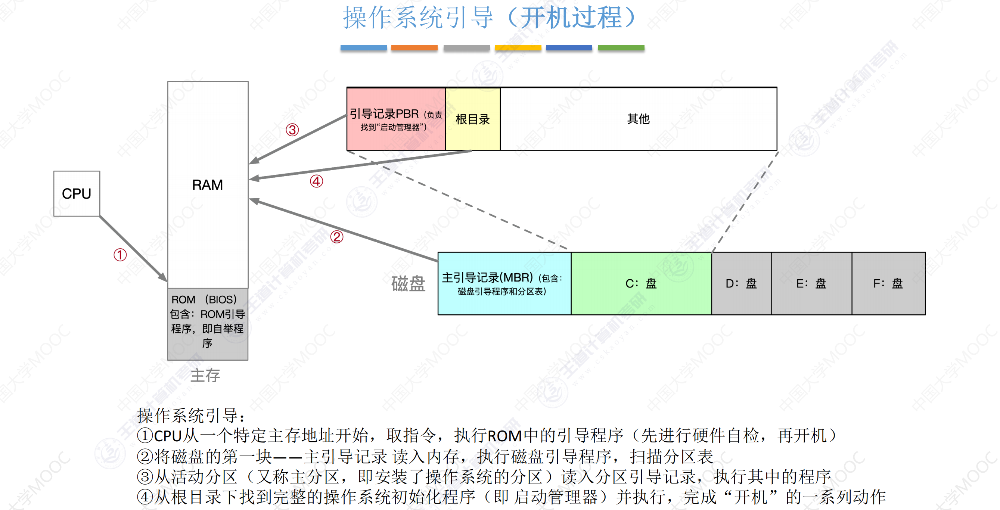

## 虚拟机

### 传统计算机的缺点

- 缺点

  - 一台物理机器上只能运行一个操作系统

  - 两个进程运行在同一个操作系统上可能会有安全隐患或者争夺系统资源

- 解决办法
  - 将其中一个应用迁移到其他操作系统上（物理机器/硬件的极大浪费）
  - 使用虚拟机

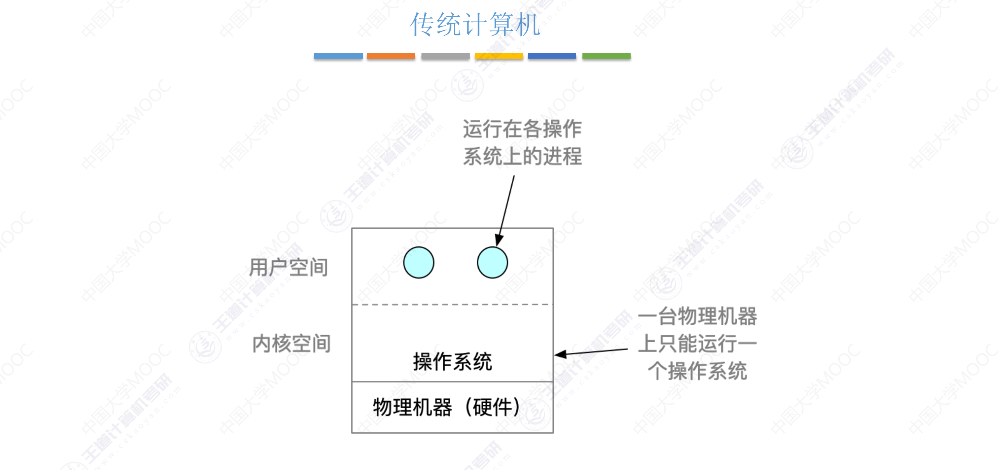

### 两类虚拟机

- 采用虚拟化技术，将一台物理机器虚拟化为多台虚拟机器（Virtual Machine, VM)，每个虚拟机器都可以独立运行一个操作系统

- 同义术语

  - 虚拟机管理程序、虚拟机监控程序、Virtual Machine Monitor(VMM)、Hypervisor

- 两类VMM

  - 直接运行在硬件上（裸金属架构）

    - 将一台物理机器虚拟化为多台虚拟机器，将总的物理资源划分为多个部分，分配给多个虚拟机使用
    - 每个虚拟机上可以安装不同的操作系统
    - 在每个操作系统上又可以运行各自的进程
      - 只有最深层的虚拟机管理程序是运行在内核态的，运行在它上面的操作系统都是用户态
        - 虚拟机上的操作系统认为自己运行在内核态（实际上不是）
        - 虚拟机上的用户进程认为自己运行在用户态（实际上确实是）
      - 当虚拟机上的操作系统想要执行特权指令，虚拟机管理程序会进行截获（虚拟机操作系统陷入虚拟机管理程序），然后做出相应的处理
        - 检查这条指令是由虚拟机中的操作系统执行的，安排这条指令功能的正确执行
        - 检查这条指令是虚拟机中用户程序执行的，模拟真实硬件面对用户态执行敏感指令时的行为
    - 对物理资源的控制权
      - 直接运行在硬件上，能直接控制和分配物理资源
    - 资源分配方式
      - 在安装 GuestOS 时，VMM 要在原本的硬盘上自行分配存储空间，类似于外核的分配方式，分配未经抽象的物理硬件
    - 性能
      - 更好
    - 可支持的虚拟机数量
      - 更多，不需要和 Host OS 竞争资源，相同的硬件资源可以支持更多的虚拟机
    - 虚拟机的可迁移性
      - 更差
    - 运行模式
      - 第一类 VMM 运行在最高特权级（Ring 0），可以执行最高特权的指令

  - 运行在宿主操作系统上（寄居架构）

    - 宿主操作系统运行在底层硬件上
    - 用户操作系统运行在虚拟机管理程序

    - 虚拟机管理程序很像一个普通进程，依赖于 Windows、Linux 等操作系统分配和调度资源
      - 伪装成具有 CPU 和各种设备的计算机
      - 只有VM 驱动（虚拟机驱动）是运行在内核态的，其他都运行在用户态
        - 当 GuestOS 中的用户进程想要进行系统调用
          - GuestOS 的操作系统不可以直接读写磁盘
          - 虚拟机管理程序截获特权指令
          - 代替用户进程向底层宿主操作系统发出请求
    - 对物理资源的控制权
      - 运行在 HostOS 上，依赖于 Host OS 为其分配物理资源
    - 资源分配方式
      - GuestOS 拥有自己的虚拟磁盘，该盘实际上是 Host OS 文件系统中的一个**大文件**
      - GuestOS 分配到的内存是虚拟内存
    - 性能
      - 性能更差，需要 HostOS 作为中介
    - 可支持的虚拟机数量
      - 更少，HostOS 本身需要使用物理资源，HostOS 上运行的其他进程也需要物理资源
    - 虚拟机的可迁移性
      - 更好，只需导出虚拟机镜像文件即可迁移到另一台 HostOS 上，商业化应用更广泛
    - 运行模式
      - 第二类 VMM 部分运行在用户态、部分运行在内核态
      - GuestOS 发出的系统调用会被 VMM 截获，并转化为 VMM 对 HostOS 的系统调用

 
