# 输入输出 I/O 管理

## 考点总结

## 知识总结

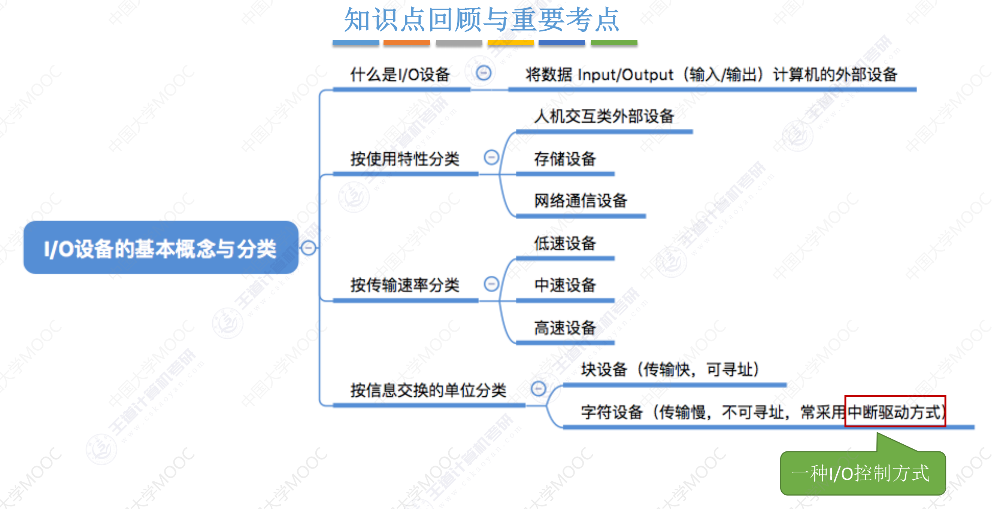

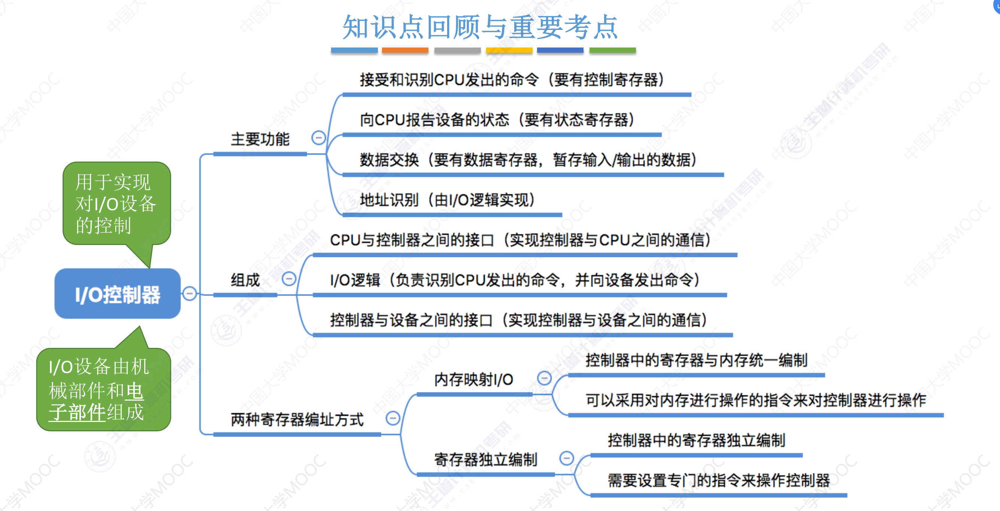

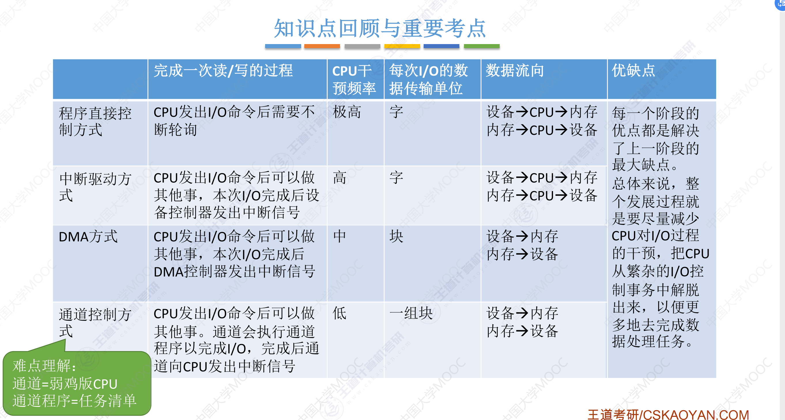

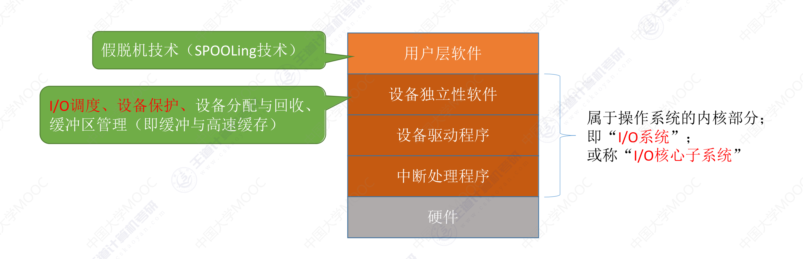

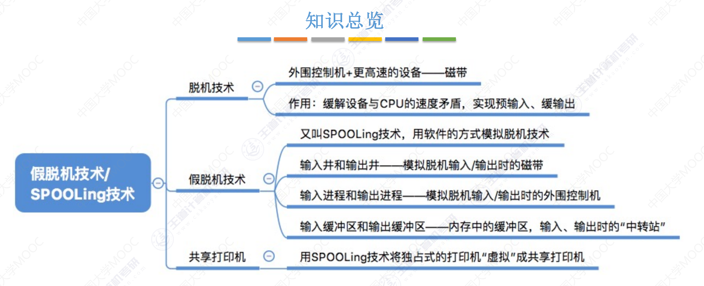

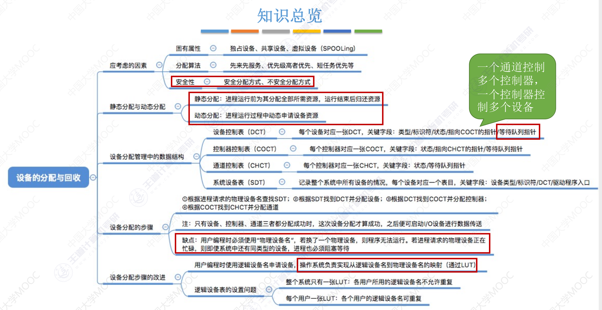

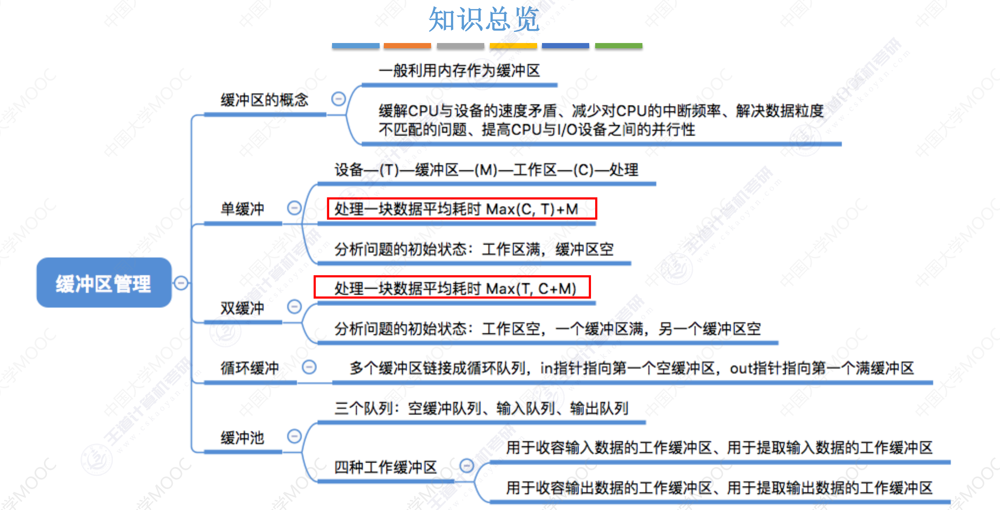

## I/O设备的基本概念和分类

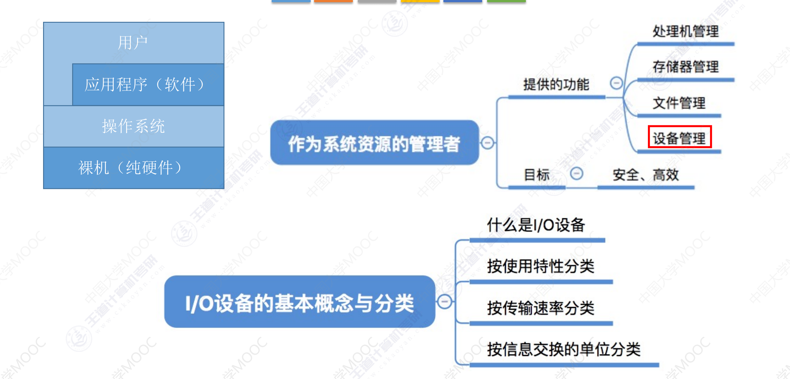

### 什么是 I/O 设备？

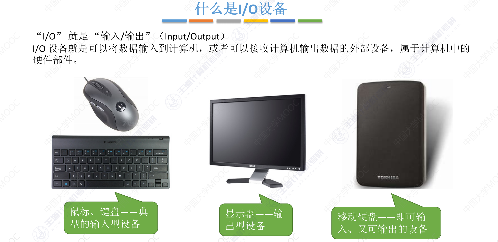
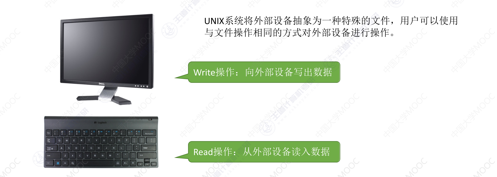

- I/O 设备
  - 输入/输出
  - I/O 设备就是可以将数据输入到计算机，或者可以接收计算机输出数据的外部设备
  - 属于计算机中的硬件部件
- Unix 系统将外部设备抽象为一种特殊的文件，用户可以使用与文件操作相同的方式对外部设备进行操作
  - write 操作
    - 向外部设备写出数据
  - read 操作
    - 从外部设备读入数据
- 设备
  - 鼠标、键盘——典型的输入型设备
  - 显示器——输出型设备
  - 移动硬盘——可输入可输出型设备

### 按使用特性分类

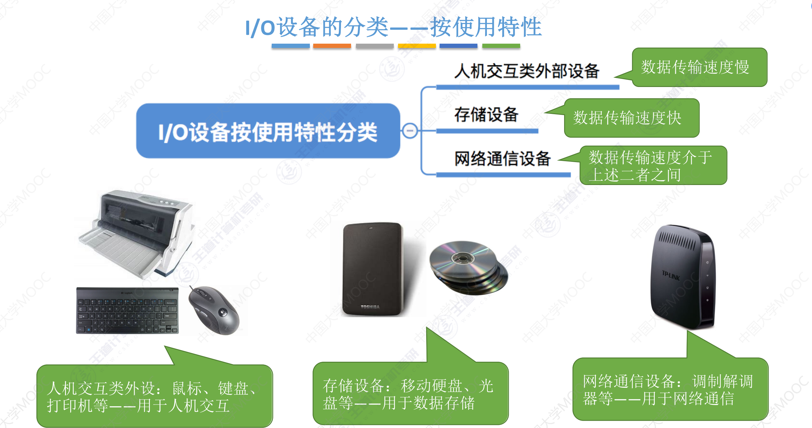

- 按使用特性分类
  - 人机交互类设备——鼠标、键盘、打印机
    - 数据传输速度慢
  - 存储设备——移动硬盘、光盘
    - 数据传输速度快
  - 网络通信设备——调制解调器
    - 数据传输速度介于上述二者之间

### 按传输速率分类

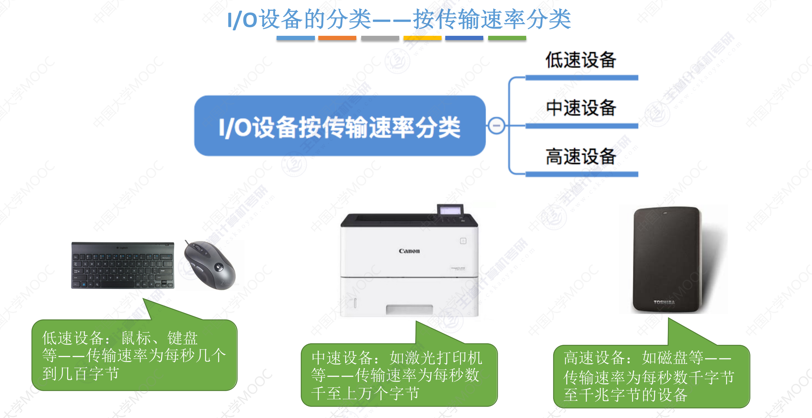

- 按传输速率分类
  - 低速设备——鼠标、键盘
    - 传输速率为每秒几个到几百字节
  - 中速设备——激光打印机
    - 传输速率为每秒数千至上万个字节
  - 告诉设备——磁盘
    - 每秒数千字节至千兆字节

### 按信息交换的单位分类

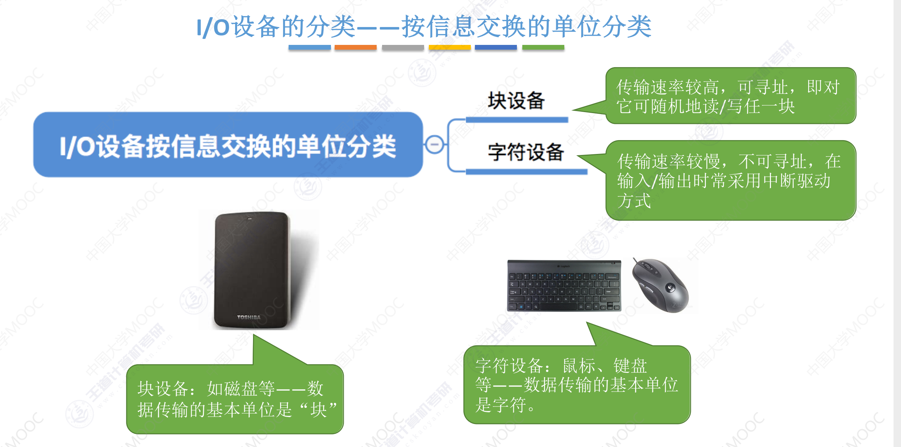

- 按信息交换的单位分类
  - 块设备——磁盘
    - 数据传输的基本单位是“块”
    - 传输速率较高，可寻址，即对它可以随机的读/写任一块
  - 字符设备——鼠标、键盘
    - 数据传输的基本单位是字符
    - 传输速率较慢，不可寻址，在输入/输出时常采用中断驱动方式

## I/O 控制器

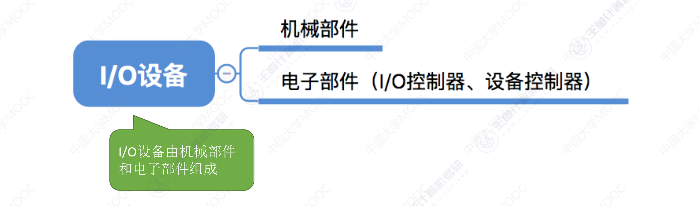

### 机械部件

- I/O 设备的机械部件主要用来执行具体 I/O操作
  - 如我们看得见摸得着的鼠标/键盘的按钮；显示器的 LED 屏；移动硬盘的磁臂、磁盘盘面

### 电子部件（I/O控制器、设备控制器）

- **I/O 设备的电子部件通常是一块插入主板扩充槽的印刷电路**

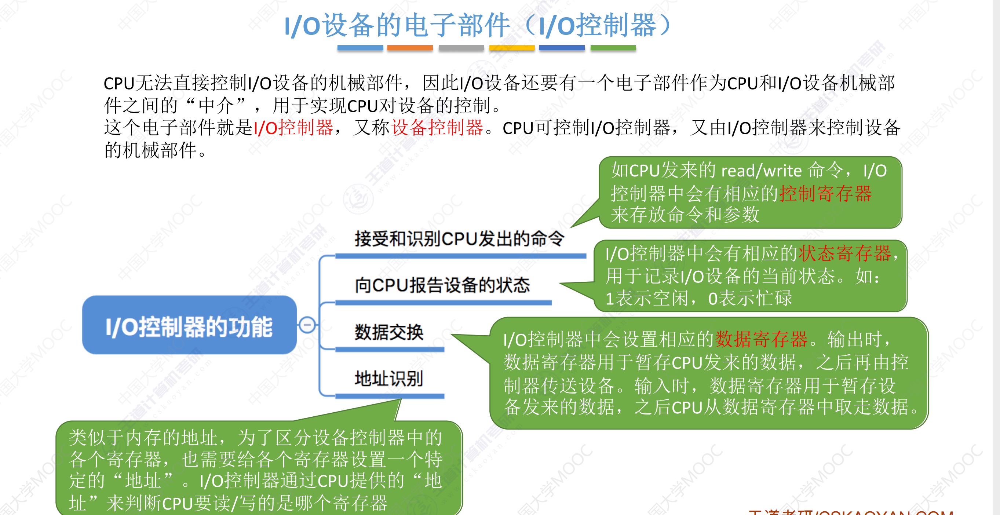

- 电子部件（I/O控制器）
  - CPU 无法直接控制 I/O 设备的机械部件，因此 I/O 设备还要有一个电子部件作为 CPU 和 I/O 设备机械部件之间的“中介”，用于实现 CPU 对设备的控制
  - 这个电子部件就是 I/O控制器，又称设备控制器
    - CPU 可以控制 I/O控制器，又由 I/O控制器来控制设备的机械部件
  - I/O控制器的功能
    - 接收和识别CPU 发出的命令
      - 如 CPU 发来的 read/write命令，I/O控制器中会有相应的**控制寄存器**来存放命令和参数
    - 向 CPU 报告设备的状态
      - I/O控制器中会有相应的**状态寄存器**，用于记录 I/O设备的当前状态
        - 1 表示空闲，0 表示忙碌
    - 数据交换
      - I/O控制器中会设置相应的**数据寄存器**
      - 输出时，数据寄存器用于暂存 CPU 发来的数据，之后再由控制器传送设备
      - 输入时，数据寄存器用于暂存设备发来的数据，之后 CPU 从数据寄存器中取走数据
    - 地址识别
      - 类似于内存的地址。为了区分设备控制器中的各个寄存器，也许要给各个寄存器设置一个特定的“地址”
      - I/O控制器通过 CPU 提供的“地址”来判断 CPU 要读写的是哪个寄存器

### I/O控制器的组成

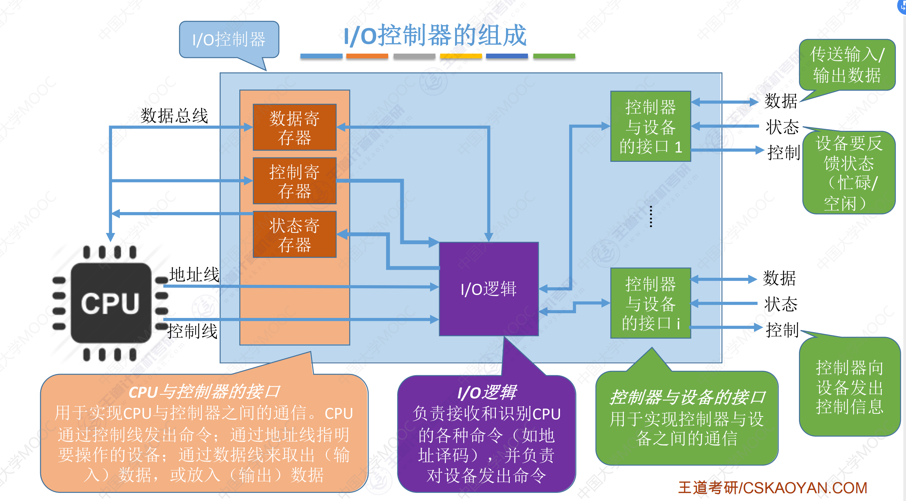

- - I/O 逻辑

    - 负责接收和识别 CPU 的各种命令

      - 如地址译码

      负责对设备发出命令

  - CPU 与控制器的接口

    - 用于实现 CPU 与控制器之间的通信
    - CPU 通过控制线发出命令
    - 通过地址线指明要操作的设备
    - 通过数据线来取出（输入）数据，或放入（输出）数据

  - 控制器与设备的接口 

    - 用于实现控制器与设备之间的通信
    - 数据线
      - 传送输入/输出的数据
    - 状态线
      - 设备要反馈状态（忙碌/空闲）
    - 控制线
      - 控制器向设备发出控制信号

- 注意
  - 一个 I/O控制器可能会对应多个设备
  - 数据寄存器、控制寄存器、控制寄存器可能会有多个，且这些寄存器都要有相应的地址，才能方便 CPU 操作
    - 每个控制/状态寄存器对应一个具体的设备
  - 有的计算机会让这些寄存器占用内存地址的一部分，称为内存映像；另一些计算机则采用 I/O专用地址，即寄存器独立编址

#### 内存映像 I/O VS 寄存器独立编址

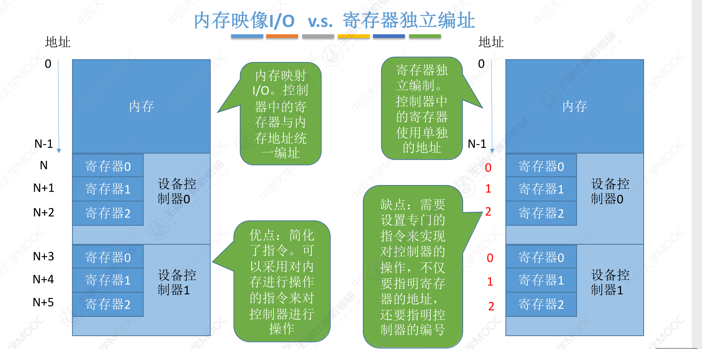

- 内存映像 I/O
  - 控制器中的寄存器与内存地址统一编址
  - 优点
    - 简化了指令。可以采用对内存进行操作的指令来对控制器进行操作
- 寄存器独立编址
  - 控制器中的寄存器使用单独的地址
  - 缺点
    - 需要设置专门的指令来实现对控制器的操作
    - 不仅要指明寄存器的地址，还要指明控制器的编号

## I/O控制方式

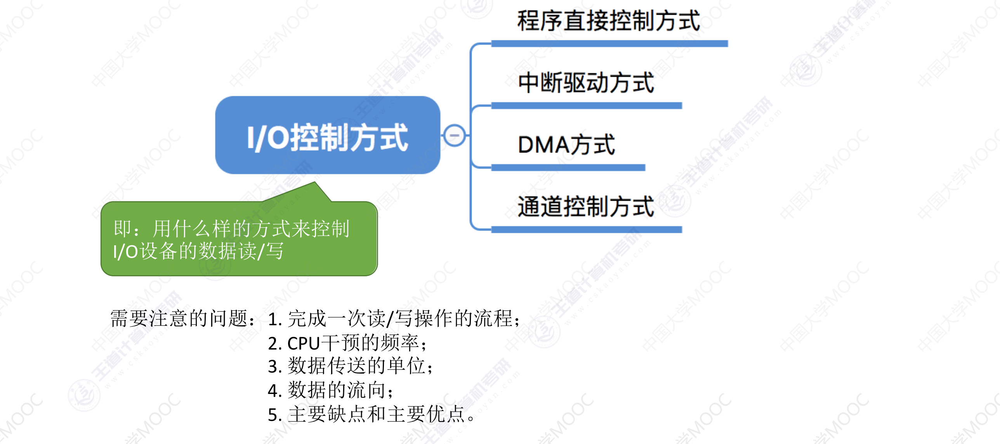

- I/O 控制方式
  - 即用什么样的方式来控制 I/O 设备的数据读/写
  - 需要注意的问题
    - 完成一次读/写的流程
    - CPU 干预的频率
    - 数据传送的单位
    - 数据的流向
    - 主要缺点和主要优点

### 程序直接控制方式

- 自己理解
  - CPU 很专一，给 I/O控制器发出命令之后，就一直询问他：好了吗，好了吗，好了吗；直到 I/O控制器告诉他好了好了，终于好了

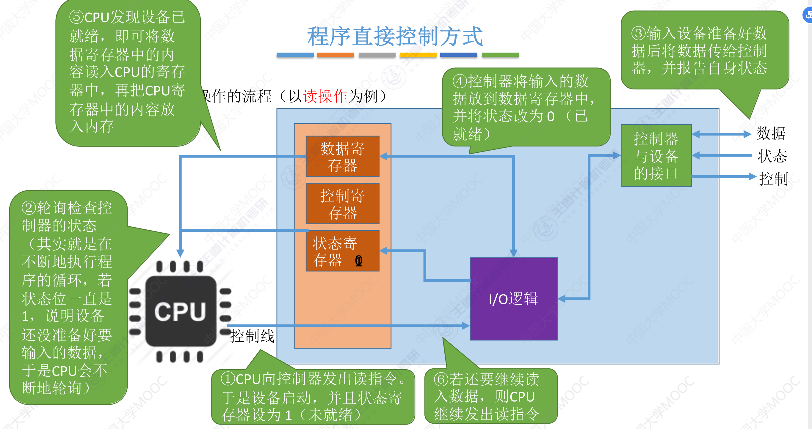

- key word：轮询
  - 完成一次读/写操作的流程（以读操作为例）
  - 流程
    - CPU 向控制器发出读指令，于是设备启动，并且状态寄存器设为 1（未就绪）
    - 轮询检查控制器状态
      - 其实就是在不断地执行程序的循环，若状态位一直是 1，说明设备还没准备好要输入的数据，于是 CPU 会不断地轮询
    - 输入设备准备好数据后将数据传给控制器，并报告自身状态
    - 控制器将输入的数据放到数据寄存器中，并将状态改为 0（已就绪）
    - CPU 发现设备已就绪，即可将数据寄存器中的内容读入 CPU 的寄存器，再把 CPU 寄存器中的内容放入内存
    - 若还要继续读入数据，则 CPU 继续发出读指令

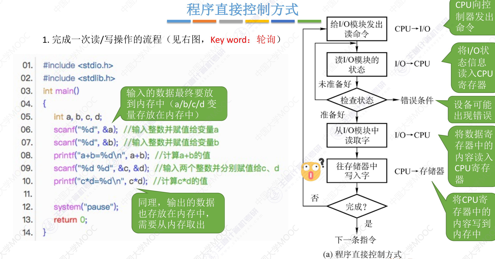

- 程序直接控制方式
  - 流程
    - CPU—>I/O
      - 给 I/O 模块发出读指令
      - CPU 向控制器发出命令
    - I/O —> CPU
      - 读 I/O模块的状态
      - 将 I/O状态信息读入 CPU 寄存器
    - 检查错误条件
      - 检查状态
      - 设备可能会出现错误
    - I/O —> CPU
      - 从I/O模块中读取字
      - 将数据寄存器中的内容读入 CPU 寄存器
    - CPU —> 存储器
      - 往存储器中写入字
      - 将 CPU 寄存器中的内容写到内存中
    - 检查是否继续

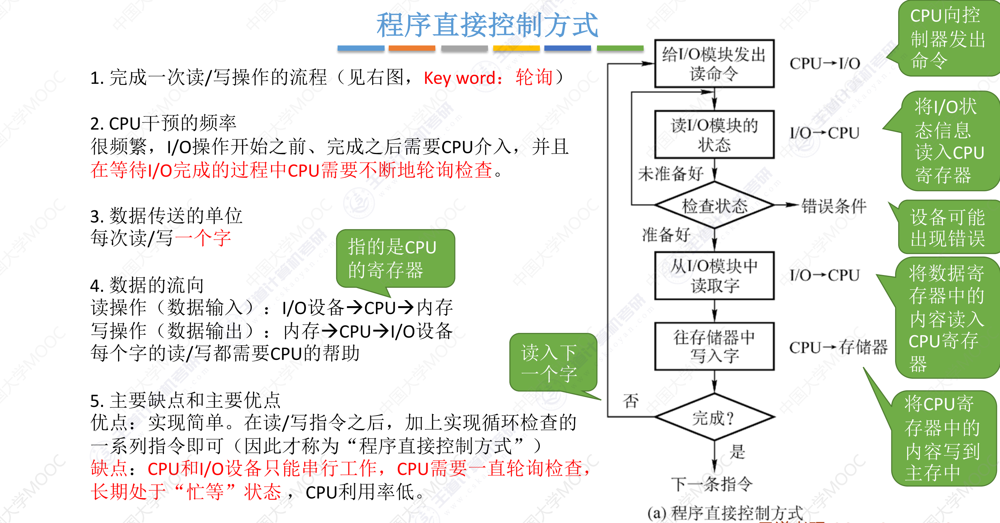

- 程序直接控制方式
  - 完成一次读/写操作的流程
  - CPU 干预的频率
    - 很频繁，I/O 操作开始之前、完成之后需要 CPU 介入，并且**在等待 I/O完成的过程中需要不断地轮询检查**
  - 数据传送的单位
    - **每次读/写一个字**
  - 数据的流向
    - 读操作（数据输入）
      - I/O 设备—> CPU —>内存
    - 写操作（数据输出）
      - 内存—>CPU—>I/O设备
    - 每个字的读/写都需要 CPU的帮助
  - 主要优点
    - 实现简单
    - 在读/写指令之后，加上实现循环检查的一系列指令即可（因此才称为“程序直接控制方式”）
  - 主要缺点
    - **CPU 和 I/O 设备只能串行工作，CPU 需要一直轮询检查，长期处于“忙等”状态，CPU 利用率低**

### 中断驱动方式

- 自己理解
  - CPU 布置任务，输入一个字之后再来叫我，我先去做其他事

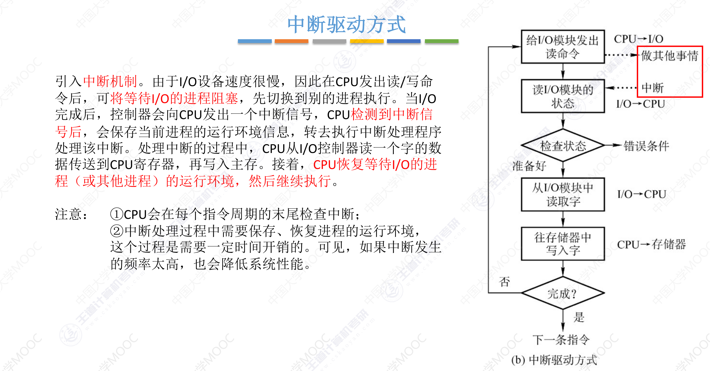

- 中断驱动方式
  - 实现
    - 引入中断机制
    - 由于 I/O 设备速度很慢，因此在 CPU 发出读/写命令后，可**将等待 I/O 的进程阻塞**，先切换到别的进程（B）执行
    - 当 I/O 完成后，控制器会向 CPU 发出一个中断信号，**CPU 监测到中断信号后，**会保存当前进程（B）的运行环境信息，转去执行中断处理程序处理该中断
    - 处理中断的过程中，CPU 从 I/O 控制器读一个字的数据传送到 CPU 寄存器，再写入主存
    - **CPU 恢复等待 I/O 的进程（或其他进程）的运行环境，然后继续执行**
  - 流程
    - CPU—>I/O
      - 给 I/O 模块发出读指令
      - CPU 向控制器发出命令
      - **然后 CPU 将该进程阻塞，去做其他事情**
    - I/O —> CPU
      - I/O 完成后，控制器会向 CPU 发出一个中断信号，CPU 检测到中断信号后，会保存当前进程的运行环境信息，执行中断处理程序处理该中断
      - 读 I/O模块的状态
      - 将 I/O状态信息读入 CPU 寄存器
    - 检查错误条件
      - 检查状态
      - 设备可能会出现错误
    - I/O —> CPU
      - 从I/O模块中读取字
      - 将数据寄存器中的内容读入 CPU 寄存器
    - CPU —> 存储器
      - 往存储器中写入字
      - 将 CPU 寄存器中的内容写到内存中
    - 检查是否继续
  - 注意
    - CPU 会在每个指令周期的末尾检查中断
    - 中断处理过程中需要保存、恢复进程的运行环境，这个过程是需要一定时间开销的。
      - 如果中断发生的频率太高，也会降低系统性能

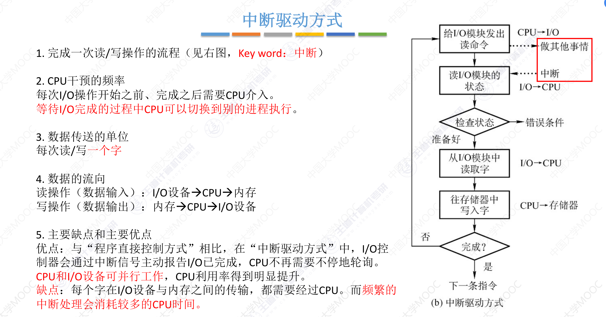

- 中断驱动方式
  - 完成一次读/写操作的流程（key word：中断）
  - CPU 干预的频率
    - 每次 I/O操作开始之前、完成之后需要 CPU 介入
    - 等待 I/O完成的过程中，CPU可以切换到别的进程执行
  - 数据传送的单位
    - 每次读/写一个字
  - 数据的流向
    - 读操作（数据输入）
      - I/O 设备—>CPU—>内存
    - 写操作（数据输出）
      - 内存—>CPU—>I/O设备
  - 主要优点
    - 与程序直接控制方式相比，在中断驱动方式中，I/O控制器会通过中断信号主动报告 I/O 已完成，CPU 不再需要不停地轮询
    - **CPU 和 I/O设备可以并行工作，CPU 利用率得到明显提升**
  - 主要缺点
    - 每个字在 I/O设备与内存之间的传输，都需要经过 CPU
    - **频繁的中断处理会消耗较多的 CPU 时间**

### DMA 方式

自己理解

- CPU 布置任务，告诉你要读多少数据，读进来要存放到内存的什么位置，存放到外存的什么位置，都完成之后再来叫我，我先去做其他事

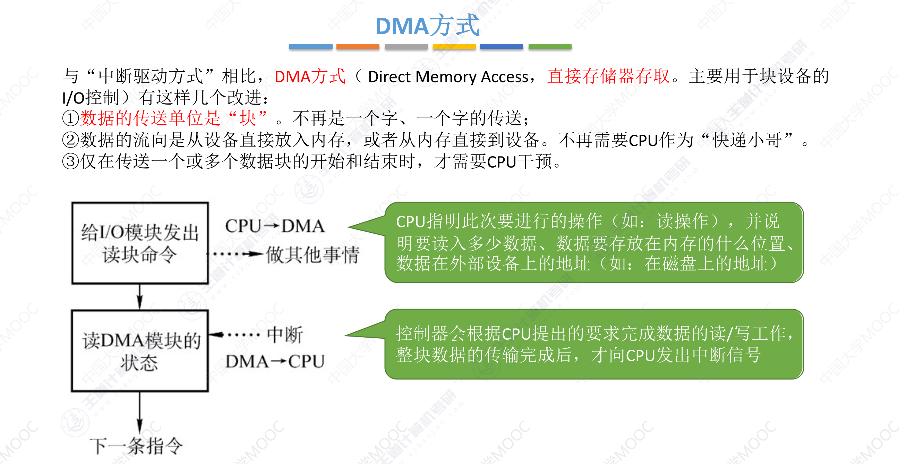

- DMA（Direct Memory Access）
  - **直接存储器存取**，主要用于块设备的 I/O控制
  - 相比于“中断驱动方式”的改进
    - **数据的传送单位是“块”**，不再是一个字、一个字的传送
    - 数据的流向是从设备直接放入内存，或者从内存直接到设备。
      - 不再需要 CPU 作为“快递小哥”
    - 仅在传送一个或多个数据块的开始和结束时，才需要 CPU 干预
  - 流程
    - CPU—>DMA
      - 做其他事情
      - CPU 指明此次要进行的操作（如：读操作），并说明要读入多少数据、数据要存放在内存的什么位置、数据在外部设备上的地址（如：磁盘上的地址）
    - DMA—>CPU
      - 中断
      - 读 DMA 模块的状态
      - 控制器会根据 CPU 提出的要求完成数据的读/写工作，整块数据的传输完成后，才向 CPU 发出中断信号

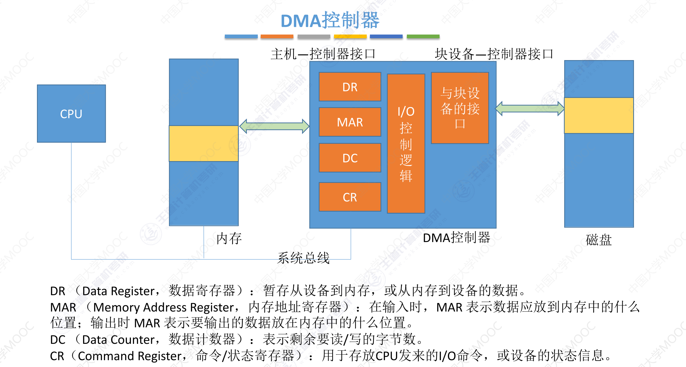

- DMA 控制器
  - DR（Data Register，数据寄存器）
    - 暂存从设备到内存，或者从内存到设备的数据
  - MAR（Memory Address Register，内存地址寄存器）
    - 输入时，MAR 表示数据应放到内存中的什么位置；
    - 输出时，MAR 表示输出的数据放在内存中的什么位置
  - DC（Data Counter，数据计数器）
    - 表示剩余要读/写的字节数
  - CR（Command Register，命令/状态寄存器）
    - 用于存放 CPU 发来的 I/O 命令，或设备的状态信息
- DMA 也是从磁盘中一个字一个字的读入，放入到 DR 中，直到DC=0，将 DR 中所有的数据放到 MAR 存放的地址中

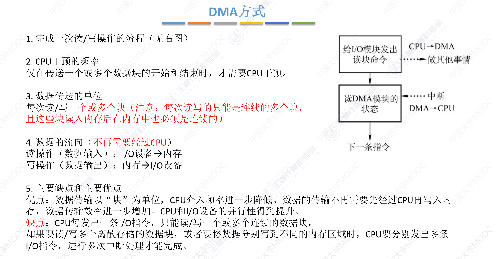

- DMA方式
  - 完成一次读/写操作的流程
  - CPU 干预的频率
    - 仅在传送一个或多个数据块的开始和结束时，才需要 CPU 干预
  - 数据传送的单位
    - 每次读/写一个或多个块
      - 每次读写只能是连续的多个块，且这些块读入内存后在内存中也必须是连续的
  - 数据的流向（不再需要经过 CPU）
    - 读操作（数据输入）
      - I/O 设备—>内存
    - 写操作（数据输出）
      - 内存—>I/O设备
  - 主要优点
    - 数据传输以“块”为单位，CPU 介入频率进一步降低
    - 数据的传输不再需要先经过 CPU 在写入内存，数据传输效率进一步增加
    - CPU 和 I/O设备的并行性得到提升
  - 主要缺点
    - CPU 每发出一条 I/O指令**，只能读/写一个或多个连续的数据块**
    - 如果要读/写多个离散存储的数据库，或者要将数据分别写到不同的内存区域时，CPU 要分别发出多条 I/O 指令，进行多次中断处理才能完成

### 通道控制方式

- 自己理解
  - CPU 发出命令，告诉通道执行哪个通道程序（任务清单）和操作哪个 I/O 设备就可以做其他事情了，其余事情由通道自己完成

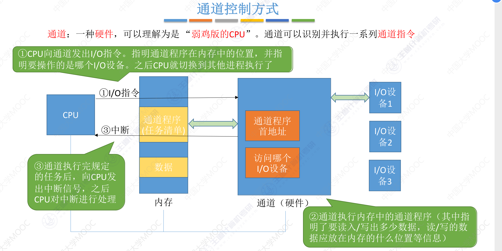

- 通道控制方式
  - 通道
    - **一种硬件**，可以理解为是“弱鸡版的 CPU”
    - **通道可以识别并执行一系列通道指令**
    - **与 CPU 相比，通道可以执行的指令很单一，并且通道程序是放在主机内存中的，也就是说通道与 CPU 共享内存**
  - 通道程序
    - 任务清单
    - 本质上是一系列通道指令的集合（跟之前的批操作指令一样）
  - 流程
    - CPU 向通道发出 I/O指令
      - 指明通道程序在内存中的位置，并指明要操作的是哪个 I/O 设备
      - 之后 CPU 就切换到其他进程执行了
    - 通道执行内存中的通道程序
      - 其中指明了要读入/写出多少数据
      - 读/写的数据应该放在内存的什么位置等信息
    - 通道执行完规定的任务后，向CPU 发出中断信号，之后 CPU 对中断进行处理

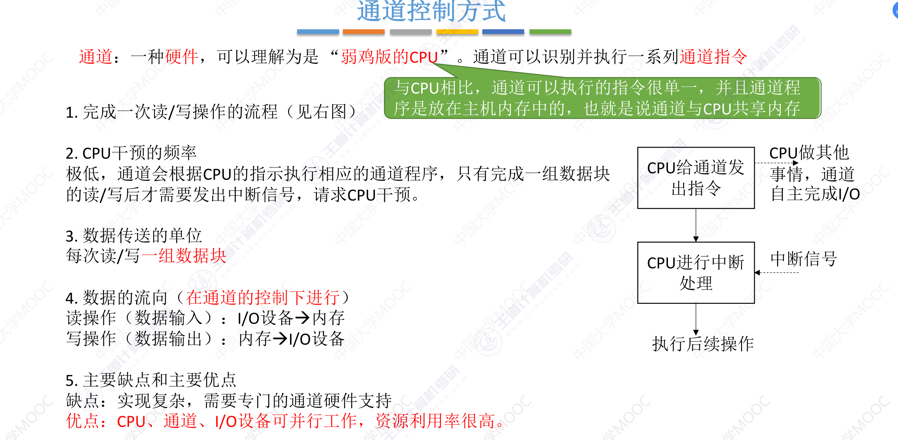

- 通道控制方式
  - 完成一次读/写操作的流程
    - CPU 给通道发出指令
      - CPU 做其他事情
  - CPU 干预的频率
    - 极低，通道会根据 CPU 的指示执行对应的通道程序，只有完成一组数据块的读/写后才需要发出中断信号，请求 CPU 干预
  - 数据传送的单位
    - **每次读/写一组数据块**
  - 数据的流向（在通道的控制下进行）
    - 读操作（数据流入）：I/O设备—>内存
    - 写操作（数据输出）：内存—>I/O设备
  - 主要缺点
    - 实现复杂，需要专门的通道硬件支持
  - 主要优点
    - CPU、通道、I/O设备可并行工作，资源利用率很高

## I/O 软件层次结构

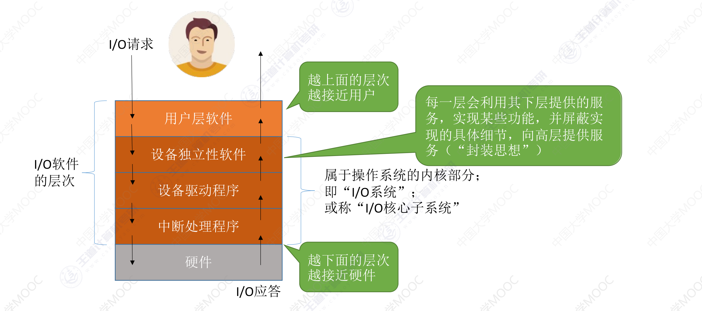

- I/O 软件层次结构
  - 用户层软件
    - 越上面的层次越接近用户
  - 设备独立性软件
    - 每一层会利用其下层提供的服务，实现某些功能，并屏蔽实现的具体细节，向高层提供服务（“封装思想”）
  - 设备驱动程序
  - 中断处理程序
    - 越下面的层次越接近硬件
  - 硬件

- 中间三层：设备独立性软件、设备驱动程序、中断处理程序
  - 属于操作系统的内核部分，即 I/O 系统或称 I/O核心子系统

### 用户层软件

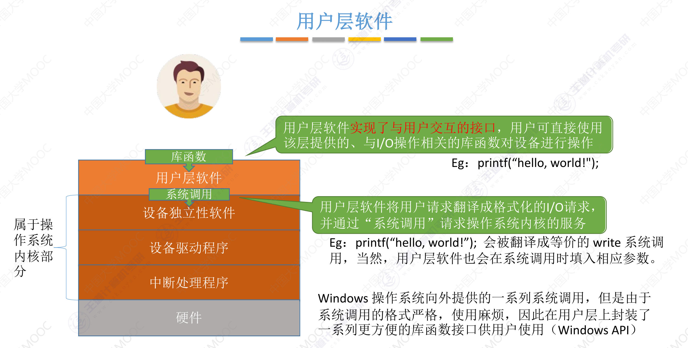

- 用户层软件
  - “系统调用处理层”
  
  - 实现了与用户交互的接口
  
  - 用户可直接使用该层提供的、与 I/O 操作相关的库函数对设备进行操作
  
    - EG：printf("Hello World!");
  - 将用户请求翻译成格式化的 I/O请求，并通过“系统调用”请求操作系统内核的服务
  
    - EG：printf("Hello World!"); 会被翻译成等价的 write 系统调用，当然用户层软件也会在系统调用时填入相应参数
  
- Windows 操作系统向外提供的一系列系统调用，但是由于系统调用的格式严格，使用麻烦，因此在用户层上封装了一系列更方便的库函数接口供用户使用（Windows API）

### 设备独立性软件

- 自己理解
  - 将下层设备编号，形成逻辑设备表
    - 逻辑设备名、物理设备名、驱动程序入口地址
  - 给上层提供服务:系统调用接口

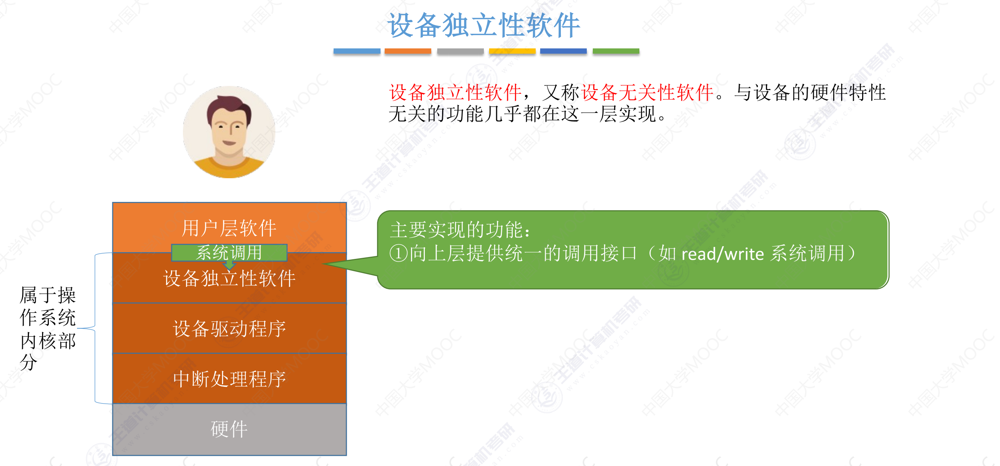
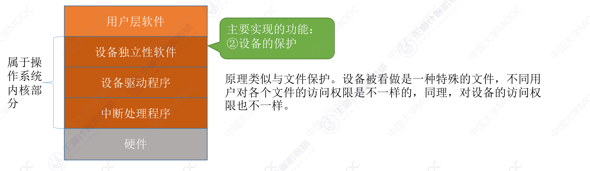
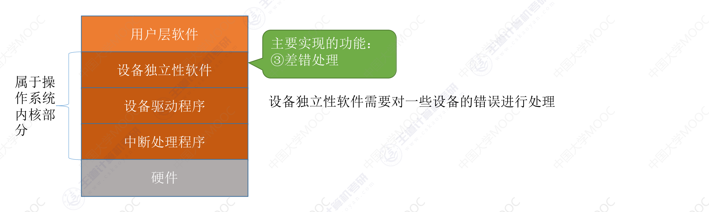
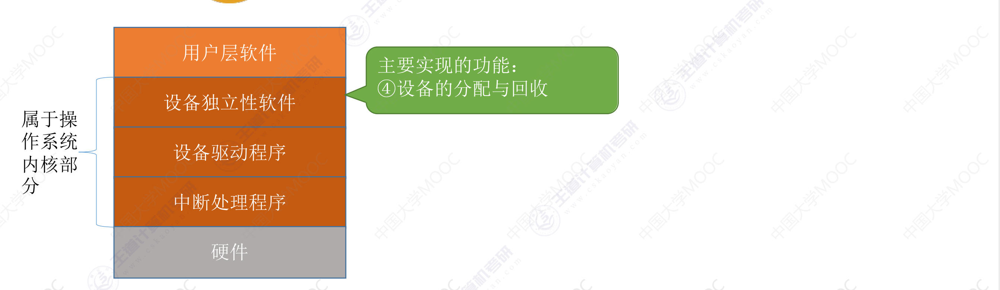
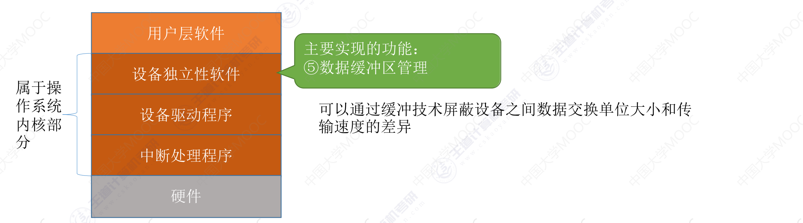
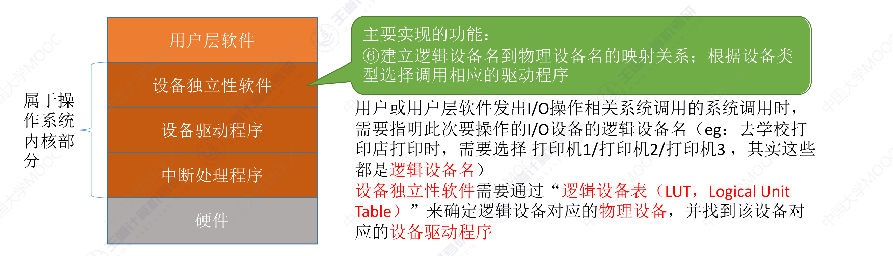

- 设备独立性软件
  - 设备无关性软件
  - 与设备的硬件特性无关的功能几乎都在这一层实现
  - 功能
    - 向上层提供统一的调用接口（如 read/write 系统调用）
    - 设备的保护
      - 原理类似于文件保护
      - 设备被看做是一种特殊的文件，不同用户对各个文件的访问权限时不一样的，同理对设备的访问权限也不一样
    - 差错处理
      - 设备独立性软件需要对一些设备的错误进行处理
    - 设备的分配与回收
    - 数据缓冲区管理
      - 可以通过缓冲技术屏蔽设备之间数据交换单位大小和传输速度的差异
    - 建立逻辑设备名到物理设备名的映射关系；根据设备类型选择调用相应的驱动程序
      - 用户或用户层软件发出 I/O操作相关系统调用的系统调用时，需要指明此次要操作的 I/O设备的逻辑设备名
        - eg：去学校打印店打印时，需要选择打印机 1/打印机 2/打印机 3，其实这些都是逻辑设备名
      - 设备独立性软件需要通过“逻辑设备表（LUT，Logical Unit Table）”来确定逻辑设备对应的物理设备，并找到该设备对应的设备驱动程序

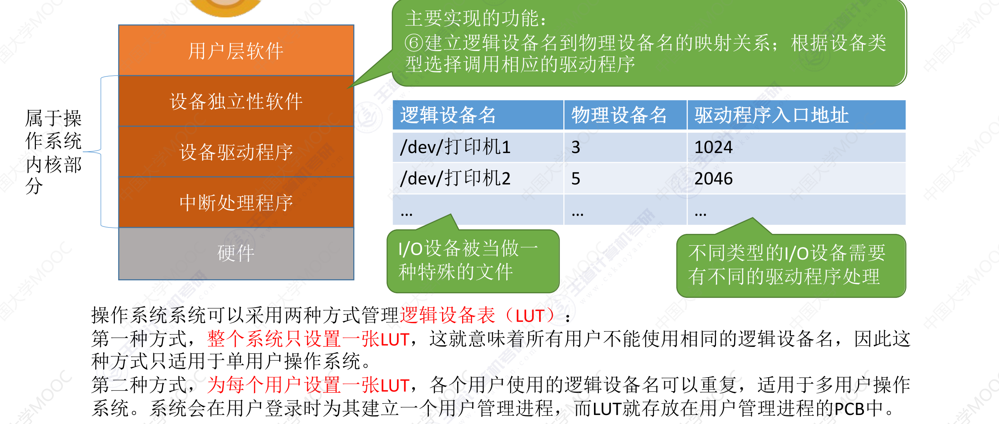

- 逻辑设备表
  - 逻辑设备名
    - I/O设备被当做一种特殊的文件
  - 物理设备名
  - 驱动程序入口地址
    - 不同类型的 I/O 设备需要有不同的驱动程序处理
- 操作系统可以用两种方式管理逻辑设备表（LUT）
  - **整个系统只设置一张 LUT，这就意味着所有用户不能使用相同的逻辑设备名**
    - 只适用于单用户操作系统
  - **为每个用户设置一张 LUT，各个用户使用的逻辑设备名可以重复，适用于多用户操作系统**
    - 系统会在用户登录时为其建立一个用户管理进程，而 LUT 就存放在用户管理进程的 PCB 中

### 设备驱动软件

- 让设备听得懂 CPU 的指令

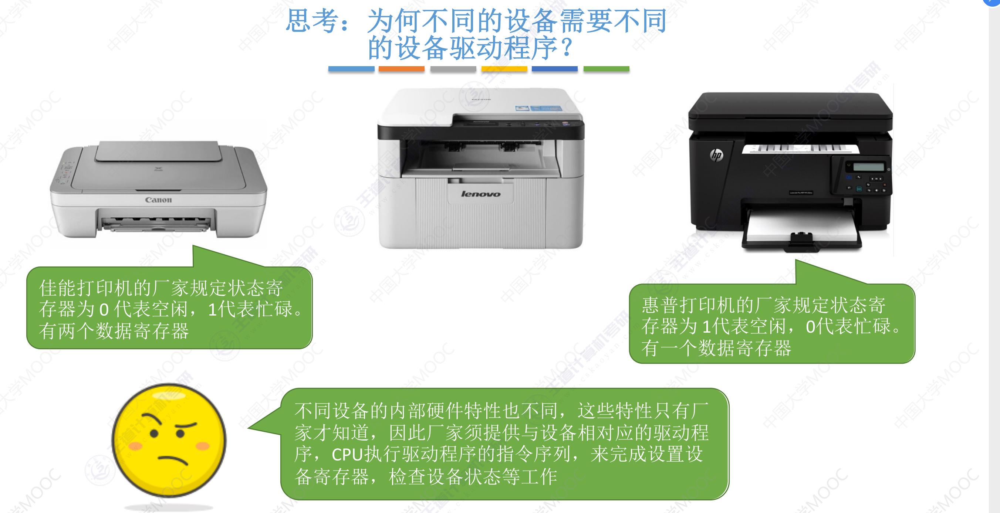

- 为何不同的设备需要不同的设备驱动程序？
  - 不同设备的内部硬件特性不同，这些特性只有厂家才知道
  - 因此厂家必须提供与设备对应的驱动程序，CPU 执行驱动程序的指令序列，来完成设置设备寄存器、检查设备状态等工作

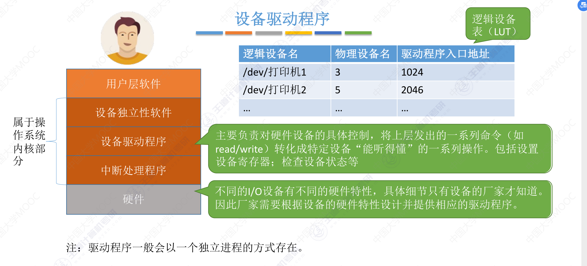

- 设备驱动程序
  - 主要负责对硬件设备的具体控制，将上一层发出的一系列命令（如 read/write）转化成特定设备“能听得懂的”一系列操作
    - 包括设置设备寄存器；检查设备状态
  - 不同的 I/O 设备有不同的硬件特性，具体细节只有设备的厂家才知道
    - 厂家需要根据设备的硬件特性设计并提供相应的驱动程序
- 驱动程序一般会以一个独立进程的方式存在

### 中断处理程序

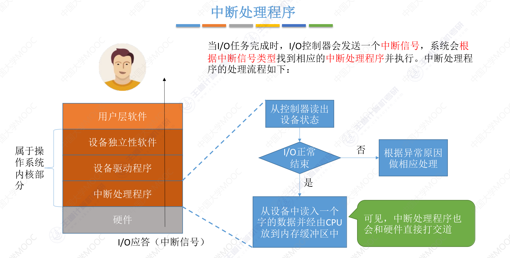

- 中断处理程序
  - **当 I/O 任务完成时，I/O 控制器会发送一个中断信号，系统会根据中断信号类型找到相应的中断处理程序并执行**
  - 流程
    - 从控制器读出设备状态
    - 判断 I/O 是否是正常结束
      - 否：根据异常原因做相应处理
      - 是：从设备中读入一个字的数据并经由 CPU 放到内存缓冲区
  - 中断处理程序也会和硬件直接打交道

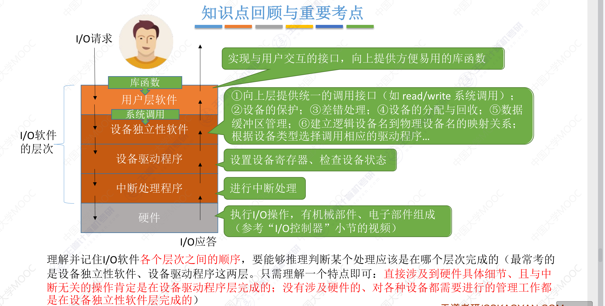

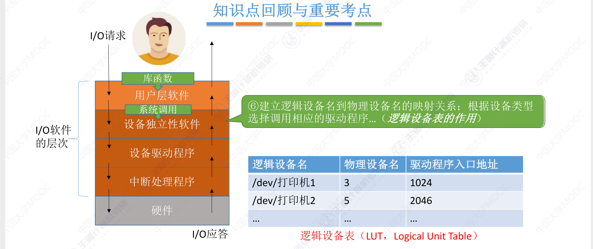

## 输入输出应用程序接口 & 设备驱动程序接口

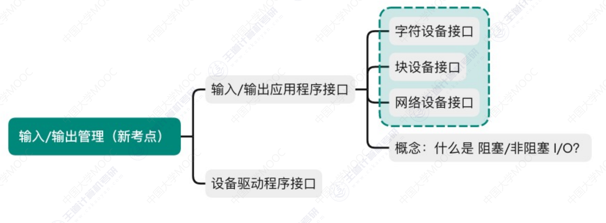

### 输入/输出应用程序接口

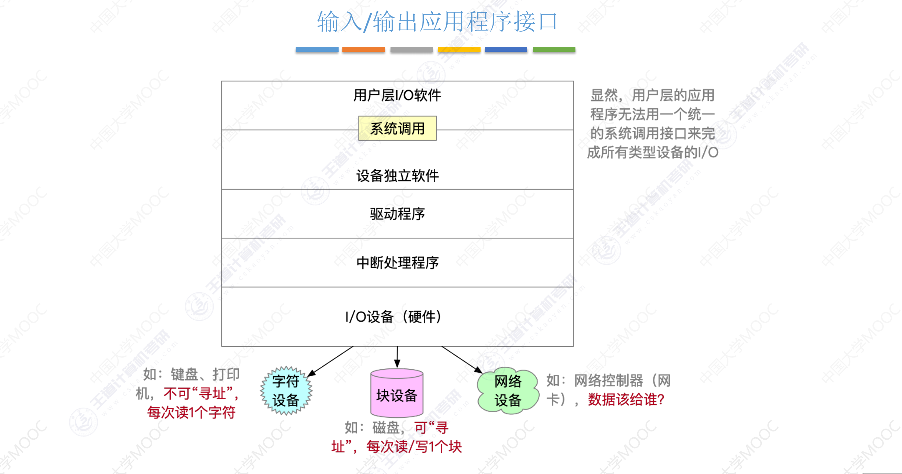

- I/O 设备（硬件）
  - 字符设备
    - 如：键盘、打印机，**不可“寻址”，每次读一个字符**
  - 块设备
    - 如：磁盘，**可“寻址”，每次读/写一个块**
  - 网络设备
    - 如：网络控制器（网卡），数据该给谁？
- 用户层的应用程序无法用一个统一的系统调用接口来完成所有类型设备的 I/O

#### 字符设备接口

- 字符设备接口
  - get/put 系统调用
    - 向字符设备读/写一个字符

#### 块设备接口

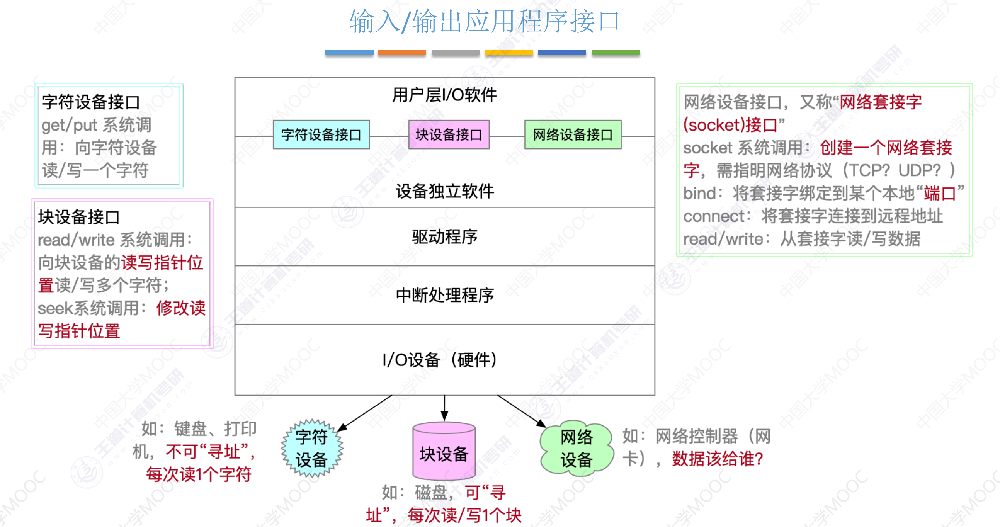

- 块设备接口
  - read/write 系统调用
    - 向块设备的读写指针位置读/写多个字符
  - seek 系统调用
    - 修改读写指针位置

#### 网络设备接口

- 网络设备接口
  - 又称网络套接字（socket）接口
  - socket 系统调用
    - 创建一个网络套接字，需要指明网络协议（TCP?UDP?）
  - bind 系统调用
    - 将套接字绑定到某个本地“端口”
  - connect 系统调用
    - 将套接字连接到远程地址
  - read/write 系统调用
    - 从套接字读/写数据

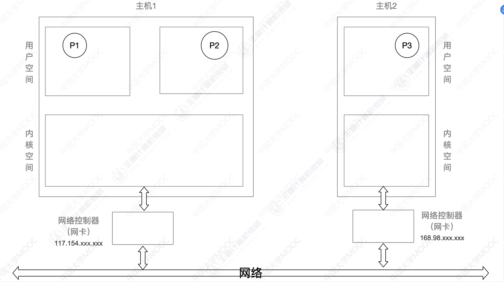

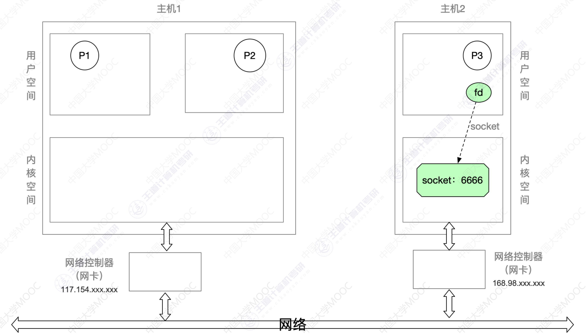

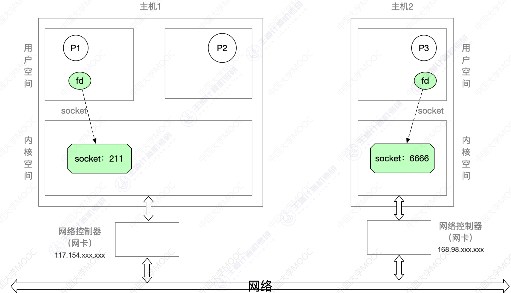

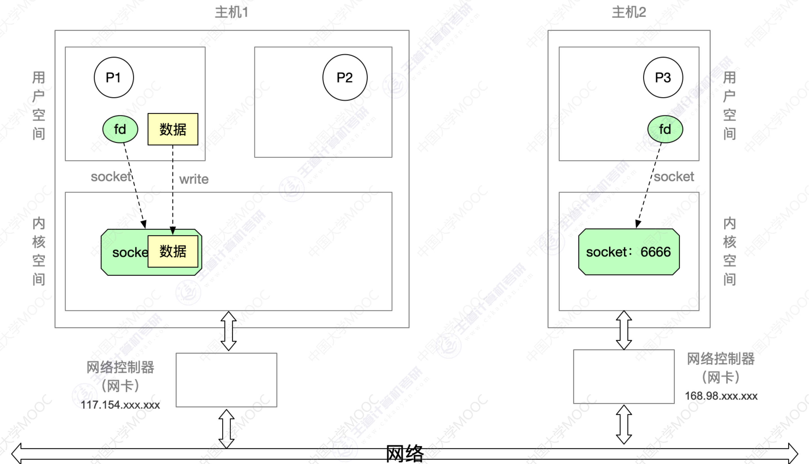

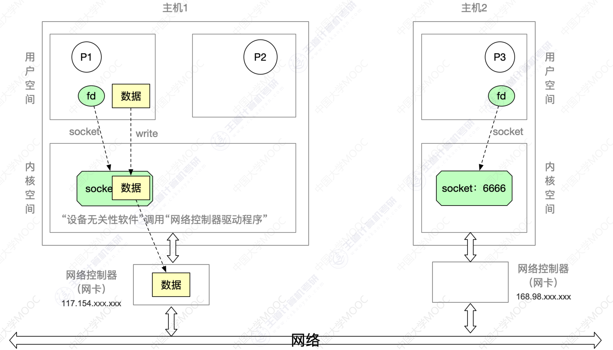


- 网络数据传输流程
  - 

#### 什么是阻塞/非阻塞 IO


- 阻塞 I/O
  - 应用程序发出 I/O 系统调用，进程需要转为阻塞态等待 I/O的完成
  - eg：字符设备接口——从键盘读一个字符 get
- 非阻塞 I/O
  - 应用程序发出 I/O 系统调用，系统调用可迅速返回，进程无需阻塞等待
  - eg：块设备接口——往磁盘写数据 write
    - 就算是磁盘被占用忙碌，内存中用户空间的进程也可以将数据复制到内核区域，等待磁盘空闲立即写入

### 设备驱动程序接口


- 设备驱动程序接口
  - 若各公司开发的设备驱动程序接口不统一，则操作系统很难调用设备驱动程序
- 统一标准的设备驱动程序接口
  - 操作系统规定好设备驱动程序的接口标准，各个厂商必须按要求开发设备驱动程序


- 不同的操作系统，对设备驱动程序接口的标准各不相同
- 设备厂商必须根据操作系统的接口要求，开发相应的设备驱动程序，设备才能被使用

## I/O 核心子系统


- I/O 软件的层次
  - 属于操作系统的内核部分，即 I/O 系统或称“I/O 核心子系统”
    - 设备独立性软件、设备驱动程序、中断处理程序
  - I/O 核心子系统要实现的功能其实就是中间三层要实现的程序
  - 要重点理解和掌握的功能是：I/O 调度、设备保护、假脱机技术（SPOOLing 技术）、设备分配与回收、缓冲区管理（即缓冲与高速缓存）


### 假脱机技术（SPOOLing 技术）

- 假脱机技术（SPOOLing 技术）需要请求“磁盘设备”的设备独立性软件的服务，因此一般来说假脱机技术是在用户层软件实现的


#### 什么是假脱机技术？可以解决什么问题？

##### 脱机技术


】

- 什么是脱机技术？
  - 手工操作阶段
    - 主机直接从 I/O 设备获得数据，由于设备速度慢，主机速度很快
    - 人机矛盾明显，主机要浪费很多时间来等待设备
  - 批处理阶段
    - 引入了脱机输入/脱机输出技术（用磁带完成）
      - 引入脱机技术后，缓解了 CPU 与慢速 I/O 设备的速度矛盾
      - 另一方面，即使 CPU 在忙碌，也可以提前将数据输入到磁带
      - 即使慢速的输出设备在忙碌，也可以提前将数据输出到磁带
    - 在外围控制机的控制下，慢速输入设备的数据先被输入到更快速的磁带上，之后主机可以从快速的磁带上读入数据，从而缓解了速度矛盾
    - 为什么叫脱机？
      - 脱离主机的控制进行的输入/输出操作

##### 假脱机技术——输入井和输出井/ 缓冲区/ 进程


- 假脱机技术
  - 又称“SPOOLing技术”
  - 用软件的方式模拟脱机技术
  - 从磁盘上开辟出两个存储区域——“输入井”和“输出井”
  - 组成
    - **输入井**
      - 模拟脱机输入时的磁带，用于收容 I/O 设备输入的数据
    - **输出井**
      - 模拟脱机输出时的磁带，用于收容用户进程输出的数据
    - **输入进程**
      - 模拟脱机输入时的外围控制机
      - **输入缓冲区**
    - **输出进程**
      - 模拟脱机输出时的外围控制机
      - **输出缓冲区**
    - **输入设备**
    - **输出设备**
  - 要**实现 SPOOLing 技术，必须要有多道程序技术的支持**，系统会建立“输入进程”和“输出进程”


#### 实现原理


- 输入输出进程
  - 输入进程
    - 模拟脱机输入时的外围控制机
    - 在输入进程的控制下，输入缓冲区用于暂存从输入设备输入的数据，之后在转存到输入井中
  - 输出进程
    - 模拟脱机输出时的外围控制机
    - 在输出进程的控制下，“输出缓冲区”用于暂存从输出井送来的数据，之后在传送到输出设备上
  - 注意
    - 输入缓冲区和输出缓冲区是在内存中的缓冲区

#### 共享打印机原理分析


- 独占式设备
  - 只允许多个进程串行使用的设备
  - 一段时间内只能满足一个进程的请求
  - 例子
    - 若进程 1 正在使用打印机，则进程 2 请求使用打印机时必然阻塞等待
- 共享设备
  - 允许多个进程同时使用的设备
    - 宏观上同时使用，微观上可能是交替使用
  - 可以同时满足多个进程的使用请求

- 打印机
  - 打印机是种独占式设备，但是可以用 SPOOLing 技术改造成“共享设备”
  - 假脱机文件队列
    - 打印任务队列
  - 原理分析（假脱机管理进程）
    - 当多个用户进程提出输出打印的请求时，系统会答应它们的请求，但是并不是真正把打印机分配给他们，而是由**假脱机管理进程**为每个进程做两件事
      - 在磁盘输出井中为进程申请一个空闲缓冲区（也就是说，这个缓冲区是在磁盘上的），并将要打印的数据送入其中
      - 为用户进程申请一张空白的打印请求表，并将用户的打印请求填入表中（其实就是用来说明用户的打印数据存放位置等信息的），再将该表挂到假脱机文件队列上
        - 当打印机空闲时，输出进程会从文件队列的队头取出一张打印请求表，并根据表中的要求将要打印的数据从输出井传送到输出缓冲区，再输出到打印机进行打印。用这种方式可以一次处理完全部的打印任务
  - 过程
    - 进程提出打印请求
    - 在磁盘（输出井）中新建空闲缓冲区
    - 将用户进程中要打印的数据放到缓冲区中
    - 为用户进程申请一张空白的打印请求表（说明书）
    - 把表挂到假脱机文件队列（打印任务队列）
  - 虽然系统中只有一台打印机，但每个进程提出打印请求时，系统都会在输出井中为其分配一个存储区（相当于分配了一个逻辑设备），使每个用户进程都觉得自己在独占一台打印机，从而实现对打印机的共享
  - **SPOOLing 技术可以把一台物理设备虚拟成逻辑上的多台设备，可将独占式设备改造成共享设备**


### I/O 调度


- I/O 调度
  - **用某种算法确定一个好的顺序来处理各个 I/O 请求**
    - 如：磁盘调度：当多个磁盘 I/O 请求到来时，用某种调度算法确定满足I/O请求的顺序
      - 先来先服务
      - 最短寻道优先算法
      - SCAN 算法
      - C-SCAN算法
      - LOOK 算法
      - C-LOOK算法
    - 打印机等设备也可以使用上述算法来确定 I/O 调度顺序

### 设备保护


- **操作系统需要实现文件保护功能，不同的用户对各个文件有不同的访问权限**
  - 只读、读和写
  - 在 UNIX 系统中，**设备被看做是一种特殊的文件**，每个设备也会有对应的 FCB
  - 当用户请求访问某个设备时，系统根据 FCB 中记录的信息来判断该用户是否有相应的访问权限，以此来实现“设备保护”的功能

## 设备的分配与回收


### 设备分配时应考虑的因素


#### 设备的固有属性

- 设备的固有属性三种
  - 独占设备
    - 一个时段只能分配给一个进程（如打印机）
  - 共享设备
    - 可同时分配给多个进程使用（如磁盘）
    - 各个进程往往是宏观上同时共享使用设备，而微观上交替使用
  - 虚拟设备
    - 采用 SPOOLing 技术将独占设备改造成虚拟的共享设备，可以同时分配给多个额进程使用
      - 如采用 SPOOLing 技术实现的共享打印机

#### 设备的分配算法

- 设备的分配算法
  - 先来先服务
  - 优先级高者优先
  - 短任务优先

#### 设备分配中的安全性


- 从进程运行的安全性上考虑，设备分配有两种方式
  - 安全分配方式
    - 为进程分配一个设备后就将进程阻塞，本次 I/O 完成后才将进程唤醒
      - eg：考虑进程请求打印机打印输出的例子
    - 一个时间段内每个进程只能是由一个设备
    - 优点
      - 破坏了“请求和保持”条件，不会死锁
    - 缺点
      - 对于一个进程来说，CPU 和 I/O设备只能串行工作
  - 不安全的分配方式
    - 进程发出 I/O 请求后，系统为其分配 I/O 设备，进程可继续执行，之后还可以发出新的 I/O 请求
    - 只有某个 I/O 请求得不到满足时才将进程阻塞
    - 一个进程可以同时使用多个设备
    - 优点
      - 进程的计算任务和 I/O 任务可以并行处理，使进程迅速推进
    - 缺点
      - 有可能发生死锁（死锁避免、死锁的检测和解除）

### 静态分配与动态分配


- 静态分配
  - 进程运行前为其分配全部所需资源，运行结束后归还资源
- 动态资源
  - 进程运行过程中动态申请设备资源

### 设备分配管理中的数据结构


- 设备分配管理中的数据结构
  - 设备、控制器、通道之间的关系
    - 一个通道可以控制多个设备控制器
    - 每个设备控制器可以控制多个设备


- 设备控制表
  - 系统为每个设备配置一张 DCT，用于记录设备情况
  - 组成
    - 设备类型
      - 如：打印机、扫描仪、键盘
    - 设备标识符
      - 物理设备名，系统中的每个设备的物理设备名唯一
    - 设备状态
      - 忙碌、空闲、故障
    - 指向控制器表的指针
      - 每个设备由一个控制器控制，该指针可找到相应控制器的信息
    - 重复执行次数或时间
      - 当重复执行多次 I/O 操作后仍不成功，才认为此次 I/O 失败
    - 设备队列的队首指针
      - 指向正在等待该设备的进程队列（由进程 PCB 组成队列）
  
  


- 控制器控制表（COCT）

  - 每个设备控制器都会对应一张 COCT，操作系统根据 COCT 的信息对控制器进行操作和管理

  - 组成

    - 控制器标识符

      - 各个控制器的唯一 ID

   - 控制器状态

        - 忙碌/空闲/故障
   - 指向通道表的指针
  - 每个控制器由一个通道控制，该指针可以找到相应通道的信息
   - 控制器队列的队首指针
   - 控制器队列的队尾指针
  - 指向正在等待该控制器的进程队列（由进程 PCB 组成队列）


- 通道控制表（CHCT）
  - 每个通道都会对应一张 CHCT，操作系统根据 CHCT 的信息对通道进行操作和管理
  - 组成
    - 通道标识符
      - 各个通道的唯一 ID
    - 通道状态
      - 忙碌/空闲/故障
    - 与通道链接的控制器表首址
      - 可通过该指针找到该通道管理的所有控制器相关信息（COCT）
    - 通道队列的对手指针
    - 通道队列的队尾指针
      - 指向正在等待该通道的进程队列（由进程 PCB 组成队列）


- 系统设备表（SDT）
  - 记录了系统中全部设备的情况，每个设备对应一个表目
  - 组成
    - 表目 1
    - 表目 2
    - 表目 i
      - 设备类型
        - 如：打印机、扫描仪、键盘
      - 设备标识符
        - 物理设备名
      - DCT（设备控制表）
      - 驱动程序入口

### 设备分配的步骤


- 设备分配的步骤
  - 根据进程请求的物理设备名查找 SDT（系统设备表）
    - 物理设备名是进程请求分配设备时提供的参数
  
  - 根据 SDT 找到 DCT，若设备忙碌则将进程 PCB 挂到设备等待队列，不忙碌则将设备分配给进程
  - 根据 DCT 找到 COCT，若控制器忙碌则将进程 PCB 挂到控制器等待队列中，不忙碌则将控制器分配给进程
  - 根据 COCT 找到 CHCT，若通道忙碌则将进程 PCB 挂到通道等待队列中，不忙碌则将通道分配给进程
  
- 只有设备、控制器、通道三者都分配成功时，这次设备分配才算成功，之后便可启动 I/O 设备进行数据传送

### 设备分配步骤的改进方法


- 设备分配步骤的改进

  - 缺点
    - 用户编程时必须使用物理设备名，底层细节对用户不透明，不方便编程
    - 若换了一个物理设备，则程序无法进行
    - 若进程请求的物理设备正在忙碌，则即使系统中还有同类型的设备，进程也必须阻塞等待
  - 改进方法
    - 建立逻辑设备名与物理设备名的映射机制，用户编程时只需提供逻辑设备名

  


- 改进后过程
  - 根据进程请求的逻辑设备名查找 SDT
    - **用户编程时提供的逻辑设备名其实就是设备类型**
  - 查找 SDT，找到用户进程指定类型的、并且空闲的设备，将其分配给该进程
    - **操作系统在逻辑设备表（LUT）中新增一个表项**
  - 根据 DCT 找到 COCT
    - 若控制器忙碌则将进程 PCB 挂到控制器等待队列中
    - 不忙碌则将控制器分配给进程
  - 根据 COCT 找到 CHCT
    - 若通道忙碌则将进程 PCB 挂到通道等待队列中
    - 不忙碌则将通道分配给进程


- 逻辑设备表（LUT）
  - 建立了逻辑设备名与物理设备名之间的映射关系
  - 第一次
    - 某用户进程第一次使用设备时使用逻辑设备名向操作系统发出请求，操作系统根据用户进程指定的设备类型（逻辑设备名）查找系统设备表，找到一个空闲设备分配给进程，并在 LUT 中增加相应表项
  - 非第一次
    - **如果之后用户进程再次通过相同的逻辑设备名请求使用设备，则操作系统通过 LUT 表即可知道用户进程实际要使用的是哪个物理设备了，并且也能知道该设备的驱动程序入口地址**

- 设置问题
  - 整个系统只有一张 LUT
    - 各用户所用的逻辑设备名不允许重复，适用于单用户操作系统
  - 每个用户一张 LUT
    - 不同用户的逻辑设备名可重复，适用于多用户操作系统

## 缓冲区管理

### 什么是缓冲区？有什么作业？


- 缓冲区
  - 定义
    - 是一个存储区域，可以由专门的硬件寄存器组成，也可利用内存作为缓冲区
  - 使用硬件作为缓冲区
    - 成本较高，容量也较小
    - 一般仅用在对速度要求非常高的场合
      - 如存储器管理中所用的联想寄存器（快表），由于对页表的访问频率极高，因此使用速度很快的联想寄存器来存放页表项的副本


- 缓冲区的作用
  - 缓和 CPU 与 I/O设备之间速度不匹配的矛盾
    - 如果是字符型设备，就需要每输出完一个字符就要向 CPU 发送一次中断信号
  - 减少对 CPU 的中断频率，放宽对 CPU 中断响应时间的限制
  - 解决数据粒度不匹配的问题
    - 如：输出进程每次可以生成一块数据，但 I/O 设备每次只能输出一个字符
  - 提高 CPU 与I/O 设备之间的并行性
    - CPU 可以把要输出的数据快速地放入缓冲区，之后就可以做别的事情了
    - 慢速的 I/O 设备可以慢慢从缓冲区取走数据
    - 数据输入时类似

### 单缓冲


- 单缓冲
  - 假设某用户进程请求某种块设备读入若干块的数据
  - 若采用单缓冲的策略，操作系统会在主存中为其分配一个缓冲区
    - 若题目中没有特别说明，一个缓冲区的大小就是一个块
    - 当缓冲区数据非空时，不能往缓冲区冲入数据，只能从缓冲区把数据传出；
    - 当缓冲区为空时，可以往缓冲区冲入数据，但必须把缓冲区充满以后，才能从缓冲区把数据传出
  - 用户进程在内存空间中，会分出一片工作区接受输入/输出数据
    - 一般默认工作区大小与缓冲区相同
  - 常考题型
    - 计算每处理一块数据平均需要多久？
      - 技巧：嘉定一个厨师状态，分析下次到达相同状态需要多少时间，这就是处理一块数据平均所需时间
    - 在单缓冲题型中，可以假设厨师状态为工作区慢，缓冲区空


- T> C
  - 初始状态：工作区满，缓冲区空
    - 处理一块数据的平均用时 = T + M
  - 因为 T>C，因此 CPU 处理完数据后暂时不能将下一块数据传送到工作区，必须等待缓冲区中充满数据


- T < C

  - 初始状态：工作区满，缓冲区空
    - 处理一块数据的平均用时 = C + M

  - 因为 T<C，因此 缓冲区中充满数据后暂时不能继续冲入下一块数据，必须等待 CPU 处理结束后，将缓冲区传送到工作区


- 结论
  - 采用单缓冲策略，处理一块数据平均耗时 Max(C,T)+M

### 双缓冲


- 双缓冲
  - 假设某用户进程请求某种块设备读入若干块数据
  - 若采用双缓冲策略，操作系统会在主存中为其分配两个缓冲区
    - 一个缓冲区大小就是一个块
  - 题目
    - 假设初始状态为：工作区空，其中一个缓冲区满，另一个缓冲区空
    - 假设 T>C+M
      - 处理一块数据的平均用时 = T


- 假设初始状态为：工作区空，其中一个缓冲区满，另一个缓冲区空
- 假设 T<C+M，2T<2M+C
  - I/O 设备将缓冲区！充满时，缓冲区 2 的数据尚未取空，因此 I/O设备暂时不能冲入数据
  - T<C+M意味着设备输入数据块的速度要比处理机处理数据块的速度更快
  - 没处理一个数据块平均耗时 C+M

- 结论
  - 采用双缓冲策略，处理一个数据库的平均耗时为 Max(T,C+M)

### 使用单/双缓冲区在通信时的区别


- 两台机器之间通信时，可以配置缓冲区用于数据的发送和接受
  - 两台机器配置单缓冲区
    - A机要发送的数据要先放入 A 机缓冲区中，等缓冲区满的时候将数据发出
    - B 机的缓冲区用于接收数据
    - B 机将缓冲区中的数据全部取走后，才能向 A 机发送数据
      - 显然两个相互通信的机器只设置单缓冲区，在任一时刻只能实现数据的单向传输
  - 两台机器配置双缓冲区
    - A\B机都有接受缓冲区和发送缓冲区
      - 若两个相互通信的机器设置双缓冲区，在同一时刻可以实现双向的数据传输

### 循环缓冲


- 循环缓冲区
  - 将多个大小相等的缓冲区连接成一个循环队列
    - in 指针
      - 指向下一个可以冲入数据的空缓冲区
    - out 指针
      - 指向下一个可以取出数据的满缓冲区

### 缓冲池


- 缓冲池
  - 由系统中共用的缓冲区组成
  - 这些缓冲区按使用状况可以分为
    - 空缓冲队列
    - 装满输入数据的缓冲队列（输入队列）
    - 装满输出数据的缓冲队列（输出队列）
  - 根据一个缓冲区在实际算法中扮演的功能不同，设置了四种工作缓冲区
    - 用于收容输入数据的工作缓冲区（hin）
    - 用于提取输入数据的工作缓冲区（sin）
    - 用于收容输出数据的工作缓冲区（hout）
    - 用于提取输出数据的工作缓冲区（sout）
  - 过程
    - 输入进程请求输入数据
    - 计算进程想要取得一块输入数据
    - 计算进程想要将准备好的数据冲入缓冲区
    - 输出进程请求输出数据
  - 从输出队列中取得一块充满输出数据的缓冲区作为“提取输出数据的工作缓冲区（sout）”
    - 缓冲区读空后挂到空缓冲区队列

